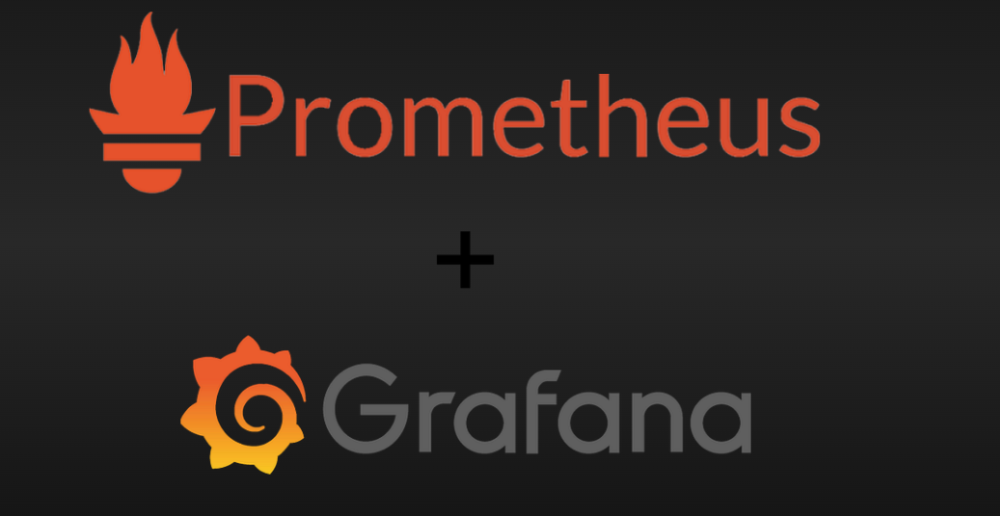

# OVERVIEW MONITORING

Monitoring (Giám sát) trong Linux là một thế giới cực kỳ rộng lớn, chia thành nhiều lớp từ phần cứng, nhân (kernel) đến ứng dụng. Với kinh nghiệm về quản trị hệ thống Linux và LVM mà bạn đang tìm hiểu, mình sẽ hệ thống lại toàn bộ các cấp độ monitoring từ cơ bản đến chuyên sâu:

## 1. Giám sát hệ thống thời gian thực (Cơ bản & Tích hợp sẵn)

Đây là các công cụ "mì ăn liền" giúp bạn biết ngay hệ thống đang bị nghẽn ở đâu.

Giám sát tài nguyên tổng quát:

- `top`: hiển thị CPU, RAM và các tiến trình đang chạy.

- `htop`: Phiên bản nâng cấp của top, giao diện màu sắc, trực quan, cho phép tương tác bằng chuột/phím để kill process.

- `glances`: Cung cấp cái nhìn toàn cảnh (CPU, Load, RAM, Disk I/O, Network) trên một màn hình duy nhất.

Giám sát Lưu trữ & I/O (Rất quan trọng khi bạn làm về LVM/Ceph):

- `iostat`: Kiểm tra tốc độ đọc/ghi của ổ đĩa. Nếu %util cao, ổ cứng của bạn đang bị nghẽn (I/O Wait).

- `df -h`: Xem dung lượng đĩa cứng còn trống.

- `lsblk`: Xem cấu trúc phân vùng, cực kỳ hữu ích để kiểm tra các Logical Volume (LV) trong LVM.

Giám sát Mạng:

- `iftop`: Xem tiến trình nào đang tiêu tốn băng thông mạng nhất.

- `nload`: Biểu đồ lưu lượng mạng theo thời gian thực.

- `netstat` / `ss`: Kiểm tra các cổng (port) đang mở và các kết nối mạng hiện có.

## 2. Giám sát chuyên sâu (Deep Performance Tracking)

Khi bạn cần tìm nguyên nhân gốc rễ (Root Cause) của một lỗi ẩn:

- `dmesg`: Xem log của nhân hệ điều hành (Kernel). Các lỗi phần cứng, lỗi ổ đĩa hoặc lỗi card mạng thường xuất hiện ở đây.

- `vmstat`: Báo cáo thống kê về bộ nhớ ảo, tiến trình, bẫy hệ thống (traps) và CPU.

- `sar` (System Activity Reporter): Đây là "hộp đen" của Linux. Nó thu thập và lưu trữ dữ liệu hệ thống trong quá khứ để bạn có thể xem lại lúc 2 giờ sáng qua server bị gì.

## 3. Hệ thống Giám sát Tập trung (Modern Monitoring Stack)

Trong môi trường doanh nghiệp hoặc khi chạy Ceph, Cinder, bạn không thể ngồi gõ lệnh mãi được. Bạn cần các hệ thống tự động:

- **Bộ đôi Prometheus & Grafana (Tiêu chuẩn hiện nay)**

  - **Prometheus**: Đóng vai trò là Database lưu trữ dữ liệu theo thời gian (`Time-series`). Nó đi "thu thập" dữ liệu từ các server thông qua `Node Exporter`.

  - **Grafana**: Là giao diện "vẽ" biểu đồ. Bạn có thể tạo các Dashboard cực đẹp để theo dõi tình trạng của cả một cụm server.

  - **ELK Stack** (Giám sát Log)

  - **Elasticsearch, Logstash, Kibana**: Tập trung vào việc đọc và phân tích Log file. Giúp bạn tìm kiếm xem trong 1 triệu dòng log thì dòng nào báo lỗi "Out of Memory".

  - **Zabbix**: Hệ thống giám sát "tất cả trong một" (All-in-one). Phù hợp cho các hạ tầng lớn, hỗ trợ cảnh báo qua Telegram, Email, SMS khi có sự cố.

## 4. Giám sát các dịch vụ lưu trữ đặc thù (Ceph, LVM, Cinder)

Vì bạn đang quan tâm đến LVM và lưu trữ đám mây, hãy chú ý các công cụ này:

`vgs`, `lvs`, `pvs`: Giám sát trạng thái của Volume Group và Logical Volume.

`ceph status` / `ceph dash`: Kiểm tra sức khỏe của cụm Ceph (Health OK/Warn/Error).

**Cinder monitoring**: Thường tích hợp trong OpenStack để theo dõi việc cấp phát block storage.

## 5. Chiến lược Cảnh báo (Alerting)

Giám sát mà không có cảnh báo thì vô nghĩa. Một hệ thống monitoring tốt phải:

- **Thu thập (Collect)**: Lấy dữ liệu CPU, RAM, Disk.

- **Ngưỡng (Threshold)**: Định nghĩa khi nào là nguy hiểm (Ví dụ: `RAM > 90%`).

- **Cảnh báo (Alert)**: Gửi tin nhắn đến Telegram Bot (như script bạn đang làm) hoặc Slack.
