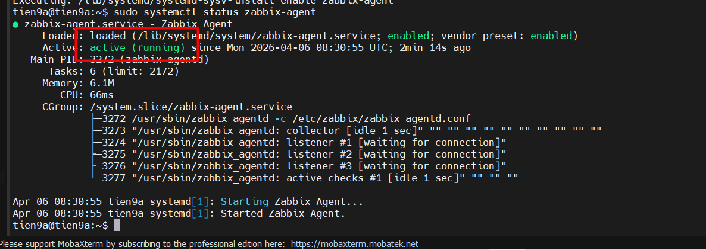
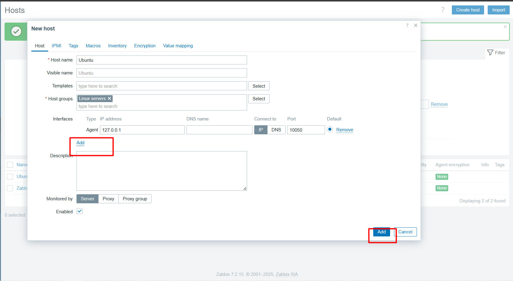
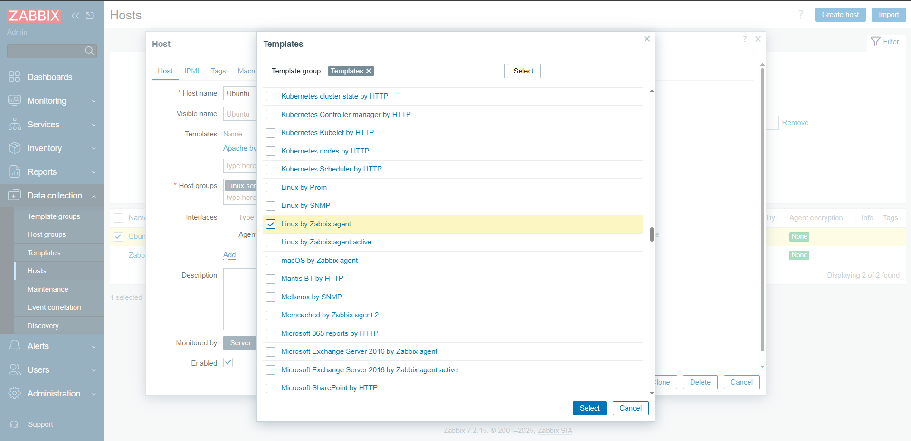
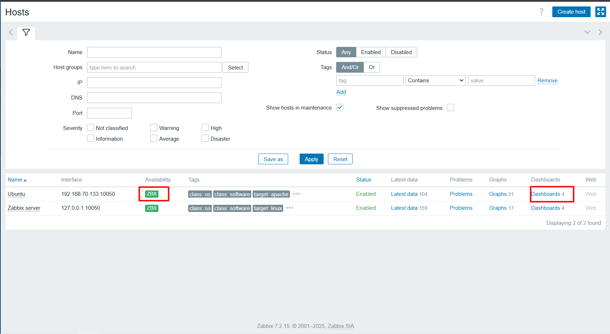
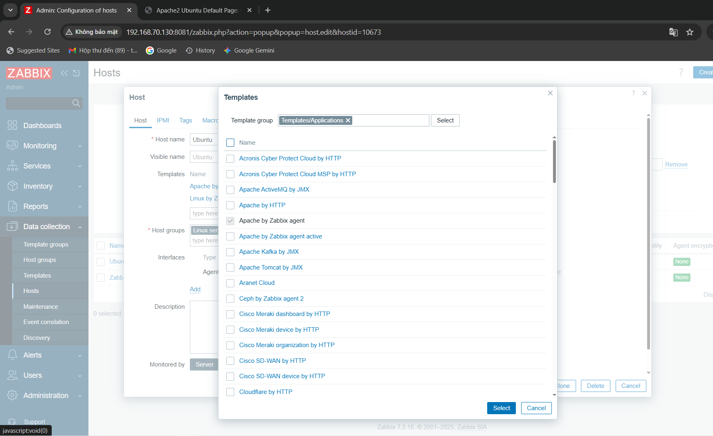
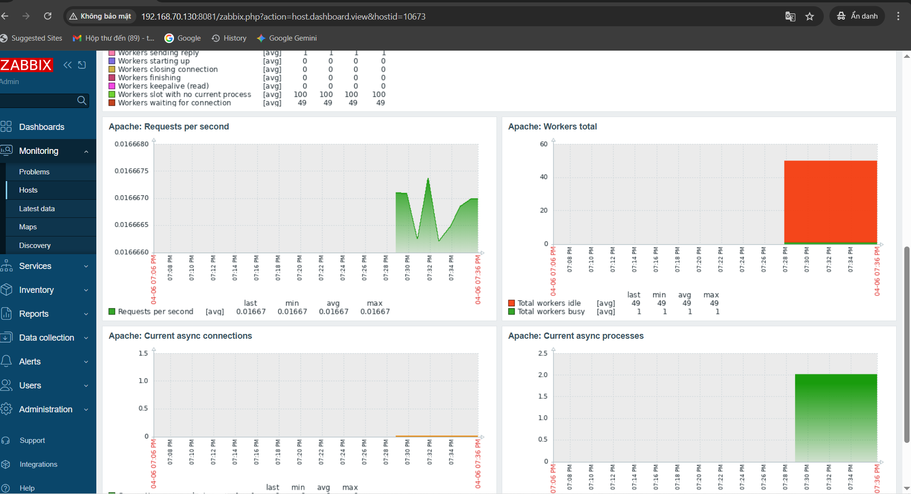

# TRIỂN KHAI ZABBIX TRÊN LINUX SERVER

## I. CHUẨN BỊ

Zabbix server IP: `192.168.70.130`  
Máy ảo ubuntu là host cần giám sát (agent). Có IP: `192.168.70.133`

### II. Sơ đồ


## III. CÁC BƯỚC TRIỂN KHAI (Trên máy host 192.168.70.133)

### 1. Cài đặt Zabbix agent

```bash
sudo apt update
sudo apt install -y wget gnupg2 lsb-release

# Thêm kho Zabbix chính thức
wget https://repo.zabbix.com/zabbix/6.0/ubuntu/pool/main/z/zabbix-release/zabbix-release_6.0-4+ubuntu22.04_all.deb

sudo dpkg -i zabbix-release_6.0-4+ubuntu22.04_all.deb

sudo apt update

# Cài Zabbix agent
sudo apt install -y zabbix-agent
```

### 2. Cấu hình Zabbix agent

```bash
sudo nano /etc/zabbix/zabbix_agentd.conf

# Chỉnh các dòng sau:

# Địa chỉ IP của Zabbix server
Server=192.168.70.130

# Địa chỉ IP của Zabbix server (để agent có thể gửi dữ liệu về server)
ServerActive=192.168.70.130

# Hostname của agent (tên này sẽ hiển thị trên Zabbix server)
Hostname=Ubuntu
```

### 3. Khởi động và kích hoạt Zabbix Agent

```bash
sudo systemctl start zabbix-agent
sudo systemctl enable zabbix-agent
```

Kiểm tra trạng thái:

```bash
sudo systemctl status zabbix-agent
```

Kết quả đúng sẽ hiện Active: `active (running)`



### 4. Tắt firewall

```bash
sudo systemctl stop ufw
```

### 5. Thêm host vào Zabbix Web UI

#### 5.1 Truy cập giao diện web Zabbix

```text
http://192.168.70.130:8081/zabbix
```

#### 5.2 Đăng nhập

```text
Admin / zabbix
```

#### 5.3 Vào Configuration → Hosts → Create host

#### 5.4 Nhập thông tin Host

- Host name: `ubuntu`
- Visible name: `ubuntu` hoặc tùy chọn
- Groups: Chọn `Linux servers` hoặc tạo mới
- Agent interfaces: Nhập IP máy `Ubuntu`



#### 5.5 Chọn tab Templates

- Nhấn `Select` → chọn `Template OS Linux by Zabbix agent` → `Add`



#### 5.6 Kiểm tra kêt nối

Vào `Monitoring` → `Hosts`, xem cột “Availability” (màu xanh là thành công).



#### 5.7 Theo dõi webserver trên con máy clinet (`192.168.70.133`)

Cài đặt Web Server trên thiết bị muốn giám sát:

```bash
sudo apt -y install apache2
sudo systemctl restart apache2
sudo systemctl enable apache2
```

Thêm template để giám sát dịch vụ Apache:



Xem số liệu sau khi giám sát:


