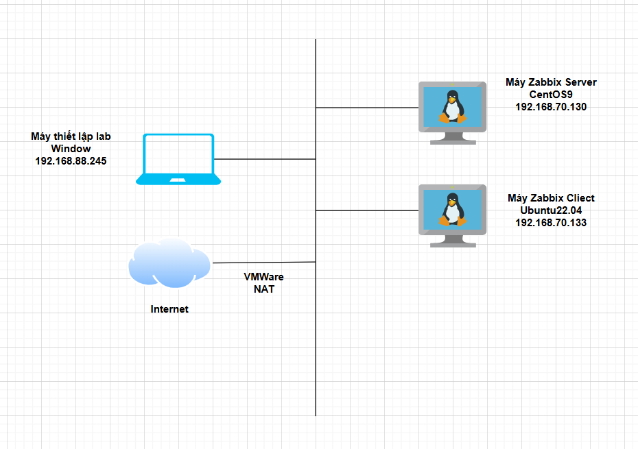
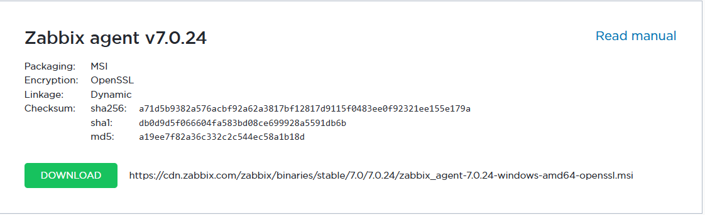
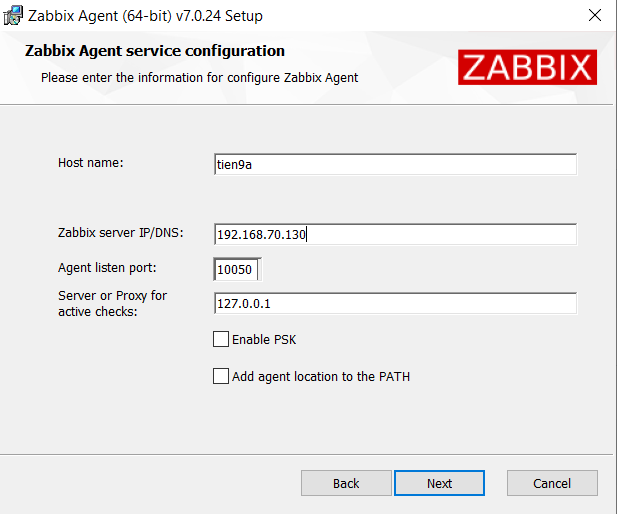
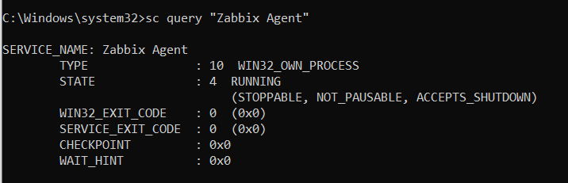
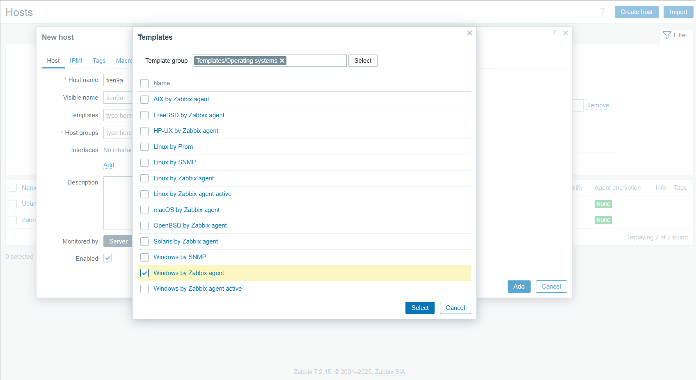
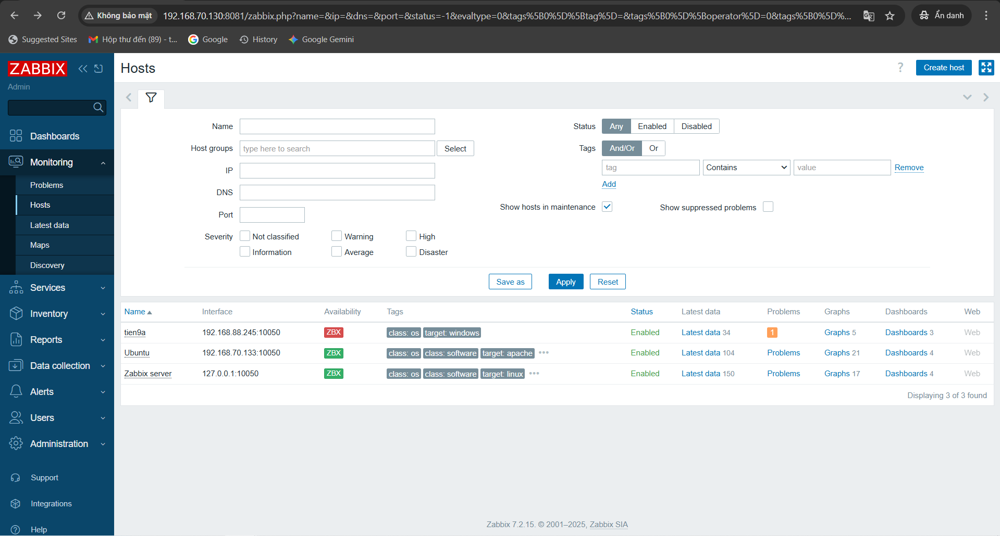
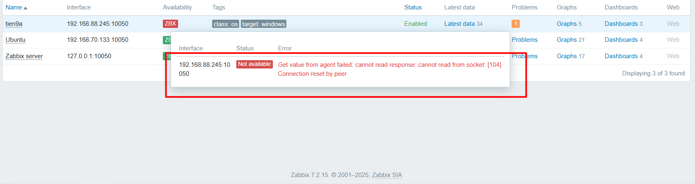
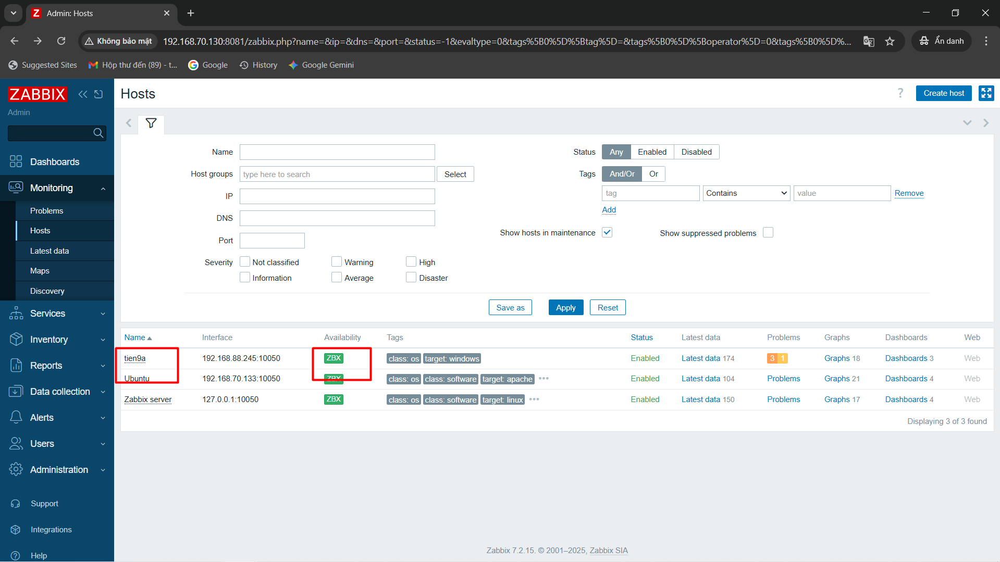

# TRIỂN KHAI ZABBIX TRÊN WINDOW SERVER

## I. CHUẨN BỊ

Zabbix server IP: `192.168.70.130`  
Máy ảo ubuntu là host cần giám sát (agent). Có IP: `192.168.88.245`

### II. Sơ đồ



## III. CÁC BƯỚC TRIỂN KHAI (Trên máy host 192.168.88.245)

### 1. Tải Zabbix Agent cho Windows

Truy cập: `https://www.zabbix.com/download_agents`

Chọn:

- Platform: `Windows`
- Version: `7.0 LTS (hoặc giống với Zabbix Server đang dùng)`
- Architecture: `x86_64`



### 2. Cài đặt Zabbix agent

Chạy file `.msi` đã tải về, làm theo từng bước:

- sau khi chọn location và chấp nhận license, cấu hình agent với IP của zabbix server, hostname (tên định danh thiết bị), listen port (mặc định là 10050):



### 3. Sau khi cài đặt

File cấu hình được cài đặt tại location đã chọn ở bước 2. Ở đây nằm tại:

```bash
C:\Program Files\Zabbix Agent\zabbix_agentd.conf
# Cái này do mình đặt (Nhớ để ý đường dẫn)
```

Mở file bằng Notepad hoặc bất kỳ trình soạn thảo văn bản nào, tìm và chỉnh sửa các dòng sau:

```bash
Server=127.0.0.1, 192.168.70.130
ServerActive=192.168.70.130
Hostname=tien9a
# Rồi nhấn Ctrl+S lưu lại
```

### 4. Khởi động Zabbix Agent trên Windows

Mở Command Prompt (Admin):

```bash
sc start "Zabbix Agent"
```

Kiểm tra trạng thái:

```bash
sc query "Zabbix Agent"
```

Chạy thành công:



### 5. Thêm máy windows vào Zabbix Server để giám sát

- **1. Truy cập giao diện web Zabbix:**

  - `http://192.168.70.130:8081`

- **2. Đăng nhập:**

  - `Admin / zabbix`



- **3. Vào Configuration → Hosts → Create host.**

- **4. Nhập thông tin host:**

  - Host name: `tien9a` (tên máy windows)
  - Groups: Chọn `Windows servers` hoặc tạo mới
  - Agent interfaces: Nhập IP máy Windows

- **5. Chọn tab Templates:**

  - Nhấn Select → chọn `Template OS Windows by Zabbix agent` → Add

### 6. Kiểm tra kết nối

Vào **Monitoring** → **Hosts**, xem cột “Availability” (màu xanh là thành công).



### 7. Debug



=> Nó đang hiện lỗi không thể lấy được gói tin `Response` từ Zabbix Agent từ phía Windows

Check:

- Tắt hẳn firewall ở 2 con máy Server và ở con máy Agent đi
- Con Server nhớ tắt SeLinux
- Check lại xem Service đang ăn config ở đường dẫn nào : Vào `Services.msc` -> tìm `Zabbix Agent`-> chuột phải chọn `Properties`.Nhìn vào dòng Path to executable. Nếu nó ghi là:`"C:\...\zabbix_agentd.exe" --config "C:\...\zabbix_agentd.conf"` thì `OKE` rồi

Sau 3 bước trên lỗi vẫn còn hiển thị:


=> Ta sẽ check log bằng cách mở file này bằng Notepad:`C:\Program Files\Zabbix Agent\zabbix_agentd.log`

`failed to accept an incoming connection: connection from "192.168.88.245" rejected, allowed hosts: "192.168.70.130"`

Giải thích cho dòng log này:

- Con máy `Linux Server` này chạy `ZabbixServer` khác dải so với so với con máy `Window` chạy `ZabbixAgent` (`.70` khác `.88`), mà con máy `Linux Server` lại là máy ảo chạy dưới nền con Windows cho lên khi gói tin đi ra Internet bị SNAT và đã bị chỉnh SourceIP về máy `WindowServer` lên gói tin phản hồi về `Zabbix Server` không nhận dạng được cho lên ta phải đổi lại file cấu hình config `C:\Program Files\Zabbix Agent\zabbix_agentd.conf` sao cho nó nhận gói tin phản hồi từ IP `192.168.88.245`.

Tiến hành Debug tiếp:

```bash
# Dùng NodePad mở file config Zabbix Aggent ra, Chỉnh từ:
Server=127.0.0.1,192.168.70.130

# Thành
Server=127.0.0.1,192.168.70.130,192.168.88.245

# Ctrl+ S lưu file lại
```

- Tiếp đên `Window + R` nhập `Services.msc` tìm service `Zabbix Agent` -> **chuột phải** -> `Restart` thì service sẽ chạy lại để ăn cấu hình.

- Sau đó nhớ bật lại Firewall máy thật mình lên !

Check lại trên Web:


