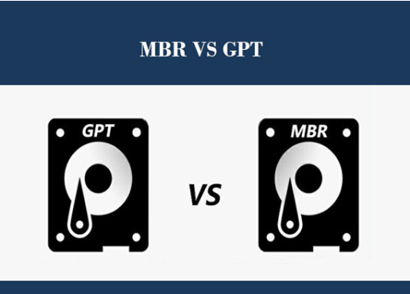
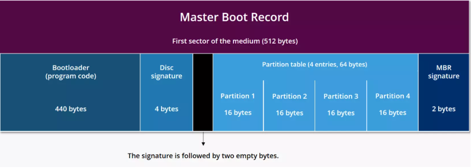
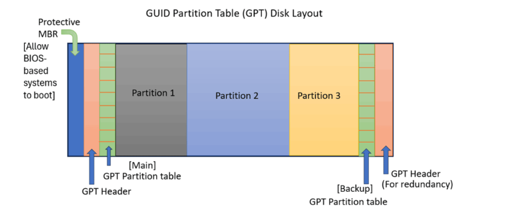
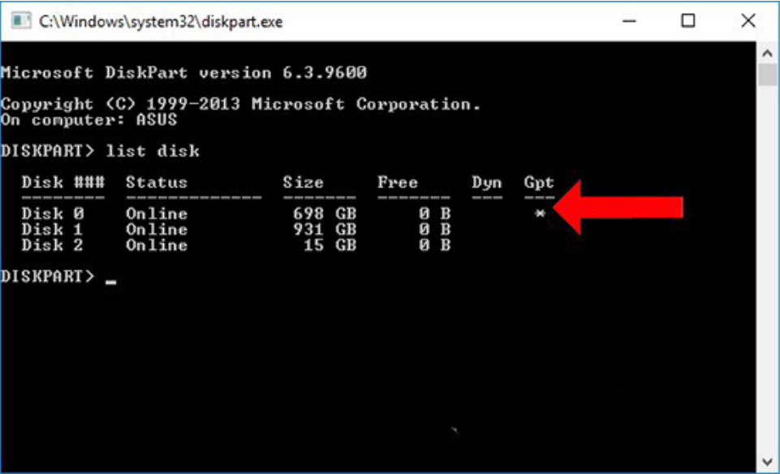
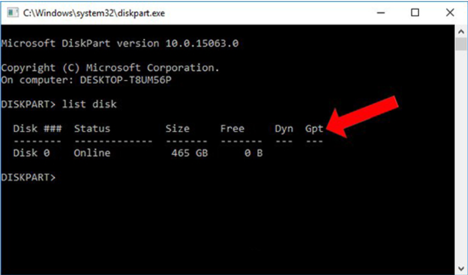

# TÌM HIỂU VỀ MBR VÀ GPT

Các ổ cứng lưu trữ trên máy tính cần phải được định dạng theo một chuẩn nhất định để có thể hoạt động:

- **MBR (Master Boot Record)** và **GPT (GUID Partition Table)**  là hai phương pháp chính mà **ổ đĩa cứng** hoặc **SSD (Solid State Drive)** sử dụng để tổ chức thông tin về các phân vùng (partitions) trên chúng. Chúng xác định cách dữ liệu được lưu trữ, số lượng phân vùng có thể tạo và cách máy tính khởi động từ ổ đĩa đó.

- **MBR** là chuẩn định dạng cũ đã được sử dụng rộng rãi từ đầu những năm 1980, cho đến nay nó vẫn còn khá phổ biến. **GPT** là chuẩn định dạng mới hơn, được ứng dụng nhiều trên các hệ điều hành và phần cứng mới. **GPT** có nhiều điểm tốt hơn và cho phép những giới hạn lớn hơn nên nó đang dần thay thế **MBR**. Tuy nhiên vì có lịch sử ứng dụng lâu đời hơn mà **MBR** vẫn có độ tương thích rất tốt và cần thiết trong nhiều trường hợp, nhất là với phần cứng và hệ điều hành cũ.

## I. ĐỊNH NGHĨA

### 1. MBR là gì?

**MBR** – Viết tắt của **Master Boot Record** (dịch nôm na là **bản ghi quản lý khởi động**): là chuẩn phân vùng ổ đĩa ra đời từ những năm 1980, dùng với hệ thống `BIOS` (`Basic Input`/`Output System`) truyền thống.

**GPT** là viết tắt của **Globally Unique Identifier Partition Table**: là một tiêu chuẩn mới hơn, được giới thiệu như một phần của **UEFI** (**Unified Extensible Firmware Interface**) - hệ thống firmware hiện đại thay thế cho **BIOS**.

## II. ĐẶC ĐIỂM

### 1. Đặc điểm MBR

- Yêu cầu ổ cứng có dung lượng thấp hơn 2 TB. Nếu ổ cứng có dung lượng lớn hơn, người dùng vẫn có thể sử dụng chuẩn phân vùng MBR nhưng phải sử dụng thêm phần mềm thứ 3 để hỗ trợ, như `GParted` trên Linux, hoặc `MBR4TB` trên Windows.

- Không có nhu cầu tạo quá nhiều phân vùng (chia ổ đĩa - `Max` là 4 vùng).

- Yêu cần máy tính đang chạy hệ điều hành Windows 32 bit (tối thiểu)

- Độ bền kém: **Bảng phân vùng MBR** chỉ có một bản sao duy nhất. Nếu `Sector 0` bị hỏng, thông tin về các phân vùng có thể bị mất, khiến dữ liệu khó truy cập.

- Thông tin **MBR** được lưu trữ ở khu vực đầu tiên của ổ đĩa (`Sector 0`).

- **MBR** sẽ có một phân vùng nhỏ (`Sector0`) trên ổ cứng chứa đựng các thông tin để hệ điều hành boot được (gọi là `Boot loader`).Khi máy tính khởi động, **BIOS** sẽ đọc **MBR** ở `Sector 0`, thực thi mã khởi động và tải hệ điều hành vào bộ nhớ.

### 2. Đặc điểm GPT

- **GPT** lưu thông tin phân vùng ở nhiều vị trí trên ổ đĩa (có **protective MBR** ở `Sector 0`, **bảng chính** và **bản sao** ở đầu/cuối ổ đĩa).

- Khi khởi động, firmware **UEFI** sẽ đọc **GPT**, tìm phân vùng hệ thống **EFI** và tải `Bootloader` để khởi động hệ điều hành.

- Hỗ trợ ổ đĩa lớn hơn: **GPT** hỗ trợ ổ đĩa có dung lượng lên đến `9.4ZB` (Zettabytes) hay sấp xỉ 9,4 tỷ TB, đủ lớn cho hầu hết các ổ đĩa hiện tại.

- **GPT** cho phép bạn tạo ra nhiều phân vùng hơn, thường là lên đến 128 phân vùng mà không cần phải sử dụng phân vùng mở rộng.

- Độ bền cao: **GPT** lưu trữ nhiều bản sao của bảng phân vùng trên ổ đĩa, giúp bảo vệ dữ liệu khỏi sự cố hỏng hóc.

- Chỉ hỗ trợ phiên bản Windows `x64`bits.

## III. CẤU TRÚC

### 1. Cấu trúc của MBR

| Thành phần                    | Kích thước | Mô tả                                                                                                    |
|-------------------------------|------------|----------------------------------------------------------------------------------------------------------|
| **Bootloader (program code)** | `440 bytes`| Phần mã khởi động đầu tiên mà BIOS thực thi. Tải hệ điều hành hoặc bootloader chính từ phân vùng.        |
| **Disk signature**            | `4 bytes`  | Giá trị duy nhất để nhận diện ổ đĩa (Disk ID). Một số hệ điều hành như Windows sử dụng để nhận dạng đĩa. |
| **Padding / Reserved**        | `2 bytes`  | Phần trống. Một số tài liệu tính 446 bytes cho bootloader gồm luôn phần này.                             |
| **Partition table**           | `64 bytes` | Bảng mô tả 4 phân vùng chính hoặc 3 chính + 1 mở rộng.                                                   |
| **MBR signature**             | `2 bytes`  | Dấu hiệu MBR hợp lệ để BIOS công nhận và tiếp tục khởi động.                                             |

**Note**:Một số tài liệu nói `Bootloader` chiếm `446 byte` thay vì `440 byte`. Sự khác biệt là do:

- `440 bytes` đầu tiên là mã máy thực thi chính.
- `6 bytes` còn lại gồm:
  - `4 bytes` Disk Signature.
  - `2 bytes` Reserved.

### 2. Cấu trúc của GPT

| Thành phần | Vị trí | Mô tả |
|------------|--------|-------|
| **Protective MBR** | Sector đầu tiên (LBA 0) | **Dành cho các hệ thống BIOS cũ không hỗ trợ GPT**, giúp nhận diện đĩa là “đã phân vùng” và ngăn không cho phần mềm ghi đè GPT. Không chứa `Bootloader`. |
| **GPT Header (Main)** | Sector thứ hai (LBA 1) | Chứa thông tin chính về GPT như số lượng entry, vị trí bảng phân vùng, CRC để kiểm tra lỗi. |
| **GPT Partition Table (Main)** | Sau GPT Header | Danh sách các phân vùng trên đĩa (mỗi entry thường 128 bytes). Thường có thể chứa tới 128 phân vùng. |
| **Các phân vùng (Partition 1, 2, 3...)** | Tiếp theo | Dữ liệu thực tế của người dùng, hệ điều hành, EFI, v.v. |
| **GPT Partition Table (Backup)** | Trước sector cuối cùng | Bản sao của bảng phân vùng chính để dự phòng. |
| **GPT Header (Backup)** | Sector cuối cùng | Bản sao của GPT Header chính, phục vụ khôi phục nếu bị hỏng. |

**Note**:

- **GPT** sử dụng `UUID` (GUID) để định danh từng phân vùng, tăng tính nhất quán và nhận diện.

## IV. SO SÁNH GIỮA MBR VÀ GPT

- **MBR** hỗ trợ tất cả các phiên bản hệ điều hành Windows, trong khi GPT chỉ hỗ trợ phiên bản `64-bit` từ Windows 7 trở đi.
- **MBR** chỉ hỗ trợ chia 4 phân vùng, trong khi GPT hỗ trợ chia 128 phân vùng.
- **MBR** hỗ trợ cả **BIOS** và **UEFI**, trong khi GPT chỉ hỗ trợ **UEFI**.
- **MBR** hỗ trợ ổ cứng tối đa 2TB, trong khi GPT hỗ trợ ổ cứng tối đa 1ZB (1024^3 TB).
- **MBR** sử dụng 1 thông tin lưu trữ phân vùng, trong khi GPT sử dụng 2 thông tin lưu trữ phân vùng.

## V. CÁCH NHẬN BIẾT Ổ CỨNG PHÂN THEO CHUẨN MBR, GPT

`Bước 1`: Nhấn tổ hợp phím `Windows + R` để mở hộp thoại `Run` sau đó nhập `diskpart` và chọn `OK` để truy cập.

`Bước 2`: Sau khi nhận lệnh `diskpart` gõ `list disk`

`Bước 3`: Chú ý đến cột **Gpt**, nếu dòng tên ổ cứng nào ở cột **GPT** có dấu `*` thì ổ cứng đó theo chuẩn **GPT**.

`Bước 4`: Trường hợp cột **GPT** không có dấu `*` thì là tiêu chuẩn **MBR**.

