# CONFIG RAM, CPU ALERT WHEN HIT OVER 80 % THRESHOLD

## I. OVERVIEW

- **Zabbix** sử dụng **Item** để thu thập dữ liệu như CPU load, RAM usage.
- **Triggers** được sử dụng để xác định khi nào vượt ngưỡng.
- Khi **Triggers** được kích hoạt, **zabbix** sẽ tạo cảnh báo (Problem).
- Cảnh báo sẽ được gửi qua telegram.

## II. CÁC BƯỚC CẤU HÌNH CẢNH BÁO

### 1. Tạo mẫu cảnh báo

#### 1.1 Tạo một Item trên Zabbix để giám sát CPU

`Bước 1`: Đăng nhập vào trang quản trị Zabbix

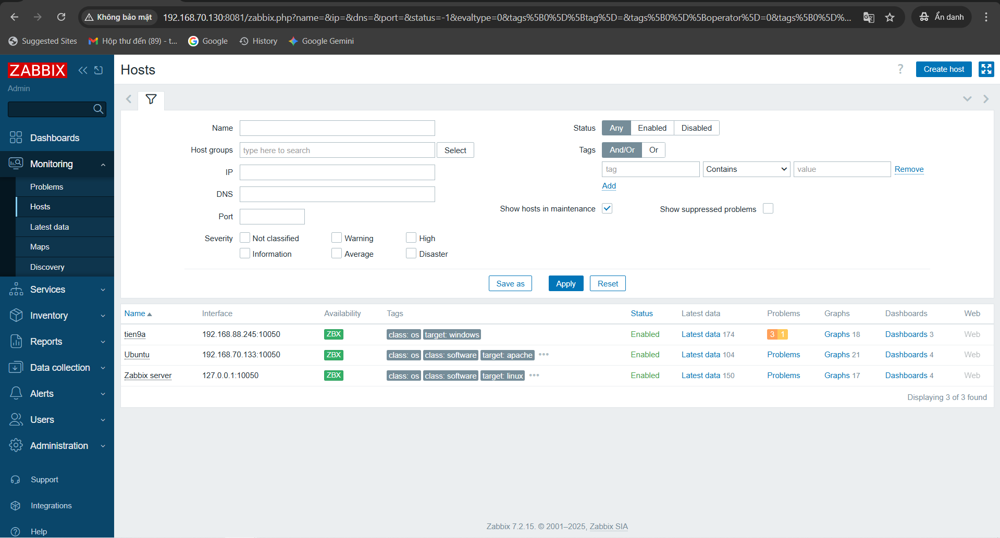

`Bước 2`: Di chuyển đến mục `Data Collection` và chọn `Hosts`

`Bước 3`: Chọn Host ta muốn giám sát ở đây (Ví dụ ở đây ta sẽ giám sát máy chủ `Ubuntu`) -> Chọn vào phần `Items`

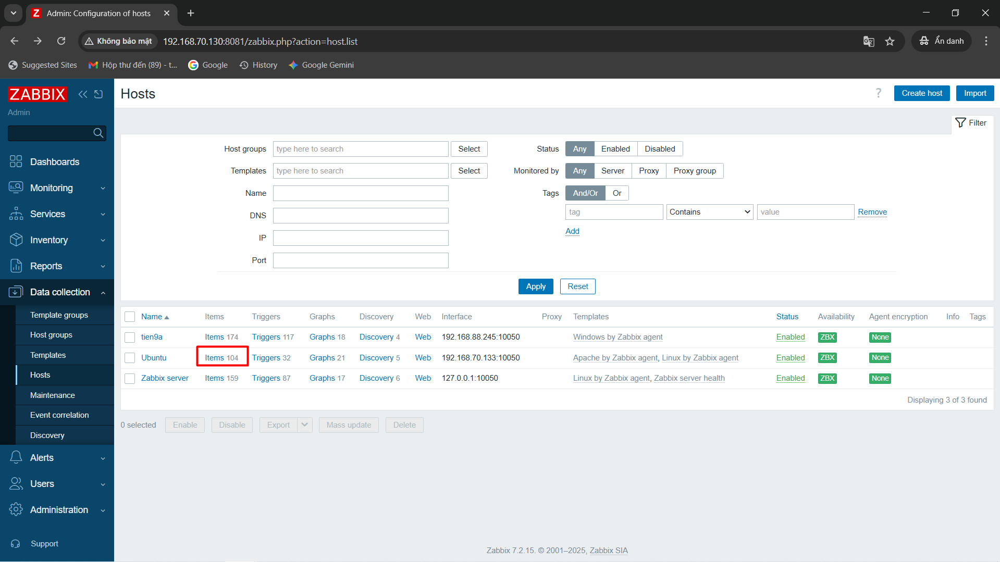

`Bước 4`: Thêm một `Item` mới , Nhấp vào `Item` sau đó là `Create Item`
(Góc phải màn hình)

Sau đó. Điền các thông tin sau:

- `Name`: Tên của Item (ví dụ: `CPU Utilization`).
- `Type`: Loại Item là "Zabbix Agent" (nếu bạn đang sử dụng `Zabbix agent` để giám sát).
- `Key`: `system.cpu.util[cpu>,<type>,<mode>,<logical_or_physical>]` (hoặc sử dụng key phù hợp để lấy thông tin về tình trạng sử dụng CPU).
- `Type of information`: **Numeric** (float).
- Lưu `Item`.

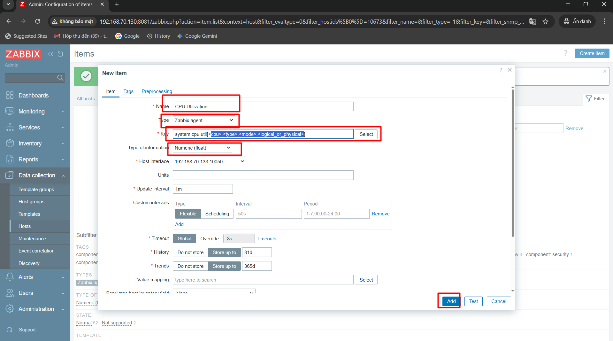

#### 1.2 Tạo một trigger cho cảnh báo

Sau khi có `Item` để giám sát CPU, bạn cần tạo một `Trigger` để cảnh báo khi CPU vượt mức 80%.

Trong cùng giao diện cấu hình `Hosts`, di chuyển đến mục "Triggers". Thêm một `Trigger` mới: Nhấp vào `Create Trigger`(Góc phải màn hình).

Điền các thông tin sau:

- `Name`: Tên của Trigger (ví dụ: `CPU load above 80%`).
- `Severity`: Mức độ nghiêm trọng của cảnh báo (ví dụ: `Warning`).
- `Expression`: Sử dụng biểu thức để kiểm tra giá trị của Item CPU usage. Bấm `add` để hiện bảng thêm giá trị -> Chọn Items vừa tạo -> Nhấp `Insert` là `OKE`
- Cuối cùng nhấp `Add` để thêm `Trigger` là `OKE`

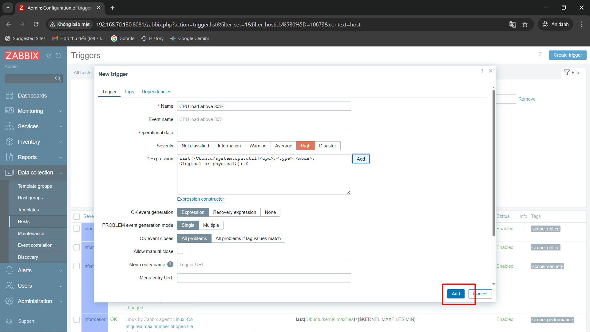

### 2. Cấu hình Zabbix gửi cảnh báo tới Telegram

#### 2.1 Tạo Bot trên Telegram

`Bước 1`: Vào `BotFather` trên Tele. Gõ `/newbot`

`Bước 2`: Nhập tên riêng và username cho Bot

- Ví dụ:

  - `Bot Cảnh báo RAM/CPU` (tên riêng Bot)
  - `RAM_CPU_bot` (username Bot)

`Bước 3`: Lưu `Token API`

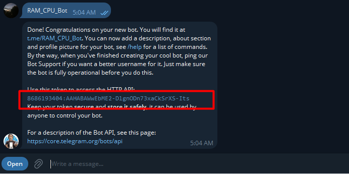

#### 2.2 Cấu hình Media Types trong Zabbix để gửi cảnh báo đến Telegram

`Bước 1`: Đăng nhập vào giao diện quản trị Zabbix, chọn `Alerts` > `Media types` > `Telegram`.

`Bước 2`: Nhập `API Token` của bot vào trường Token. Nhấp vào nút `Update` để lưu lại nội dung **Mediatype**.

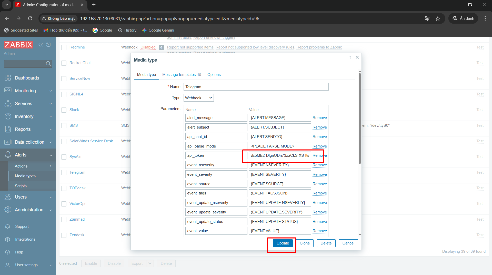

`Bước 3`: Enable cái Media Types này lên.

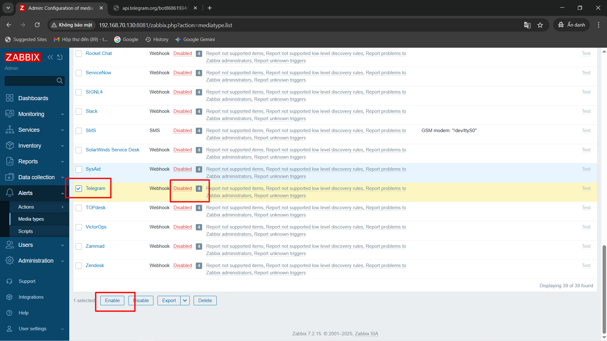

#### 2.3 Cấu hình Users

`Bước 1`: Chọn mục `Users` và chọn người dùng bạn muốn gửi cảnh báo qua Telegram.

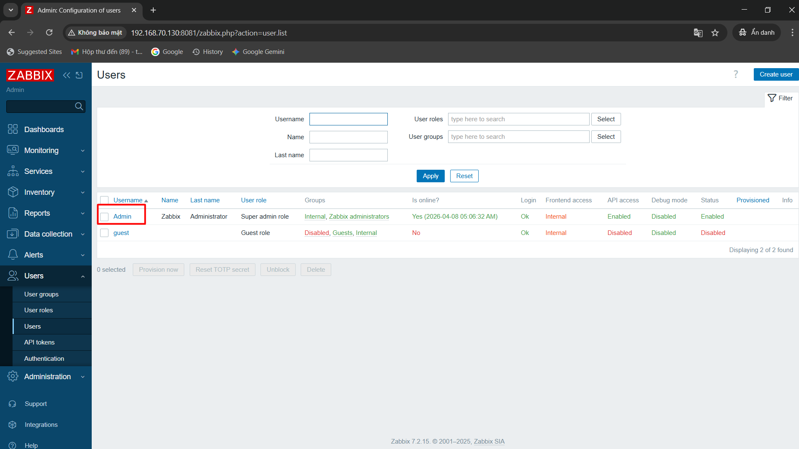

`Bước 2`: Chọn tab `Media` > `Add` để thêm Media mới.

- Trong phần "Type", chọn `mediatype` bạn đã tạo trước đó là Telegram.
- Điền `chat ID` của người dùng hoặc `ID` của group tại `Send to`.
- Tại When active nhập giới hạn khung thời gian có thể gửi cảnh báo.
- Nhấp vào nút "Update” để lưu lại thay đổi.

Sau đây là cách lấy `Chat ID`: Tra trình duyệt `https://api.telegram.org/bot<YourBOTToken>/getUpdates`(Nhớ chat thằng bot trước)

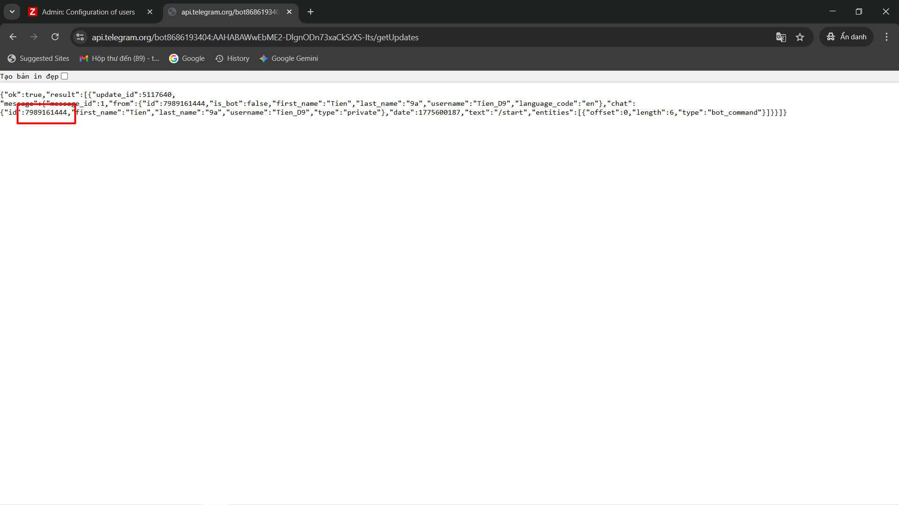

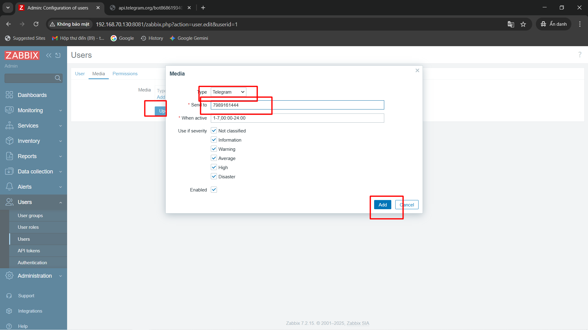

#### 2.4 Cấu hình Action để nhận cảnh báo

`Bước 1`: Chọn `Alerts` > `Actions` > `Trigger action` > `Create Action`(Góc phải màn hình)

`Bước 2`: Trong bảng tạo `Action` ta điền các thông tin như phía dưới:

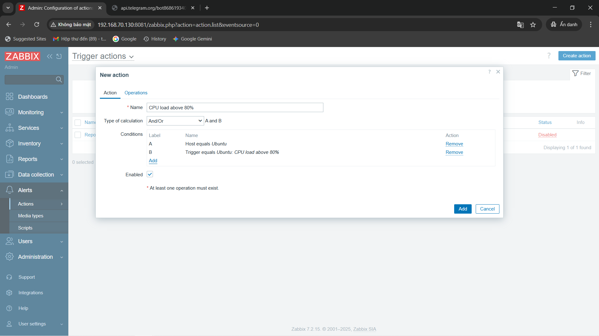

`Bước 3`: Nhấp `Add` để thêm `Conditions` tiếp cho `Hosts`

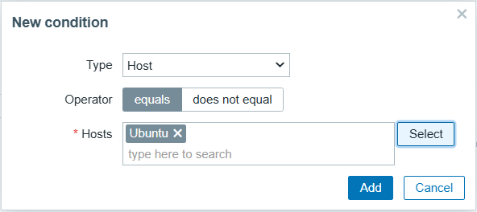

`Bước 4`: Lại `Add` để thêm `Conditions` tiếp cho `Trigger`

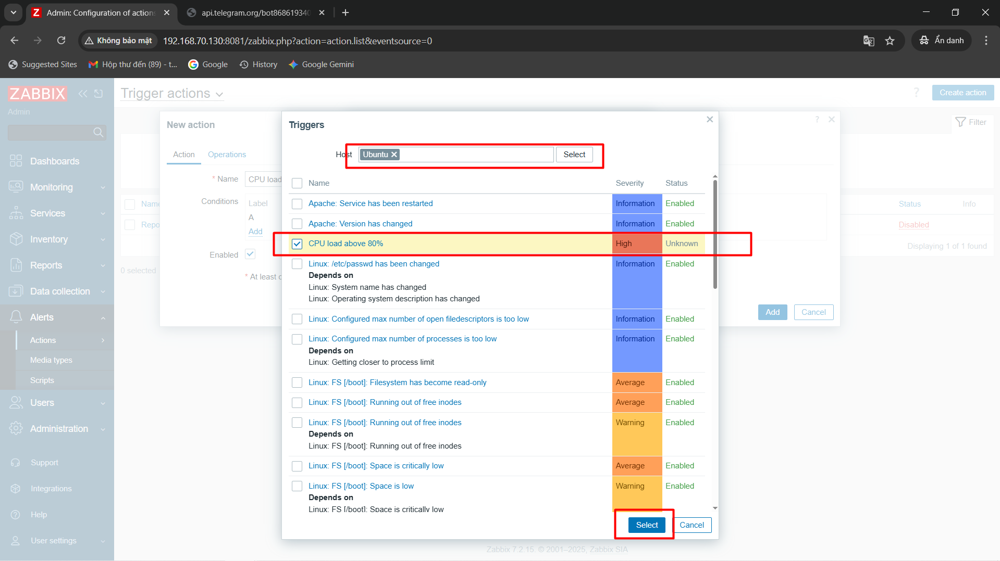

`Bước 5`: Chọn tab `Operations` > `Operations` > `Add`

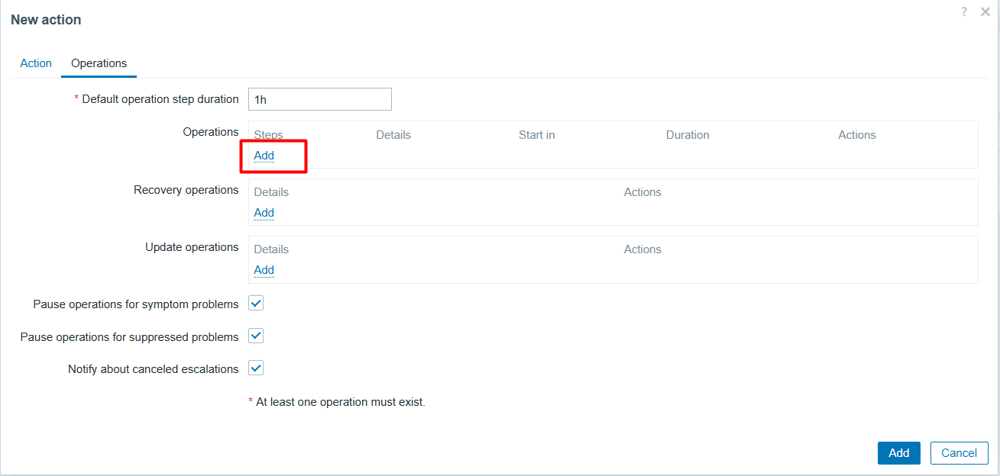

`Bước 5.1`: Tại `Operation details`:

- `Send to users` chọn **User** (`Admin`) cần gửi cảnh báo đã chọn ở trên.
- `Send to media type` chọn `Telegram`
- Chọn `Custom message` để thiết lập form cho message, có thể tham khảo mẫu bên dưới:

  - Subject:

  ```bash
  {TRIGGER.STATUS}: {TRIGGER.NAME} on {HOSTNAME}
  ```

  - Message:

  ```bash
  Host: {HOSTNAME}
  Severity: {TRIGGER.SEVERITY}
  Values:{ITEM.VALUE1}
  Event: {EVENT.NAME}
  Operational data: {EVENT.OPDATA}
  Item Graphic: [{ITEM.ID1}]
  ```

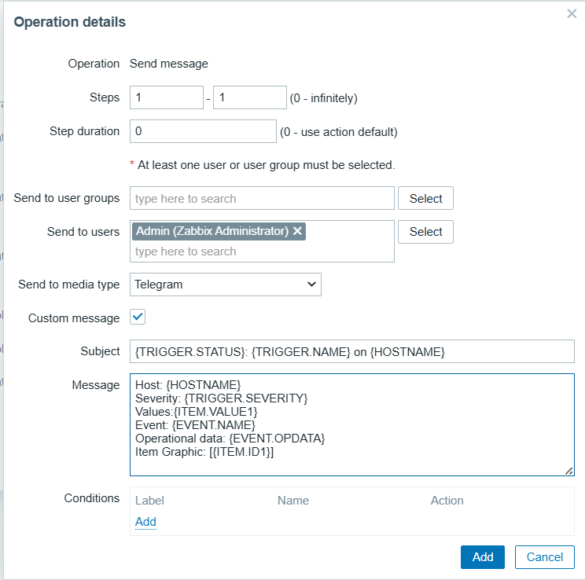

`Bước 5.2`: Chọn `Add` tại `Recovery operations`:

Tại `Operation details`:

- `Send to users` chọn **User**(`Admin`) cần gửi cảnh báo đã chọn ở trên.
- `Send to media type` to chọn `Telegram`
- Chọn `Custom message` để thiết lập form cho message, có thể tham khảo mẫu bên dưới:

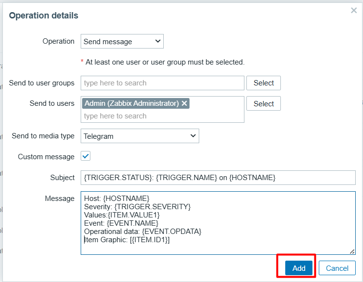

`Bước 6`: Lưu cấu hình `Actions` bằng cách nhấp vào `Add`:

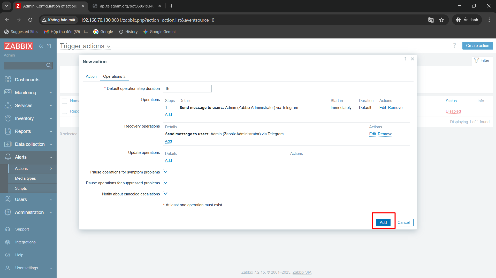

Sau khi cấu hình thành công:

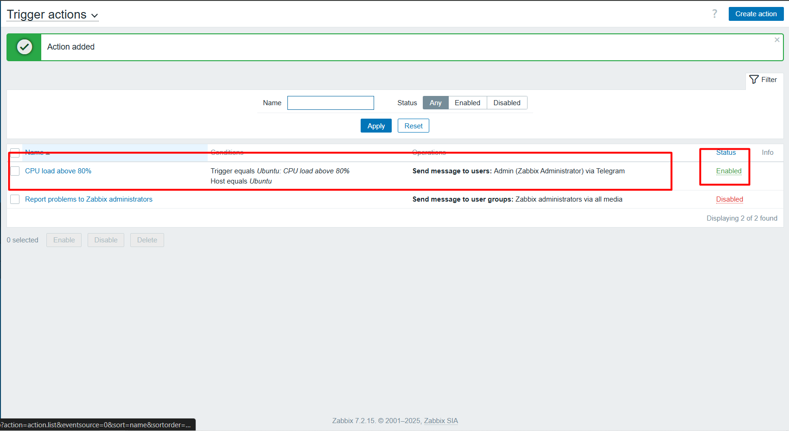
