# READ MONITORING DATA

## I. CÁC LOẠI DỮ LIỆU GIÁM SÁT PHỔ BIẾN

| Name | Key | Type of info | Unit | Meaning |
|------|-----|--------------|------|---------|
| CPU load (1m) | `system.cpu.load[percpu,avg1]` | Numeric (float) | - | Mức tải CPU trung bình 1 phút trên mỗi core |
| CPU load (5m) | `system.cpu.load[percpu,avg5]` | Numeric (float) | - | Mức tải CPU trung bình 5 phút trên mỗi core |
| CPU utilization | `system.cpu.util[,user]` | Numeric (float) | % | % CPU do user sử dụng |
| Memory available | `vm.memory.size[available]` | Numeric (unsigned) | Byte | RAM khả dụng (tuyệt đối) |
| Memory avaulable in % | `vm.memory.size[available]` | Numeric (float) | % | RAM khả dụng theo phần trăm |
| Disk space used | `vfs.fs.size[/,used]` | Numeric (unsigned) | Byte | Dung lượng đĩa đã dùng |
| Disk space used in % | `vfs.fs.size[/,pused]` | Numeric (float) | % | Dung lượng đĩa đã dùng theo phần trăm |
| Network traffic | `net.if.in[eth0]` / `net.if.out[eth0]` | Numeric (unsigned) | Bps | Lưu lượng mạng vào/ra internet |
| Ping | `icmpping` | Numeric (unsigned) | - | Kiểm tra host còn hoạt động không |

## II. CÁC THÀNH PHẦN GIÁM SÁT TRONG ZABBIX

### 1. HOST

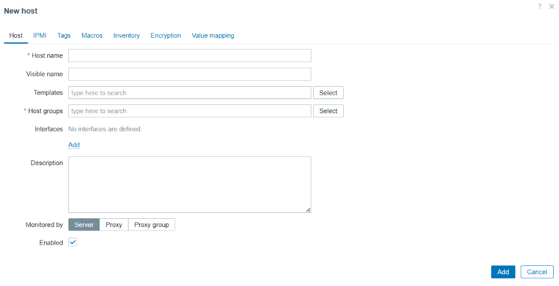

Là thiết bị, dịch vụ hoặc máy chủ bạn giám sát (Linux, Windows, Router, Switch, Website, Database…).

Mỗi host có:

- `Interface`: `IP` hoặc `DNS`, kiểu (Agent, SNMP, JMX, IPMI).

- `Template`: Bộ `item` và `trigger` được gán để giám sát.

### 2. ITEM

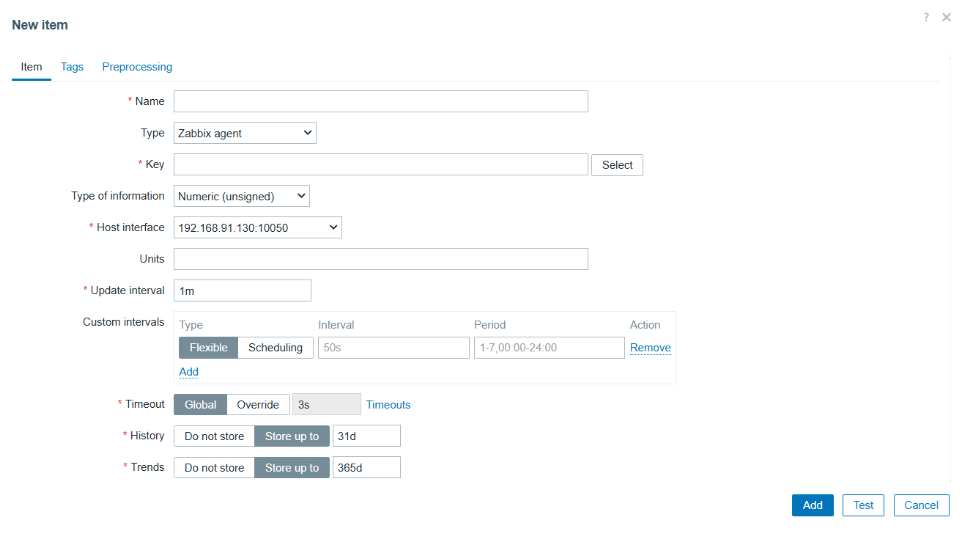

Là chỉ số cụ thể ta muốn thu thập từ Host.

Mỗi **Item** có:

- `Key`: định danh **Item** (Vd: `system.cpu.load[percpu,avg1`] - là các dữ liệu giám sát ta ghi ở trên)
- `Type`: **Zabbix Agent**, **SNMP**, extrenal (Các loại Agent cài vào client để giám sát)
- `Type of Information`: Numeric(float), Numeric(unsigned), Character, Log, Text. (Các loại dự liệu giám sát)
- `Update interval`: tần suất lấy dữ liệu (vd: 30s, 1m, 5m).
- `History storage period`: số ngày lưu giá trị gốc.
- `Trends Strorage period`: số ngày lưu dữ liệu tổng hợp (`min`,`avg`,`max` mỗi giờ).

### 3. Trigger

**Định nghĩa**: **điều kiện bất thường** dựa trên **Item**.

**Trigger expression**(biểu thức Trigger) có cú pháp:

```bash
{host:item.key.last()} operator value
```

Trong đó:

| **Thành phần** | **Ý nghĩa**                |
|----------------|----------------------------|
| `host`         | Tên host                   |
| `item.key`     | Item key                   |
| `last()`       | Hàm lấy giá trị cuối cùng  |
| operator value | So sánh với giá trị ngưỡng |

Ví dụ `Trigger`:

```bash
{webserver01.nvq.local:system.cpu.load[percpu,avg1].last()}>1.5
```

Nghĩa là:

```bash
Load average per CPU core > 1.5, cảnh báo quá tải CPU.
```

### 4. Event

Phát sinh khi **Trigger** thay đổi trạng thái:

| **Trường**    | **Ý nghĩa**         |
|---------------|---------------------|
| `Event ID`    | Mã sự kiện duy nhất |
| `Time`        | Thời gian xảy ra    |
| `Host`        | Host bị ảnh hưởng   |
| `Description` | Mô tả trigger       |
| `Severity`    | Mức độ nghiêm trọng |
| `Status`      | Problem/OK          |

### 5. Action

Hành động tự động khi event xảy ra:

- Gửi **email**, **Telegram**, **Slack**

- **Chạy script tự động khắc phục** (restart service)

- Tạo **Ticket** (`ITSM`, `Zammad`)

### 6. Graph

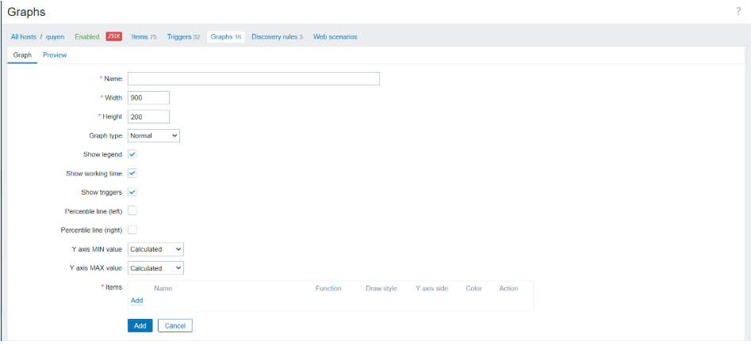

Biểu đồ hiển thị giá trị item theo thời gian.

| **Thành phần**   | **Ý nghĩa**                |
|------------------|----------------------------|
| `Trục X`         | Thời gian                  |
| `Trục Y`         | Giá trị Item               |
| `Legend`         | Mô tả từng line màu (item) |

## III. ĐỌC DŨ LIỆU GIÁM SÁT TRONG ZABBIX

### 1. Dashboards

Tổng quan tất cả **hosts**, **triggers**, **graphs**, **maps**.

Tuỳ chỉnh **widgets** để hiển thị thông tin quan trọng.

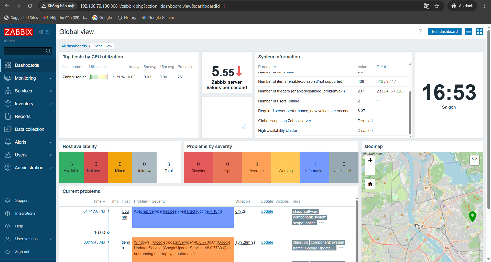

### 2. Monitoring

#### 2.1 Problems

**Problems**: Hiển thị các **vấn đề** đối với từng **device** mà **zabbix server thu thập dữ liệu về**. **Hỗ trợ cơ chế lọc** theo ý người quản trị.

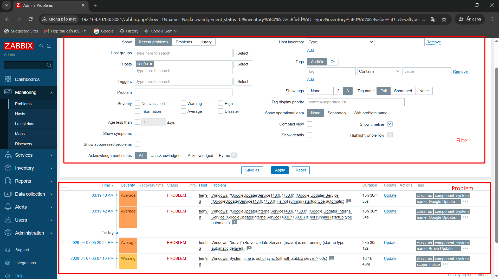

Trong đó:

- **Show Recent problems**: Hiển thị vấn đề hiện tại đang gặp phải.
- **Show Problems**: Hiển thị các vấn đề đã gặp phải.
- **Show History**: Lịch sử các vấn đề đã gặp phải.
- **Host group**, **Host**, **Trigger**, **Problem**, **Host inventory**, **Tags**... là các lựa chọn để lọc thông tin, có thể lọc theo một tiêu chí hoặc kết hợp nhiều tiêu chí.

=> Có thể lọc theo các tiêu chí sau và có thể export ra file `.csv` để lưu trữ lại.

#### 2.2 Hosts

Hiển thị danh sách đầy đủ các máy chủ được giám sát với thông tin chi tiết về giao diện máy chủ, tính khả dụng, thẻ, sự cố hiện tại, trạng thái (đã bật/tắt) và các liên kết để dễ dàng điều hướng đến dữ liệu mới nhất của máy chủ, lịch sử sự cố, biểu đồ, bảng điều khiển và các kịch bản web.

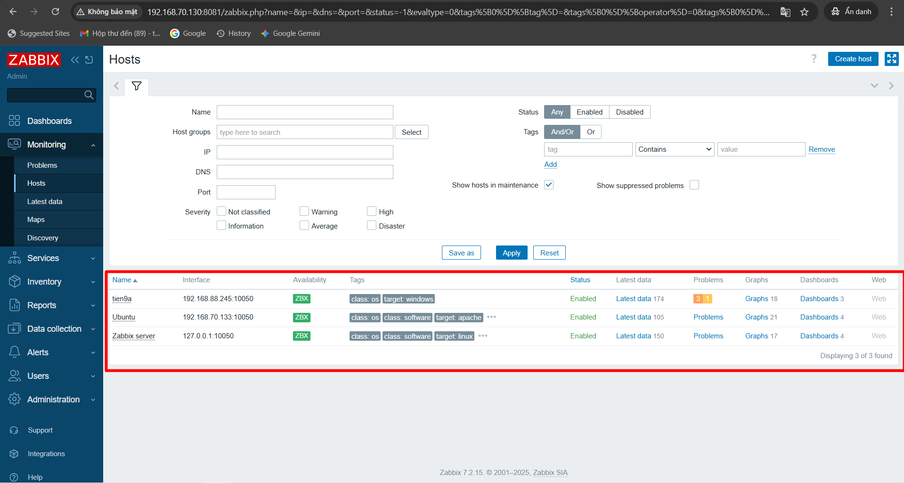

Trong đó:

- **Name**: Tên máy chủ
- **Interface**: Địa chỉ IP máy chủ / Port kết nối
- **Availability**: Tính khả dụng của máy chủ
- **Tags**: Các tag được gắn vào máy chủ
- **Status**: Tình trạng bật tắt máy chủ
- **Latest data**: Dữ liệu mới nhất
- **Problems**: Các sự cố gặp phải
- **Graphs**: Biểu đồ được cấu hình cho máy chủ
- **Dashboards**: Bảng điều khiển được định cấu hình cho máy chủ
- **Web**: Các kịch bản web được cấu hình cho máy chủ

#### 2.3 Latest Data

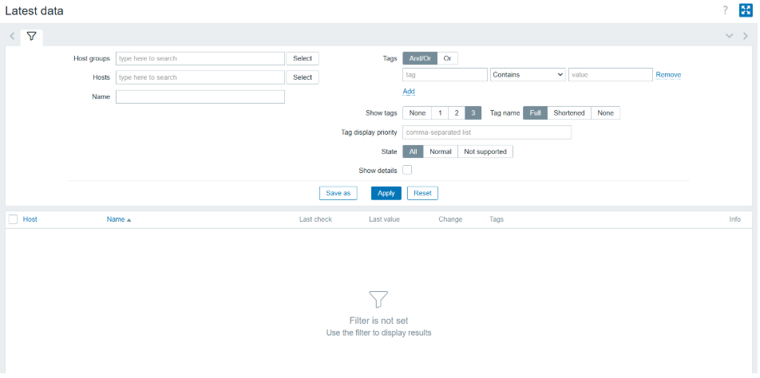

| **Cột**      | **Ý nghĩa**                                |
|--------------|--------------------------------------------|
| `Host`       | Tên host chứa item                         |
| `Name`       | Tên item (chỉ số giám sát)                 |
| `Last check` | Thời gian lấy dữ liệu gần nhất             |
| `Last value` | Giá trị cuối cùng                          |
| `Change`     | Thay đổi so với giá trị trước              |
| `Tags`       | Tag gắn với item (nếu có)                  |
| `Info`       | Thông tin chi tiết (đơn vị, kiểu dữ liệu…) |

Ứng dụng:

- Xem giá trị hiện tại của CPU, RAM, Disk, Network.
- So sánh change để nhận biết đột biến bất thường.

#### 2.4 Maps

- Là thành phân cung cấp khả năng giám sát hệ thống dưới hình thức mô hình mạng. Giúp người quản trị có cái nhìn tổng quan về hệ thống sống mạng dưới dạng sơ đồ, trong trường hợp có sự cố sẽ giúp người quản trị đánh giá tầm ảnh hưởng của thiết bị gặp sự cố và đưa ra giải pháp phù hợp..

#### 2.5 Discovery

Nếu một thiết bị đã được giám sát, tên máy chủ sẽ được liệt kê trong cột Máy chủ được giám sát và khoảng thời gian thiết bị được phát hiện hoặc bị mất sau lần phát hiện trước đó sẽ được hiển thị trong cột Thời gian hoạt động/Thời gian ngừng hoạt động.

### 3. Services

**Menu Services** dùng cho các chức năng **giám sát dịch vụ** (service monitoring) của Zabbix.

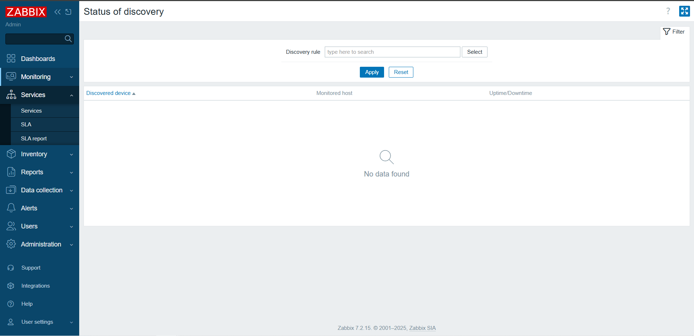

#### 3.1 Service actions

Các hành động đã định cấu hình sẽ được hiển thị trong danh sách liên quan đến quyền của vai trò người dùng . Người dùng sẽ chỉ thấy các hành động đối với các dịch vụ mà vai trò người dùng của họ cấp quyền truy cập.

#### 3.2 SLA

Phần này cho phép xem và định cấu hình SLA.

#### 3.3 SLA reports

Phần này cho phép xem báo cáo SLA , dựa trên tiêu chí đã chọn trong bộ lọc. Báo cáo SLA cũng có thể được hiển thị dưới dạng tiện ích bảng điều khiển.

### 4. Inventory

**Menu Inventory** bao gồm các mục cho phép **cung cấp tổng quan dữ liệu kiểm kê của host** (host inventory) dựa trên một tham số được chọn và xem chi tiết thông tin kiểm kê của từng host.

#### 4.1 Overview

Phần **Inventory** → **Overview** cung cấp các cách để xem tổng quan dữ liệu kiểm kê của host.

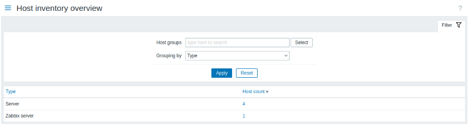

=>Thẻ `Overview` chứa một số thông tin tổng quan về host, dữ liệu giám sát mới nhất và các tùy chọn cấu hình host

#### 4.2 Hosts

Trong phần **Inventory** → **Hosts**, dữ liệu kiểm kê (inventory data) của các host sẽ được hiển thị. Bạn có thể lọc các host theo nhóm host và theo bất kỳ trường kiểm kê nào để chỉ hiển thị những host mà bạn quan tâm.

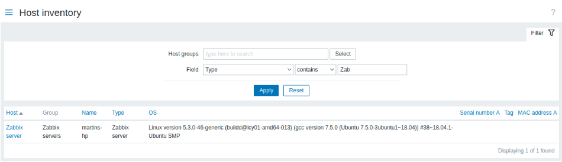

Thẻ `Details` chứa toàn bộ thông tin kiểm kê (inventory details) hiện có của host. Mức độ đầy đủ của dữ liệu kiểm kê phụ thuộc vào lượng thông tin kiểm kê được lưu trữ cho host. Nếu không có thông tin nào được lưu trữ, thẻ `Details` sẽ bị **vô hiệu hóa**.

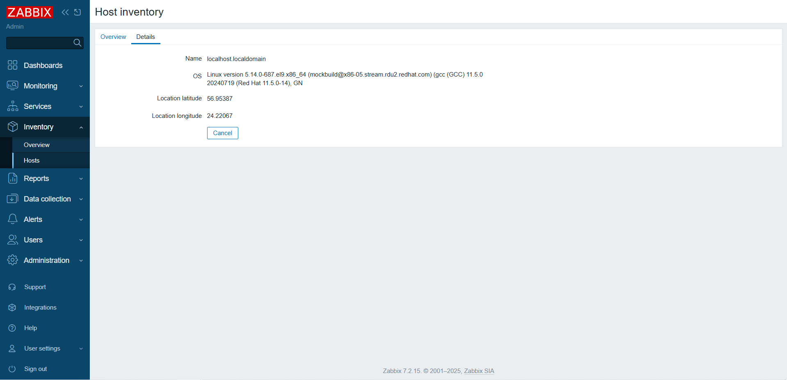

### 5. Reports

**Menu Reports** bao gồm nhiều mục **chứa các báo cáo được định sẵn** và có thể tùy chỉnh bởi người dùng, tập trung vào việc hiển thị tổng quan các thông số như: **thông tin hệ thống**, **triggers** và **dữ liệu đã thu thập**.

#### 5.1 System Information

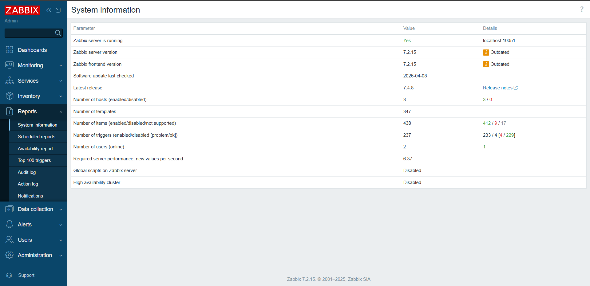

|  Tham số |	Giá trị	|Chi tiết |
|---|---|---|
|Zabbix server is running|Có:máy chủ đang chạy- Không :máy chủ không chạy|Vị trí và cổng của máy chủ Zabbix.|
|Number of hosts (enabled/disabled)|Tổng số máy chủ được cấu hình được hiển thị|	Số lượng máy chủ được giám sát/máy chủ không được giám sát.|
|Number of templates	|Tổng số mẫu được hiển thị.	|  |
|Number of items |Tổng số mục được hiển thị |Số lượng mục cấp máy chủ được giám sát/vô hiệu hóa/không được hỗ trợ.Các mục trên máy chủ bị vô hiệu hóa được tính là bị vô hiệu hóa.|
|Number of triggers|Tổng số kích hoạt được hiển thị|Số lượng trình kích hoạt cấp máy chủ đã bật/tắt; phân chia các trình kích hoạt được bật theo trạng thái "Sự cố"/"OK".|
|Number of users|Tổng số người dùng được cấu hình được hiển thị|Số lượng người dùng trực tuyến.|
|Required server performance, new values per second|Số lượng giá trị mới dự kiến ​​​​được máy chủ Zabbix xử lý mỗi giây được hiển thị.|   |

#### 5.2 Schedule reports

Người dùng có đủ quyền có thể định cấu hình việc tạo phiên bản `PDF` theo lịch của trang tổng quan, phiên bản này sẽ được gửi qua **email** đến những người nhận được chỉ định.

#### 5.3 Availability report

Trong **Reports** → **Availability report**, bạn có thể xem tỷ lệ thời gian mà mỗi trigger ở trạng thái `Problem` hoặc `OK`.

Với mỗi trạng thái, báo cáo sẽ hiển thị phần trăm thời gian tương ứng, giúp bạn dễ dàng xác định **mức độ sẵn sàng** (availability) của các thành phần khác nhau trong hệ thống.

#### 5.4 Top 100 Triggers

Trong **Reports** → **Top 100 triggers**, bạn có thể xem các trigger có **số lượng sự cố** (problems) được phát hiện nhiều nhất trong khoảng thời gian đã chọn.

#### 5.5 Audit log

Audit log có thể xem hồ sơ về hoạt động của người dùng và hệ thống.

#### 5.6 Action log

Người dùng có thể xem chi tiết các hoạt động (thông báo, lệnh từ xa) được thực hiện trong một hành động.

#### 5.7 Notifications

Một báo cáo về số lượng thông báo được gửi đến mỗi người dùng sẽ được hiển thị.

### 6. Data Collections

Là nơi thu thập Data để Zabbix có thể **Phân tích**

#### 6.1 Template Groups + Templates

`Templates`: Đây là tập hợp các thực thể có thể áp dụng cho các Host, một `Template` sẽ chứa trong nó các tập lệnh để truy vấn lấy dữ liệu, hiển thị thông tin dữ liệu lấy được, thông tin tình trạng thiết bị, hiển thị và thông báo lỗi…

Trong mỗi `Template`, các tệp lệnh được chia thành: `items`, triggers, `graphs`, `applications`, `web` .... Tùy theo giám sát thiết bị, dịch vụ, ứng dụng… nào thì các thành phần này được thiết lập khác nhau.

#### 6.2 Host Groups + Host

Là nhóm loại máy chủ + máy chủ .Có tất cả các loại nhóm máy chủ sau:

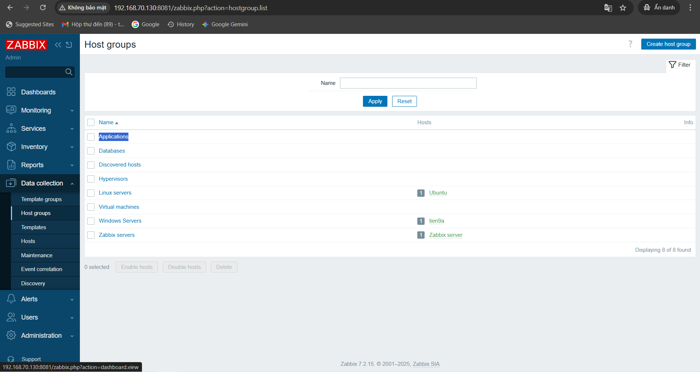

#### 6.3 Maintance

**Maintance** có thể xác định thời gian bảo trì cho máy chủ và group trong Zabbix. Có hai loại **Maintance** - với thu thập dữ liệu và không thu thập dữ liệu.

- Ví dụ: Server của bạn `off` trong khoảng thời gian này để nâng cấp sửa chữa, thì **maintance** sẽ được lựa chọn cấu hình để không thu thập data trong khoảng thời gian đó.

#### 6.4 Event Correlation

Được dùng để xử lý, lọc và hợp nhất các sự kiện (events) nhằm giảm cảnh báo trùng lặp.

#### 6.5 Discovery

Có mục đích chính là tự động phát hiện và thêm các thiết bị/host trong mạng vào hệ thống giám sát mà không cần cấu hình thủ công từng host.

### 7. Alerts

#### 7.1 Action

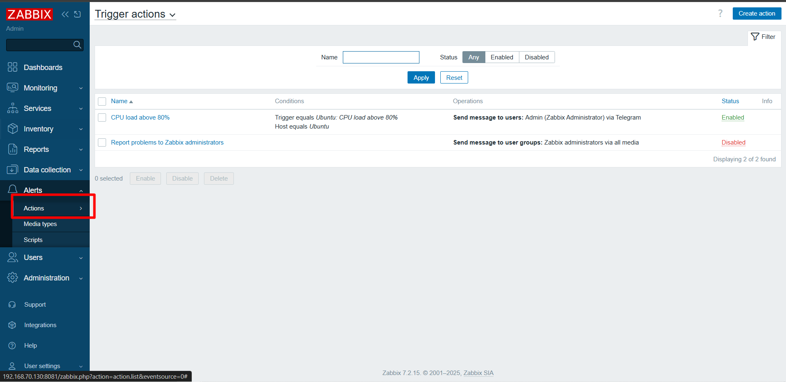

Các hành động được hiển thị là các hành động được chỉ định cho nguồn sự kiện đã chọn (trigger, service, discovery, autoregistration, internal actions).

Các hành động được nhóm thành các tiểu mục theo nguồn sự kiện (trigger, service, discovery, autoregistration, internal actions). Danh sách các tiểu mục có sẵn sẽ xuất hiện khi nhấn vào Hành động trong phần menu Cấu hình . Cũng có thể chuyển đổi giữa các phần phụ bằng cách sử dụng danh sách thả xuống tiêu đề ở góc trên cùng bên trái.

#### 7.2 Media Types

Thông tin về loại phương tiện chứa các hướng dẫn chung về cách sử dụng phương tiện làm kênh phân phối thông báo.

Các chi tiết cụ thể, chẳng hạn như địa chỉ email riêng lẻ để gửi thông báo sẽ được lưu giữ với từng người dùng.

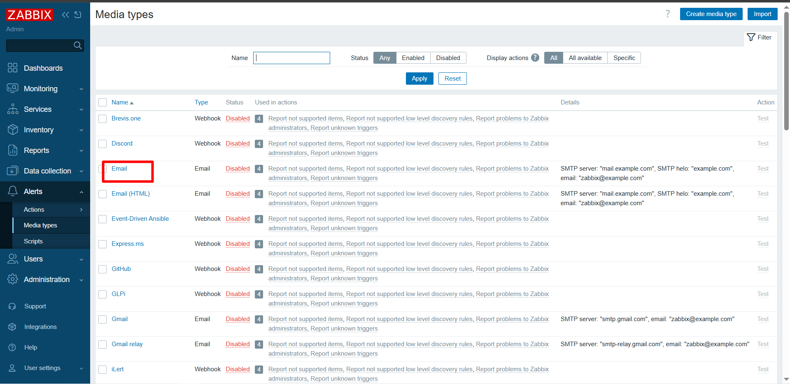

#### 7.3 Scripts

Các tập lệnh chung, tùy thuộc vào phạm vi được định cấu hình và quyền của người dùng, có sẵn để thực thi.

### 8. User

Phần này chỉ có tài khoản `Admin` sẽ can thiệp thiết lập quyền cho các User khác

#### 8.1 User Groups

Các nhóm người dùng của hệ thống được duy trì.

### 8.2 User Roles

Các **vai trò** có thể **được chỉ định cho người dùng hệ thống** và **các quyền cụ thể cho từng vai trò** vẫn **được duy trì**.

**Vai trò người dùng mặc định** Theo mặc định, Zabbix được định cấu hình với bốn vai trò người dùng, có một bộ quyền được xác định trước:

- Vai trò quản trị viên
- Vai trò khách mời
- Vai trò quản trị viên cấp cao
- Vai trò người dùng

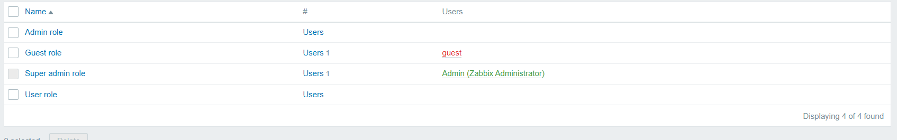

#### 8.3 Users

Danh sách người dùng hiện tại cùng với thông tin chi tiết của họ được hiển thị.

#### 8.4 API Tokens

Quản trị viên có thể tạo API Token cho từng User để họ có thể lấy làm chat Bot thông báo.

#### 8.5 Authentication

Cho phép chỉ định phương thức xác thực người dùng toàn cầu cho Zabbix và các yêu cầu mật khẩu nội bộ. Các phương thức khả dụng là xác thực nội bộ, **HTTP**, **LDAP** và **SAML**.

### 9. Adminitration

Phần quản trị này ta tham khảo ở phần tài liệu của Zabbix sẽ rõ nhất.

Xem tài liệu tham khảo ở [đây](https://www.zabbix.com/documentation/current/en/manual/web_interface/frontend_sections).
