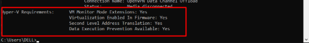
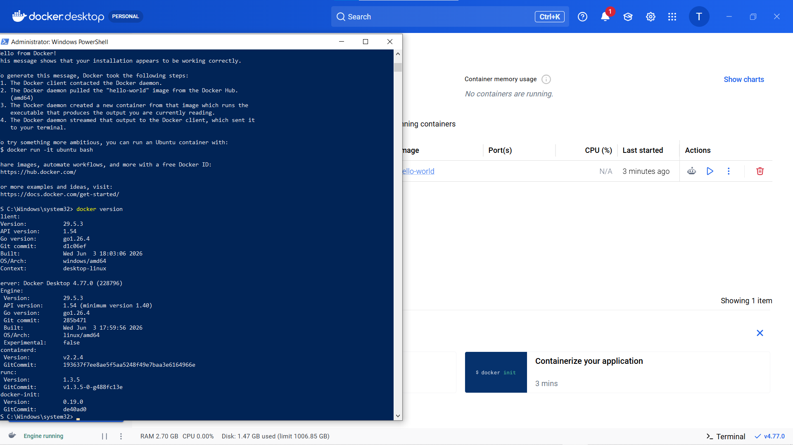
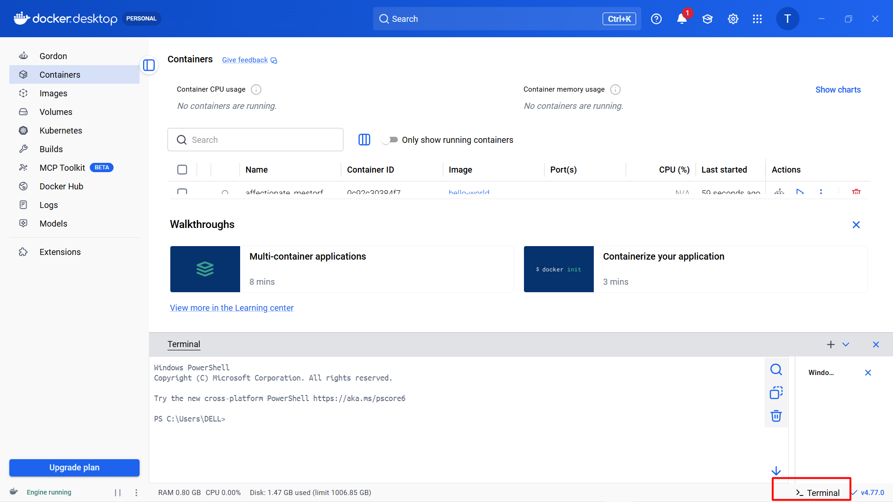

# INSTALLING DOCKER

Có rất nhiều cách và môi trưởng để cài đặt Docker: Windows, Mac và Linux.

Bạn có thể cài trên cloud, on-premises (tại chỗ), hoặc trên laptop.

Ngoài ra còn có cài đặt thủ công, cài đặt bằng script, cài đặt qua wizard, ...

Ta sẽ đề cập đến các nội dung sau:

Docker Desktop cài đặt trên:

- Windows 10

  - Mac

- Cài đặt trên server:

  - Linux

- Play with Docker

## I. DOCKER DESKTOP

Docker Desktop là một sản phẩm đóng gói của Docker, Inc.. Nó chạy trên các phiên bản 64-bit của Windows 10 và Mac, rất dễ tải về cũng như cài đặt

Docker Desktop **trên Windows 10** có thể chạy cả **container Windows** gốc lẫn **container Linux**. Docker Desktop **trên Mac** chỉ có thể chạy **container Linux**.

### 1. Windows pre-reqs

Docker Desktop trên Windows yêu cầu tất cả các điều sau:

- Phiên bản Windows 10 64-bit thuộc các bản Pro / Enterprise / Education (không hoạt động với bản Home)
- Hệ thống phải bật hỗ trợ ảo hóa phần cứng (hardware virtualization) trong BIOS
- Các tính năng Hyper-V và Containers phải được bật trong Windows

**Installing Docker Desktop on Windows 10**:


Check xem phiên bản Window ta đang sử dụng thuộc các bản Pro / Enterprise / Education hay không

- nhấp `Win+R` gõ `winver` rồi **Enter** và trên màn hình sẽ hiện ra bản mà Window ta đang dùng


- Tiếp theo nhấn Restart lại Window + `F12` là sẽ vào giao diện BIOS và gõ trong thanh tìm kiếm `hardware virtualization` rồi tắt hỗ trợ ảo hoá phần cứng đi(Nhiều máy auto bật rồi) or chạy các lệnh sau trên powershell:

```powershell
dism /online /enable-feature /featurename:Microsoft-Windows-Subsystem-Linux /all /norestart
dism /online /enable-feature /featurename:VirtualMachinePlatform /all /norestart
DISM /Online /Enable-Feature /FeatureName:Microsoft-Hyper-V-All /All
bcdedit /set hypervisorlaunchtype auto

# Xong restart lại máy để nhận config
```

- Sau đó kiểm tra nhanh Hyper-V có sẵn không, trên cmd:

```cmd
systeminfo 
```



- Ý nghĩa:

  - VM Monitor Mode Extensions: Yes → CPU hỗ trợ VT-x/AMD-V.
  - Virtualization Enabled In Firmware: Yes → Đã bật ảo hóa trong BIOS/UEFI.
  - Second Level Address Translation: Yes → Hỗ trợ SLAT (bắt buộc với Hyper-V hiện đại).
  - Data Execution Prevention Available: Yes → Hỗ trợ DEP/NX.

- Tiếp theo, Nhấp vào link sau [đây](https://www.docker.com/products/docker-desktop/) và tải bản dành cho Desktop


- Cài WSL 2 nếu chúng ta dùng thay Hyper-V(Nhớ mở shell = quyền `admin`):

```powershell
wsl --update
```

- Chạy file cài đặt vừa được tải, khi được hỏi `Use WSL 2 instead of Hyper-V` thì chọn Hyper-V or WSL 2 cũng được(khuyên khích WSL2 hơn)

- Mở DockerDesktop ra và đăng kí account (khuyến khích đăng kí personal để lab)

- Cuối cùng, kiểm tra Docker bằng cách mở PowerShell:

```powershell
docker version
docker run hello-world
```



- Nhìn output sau ta có thể chạy Ubuntu Container, mở shell hoặc mở terminal ngay trên Docker Desktop:



```bash
docker run -it ubuntu bash
# Docker engine tiến hành pull image từ runtime
```


- Sau khi pull images về thì ta có thể thấy ta đã tạo 1 container mới và vào thẳng môi trường Linux thông qua dòng `root@cb08927b1e78`

- Với môi trường container production này ta có thể làm:

  - Môi trường `/test/dev` để build production

**Note**: Nếu cài kiểu Desktop trên Window này sẽ gặp vấn đề khi bật máy ảo ở VMW lên ta phải tắt hỗ trợ ảo hoá trên Window đi không KVM sẽ không ảo hoá CPU được !

- Tắt HyperV trên Win để VMW dùng được:

```powershell
# Nhớ reboot sau khi xong
bcdedit /set hypervisorlaunchtype off

dism /online /disable-feature /featurename:Microsoft-Hyper-V-All /norestart

dism /online /disable-feature /featurename:VirtualMachinePlatform /norestart

dism /online /disable-feature /featurename:Microsoft-Windows-Subsystem-Linux /norestart
```

- Bật lại khi cần Docker Desktop:

```powershell
# nhớ reboot sau khi xong
dism /online /enable-feature /featurename:Microsoft-Hyper-V-All /all /norestart

dism /online /enable-feature /featurename:VirtualMachinePlatform /all /norestart

dism /online /enable-feature /featurename:Microsoft-Windows-Subsystem-Linux /all /norestart

bcdedit /set hypervisorlaunchtype auto
```

### 2. Installing DockerDesktop on MAC

## II. INSTALL DOCKER ON LINUX

**Điều kiện**:

Để có thể tải Docker trên Distro Linux, máy bạn bắt buộc phải là kiến trúc máy tính `64bit` như là: `amd64`, `x86_64`, `arm64`,...
. Check kiến trúc của máy bằng cách:

```bash
lscpu | grep Architecture
```

**Lưu ý**:

Tiếp theo , gỡ cài đặt các phiên bản cũ của gói Docker trong máy. Không sẽ gây ra conflict

```text
docker.io
docker-compose
docker-compose-v2
docker-doc
podman-docker
```

Ngoài ra, Docker Engine phụ thuộc vào `containerd` và `runc`. Docker Engine gộp các phụ thuộc này thành một gói: `containerd.io`. Nếu bạn đã cài đặt `containerd` hoặc `runc` trước đó, hãy gỡ cài đặt chúng để tránh xung đột. Chạy các lệnh sau:

```bash
sudo apt remove $(dpkg --get-selections docker.io docker-compose docker-compose-v2 docker-doc podman-docker containerd runc | cut -f1)

# Nếu không có gói nào tồn tại có thể nhận respone from apt
```

Không những thế, các hình ảnh (images), container, volume và mạng được lưu trữ tại `/var/lib/docker/` sẽ không tự động bị xóa.Ta thực hiện cách sau để xoá:

- Gỡ bỏ các gói:

```bash
sudo apt purge docker-ce docker-ce-cli containerd.io docker-buildx-plugin docker-compose-plugin docker-ce-rootless-extras
```

- Xoá sạch dữ liệu:(Hành động này có thể xoá sạch dữ liệu Docker của bạn trước đó)

```bash
sudo rm -rf /var/lib/docker
sudo rm -rf /var/lib/containerd
```

- Xoá nguồn danh sách và khoá:

```bash
sudo rm /etc/apt/sources.list.d/docker.sources
sudo rm /etc/apt/keyrings/docker.asc
```

**Các phương thức cài đặt**:

Ta có 4 phương thức cài đặt khác nhau:

1. Docker Desktop cho Linux: Cách dễ nhất và nhanh nhất.(Tương tự như cài trên Window )
2. Từ kho lưu trữ apt của Docker: Cách phổ biến nhất (**khuyên dùng**).
3. Cài đặt thủ công: Tải gói `.deb` và quản lý cập nhật thủ công.
4. Script tiện ích: Chỉ khuyến nghị cho môi trường thử nghiệm và phát triển.

### 1. Cài đặt bằng kho lưu trữ `apt`

Trước khi cài đặt Docker lần đầu tiên, bạn cần thiết lập kho lưu trữ apt cho Docker:

```bash
# Thêm khóa GPG chính thức của Docker:(Chuẩn mới để xác thực gói apt)
sudo apt update
sudo apt install ca-certificates curl
sudo install -m 0755 -d /etc/apt/keyrings

# Tải khoá về thư mục /etc/apt/keyrings đã tạo để chứa key
sudo curl -fsSL https://download.docker.com/linux/ubuntu/gpg -o /etc/apt/keyrings/docker.asc
sudo chmod a+r /etc/apt/keyrings/docker.asc

# Thêm vào kho lưu trữ apt sources:
sudo tee /etc/apt/sources.list.d/docker.sources <<EOF
Types: deb
URIs: https://download.docker.com/linux/ubuntu
Suites: $(. /etc/os-release && echo "${UBUNTU_CODENAME:-$VERSION_CODENAME}")
Components: stable
Architectures: $(dpkg --print-architecture)
Signed-By: /etc/apt/keyrings/docker.asc
EOF

sudo apt update
```

Tiếp theo đó, cài đặt các gói phiên bản mới nhất của Docker:

```bash
sudo apt install docker-ce docker-ce-cli containerd.io docker-buildx-plugin docker-compose-plugin
```

Cài đặt các phiên bản cụ thể tuỳ chọn(Liệt kê các phiên bản có sẵn)

```bash
sudo apt list --all-versions docker-ce

docker-ce/noble 5:29.4.3-1~ubuntu.24.04~noble <arch>
docker-ce/noble 5:29.4.2-1~ubuntu.24.04~noble <arch>
...
```

Sau đó, lựa chọn và cài đặt:

```bash
VERSION_STRING="5:29.4.3-1~ubuntu.24.04~noble"
sudo apt install docker-ce=$VERSION_STRING docker-ce-cli=$VERSION_STRING containerd.io docker-buildx-plugin docker-compose-plugin
```

Sau khi cài đặt xong kiểm tra Docker đã chạy chưa:

```bash
sudo systemctl status docker
```

Cuối cùng , chạy thử 1 container `hello-world` (có sẵn) để check Docker chạy chưa:

```bash
sudo docker run hello-world
```

### 2. Cài đặt từ gói (Package `.deb`)

Nếu bạn không thể sử dụng kho lưu trữ, hãy tải tệp `.deb` thủ công:

`Bước 1`: Truy cập <download.docker.com/linux/ubuntu/dists/.>

`Bước 2`: Chọn phiên bản Ubuntu của bạn

`Bước 3`: Vào `pool/stable/` và chọn kiến trúc máy (ví dụ: `amd64`, `armhf`, `arm64`, or `s390x`).

`Bước 4`: Tải về các tệp `.deb` cho Docker Engine, CLI, containerd, and Docker Compose packages:

- `containerd.io_<version>_<arch>.deb`
- `docker-ce_<version>_<arch>.deb`
- `docker-ce-cli_<version>_<arch>.deb`
- `docker-buildx-plugin_<version>_<arch>.deb`
- `docker-compose-plugin_<version>_<arch>.deb`

`Bươc 5`: Cài đặt các gói

```bash
sudo dpkg -i ./containerd.io_<version>_<arch>.deb \
  ./docker-ce_<version>_<arch>.deb \
  ./docker-ce-cli_<version>_<arch>.deb \
  ./docker-buildx-plugin_<version>_<arch>.deb \
  ./docker-compose-plugin_<version>_<arch>.deb
```

### 3. Cài đặt từ script

Docker cung cấp một script tiện ích tại <https://get.docker.com/> để cài đặt Docker vào môi trường phát triển một cách tự động (non-interactively).

**Cảnh báo quan trọng**:

- Script này không được khuyến nghị cho môi trường production (môi trường vận hành thực tế).

- Nó hữu ích để tạo các script cấp phát (provisioning) tùy chỉnh theo nhu cầu của bạn.

- Luôn kiểm tra kỹ các script tải từ internet trước khi chạy cục bộ trên máy.

**Các rủi ro và hạn chế cần biết**:

- Quyền hạn: Script yêu cầu quyền root hoặc sudo để chạy.

- Tự động nhận diện: Script cố gắng tự phát hiện bản phân phối và phiên bản Linux của bạn để tự cấu hình hệ thống quản lý gói.

- Không thể tùy chỉnh: Script không cho phép bạn tùy chỉnh hầu hết các tham số cài đặt.

- Tự động cài đặt phụ thuộc: Script sẽ cài đặt các gói phụ thuộc và đề xuất mà không hỏi ý kiến xác nhận. Điều này có thể cài đặt một lượng lớn các gói tùy thuộc vào cấu hình hiện tại của máy chủ.

- Phiên bản: Theo mặc định, script cài đặt phiên bản ổn định (stable) mới nhất của Docker, containerd và runc. Điều này có thể dẫn đến việc nâng cấp phiên bản lớn (major version) ngoài ý muốn. Hãy luôn thử nghiệm nâng cấp trong môi trường test trước.

- Không dùng để nâng cấp: Script không được thiết kế để nâng cấp một bản cài đặt Docker hiện có. Nếu dùng để cập nhật, các gói phụ thuộc có thể không được cập nhật lên phiên bản mong muốn, dẫn đến lỗi thời.

**Cách thực hiện**:

```bash
curl -fsSL https://get.docker.com -o get-docker.sh
sudo sh get-docker.sh
```

**Lưu ý**:

- Nếu bạn đã cài đặt Docker bằng script tiện ích, bạn nên nâng cấp Docker trực tiếp bằng trình quản lý gói (ví dụ: `apt upgrade`) của hệ điều hành.

- **Không có lợi ích gì khi chạy lại script tiện ích**. Việc chạy lại có thể gây lỗi nếu nó cố gắng cài đặt lại các kho lưu trữ (repositories) đã tồn tại trên máy chủ.
