# DOCKER CLI _ CÁC LỆNH THƯỜNG DÙNG

**Docker CLI** giao tiếp với dockerd qua REST API. Mọi lệnh đều theo cú pháp:

```text
docker [OPTIONS] COMMAND [SUBCOMMAND] [ARGS...]
```

Từ `Docker 1.13+`, các lệnh đã được nhóm lại (ví dụ `docker container ls` thay cho `docker ps`). Cả hai cú pháp đều dùng được.

## 1. Thông tin hệ thống

```bash
docker version              # Phiên bản Client + Engine
docker info                 # Trạng thái toàn cục: số container, image, storage driver…
docker system df            # Dung lượng Docker đang dùng (image, container, volume, cache)
docker system df -v         # Chi tiết từng item
docker stats                # Monitor realtime CPU/RAM/IO của container
docker stats --no-stream    # Một snapshot, không stream
docker events               # Stream sự kiện Docker realtime (debug)
```

Lệnh `docker version`:

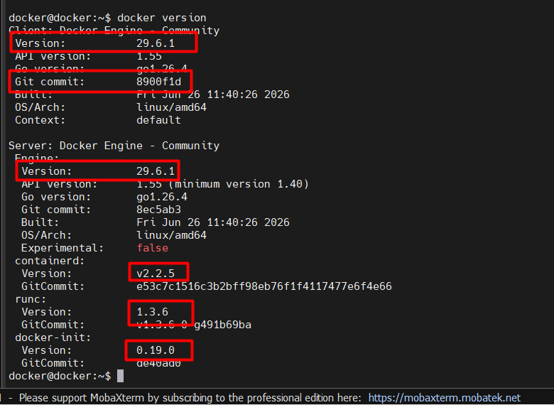

Lệnh `docker info`:

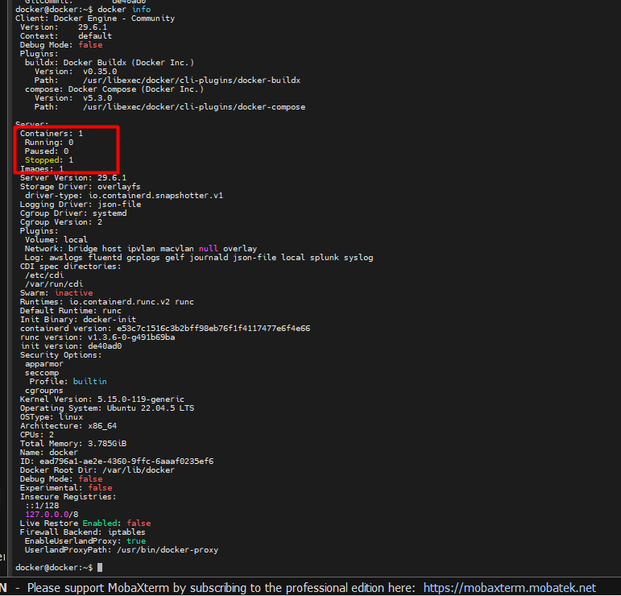

Lệnh `docker system df` + `docker system df -v` :

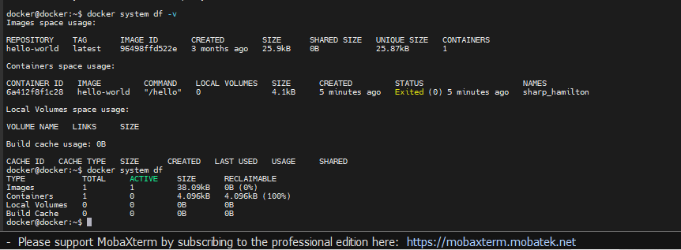

Lệnh `docker stats` + `docker stats --no-stream`:

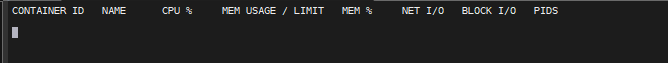

Lệnh `docker events`:

=> Phải có `container` chạy mới ghi event

## 2. Quản lý Image

### 2.1 Pull / Push Image

```bash
docker pull nginx:1.27-alpine                # Tải image
docker pull --platform linux/amd64 nginx     # Chỉ định platform
docker push myrepo/myapp:1.0                 # Đẩy lên registry (cần login)
```

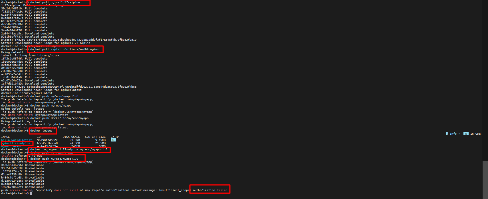

## 2.2 Liệt kê / Tra cứu Image

```bash
docker images                                # Liệt kê image local
docker image ls                              # Tương đương lệnh trên
docker images -a                             # Bao gồm cả intermediate layer
docker images --digests                      # Hiện cả digest
docker images --filter "dangling=true"       # Image mồ côi (không tag, không dùng)
docker image inspect nginx:1.27-alpine       # Toàn bộ metadata
docker image history nginx:1.27-alpine       # Layer history
docker search nginx                          # Tìm image trên Docker Hub
```

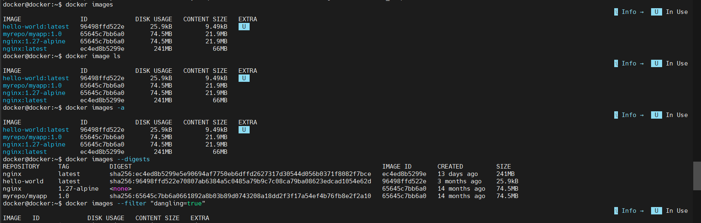

- Lệnh hiện toàn bộ `metadata`:

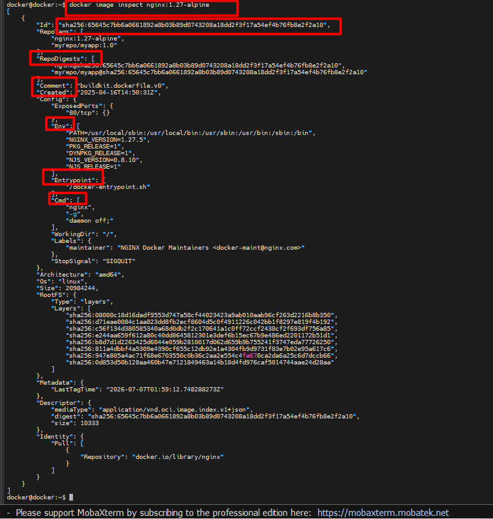

- Lệnh hiện lịch sử layer:

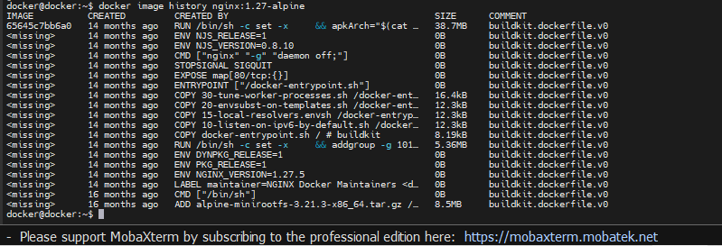

- Lệnh tìm image trên Docker Hub:

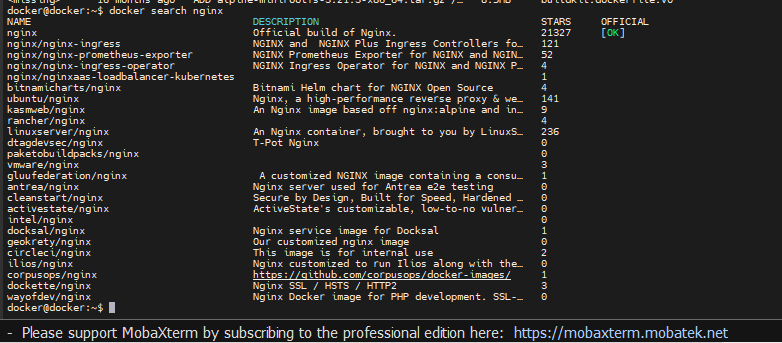

### 2.3 Tag / Build / Save / Load Image

```bash
docker tag nginx:1.27-alpine myrepo/nginx:custom    # Đặt tag mới
docker build -t myapp:1.0 .                         # Build từ Dockerfile
docker save myapp:1.0 -o myapp.tar                  # Export image ra file tar
docker load -i myapp.tar                            # Import từ tar
```

- Lệnh đặt tag:

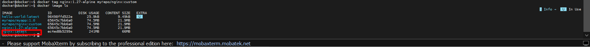

- Lệnh build từ Dockerfile:

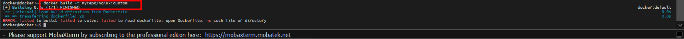

=> Lệnh build này chạy Docker đã tìm trong thư mục hiện tại (`.`), nhưng thư mục không có file **Dockerfile**. Phải chỉ định thư mục chứa Dockerfile

### 2.4 Xoá image

```bash
docker rmi nginx:1.27-alpine        # Xóa image (alias: docker image rm)
docker rmi -f nginx                 # Force xóa (kể cả khi có container dùng)
docker image prune                  # Xóa image dangling (không tag)
docker image prune -a               # Xóa tất cả image không được dùng bởi container nào
docker image prune -a --filter "until=24h"   # Xóa image cũ hơn 24 giờ
```

- Lệnh xoá image:

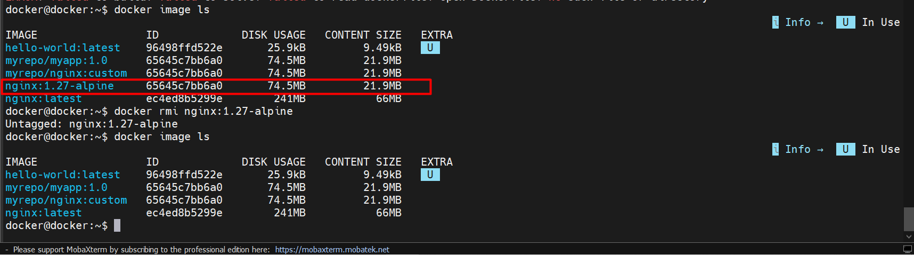

- Lệnh xoá flag `-force`:

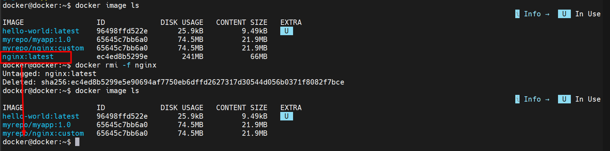

- Lệnh xoá image không tag:

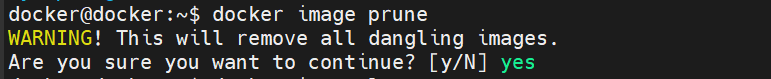

- Xoá tất cả image không được dùng bởi container nào:

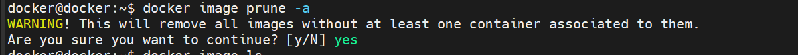

- Xoá image cũ hơn `24h` dùng lọc `filter`:

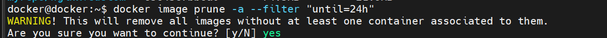

**Lưu ý**: Với các phiên bản Docker mới sử dụng **containerd image store**, `docker image prune -a` chỉ xóa các image không còn được gắn tag (untagged) hoặc không còn được tham chiếu. Một image vẫn còn các tag hợp lệ như `myrepo/myapp:1.0` và `myrepo/nginx:custom` được xem là vẫn đang được giữ lại, dù không có container nào dùng. Lúc này cần untag 1 trong 2 tag của image đó:(Giả sử untag `myrepo/myapp:1.0`)

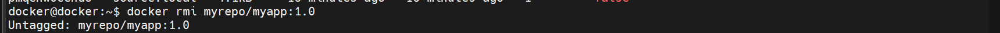

## 3. Quản lí Container

### 3.1 Các lệnh tạo và chạy Container

```bash
docker run nginx                              # Foreground, gắn STDOUT/STDERR
docker run -d nginx                           # Detached (chạy ngầm)
docker run -d -p 8080:80 nginx                # Map port host:container
docker run -d -p 127.0.0.1:8080:80 nginx      # Chỉ bind localhost
docker run -d --name web nginx                # Đặt tên container
docker run -it ubuntu:24.04 bash              # Interactive + TTY (vào shell)
docker run --rm ubuntu:24.04 echo "hello"     # Tự xóa sau khi exit
docker run -e MY_VAR=value nginx              # Biến môi trường
docker run --env-file .env nginx              # Load env từ file
docker run -v my-vol:/data nginx              # Named volume
docker run -v $(pwd)/src:/app/src nginx       # Bind mount
docker run --network my-net nginx             # Custom network
docker run --restart unless-stopped nginx     # Restart policy
docker run --memory="512m" --cpus="1.5" nginx # Giới hạn tài nguyên
docker run --user 1000:1000 nginx             # Chạy với UID:GID cụ thể
docker run --read-only nginx                  # Filesystem chỉ đọc
docker run --cap-drop ALL --cap-add NET_BIND_SERVICE nginx   # Giới hạn capability
docker run --health-cmd="curl -f http://localhost/" \
           --health-interval=30s nginx        # Healthcheck
```

- Lệnh chạy container từ image + Dừng chạy:

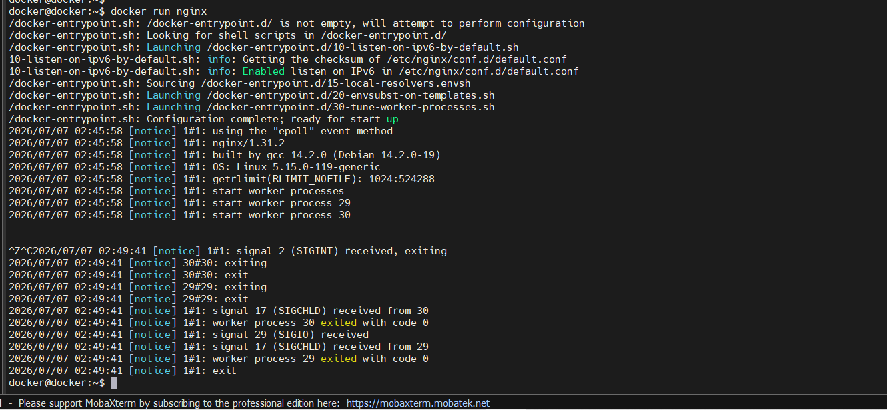

- Lệnh chạy ngầm container để tiện theo dõi:

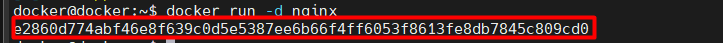

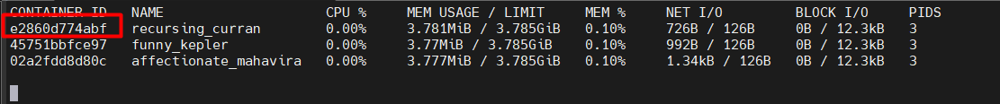

- Map port `host:container`:

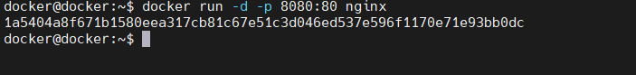

- Map port chỉ bind localhost (Dùng cho lab local):

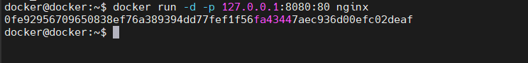

- Đặt tên container:

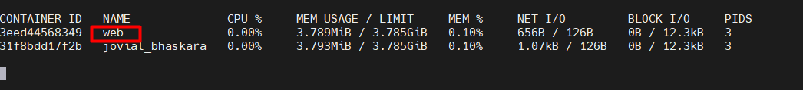

- Lệnh Interactive + TTY (vào shell của ubuntu):

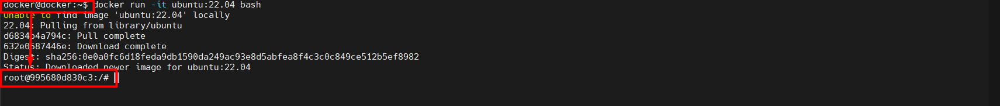

=> Gõ `exit` hoặc nhấn `Ctrl + D` để thoát shell container.

- Lệnh tự xóa sau khi exit shell:(Thực hiện trên Docker Host)

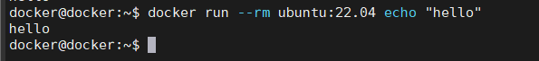

- Lệnh truyền biến môi trường vào trong Container (Chỉ có tác dụng trong Container đó) để các user chạy nó có cùng môi trường:
  
  - Giả sử truyền biến môi trường là kết nối database:

  ```bash
  docker run -d --name my-mysql -e MYSQL_ROOT_PASSWORD=Tien123 mysql

  # Xem docker run --help để rõ các trường
  # Riêng trường --name là đặt trên container
  ```

  - Tương tác vào shell **container đang chạy**:

  ```bash
  docker exec -it my-mysql mysql -u root -p
  ```

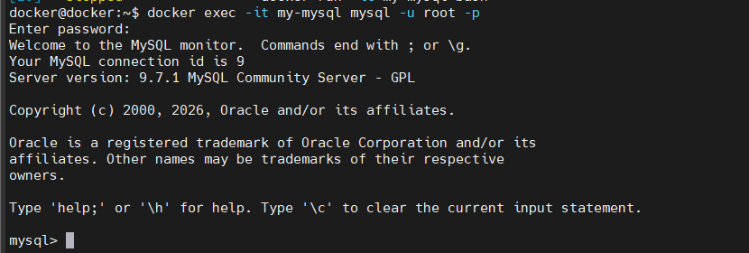

- Ngoài ra, thay vì truyền từng biến và giá trị của nó vào từng lệnh một, ta có thể truyền hẳn một file `.env` chứa tất cả biến môi trường mà ta muốn chuyển:

  - Ta tạo file `.env` vào thư mục mà ta đang chạy lệnh. Lấy luôn ví dụ Mysql bên trên:

  ```bash
  nano mysql.env

  MYSQL_ROOT_PASSWORD=StrongPass123!
  MYSQL_DATABASE=appdb
  MYSQL_USER=appuser
  MYSQL_PASSWORD=appuser123
  ```

  - Sau đó ta xoá và chạy lại container:

  ```bash
  docker run -d --name my-mysql --env-file mysql.env mysql
  ```

  - Kiểm tra biến đã nạp đúng chưa:

  ```bash
  docker exec my-mysql env
  ```

**Note**: Lưu ý quan trọng khi dùng file

- Không nên commit file `.env` lên Git nếu chứa mật khẩu — nên thêm `.env` vào file `.gitignore`.
- File `.env` không hỗ trợ comment bắt đầu bằng `#` trên một số phiên bản Docker cũ — nên tránh dùng comment nếu không chắc.
- Có thể kết hợp cả `--env-file` và `-e` trong cùng một lệnh — nếu trùng tên biến, `-e` sẽ ghi đè giá trị trong file.

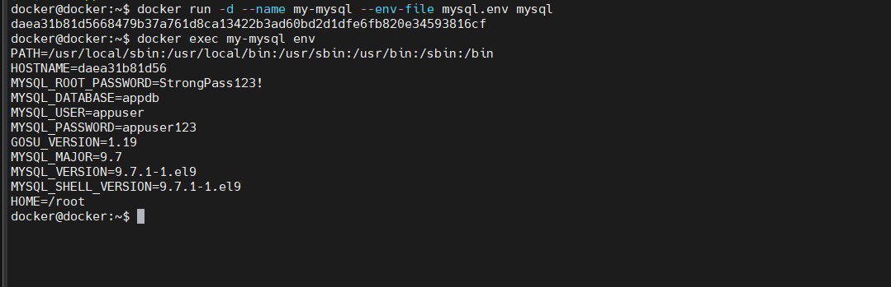

- Tiếp  theo, thực hành lệnh gắn volume trên máy Host (Do Docker quản lí) mount với thư mục `/data` trong cointainer, để sau khi xoá container cũng không mất dữ liệu:

  - Đầu tiên, thực hiện tạo và chạy container với volume:

  ```bash
  docker run -d --name web1 -v my-vol:/usr/share/nginx/html nginx
  
  # Mount vào đúng thư mục nginx dùng để chứa trang web (/usr/share/nginx/html).
  ```

  - Rồi tạo 1 file trong Container:

  ```bash
  docker exec web1 sh -c "echo 'Hello Volume' > /usr/share/nginx/html/index.html"

  # flag -c thực hiện chuỗi command string sau!
  ```

  - Tiếp theo, xoá container:

  ```bash
  docker rm -f web1
  ```

  - Tạo container mới và mount cùng volume cũ:

  ```bash
  docker run -d --name web2 -v my-vol:/usr/share/nginx/html nginx
  ```

  - Cuối cùng kiểm tra dữ liệu còn không:

  ```bash
  docker exec web2 cat /usr/share/nginx/html/index.html
  ```

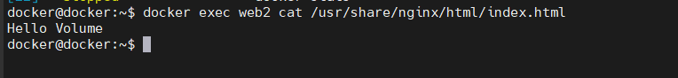

- Lệnh dùng để mount trực tiếp một thư mục thật trên **máy host** vào bên trong container — đây chính là kiểu bind mount mà mình có nhắc ở câu trước, khác với **volume do Docker tự quản lý**:

  - Đầu tiên, check xem thư mục ta đứng là ở đâu:

  ```bash
  pwd
  
  # Output:/home/docker
  ```

  - Giả sử ta tạo thư mục `myapp` để hình dung như đang làm việc với dự án ta phát triển 1 ứng dụng Node.js

  ```bash
  mkdir myapp
  ```

  - Lúc này cấu trúc thư mục dự án sẽ phân như sau:

  ```text
  /home/docker/myapp/
  ├── src/
  │   ├── index.js
  │   └── utils.js
  ├── package.json
  ```

  - Ta chạy để bind mount thư mục trên máy Host ứng với thư mục dự án:

  ```bash
  cd /home/docker/myapp
  docker run -it -v $(pwd)/src:/app/src -w /app node sh
  ```

  - Thử sửa file ngay trên máy host (không cần vào container):

  ```bash
  sudo chown -R docker:docker src
  echo "console.log('Hello from host')" >> src/index.js
  ```

  - Rồi thử vào container kiểm tra:

  ```bash
  docker exec -it <container_id> cat /app/src/index.js
  ```

  =>  Bạn sẽ thấy dòng vừa thêm xuất hiện ngay lập tức, dù bạn sửa file từ bên ngoài container. Đây chính là điểm mạnh nhất của bind mount: dev code ở máy host bằng VS Code quen thuộc, nhưng **chạy/test** trong môi trường container — rất phổ biến khi phát triển phần mềm.

**Note2**: Lưu ý dùng trong thực tế

- Không dùng bind mount kiểu này cho production — vì phụ thuộc vào cấu trúc thư mục của máy host, không portable.
- Thường kết hợp bind mount này với Dockerfile để dev có "hot reload" — sửa code là thấy kết quả ngay, không cần build lại image.
- Trên Windows (PowerShell), `$(pwd)` không hoạt động giống hệt — cần dùng `${PWD}` (PowerShell) hoặc `%cd%` (cmd) thay thế.

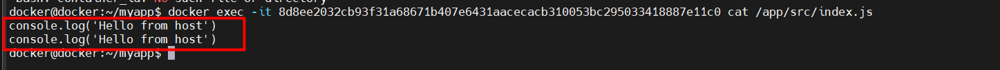

- Tiếp theo, lệnh custom Network container:

  - Đầu tiên tạo 1 mạng có tên `my-net` cho container:

  ```bash
  docker network create my-net
  ```

  - Chạy container trong network đó:

  ```bash
  docker run -d --name my-mysql --network my-net \
  -e MYSQL_ROOT_PASSWORD=StrongPass123! \
  -e MYSQL_DATABASE=appdb \
  mysql
  ```

  - Chạy container ứng dụng khác để kết nối mysql thông qua `my-net`:

  ```bash
  docker run -it --network my-net --name my-app node sh
  ```

  - Từ bên trong `my-app`, thử kết nối tới `my-mysql` bằng TÊN, không cần IP

  ```bash
  apt-get update && apt-get install -y default-mysql-client
  mysql -h my-mysql -u root -p --skip-ssl

  # -h: dùng thẳng tên container làm hostname
  ```

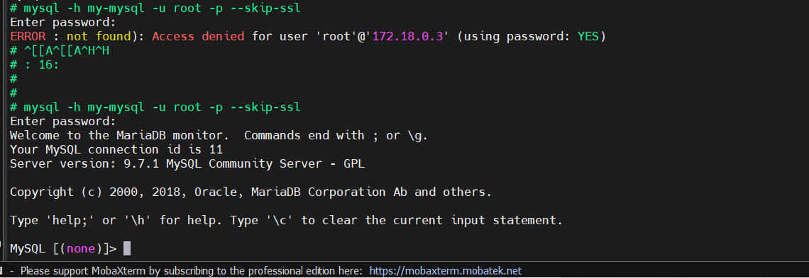  

=> Việc sử dụng mạng trong triển khai ứng dụng nói chung giúp phân chia quyền truy cập giữa các services với nhau (Ví dụ như `backend-net` là đường mạng để backend-app truy cập vào database mà frontent không thể truy cập được!)

**Note 3**:

- Khác với volume thì ta cần phải tạo trước network thì mới có thể gán nó vào container
- Ngoài ra, phải dừng/xóa hết container đang dùng network đó trước, nếu không sẽ báo lỗi "network has active endpoints".

- Tiếp theo, ta tìm hiểu lệnh set policy restart cho container (Trong trường hợp, container bị dừng vì lí do nào đó sẽ restart lại)

  - Ví dụ:

  ```bash
  docker run --restart unless-stopped nginx
  ```

  - `--restart`: flag để chỉ định chính sách restart.
  - `unless-stopped`: container sẽ tự khởi động lại trong mọi trường hợp (container bị crash, Docker daemon restart, máy host reboot,...) NGOẠI TRỪ khi bạn chủ động dừng nó bằng tay (docker stop).

  - Ngoài ra, có 1 số flag của trường `--restart`:

| Giá trị          | Ý nghĩa                                                                                             |
| ---------------- | ----------------------------------------------------------------------------------------------------- |
| `no`             | Mặc định. Không tự động khởi động lại container trong bất kỳ trường hợp nào.                                                                                                        |
| `on-failure`     | Chỉ khởi động lại nếu container thoát với lỗi (exit code khác `0`).                                                                                                                 |
| `on-failure:5`   | Giống `on-failure`, nhưng chỉ thử khởi động lại tối đa **5 lần**.                                                                                                                   |
| `always`         | Luôn tự khởi động lại container. Nếu Docker daemon khởi động lại (ví dụ sau khi reboot máy), container cũng sẽ tự chạy lại, ngay cả khi trước đó bạn đã `docker stop` nó.           |
| `unless-stopped` | Giống `always`, nhưng nếu bạn **`docker stop` thủ công**, Docker sẽ ghi nhớ trạng thái đó và **không tự khởi động lại** container sau khi Docker daemon hoặc máy chủ khởi động lại. |

=> Trong production người ta luôn sử dụng `unless-stopped`.

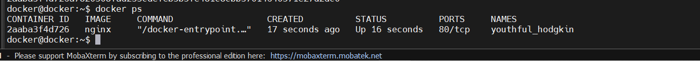  

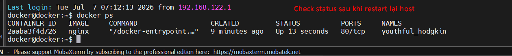

- Tiếp theo, ta tìm hiểu lệnh giới hạn tài nguyên:

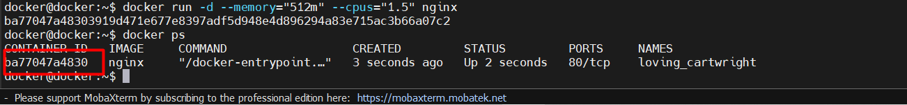

=> Chức năng chính sẽ là phân chia tài nguyên hạ tầng cho ứng dụng.

- Tiếp theo, chạy container vưới `UID`:`GID` cụ thể:
  
  - Trong Dockerfile:
  
  ```bash
  RUN chown -R 1000:1000 /var/cache/nginx /var/run /var/log/nginx
  USER 1000
  ```

  - Ví dụ:

  ```bash
  docker run --user 1000:1000 nginx
  ```

  - Số đầu (1000) là UID (User ID) hay là user Docker
  - Số sau (1000) là GID (Group ID)
  - Cú pháp: --user <UID>:<GID>

=> Chức năng chính lệnh này:

- Nếu ứng dụng bên trong container có lỗ hổng bảo mật, và kẻ tấn công thoát được ra khỏi container (container escape), họ sẽ có quyền root trên chính host (cực kỳ nguy hiểm).
- Bất kỳ file nào container tạo ra (qua bind mount) đều mang quyền root, gây khó khăn khi thao tác từ host (như ta đã gặp ở trên).

- Tiếp theo, chạy container với **File-system** `read-only`

```bash
docker run -d --name web --read-only \
  --tmpfs /var/cache/nginx \
  --tmpfs /var/run \
  --tmpfs /tmp \
  nginx
```

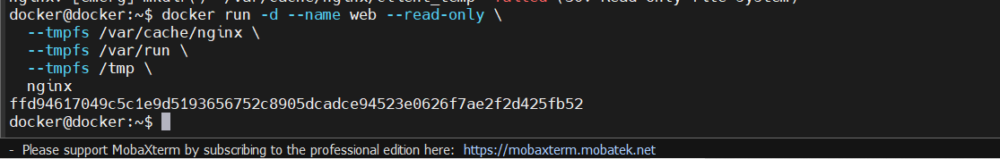

**Note 4**: Nếu ta chạy lệnh `docker run --read-only nginx` -> Rất có thể nginx sẽ báo lỗi hoặc không khởi động được, vì nginx cần ghi vào một số thư mục tạm như `/var/cache/nginx`, `/var/run`, `/tmp` để hoạt động (lưu PID file, cache,...).

**Note 5**: Với mỗi image ứng dụng khcas nhau thì thư mục ghi tạm khác nhau.

=> **Cách khắc phục**: dùng thêm `--tmpfs` để cấp phát vùng nhớ tạm (RAM) cho những thư mục cụ thể cần ghi.

=> `--tmpfs /path`: tạo một filesystem tạm nằm trong RAM tại đường dẫn đó, container được ghi thoải mái vào đây, nhưng dữ liệu sẽ mất hết khi container dừng (đúng ý đồ — vì đây chỉ là cache/tạm, không phải dữ liệu cần giữ).

=> Ngoài ra, kết hợp `--read-only` + volume cho dữ liệu thật sự cần giữ (Giả dụ ví dụ MySQL):

```bash
docker run -d --name my-mysql \
  --read-only \
  --tmpfs /tmp \
  --tmpfs /var/run/mysqld \
  -v mysql-data:/var/lib/mysql \
  --env-file mysql.env \
  mysql
```

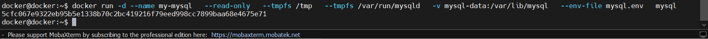

- Tiếp theo, chạy container giới hạn Capacility

  - Ví dụ:

  ```bash
  docker run --cap-drop ALL \
  --cap-add NET_BIND_SERVICE \
  --cap-add CHOWN \
  --cap-add SETUID \
  --cap-add SETGID \
  -p 8080:80 nginx
  ```

  => Lệnh này chạy container nginx với nguyên tắc "least privilege" (đặc quyền tối thiểu) bằng cách kiểm soát Linux capabilities — các quyền hạn cấp thấp của kernel mà bình thường tiến trình root trong container sẽ có toàn bộ.

  - Trong đó: `--cap-drop ALL`:Loại bỏ toàn bộ capabilities mặc định mà Docker cấp cho container (khoảng 14 quyền như CHOWN, KILL, NET_RAW, SETUID,...)
  - `--cap-add NET_BIND_SERVICE`(Chỉ cấp lại một quyền duy nhất): Cho phép tiến trình bind vào các cổng < `1024` (như cổng `80`, `443`) mà không cần chạy full quyền root
  - `nginx`: Image chạy

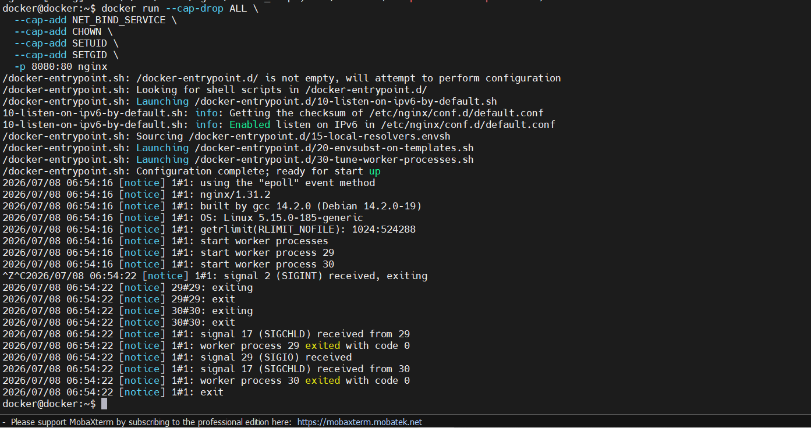

**Note 6**: Bộ **14 capabilities** mặc định của Docker cấp cho container:

```text
CHOWN, DAC_OVERRIDE, FOWNER, FSETID, KILL, SETGID, SETUID,
SETPCAP, NET_BIND_SERVICE, NET_RAW, SYS_CHROOT, MKNOD,
AUDIT_WRITE, SETFCAP
```

- Còn đối root capabilities là `~40`

- Cuối cùng, ta đi tìm hiểu lệnh chạy container kèm HealthCheck:

  - Ví dụ:
  
  ```bash
  docker run --health-cmd="curl -f http://localhost/" \
           --health-interval=30s nginx        # Healthcheck
  ```

### 3.2 Các lệnh Quản lí vòng đời

```bash
docker ps                       # Container đang chạy
docker ps -a                    # Tất cả (cả đã dừng)
docker ps -q                    # Chỉ ID (dùng để pipe)
docker ps --filter "status=exited"
docker ps --format "table {{.Names}}\t{{.Status}}\t{{.Ports}}"

docker stop web                 # SIGTERM, chờ 10s, SIGKILL
docker stop -t 30 web           # Tăng timeout lên 30s
docker start web                # Khởi động lại container đã dừng
docker restart web              # Stop rồi start
docker pause web                # Freeze process (SIGSTOP qua cgroups freezer)
docker unpause web              # Resume
docker kill web                 # SIGKILL ngay lập tức
docker kill -s SIGHUP web       # Gửi signal khác

docker rm web                   # Xóa container đã dừng
docker rm -f web                # Force xóa container đang chạy
docker rm $(docker ps -aq)      # Xóa tất cả container
```

- Đầu tiên lệnh quản lí các container đang chạy:

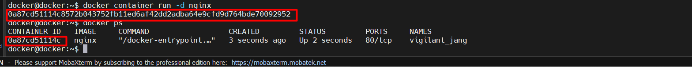

- Lệnh liệt kê container kể cả các container đã dừng:

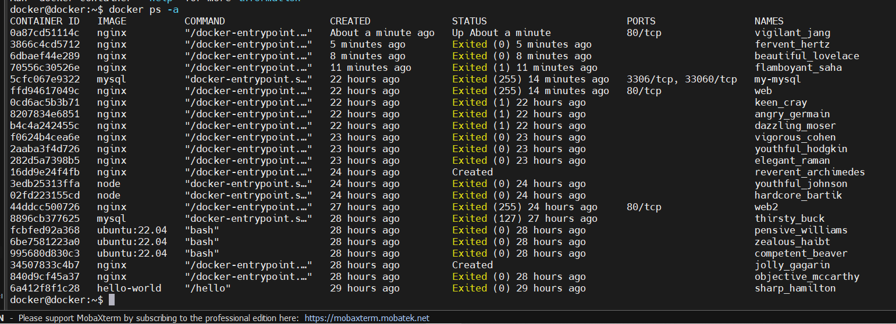

- Lệnh liệt kê container chỉ hiện ID hỗ trợ cho việc CI/CD pipeline

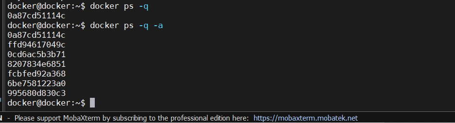

- Lệnh liệt kê các container trạng thái dừng:

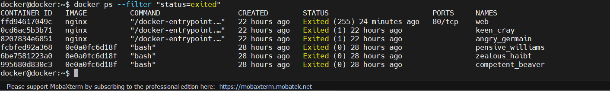

- Lệnh liệt kê các container thành format bảng với các trường tuỳ chọn. Ví dụ:

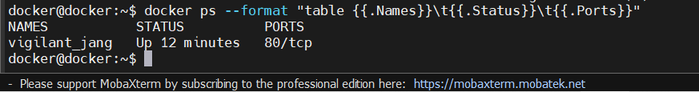

- Lệnh dừng container đang chạy:

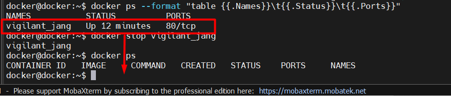

- Lệnh dừng container đang chạy nhưng timeout 30s:

- Lệnh chạy lại container:

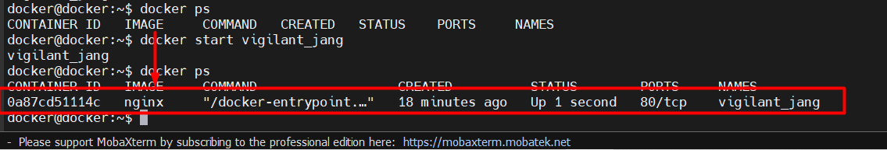

- Lệnh restart container:

- Lệnh pause container:

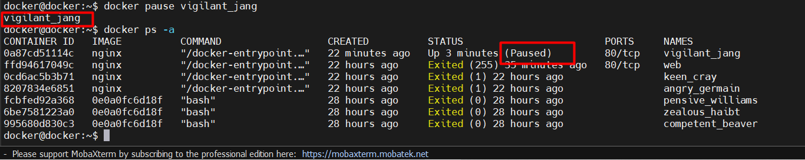

- Lệnh unpause container:

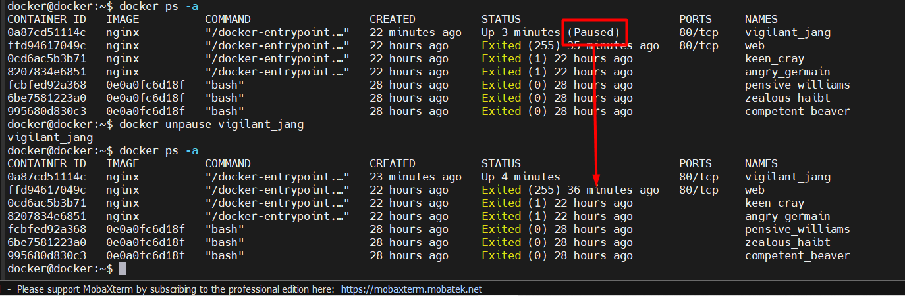

- Lệnh gửi `SIGKILL` dừng tiến trình ngay chạy trong container ngay lập tức:

**Note 7**: Khác với lệnh `docker stop` làm cho tiến trình trong container bị treo (SiGTERM) khoảng 10s để dọn dẹp sau nhưng lệnh `docker kill` gửi lệnh `SIGKILL` cho dừng tiến trình ngay lập tức mà không có cơ hội time out.

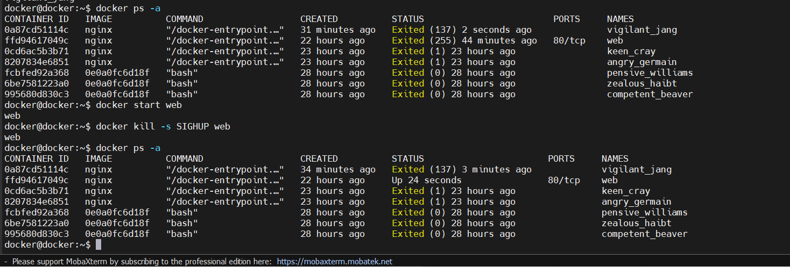

- Ngoài ra, còn có lệnh gửi tiến trình `SIGHUP`:

  - Lệnh `SIGHUP` là tiến trình dùng để reload config mà không cần restart toàn bộ tiến trình

- Tiếp theo, lệnh xoá container đã dừng:

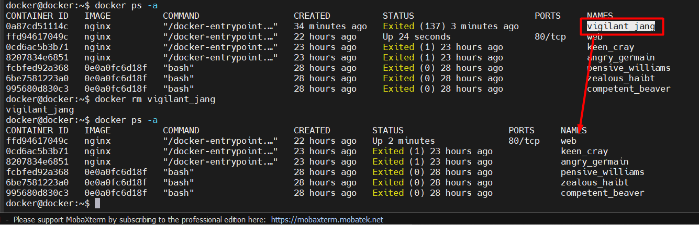

- Tiếp theo, lệnh xoá container kể cả đang chạy:

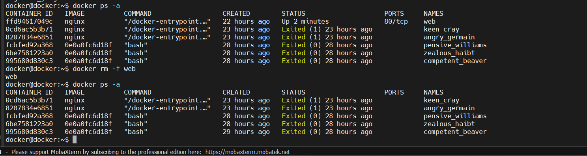

- Cuối cùng là lệnh xoá tất cả container(kể cả dừng và đang chạy):

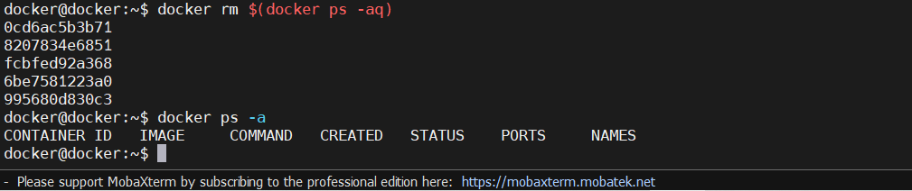

### 3.3 Các lệnh tương tác với Container

```bash
docker exec -it web bash              # Mở shell vào container
docker exec -it web sh                # Khi không có bash (alpine)
docker exec web cat /etc/hosts        # Chạy lệnh đơn
docker exec -u root -it web bash      # Vào với user root
docker exec -w /usr/share/nginx/html magical_fermat ls            # Đặt working dir

docker logs web                       # Xem log
docker logs -f web                    # Follow realtime
docker logs --tail 100 web            # 100 dòng cuối
docker logs --since 10m web           # Log trong 10 phút gần nhất
docker logs -t web                    # Kèm timestamp

docker attach web                     # Gắn STDIN/STDOUT vào main process (cẩn thận: Ctrl+C sẽ kill container nếu không thoát đúng)
# Thoát attach mà không kill: Ctrl+P, Ctrl+Q

# Bạn thấy log nginx chạy trực tiếp trên terminal
# Nhấn Ctrl+C → nginx nhận SIGINT → thoát → container "web" dừng luôn (Exited)
```

- Đầu tiên, là lệnh mở shell vào container:

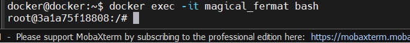

- Tiếp theo, Chạy lệnh mở shell nếu không có bash shell:

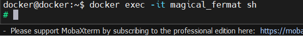

- Tiếp theo, nếu ta chỉ muốn chạy lệnh đơn trong container:

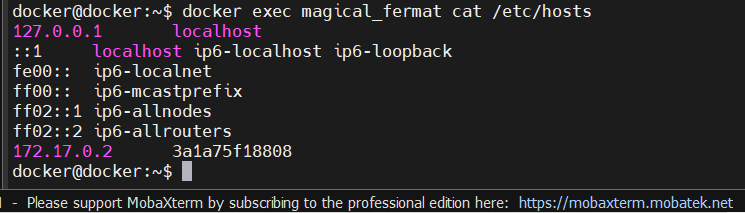

- Tiếp theo, nếu ta muốn truy cập vào container với user `root`:

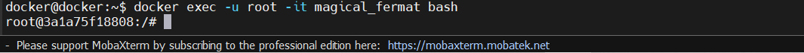

- Tiếp theo, nếu ta muốn đặt working dir trong container:

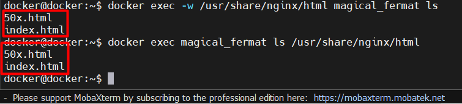

- Tiếp theo, ta muốn check log trong container:

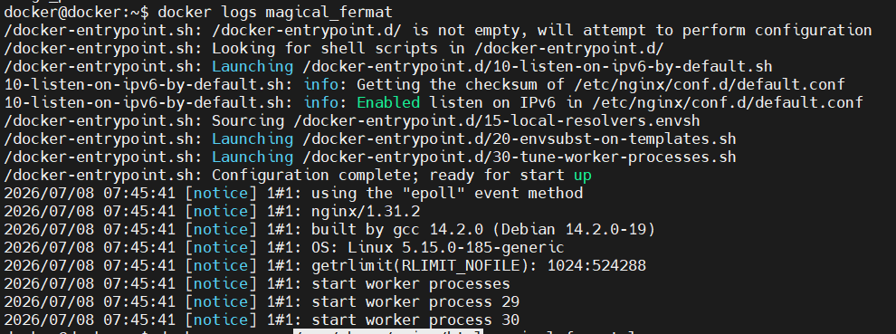

Tiếp theo, ta muốn check log realtime:

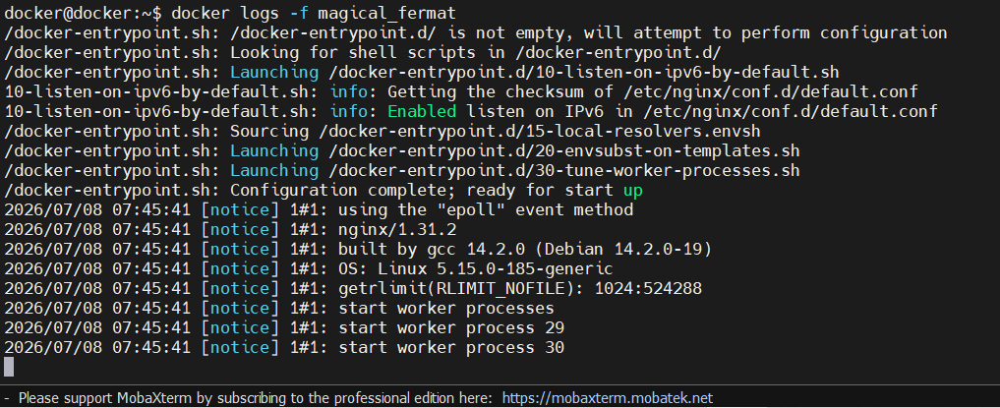

- Tiếp tục với check log 100 dòng cuối, hoặc log trong 10 phút gần nhất hay log kèm timestamp

- Cuối cùng, Gắn `STDIN`/`STDOUT` vào main process

**Note 8**: Khi nào nên dùng `docker attach`:

- Xem trực tiếp output của tiến trình chính (giống `docker logs -f` nhưng còn tương tác được input)
- Debug tiến trình chạy foreground (vd: một script Python đang chạy interactive)
- Không nên dùng cho các service production chạy 24/7 như nginx, vì rủi ro vô tình `Ctrl+C` làm sập service

### 3.4 Inspect/ Top/ Stats trong Container

```bash
docker inspect web                              # Toàn bộ metadata JSON
docker inspect -f '{{.State.Status}}' web       # Lấy field cụ thể (Go template)
docker inspect -f '{{.NetworkSettings.IPAddress}}' web
docker top web                                  # Process trong container
docker stats web                                # CPU/RAM/IO realtime
docker port web                                 # Xem port mapping
docker diff web                                 # File đã thay đổi so với image
```

- Đầu liên lệnh check metadata JSON của container:

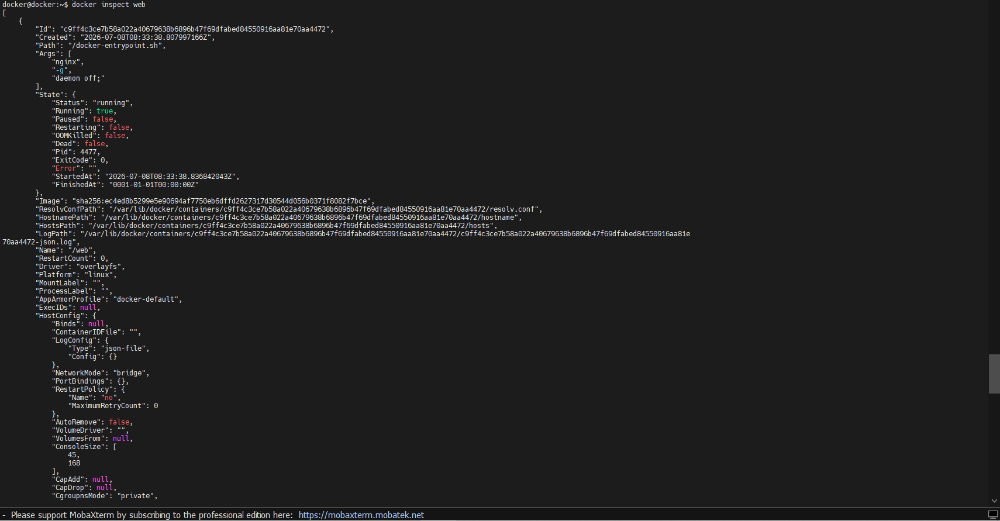

- Tiếp theo lệnh lấy field cụ thể của container:

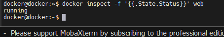

- Lệnh check Process trong container:

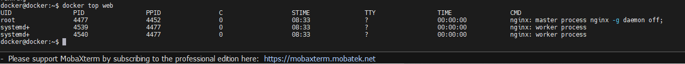

- Lệnh check CPU/RAM/IO container:

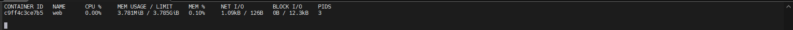

- Lệnh check port mapping với container:

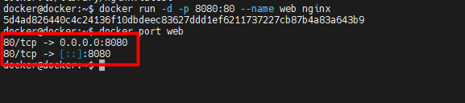

- Lệnh check file đã thay đổi gì so với images:

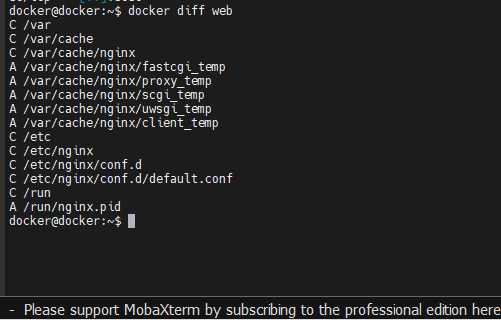

### 3.5 Copy file trong Container

```bash
docker cp ./config.yaml web:/etc/app/config.yaml     # Host → container
docker cp web:/etc/app/config.yaml ./config.yaml     # Container → host
docker cp web:/etc/. ./web-etc/                      # Copy nguyên thư mục
```

Đầu tiên, lệnh copy file từ Docker Host đến Conatiner:

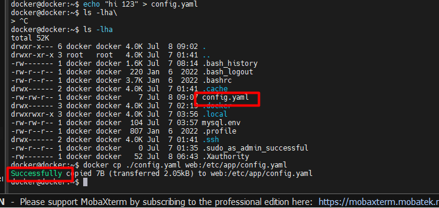

Tiếp theo, lệnh copy file từ Container đến Docker Host:

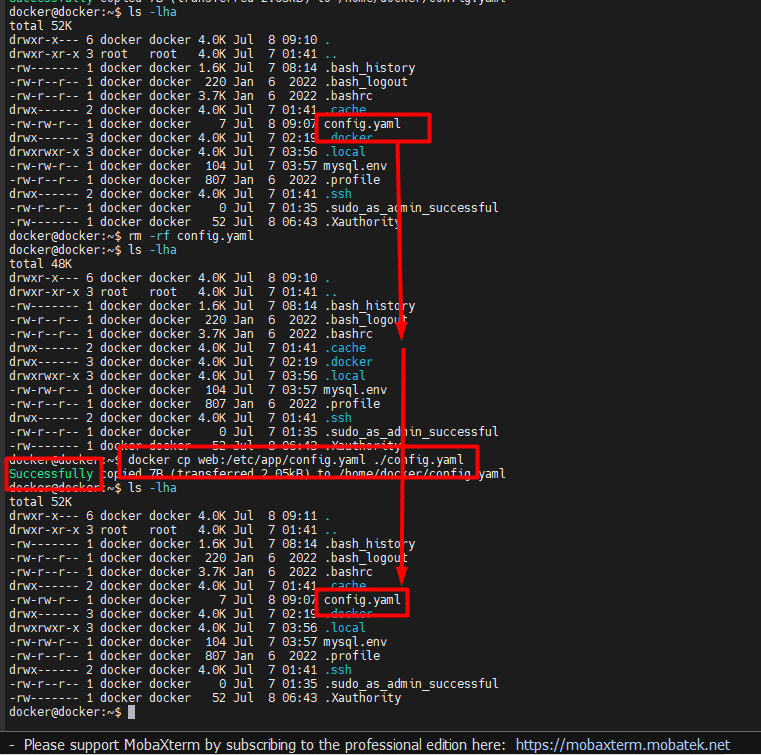

Cuối cùng, Lệnh copy nguyên thư mục từ Container ra Host:

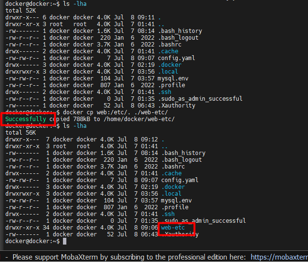

### 3.6 Commit / Export Container

```bash
docker commit web my-image:custom        # Tạo image từ container hiện tại (debug only, không dùng cho production)
docker export web -o web.tar             # Export filesystem container ra tar (mất history layer)
docker import web.tar my-image:flat      # Import flat tar thành image
```

Ta đóng gói cả container(đóng gói trạng thái hiện tại của container web - bao gồm mọi thay đổi filesystem đã xảy ra kể từ lúc chạy thành 1 image mới) thành 1 image để tạo ra nhiều container clone khác:(Dùng cho debug, không dùng cho production)

- Có thể thêm metadata khi commit:

```bash
docker commit \
  --author "Nguyen Van A <a@example.com>" \
  --message "Add curl and disable server_tokens" \
  --change='CMD ["nginx", "-g", "daemon off;"]' \
  web my-image:custom
```

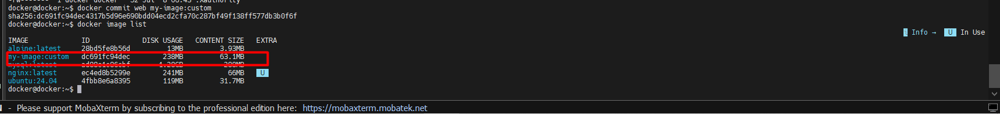

Tiếp theo, ta Export filesystem container ra tar(mất history layer):

- `TAR` = `Tape ARchive` — một định dạng file dùng để gộp nhiều file/thư mục thành 1 file duy nhất, giữ nguyên cấu trúc thư mục và permissions gốc.

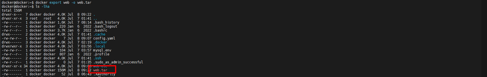

=> Lệnh này xuất toàn bộ filesystem của container web (tại thời điểm hiện tại) thành 1 file `.tar` duy nhất, lưu ra đường dẫn web.tar.

=> Do nó không giữ lại metadata lên nó dùng để backup/di chuyển filesystem thô, hoặc audit(quyền).

Cuối cùng, ta import flat tar ta vừa xuất ở trên thành image:

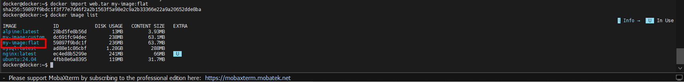

**Note 9**: image này sẽ mất hết `CMD`, `ENTRYPOINT`, `EXPOSE`... đã có ở image gốc — phải khai báo lại nếu cần.

### 3.7 Dọn dẹp Container

```bash
docker container prune                      # Xóa tất cả container đã dừng
docker container prune --filter "until=24h"
docker system prune                         # Xóa container, network, image dangling - image no tag không dùng
docker system prune -a                      # Xóa tất cả image không dùng
docker system prune -a --volumes            # Xóa sạch (CẢNH BÁO: mất volume data!)
```

- Đầu tiên, xoá tất cả container đã dừng:

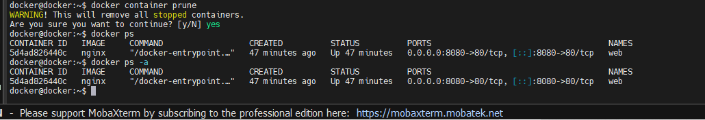

- Tiếp theo, xoá tất cả container đã dừng trong vòng 24h + xoá network, image ko tag,...(xoá tất cả tài nguyên không sử dụng trên hệ thống) và xoá sạch cả volume

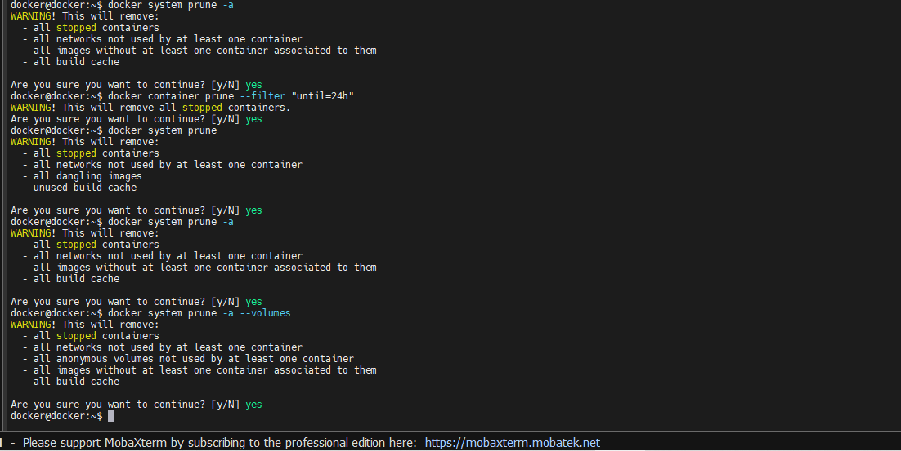

## 4. Các lệnh quản lí Volume

```bash
docker volume create my-data                   # Tạo volume
docker volume create --driver local \
       -o type=nfs -o o=addr=10.0.0.1,rw \
       -o device=:/exports/data my-nfs         # Volume với driver/option

docker volume ls                               # Liệt kê
docker volume ls --filter "dangling=true"      # Volume không gắn container nào
docker volume inspect my-data                  # Xem chi tiết
docker volume rm my-data                       # Xóa
docker volume prune                            # Xóa volume không dùng
docker volume prune --filter "label!=keep"     # Trừ volume có label `keep`

# Gắn volume vào cointainer
docker run --mount source=my-data,target=/app/data ...

# Xóa nhiều volume cùng lúc / force
docker volume rm $(docker volume ls -q -f dangling=true)
docker volume rm -f my-data

# Xem volume đang gắn ở container nào
docker inspect --format '{{ json .Mounts }}' <container>

# Backup / restore dữ liệu trong volume
docker run --rm -v my-data:/data -v $(pwd):/backup alpine \
  tar czf /backup/backup.tar.gz -C /data .

docker run --rm -v my-data:/data -v $(pwd):/backup alpine \
  tar xzf /backup/backup.tar.gz -C /data
```

- Đầu tiên là lệnh tạo volume `my-data` lưu trữ local:

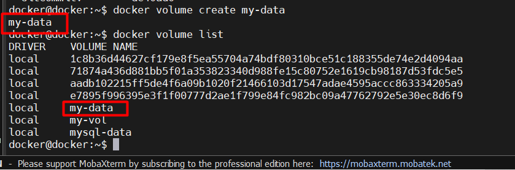

- Sau đó là lệnh tạo volume với diver option khác:

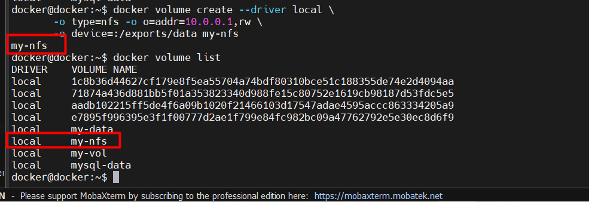

- Tiếp theo đó, là các lệnh xem chi tiết, xoá và xoá các volume không dùng:

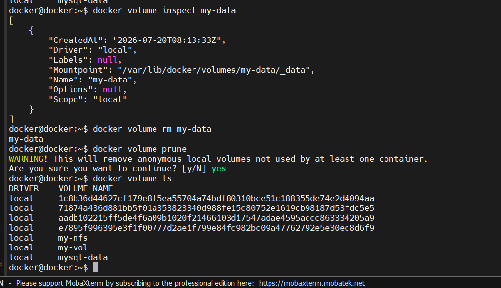

- Quan trọng nhất là lệnh gắn volume vào container:

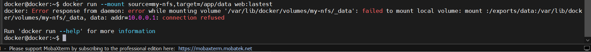

=> Output này được rồi do ta chưa cấu hình volume type nfs chuẩn.

## 5. Các lệnh Quản lí Network

```bash
docker network create my-net                          # Bridge network
docker network create --driver overlay swarm-net      # Overlay (cần swarm)
docker network create --subnet=172.20.0.0/16 \
       --gateway=172.20.0.1 my-net                    # Chỉ định subnet/gateway

docker network ls                                     # Liệt kê
docker network inspect my-net                         # Chi tiết (gồm container đang gắn)

docker network connect my-net web                     # Gắn container vào network
docker network connect --ip 172.20.0.10 my-net web   # Gắn với IP cố định
docker network disconnect my-net web                  # Bỏ gắn

docker network rm my-net                              # Xóa
docker network prune                                  # Xóa network không dùng

# Gắn container vào network ngay lúc tạo (thay vì connect sau)
docker run --network my-net --name web nginx
docker run --network my-net --network-alias webserver nginx   # đặt alias DNS trong network

# Container giao tiếp bằng tên - Chỉ hoặt dộng với user define network
docker network create my-net
docker run -d --network my-net --name db postgres
docker run -d --network my-net --name app myapp
# app có thể ping/connect tới "db" bằng tên, không cần --link

# Gắn container vào nhiều network
docker network connect net1 web
docker network connect net2 web
docker inspect --format '{{json .NetworkSettings.Networks}}' web

# Tuỳ chọn driver Option nâng cao khi tạo
docker network create --driver bridge \
  -o com.docker.network.bridge.name=br0 \
  --internal my-net                          # --internal: cô lập, không ra ngoài internet

# Xem nhiều network/lọc khi prune
docker network prune --filter "until=24h"
docker network rm $(docker network ls -q --filter "type=custom")

# Xem network mặc định (bridge, host, none)
docker network ls   # sẽ thấy bridge, host, none luôn tồn tại sẵn
docker run --network host ...    # dùng trực tiếp network của host, không NAT
docker run --network none ...    # không có network

# Debug network container đang chạy
docker exec web ip addr show
docker exec web cat /etc/resolv.conf
```

- Đầu tiên, là lệnh tạo network trong localhost và chỉ định option riêng:

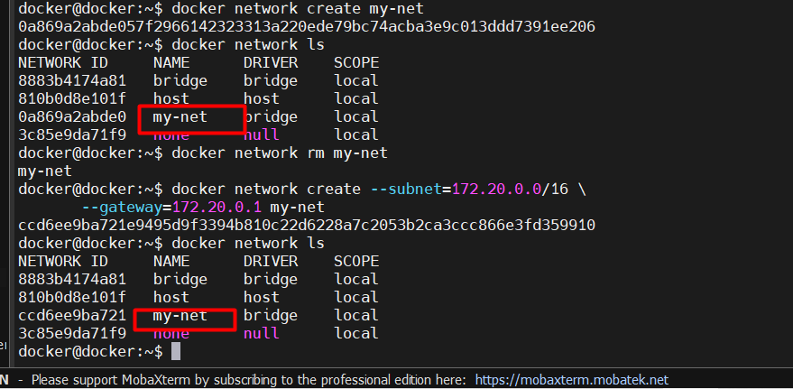

- Tiếp theo, show Chi tiết network (gồm container đang gắn):

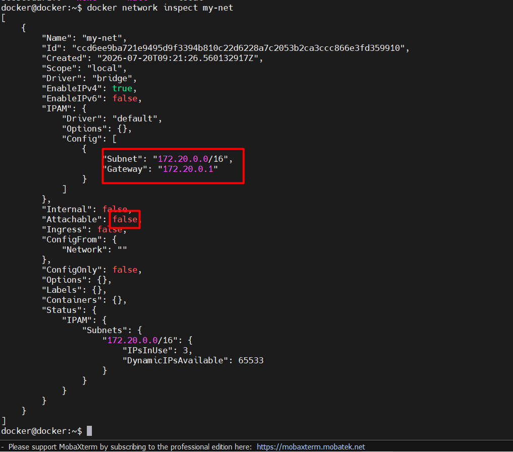

-> Ở đây`Attachable=False` thì chứng tỏ đang không gắn vào Container nào cả.

- Gắn với network vaof container:

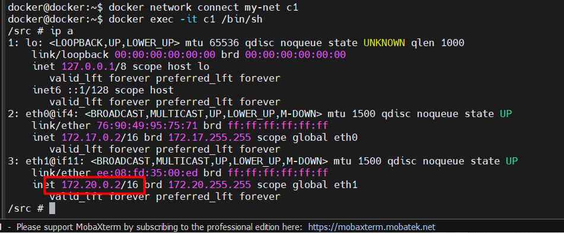

=> Các lệnh sau làm tương tự.

## 6. Các lệnh build Image

```bash
docker build -t myapp:1.0 .                              # Build từ thư mục hiện tại
docker build -t myapp:1.0 -f Dockerfile.prod .           # Chỉ định Dockerfile
docker build --no-cache -t myapp:1.0 .                   # Không dùng cache
docker build --target=builder -t myapp:dev .             # Chỉ build đến stage `builder` (multi-stage)
docker build --build-arg VERSION=1.0 -t myapp:1.0 .      # Truyền ARG
docker build --platform linux/amd64,linux/arm64 \
       -t myapp:1.0 .                                    # Build đa nền tảng (cần buildx)

# Buildx (BuildKit advanced)
docker buildx create --name multi --use                  # Tạo builder mới
docker buildx build --platform linux/amd64,linux/arm64 \
       -t myorg/myapp:1.0 --push .                       # Build và push đa nền tảng
docker buildx prune                                      # Dọn build cache
```

=> Các lệnh này ta check trong lab **deploy app thực tế** trong **Lab Docker**.

## 7. Registry / Auth

```bash
docker login                                  # Login Docker Hub
docker login ghcr.io -u USER -p TOKEN         # Login registry khác
docker logout
docker logout ghcr.io

docker pull myrepo/myapp:1.0
docker push myrepo/myapp:1.0

# Tag để push lên registry private
docker tag myapp:1.0 ghcr.io/myorg/myapp:1.0
docker push ghcr.io/myorg/myapp:1.0
```

=> Các lệnh này làm ở phần **Docker_Images&Register**.

## 8. Docker Compose

```bash
# Life Cycle
docker compose up                       # Khởi động foreground (xem log)
docker compose up -d                    # Detached
docker compose up -d --build            # Build lại image trước khi start
docker compose up -d --force-recreate   # Tạo lại container kể cả khi không đổi
docker compose up -d --no-deps web      # Không khởi động dependency
docker compose up -d web db             # Chỉ khởi động service được chỉ định

docker compose down                     # Dừng và xóa container + network
docker compose down -v                  # Bao gồm cả volume (MẤT DATA)
docker compose down --rmi all           # Xóa cả image

docker compose stop                     # Dừng (giữ container)
docker compose start                    # Khởi động lại container đã stop
docker compose restart web              # Restart 1 service
docker compose pause web                # Freeze process
docker compose unpause web

#  Inspect / Logs / Exec
docker compose ps                       # Trạng thái service
docker compose ps -a                    # Bao gồm cả stopped
docker compose top                      # Process trong từng service
docker compose stats                    # CPU/RAM realtime

docker compose logs                     # Log tất cả (1 lần)
docker compose logs -f                  # Follow
docker compose logs -f --tail 100 web   # 100 dòng cuối của `web`
docker compose logs --since 10m         # Log 10 phút gần nhất

docker compose exec web bash            # Vào shell service đang chạy
docker compose exec -u root web bash    # Với root
docker compose run --rm web npm test    # Tạo container mới chạy lệnh (rồi xóa)
docker compose run --rm web sh -c "echo $DB_HOST"

# Build/Pull/Push
docker compose build                    # Build tất cả service có `build:`
docker compose build --no-cache web
docker compose build --pull             # Pull base image mới nhất
docker compose pull                     # Pull image cho tất cả service
docker compose pull db                  # Pull image cho service cụ thể
docker compose push                     # Push image (cần đã build + login)

# Config / Validation
docker compose config                   # In ra config đã merge và validate
docker compose config --services        # Liệt kê tên service
docker compose config --volumes
docker compose config --quiet           # Chỉ kiểm tra syntax (silent)

# Scale
docker compose up -d --scale web=3      # Chạy 3 instance `web` (cần dùng `ports` dạng range hoặc bỏ ports)
```

=> Các lệnh này ta check trong lab **deploy app thực tế** trong phần **Lab Docker**.
