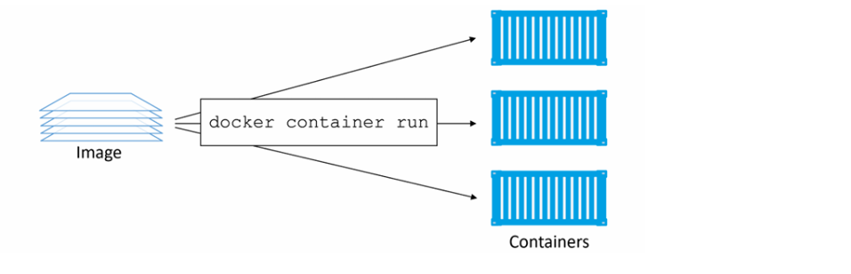
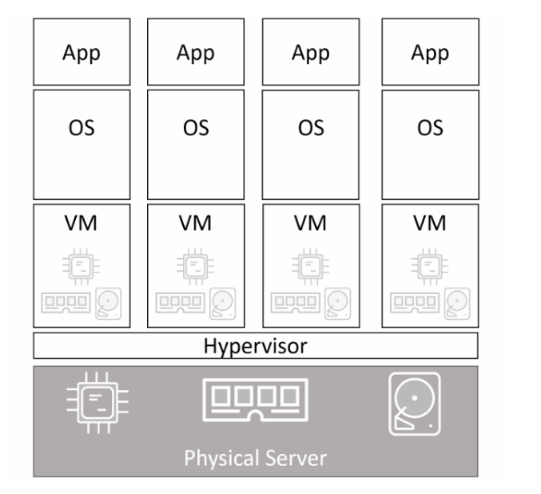
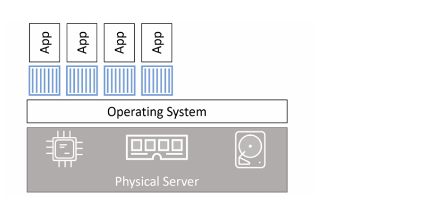

# TỔNG QUAN CONTAINERS

## I. DOCKER CONTAINERS - The TLDR

Container là instance đang chạy (runtime instance) của một image. Tương tự như việc bạn có thể khởi động một máy ảo từ một VM template, bạn có thể khởi chạy 1 hoặc nhiều container từ một image duy nhất



Cách đơn giản nhất để khởi chạy container là dùng lệnh `docker container run`

Cú pháp:

```bash
docker container run <image> <app>
```

Ví dụ sau sẽ khởi chạy một container Ubuntu chạy shell Bash:

```bash
$ docker container run -it ubuntu /bin/bash
```

## II. DOCKER CONATINERS - The deep dive

### 1. Containers vs VMs

Cả container và máy ảo (VM) đều cần một host để chạy.

Host này có thể là:

- Laptop
- Máy chủ vật lý trong data center
- 1 instance trên public cloud

Giả sử doanh nghiệp của bạn có một server vật lý cần chạy 4 ứng dụng

**Trong mô hình VM**. server vật lý được bật và hypervisor khởi động. Sau đó, hypervisor chiếm toàn bộ tài nguyên phần cứng như CPU, RAM, storage và NIC rồi chia các tài nguyên này thành các phiên bản ảo hoạt động giống hệt phần cứng thật. Tiếp theo, nó đóng gói các tài nguyên này thành một cấu trúc phần mềm gọi là máy ảo (VM).

Sau đó, chúng ta cài hệ điều hành và ứng dụng vào từng VM.

Với kịch bản một server vật lý chạy 4 ứng dụng, chúng ta sẽ tạo 4 VM, cài 4 hệ điều hành và sau đó cài 4 ứng dụng



**Trong mô hình container**: server được bật và hệ điều hành khởi động. Tương tự như mô hình VM, hệ điều hành chiếm toàn bộ tài nguyên phần cứng.

Trên nền hệ điều hành đó, chúng ta cài một container engine như Docker.

Container engine sau đó sử dụng các tài nguyên của hệ điều hành và chia chúng thành các môi trường cô lập gọi là container.

Mỗi container sẽ giống như một hệ điều hành thật. Bên trong mỗi container chúng ta sẽ chạy một ứng dụng



- Hypervisor thực hiện ảo hóa phần cứng - chia tài nguyên phần cứng thành các phiên bản ảo gọi là VM

- Container thực hiện ảo hóa hệ điều hành - chia tài nguyên hệ điều hành thành các phiên bản ảo gọi là container

### 2. Cloud and Cloud-Native

**Cloud (Điện toán đám mây)**:

Khái niệm cơ bản: Cloud là mô hình cung cấp tài nguyên tính toán (server, storage, network, database...) qua Internet theo dạng dịch vụ, thay vì bạn phải tự mua sắm, lắp đặt, vận hành phần cứng vật lý tại chỗ (on-premise).

Đặc điểm cốt lõi (theo định nghĩa NIST — chuẩn phổ biến nhất):

- On-demand self-service: Tự cấp phát tài nguyên (VM, storage...) mà không cần liên hệ con người bên nhà cung cấp — giống hệt bạn tạo VM qua Horizon/OpenStack mình đã hướng dẫn ở trên.
- Broad network access: Truy cập được qua Internet, từ nhiều loại thiết bị.
- Resource pooling: Tài nguyên được dùng chung (multi-tenant) — nhiều khách hàng share chung hạ tầng vật lý nhưng cách ly logic với nhau.
- Rapid elasticity: Co giãn nhanh — cần nhiều thì scale up, hết nhu cầu thì scale down, gần như tức thời.
- Measured service: Trả tiền theo mức sử dụng thực tế (pay-as-you-go).

**Cloud-Native**:

Khái niệm: Cloud Native không phải là "chạy trên cloud" — mà là cách thiết kế và xây dựng ứng dụng để tận dụng tối đa lợi thế của mô hình cloud (co giãn, tự phục hồi, triển khai nhanh), bất kể chạy trên public cloud, private cloud, hay on-premise.

Đặc điểm chính của Cloud Native:

- Microservices: Chia ứng dụng lớn thành nhiều service nhỏ, độc lập (đúng chủ đề mTLS/microservices bạn hỏi lúc đầu buổi chat này), mỗi service tự deploy, tự scale riêng — khác với kiến trúc Monolith (1 khối lớn duy nhất).
- Containers: Đóng gói app + toàn bộ dependency vào 1 đơn vị nhẹ, chạy nhất quán ở mọi môi trường (Docker, containerd) — đây là công nghệ nền tảng gần như bắt buộc của Cloud Native.
- DevOps & CI/CD: Tự động hoá build → test → deploy liên tục, rút ngắn thời gian đưa tính năng ra production.
- Dynamic Orchestration: Dùng công cụ điều phối tự động (chủ yếu là Kubernetes) để quản lý việc scale, tự phục hồi (self-healing) khi container chết, load balancing giữa các instance.

### 3. The VM tax

Như ta đã biết ban đầu VM và container khá giống nhau (đều cần host + OS/hypervisor). Nhưng khác biệt đến từ việc:

- VM - chia phần cứng
- container - chia OS

Với VM model:

- Mỗi VM cần 1 OS riêng
- Tốn CPU, RAM, disk
- Cần license

Với container model:

- Chỉ có 1 OS duy nhất trên host
- Tất cả container share kernel
- Chỉ tốn 1 OS tax

### 4. Running containers

Check thực hành trong phần Docker CLI

## III. CONTAINERS - The commands

Check thực hành trong phần Docker CLI.
