# A. QUY TRÌNH CONTAINERIZING AN APP

Docker chủ yếu xoay quanh việc lấy các ứng dụng và chạy chúng trong các container

Quá trình lấy một ứng dụng và cấu hình nó để chạy dưới dạng container được gọi là containerizing (đóng gói thành container)

## I. CONTAINERIZING - The TLDR

Container chủ yếu nhằm mục đích giúp việc xây dựng, phân phối và chạy ứng dụng trở nên dễ dàng hơn

Quy trình container hóa một ứng dụng diễn ra như sau:

1. Bắt đầu với mã nguồn ứng dụng và các phụ thuộc của nó
2. Tạo một Dockerfile mô tả ứng dụng của bạn, các phụ thuộc, và cách chạy nó
3. Đưa Dockerfile vào lệnh docker image build để tạo image
4. Đẩy (push) image mới lên một registry
5. Chạy container từ image đó

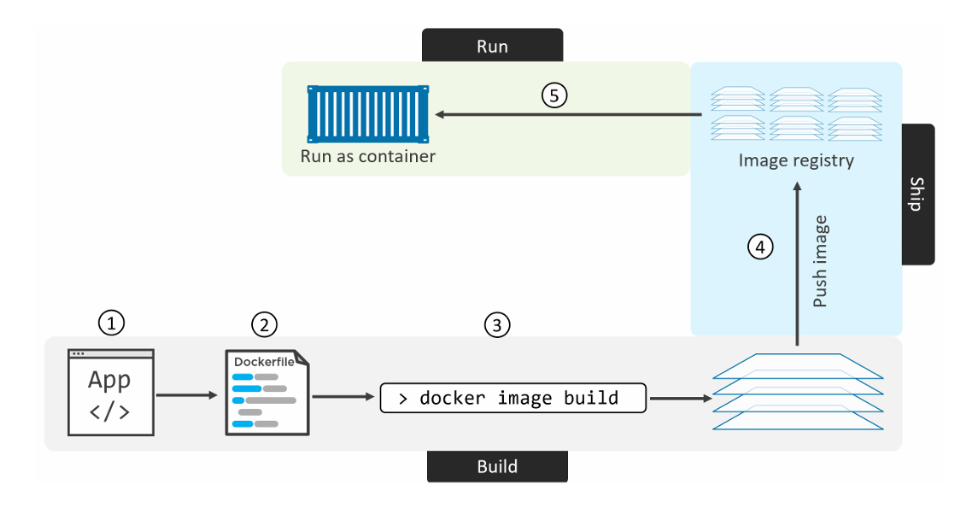

## I. CONTAINERIZING - The deep dive

### 1. Containerize a single-container app

Ta sẽ thực hiện quy trình container hóa một ứng dụng web đơn giản viết bằng `Node.js`

Ta thực hiện theo các bước sau:

- Clone repo để lấy mã nguồn ứng dụng
- inspect Dockerfile
- Container hóa ứng dụng
- Chạy ứng dụng
- Test ứng dụng
- Xem xét kỹ hơn ứng dụng
- Đưa ứng dụng lên môi trường production với Multi-stage Builds
- Một vài best practices

### 2. Getting the application code

Clone app từ Github:

```bash
git clone https://github.com/nigelpoulton/psweb.git
```

Di chuyển và thư mục của app và xem danh sách file:

```bash
cd psweb
root@client:~/psweb# ls -l
total 20
-rw-r--r-- 1 root root  324 Apr 17 10:23 Dockerfile
-rw-r--r-- 1 root root  378 Apr 17 10:23 README.md
-rw-r--r-- 1 root root  341 Apr 17 10:23 app.js
-rw-r--r-- 1 root root  309 Apr 17 10:23 package.json
drwxr-xr-x 2 root root 4096 Apr 17 10:23 views
root@client:~/psweb#
```

### 3. Inspecting the Dockerfile

Dockerfile là điểm khởi đầu để tạo một container image - nó mô tả ứng dụng và hướng dẫn Docker cách build ứng dụng đó

Thư mục chứa ứng dụng và các phụ thuộc được gọi là build context, ta nên đặt Dockerfile ở build context.

```bash
root@client:~/psweb# cat Dockerfile
# Test web-app to use with Pluralsight courses and Docker Deep Dive book
FROM alpine

LABEL maintainer="nigelpoulton@hotmail.com"

# Install Node and NPM
RUN apk add --update nodejs npm curl

# Copy app to /src
COPY . /src

WORKDIR /src

# Install dependencies
RUN  npm install

EXPOSE 8080

ENTRYPOINT ["node", "./app.js"]
root@client:~/psweb#
```

Tổng quan thì Dockerfile này cho ta biết:

- Bắt đầu với image alpine
- `nigelpoulton@hotmail.com` là người bảo trì
- Cài đặt Node.js và npm
- Sao chép mọi thứ trong build context vào /src trong image
- đặt thư mục làm việc là /src
- cài đặt các phụ thuộc, khai báo port
- Thiết lập `app.js` là default app

**Giải thích rõ từng step**:

Tất cả Dockerfile đều bắt đầu với `FROM`. Đây sẽ là base layer, và phần còn lại của ứng dụng sẽ được thêm vào phía trên dưới dạng layer bổ sung

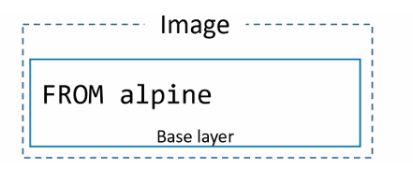

Tiếp theo, Dockerfile tạo `LABEL` chỉ định `nigelpoulton@hotmail.com` là người bảo trì của image. Label là các cặp key-value đơn giản. Đây được xem là best practice khi liệt kê người bảo trì

Chỉ thị `RUN apk add --update nodejs npm curl` sử dụng packet manager `apk` của Alpine để cài đặt `nodejs` và `npm` vào image. Nó tạo ra một layer mới nằm bên trên base layer Alpine.

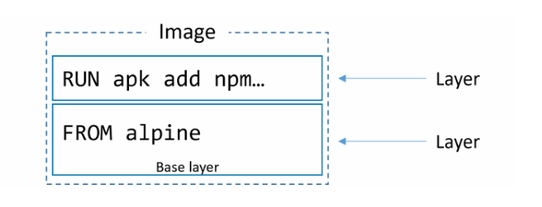

Chỉ thị COPY `. /src` tạo thêm một layer mới và sao chép build context vào `/src`

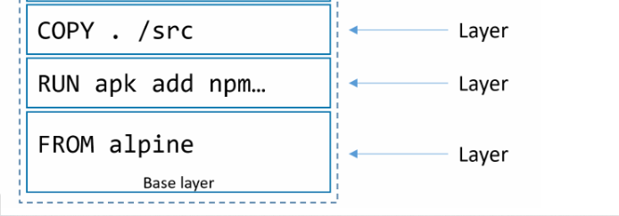

Tiếp theo, Dockerfile sử dụng chỉ thị `WORKDIR` để đặt thư mục làm việc bên trong hệ thống file của image cho các chỉ thị còn lại trong file

Chỉ thị `RUN npm install` tạo một layer mới và sử dụng npm để cài đặt các phụ thuộc(dependencies) của ứng dụng được liệt kê trong `package.json`

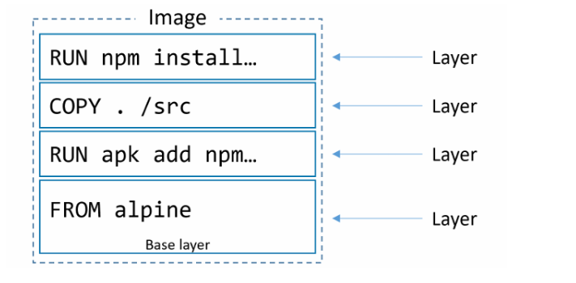

Ứng dụng này cung cấp một dịch vụ web trên port TCP `8080`, vì vậy Dockerfile ghi lại điều này bằng chỉ thị `EXPOSE 8080`

Cuối cùng, chỉ thị `ENTRYPOINT` được sử dụng để thiết lập ứng dụng chính mà image sẽ chạy

### 4. Containerize the app/build the image

Ta sẽ build một image từ build context bằng câu lệnh sau:

```bash
docker image build -t web:latest .

Step 1/8 : FROM alpine
 ---> a40c03cbb81c
Step 2/8 : LABEL maintainer="nigelpoulton@hotmail.com"
 ---> Running in f00cade994b9
 ---> Removed intermediate container f00cade994b9
 ---> a0067276bf11
Step 3/8 : RUN apk add --update nodejs npm curl
 ---> Running in 7664bf359cf7
( 1/21) Installing brotli-libs (1.2.0-r0)
( 2/21) Installing c-ares (1.34.6-r0)
( 3/21) Installing libunistring (1.4.1-r0)
( 4/21) Installing libidn2 (2.3.8-r0)
( 5/21) Installing nghttp2-libs (1.68.0-r0)
( 6/21) Installing nghttp3 (1.13.1-r0)
( 7/21) Installing libpsl (0.21.5-r3)
( 8/21) Installing zstd-libs (1.5.7-r2)
( 9/21) Installing libcurl (8.17.0-r1)
(10/21) Installing curl (8.17.0-r1)
(11/21) Installing ca-certificates (20260413-r0)
(12/21) Installing libgcc (15.2.0-r2)
(13/21) Installing libstdc++ (15.2.0-r2)
(14/21) Installing ada-libs (3.3.0-r0)
(15/21) Installing icu-data-en (76.1-r1)
  Executing icu-data-en-76.1-r1.post-install
  *
  * If you need ICU with non-English locales and legacy charset support, install
  * package icu-data-full.
  *
(16/21) Installing icu-libs (76.1-r1)
(17/21) Installing simdjson (3.12.0-r0)
(18/21) Installing simdutf (7.5.0-r1)
(19/21) Installing sqlite-libs (3.51.2-r0)
(20/21) Installing nodejs (24.14.1-r0)
(21/21) Installing npm (11.11.0-r0)
Executing busybox-1.37.0-r30.trigger
Executing ca-certificates-20260413-r0.trigger
OK: 86.0 MiB in 37 packages
 ---> Removed intermediate container 7664bf359cf7
 ---> 372026881456
Step 4/8 : COPY . /src
 ---> e63e9c309981
Step 5/8 : WORKDIR /src
 ---> Running in c215bd363464
 ---> Removed intermediate container c215bd363464
 ---> 73c4aa23550f
Step 6/8 : RUN  npm install
 ---> Running in 820a3c9abd78

added 119 packages, and audited 120 packages in 6s

28 packages are looking for funding
  run `npm fund` for details

2 vulnerabilities (1 low, 1 moderate)

To address all issues, run:
  npm audit fix --force

Run `npm audit` for details.
 ---> Removed intermediate container 820a3c9abd78
 ---> 2580ce992966
Step 7/8 : EXPOSE 8080
 ---> Running in 3b0bfe88e600
 ---> Removed intermediate container 3b0bfe88e600
 ---> 087b44c66301
Step 8/8 : ENTRYPOINT ["node", "./app.js"]
 ---> Running in a86b3e8fd643
 ---> Removed intermediate container a86b3e8fd643
 ---> c2fa68a888a4
Successfully built c2fa68a888a4
Successfully tagged web:latest
```

Check lại:

```bash
docker image ls
```

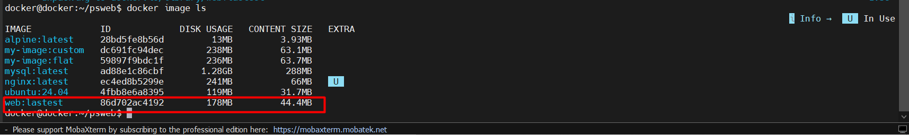

### 5. Pushing images

Sau khi ta đã tạo xong image, ta nên lưu trữ nó trong một image registry để người khác có thể truy cập.

Docker Hub là image registry phổ biến nhất và là nơi mặc định khi sử dụng `docker image push`

Để push một image lên Docker Hub, bạn cần đăng nhập bằng Docker ID của mình. Bạn cũng cần gắn tag cho image một cách phù hợp.

```bash
root@client:~/psweb# docker login -u tien9a
Password:
WARNING! Your password will be stored unencrypted in /root/.docker/config.json.
Configure a credential helper to remove this warning. See
https://docs.docker.com/engine/reference/commandline/login/#credential-stores

Login Succeeded
root@client:~/psweb#
```

Trước khi có thể push một image, bạn cần gắn tag cho image đó. Điều này là vì Docker cần các thông tin sau khi push image:

- Registry
- Repository
- Tag

Docker có sẵn cấu hình mặc định, nên theo mặc định nó sẽ push image lên Docker Hub. Bạn có thể push lên registry khác, nhưng bạn phải chỉ định rõ URL của registry trong lệnh docker image push.

Bên trên khi ta sử dụng docker image ls ta thấy image được gắn tag là web:latest - repository là web và tag là latest.

Vì vậy, docker image push sẽ cố gắng push image lên repo tên web trên Docker Hub. Tuy nhiên, do không có quyền truy cập vào repo này, tất cả image phải nằm trong namespace của mình.

Do đó ta cần gắn lại tag cho image bao gồm cả Docker ID:

```bash
# Cú pháp:
docker image tag <tag-hiện-tại> <tag-mới>

#
docker image tag web:lastest tien9a/web:lastest
```

Kiểm tra:

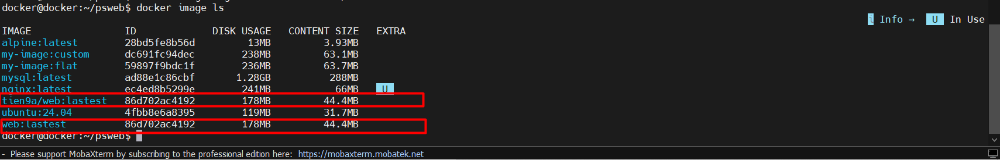

Bây giờ, ta có thể push nó lên Docker Hub

```bash
docker image push tien9a/web:lastest

The push refers to repository [docker.io/tien9a/web]
399e12ef6276: Pushed
d8f81fa981ef: Pushed
5f7530e11b4a: Pushed
989e799e6349: Mounted from library/alpine
latest: digest: sha256:2d4f5b178d7631fcdbff88b256e284b6f94309f37059c87fe0247ae5f8fa22a5 size: 1160
```

Minh hoạ cách Docker xác định vị trí push:

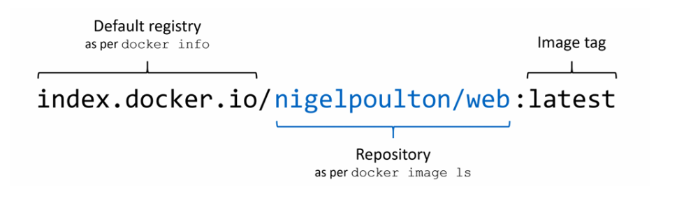

=> Bây giờ khi image đã được push lên registry, bạn có thể truy cập nó từ bất kỳ đâu có kết nối internet. Bạn cũng có thể cấp quyền cho người khác pull image hoặc push các thay đổi.

### 6. Run the app

Sử dụng lệnh sau để khởi chạy một container mới có tên là `c1`, dựa trên image `web:latest` mà ta vừa tạo:

```bash
docker container run -d --name c1 -p 80:8080 web:lastest
```

Kiểm tra:

```bash
root@client:~/psweb# docker container ls
CONTAINER ID   IMAGE        COMMAND           CREATED              STATUS         PORTS                                     NAMES
6dcd0f8e49d6   web:latest   "node ./app.js"   About a minute ago   Up 2 seconds   0.0.0.0:80->8080/tcp, [::]:80->8080/tcp   c1
```

### 7. Test the app

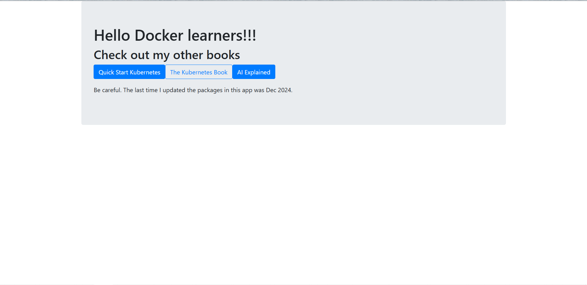

### 8. Looking a bit closer

Lệnh `docker image build` sẽ phân tích Dockerfile từng dòng một, bắt đầu từ trên xuống

Các dòng comment sẽ được bắt đầu bằng `#`

Tất cả các dòng không phải comment đều là Instruction và có dạng: `INSTRUCTION argument`

Một số instruction sẽ tạo layer mới, trong khi những instruction khác chỉ thêm metadata vào file cấu hình của image. Ví dụ:

- `FROM`, `RUN`, `COPY` là instruction tạo layer mới
- `EXPOSE`, `WORKDIR`, `ENV`, `ENTRYPOINT` là các instruction tạo metadata

**Nguyên tắc là**: nếu instruction thêm nội dung như file hoặc chương trình vào image thì nó sẽ tạo layer mới. Nếu nó thêm thông tin về cách build image và chạy ứng dụng, nó sẽ tạo metadata.

Ta có thể xem các instruction đã được sử dụng để build image bằng lệnh docker image history:

```bash
docker image history web:latest
IMAGE          CREATED          CREATED BY                                      SIZE      COMMENT
c2fa68a888a4   40 minutes ago   /bin/sh -c #(nop)  ENTRYPOINT ["node" "./app…   0B
087b44c66301   40 minutes ago   /bin/sh -c #(nop)  EXPOSE 8080                  0B
2580ce992966   40 minutes ago   /bin/sh -c npm install                          21.5MB
73c4aa23550f   40 minutes ago   /bin/sh -c #(nop) WORKDIR /src                  0B
e63e9c309981   40 minutes ago   /bin/sh -c #(nop) COPY dir:19ae45728f2608c48…   49.7kB
372026881456   40 minutes ago   /bin/sh -c apk add --update nodejs npm curl     85MB
a0067276bf11   41 minutes ago   /bin/sh -c #(nop)  LABEL maintainer=nigelpou…   0B
a40c03cbb81c   2 months ago     CMD ["/bin/sh"]                                 0B        buildkit.dockerfile.v0
<missing>      2 months ago     ADD alpine-minirootfs-3.23.3-x86_64.tar.gz /…   8.44MB    buildkit.dockerfile.v0
```

Ta thấy:

- Mỗi dòng tương ứng với một instruction trong Dockerfile (bắt đầu từ dưới lên). Cột `CREATED BY` cho ta biết chính xác instruction đã thực thi
- Chỉ có 4 dòng tạo layer mới (những dòng có giá trị khác 0 trong cột SIZE). Những dòng này tương ứng với các instruction `FROM`, `RUN`, và `COPY` trong Dockerfile

Sử dụng `docker image inspect` để xác nhận chỉ có 4 layer được tạo:

```bash
docker image inspect web:latest
```

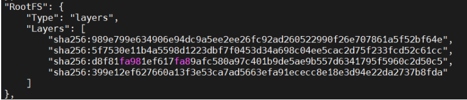

## III. MOVING TO PRODUCTION WITH Multi-stage BUILDS

Docker image nên có kích thước nhỏ. Mục tiêu là chỉ đóng gói những gì cần thiết để chạy ứng dụng trong môi trường production

Việc giữ cho image nhỏ không phải là điểu đơn giản

**Ví dụ**: Cách viết Dockerfile có ảnh hưởng lớn đến kích thước image. Phổ biễn là mỗi instruction `RUN` sẽ tạo một layer mới. Do đó, thường được coi là best practice khi gộp nhiều lệnh vào một instruction RUN - sử dụng toàn tử && và xuống dòng bằng dấu \

Một vấn đề khác là không dọn dẹp sau khi sử dụng. Ta chạy một lệnh RUN để tải các công cụ build vào image, nhưng giữ lại tất cả công cụ đó khi đưa image vào production

### 1. Giải pháp Multi-stage builds

**Multi-stage builds**: tập trung vào việc tối ưu quá trình build mà không làm tăng độ phức tạp

**Tổng quan**: **Multi-stage builds** sử dụng một Dockerfile duy nhất nhưng có nhiều instruction `FROM`. Mỗi `FROM` là một giai đoạn build mới và có thể dễ dàng `COPY` các thành phần từ giai đoạn trước

**Ví dụ**:

Xét một Dockerfile tại link sau: `https://github.com/nigelpoulton/atsea-sample-shop-app.git`

```bash
#
git clone https://github.com/nigelpoulton/atsea-sample-shop-app.git

#
cd atsea-sample-shop-app/app

#
cat Dockerfile

#
FROM node:latest AS storefront
WORKDIR /usr/src/atsea/app/react-app
COPY react-app .
RUN npm install
RUN npm run build

FROM maven:latest AS appserver
WORKDIR /usr/src/atsea
COPY pom.xml .
RUN mvn -B -f pom.xml -s /usr/share/maven/ref/settings-docker.xml dependency:resolve
COPY . .
RUN mvn -B -s /usr/share/maven/ref/settings-docker.xml package -DskipTests

FROM java:8-jdk-alpine
RUN adduser -Dh /home/gordon gordon
WORKDIR /static
COPY --from=storefront /usr/src/atsea/app/react-app/build/ .
WORKDIR /app
COPY --from=appserver /usr/src/atsea/target/AtSea-0.0.1-SNAPSHOT.jar .
ENTRYPOINT ["java", "-jar", "/app/AtSea-0.0.1-SNAPSHOT.jar"]
CMD ["--spring.profiles.active=postgres"]
```

Ta thấy Dockerfile có 3 instruction `FROM`. Mỗi cái đại diện cho một giai đoạn build riêng biệt:

- Stage 0 được gọi là `storefront`
- Stage 1 được gọi là `appserver`
- Stage 2 được gọi là `production`

**storefront**:

- Sử dụng image `node:latest` có kích thước hơn `900MB`.
- Thiết lập thư mục làm việc, sao chép mã nguồn ứng dụng
- Sử dụng 2 instruction `RUN` để thực hiện các thao tác npm

-> Tạo thêm 3 layer và làm tăng kích thước đáng kể!!!

**appserver**:

- Sử dụng image `maven:latest` có kích thước hơn `500MB`
- Nó thêm 4 layer thông qua 2 instruction `COPY` và 2 instruction `RUN`

**production**:

- Bắt đầu với image `java:8-jdk-alpine` khoảng 150MB - nhỏ hơn đáng kể so với các image ở giai đoạn trước
- Nó thêm 1 user, thiết lập thư mục làm việc, và sao chép 1 phần mã ứng dụng từ image của giai đoạn storefront
- Sau đó, nó đổi thư mục làm việc và sao chép mã ứng dụng từ image của giai đoạn **appserver**
- Cuối cùng, nó thiết lập ứng dụng chính sẽ chạy khi container được khởi động.
- Một điểm quan trọng là các instruction `COPY --from` chỉ sao chép các phần liên quan đến production từ các image của các giai đoạn trước. Chúng không sao chép các thành phần build không cần thiết cho production.
- Cũng cần lưu ý rằng chỉ cần một Dockerfile duy nhất, và không cần thêm tham số nào cho lệnh `docker image build`.

Tiếp theo, ta sẽ bulid images này cho tối ưu:

```bash
docker image build -t multi:stage .
```

Xem danh sách các images:

```bash
docker image ls
```

```bash
REPOSITORY                           TAG               IMAGE ID       CREATED              SIZE
multi                                stage             aa23fd32d597   31 seconds ago       259MB
<none>                               <none>            c9ecf5684413   About a minute ago   677MB
<none>                               <none>            dcbcb6628a6c   2 minutes ago        677MB
<none>                               <none>            2339feb8c3dd   5 minutes ago        677MB
<none>                               <none>            de260f727cde   9 minutes ago        552MB
<none>                               <none>            75b6455acb90   10 minutes ago       1.42GB
<none>                               <none>            e616b7666ef8   14 minutes ago       552MB
<none>                               <none>            4a7f4b1eca05   15 minutes ago       1.42GB
```

Ta thấy image `multi:stage` có kich thước nhỏ hơn rất nhiều so với vì nó dựa trên image `java:8-jdk-alpine` nhỏ hơn và chỉ chứa các file cần thiết cho `production`

Kết quả cuối cùng là một image `production` nhỏ được tạo từ một Dockerfile duy nhất, một lệnh `docker image build` thông thường, và không cần script bổ sung.

## IV. A FEW BEST PRACTICES

### 1. Leverage the build cache

Docker dùng cache để tăng tốc build image. Khi build lại cùng Dockerfile:

- Lần đầu -> chậm (build từ đầu)
- Lần sau -> rất nhanh (dùng cache)

Cách cache hoạt đông:

- Docker đọc file Dockerfile từ trên xuống
- Mỗi dòng:

  - Có layer trong cache -> cache hit (dùng lại)
  - Không có -> cache miss (build mới)

**Note**: Điểm quan trọng là chỉ cần 1 cache miss xảy ra tất cả các bước phía sau **KHÔNG** dùng cache nữa

Do đó, khi viết Dockerfile ta nên đặt các bước ít thay đổi (như install, setup) lên trên và đặt các bước hay thay đổi (COPY code) xuống dưới để tận dụng cache tối đa

Với instruction `COPY` / `ADD` Docker không chỉ check lệnh mà còn check cả nội dung file, nếu file thay đổi -> cache miss

Ta có thể build mà không sử dụng cache bằng lệnh:

```bash
docker image build --no-cache=true
```

### 2. Squash the images

Squash = gộp tất cả layer thành 1 layer duy nhất

Nó có thể làm giảm số lượng layer, hữu ích khi tạo base layer để dùng lại. Tuy nhiên, nó không thể share layer với image khác, tốn dung lượng vì không tận dụng layer chung, quá trình push/pull chậm hơn vì phải gửi toàn bộ image

**Cú pháp**:

```bash
docker image build --squash
```

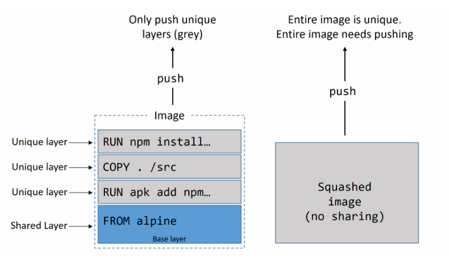

### 3. Use no-install-recommends

Nếu build các image Linux và sử dụng package manager `apt`, ta nên sử dụng option `--no-install-recommends` với lệnh `apt install`

Điều này đảm bảo rằng `apt` chỉ cài đặt các dependency chính (các package trong mục Depends) và không cài các package được đề xuất hoặc gợi ý gây mất dữ liệu.

### 4. BuildKit Mount (tối ưu tốc độ)

Bật BuildKit (mặc định từ Docker 23+). Thêm `# syntax=docker/dockerfile:1.7` ở dòng đầu.

#### 4.1 Cache mount

```dockerfile
# Cache thư mục npm — không tải lại mỗi lần build
RUN --mount=type=cache,target=/root/.npm \
    npm ci

# Cache apt
RUN --mount=type=cache,target=/var/cache/apt,sharing=locked \
    --mount=type=cache,target=/var/lib/apt,sharing=locked \
    apt-get update && apt-get install -y curl

# Cache Go module
RUN --mount=type=cache,target=/go/pkg/mod \
    --mount=type=cache,target=/root/.cache/go-build \
    go build -o /out/app ./cmd/server
```

#### 4.2 Bind mount (đọc nhanh, không copy)

```dockerfile
RUN --mount=type=bind,source=.,target=/src \
    cd /src && go build -o /out/app ./cmd/server
```

#### 4.3 Secret mount (an toàn)

```dockerfile
# Dockerfile
RUN --mount=type=secret,id=npmrc,target=/root/.npmrc \
    npm ci
# Build
docker build --secret id=npmrc,src=$HOME/.npmrc -t myapp:1.0 .
Secret KHÔNG bị lưu vào image layer — kiểm tra bằng docker image history.
```

#### 4.4 SSH mount (clone private repo)

```dockerfile
RUN --mount=type=ssh \
    git clone git@github.com:myorg/private.git
docker build --ssh default=$SSH_AUTH_SOCK -t myapp:1.0 .
```

### 5. .dockerignore

Tương tự `.gitignore` — loại trừ file khỏi build context, giúp build nhanh hơn và image nhỏ hơn.

```bash
# Git
.git
.gitignore

# Node
node_modules
npm-debug.log

# Python
__pycache__
*.pyc
.venv
venv

# Build artifact
dist
build
target
*.exe

# Editor
.vscode
.idea
*.swp

# Secret (rất quan trọng!)
.env
.env.*
*.pem
*.key
id_rsa*

# OS
.DS_Store
Thumbs.db
```

### 6. Best Practices

| Nguyên tắc | Lý do |
|---|---|
| Dùng image tag cụ thể (`node:22-alpine`) | Tránh build "trôi" do tag `latest` đổi |
| Dùng `alpine`/`distroless` cho production | Image nhỏ, ít CVE |
| Gộp `RUN` liên quan thành một lệnh | Giảm số layer |
| Copy `package.json` trước, source sau | Tận dụng cache layer dependencies |
| `apt-get update && install` trong cùng `RUN` | Tránh cache update cũ + install mới (gây lỗi) |
| Xóa `/var/lib/apt/lists/*` ngay trong `RUN` | Không để cache vào layer |
| Dùng `--no-install-recommends` với apt | Bớt package thừa |
| Chạy bằng `USER` không phải root | Bảo mật |
| Dùng `COPY` thay vì `ADD` | `ADD` có hành vi ẩn |
| Dùng multi-stage build | Image production gọn |
| Dùng `.dockerignore` | Build context nhỏ, không leak secret |
| Pin version mọi thứ (`npm ci`, `pip --require-hashes`) | Tái lập build |
| `EXPOSE` đúng port — dùng số nhỏ hơn 1024 chỉ khi cần | Documentation rõ |
| Đặt `HEALTHCHECK` | Compose/Swarm/K8s biết khi nào container sẵn sàng |
| Exec form cho CMD/ENTRYPOINT | Signal (SIGTERM) tới đúng process |

## V. CONTAINERIZING AN APP - The commands

Check phần thực hành ở Docker CLI
