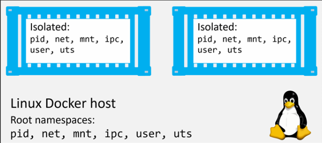
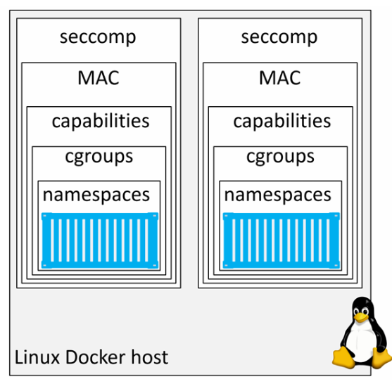
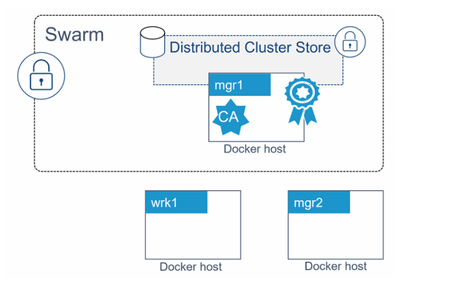
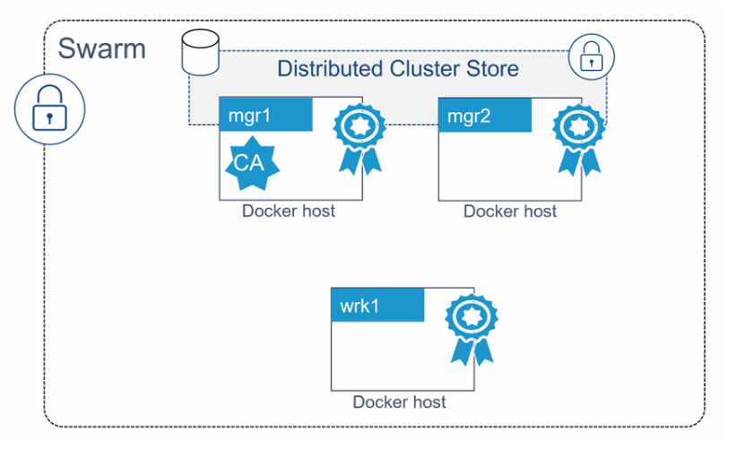
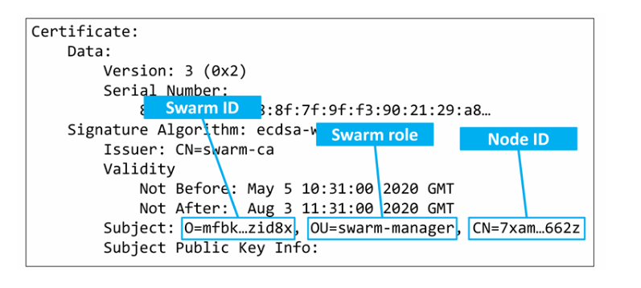
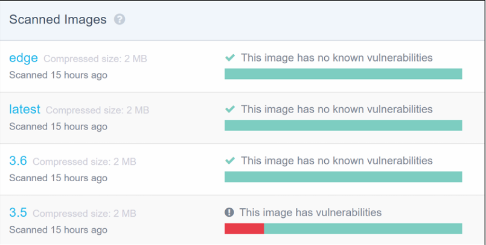
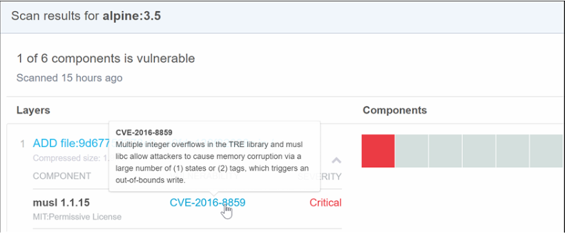
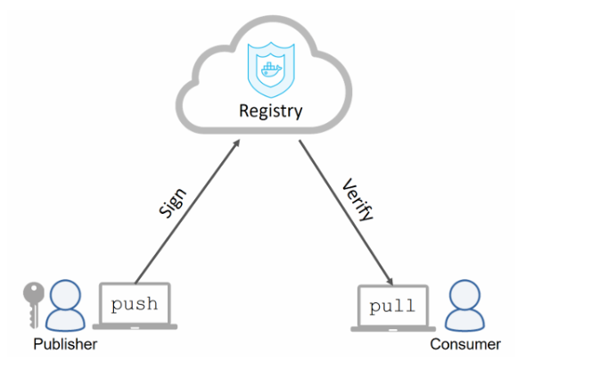
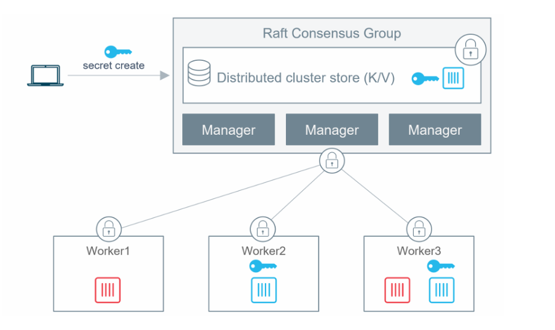

# SECURITY IN DOCKER

## I. SECURITY IN DOCKER - The TLDR

Cũng như Linux. Docker cung cấp nhiều lớp bảo mật khác nhau:


Trên Linux, Docker tận dụng hầu hết các công nghệ bảo mật và cô lập tiến trình phổ biến:

- namespace (tách biệt tài nguyên như process, network, filesystem)
- cgroups (control groups) (giới hạn tài nguyên như CPU, RAM)
- capabilities (chia nhỏ quyền root)
- MAC - Mandatory Access Control (Ví dụ: SELinux)
- seccomp (lọc system call để hạn chế hành vi nguy hiểm)

Docker cũng bổ sung thêm nhiều công nghệ bảo mật rất tốt.

Docker Swarm Mode được bảo mật mặc định như:

- ID node được mã hóa, xác thực 2 chiều, tự động cấu hình CA, lưu trữ cluster được mã hóa, mạng được mã hóa, ..
- Docker Content Trust (DCT) cho phép bạn ký image và xác minh tính toàn vẹn cũng như nguồn phát hành của các image mà bạn sử dụng.

## II. SECURITY IN DOCKER - The deep dive

Tìm hiểu về các công nghệ bảo mật của:

- Linux:

  - Namespaces
  - Control Groups
  - Capabilities
  - Mandatory Access Contorl
  - seccomp

- Docker:

  - Swarm mode
  - Image scanning
  - Docker Content Trust
  - Docker Secrets

### 1. Linux security technologies

#### a. Namespaces

Kernel namespaces là nền tảng cốt lõi của container. Chúng chia nhỏ 1 hệ điều hành sao cho nó trông và hoạt động như nhiều hệ điều hành riêng biệt, được cô lập với nhau.

Ví dụ:

- **Namespaces** cho phép chạy nhiều web server, mỗi cái đều dùng port `443`, trên cùng 1 OS. Để làm điều này, bạn chỉ cần chạy mỗi web server trong network namespace riêng. Điều này hoạt động vì mỗi network namespace có địa chỉ IP riêng và dải port đầy đủ. Bạn có thể cần map chúng ra các port khác nhau trên Docker host, nhưng mỗi web server vẫn có thể chạy mà không cần sửa code hay cấu hình lại port.


Docker giúp cho việc làm với **namespaces** trở nên đơn giản hơn. Docker tự động quản lý tất cả các **namespace** cần thiết để tạo container.

Docker trên Linux sử dụng các kernel namespace sau:

- Process ID (PID)
- Network (net)
- Filesystem/mount (mnt)
- User (user)

**Note**: Container Docker thực chất là 1 tập hợp các namespace được tổ chức lại với nhau - Ta sẽ có được toàn bộ cơ chế cô lập của OS với mỗi Container

**Ví dụ**: Mỗi container đều có namespace riêng cho `pid`, `net`, `mnt`, `user`. Thực tế, chính tập hợp các **namespace** này tạo nên cái gọi là **container**.



Cách Docker sử dụng từng loại namespace:

- Process ID namespace (`pid`): Docker sử dụng `pid` namespace để tạo cây tiến trình (process tree) riêng biệt cho mỗi container. Điều này có nghĩa là mỗi container có PID `1` riêng. Đồng thời, container không thể nhìn thấy hoặc truy cập process của container khác hay của host
- Network namespace (`net`): Docker dùng `net` namespace để cung cấp cho mỗi container một network stack riêng biệt, bao gồm: interface, địa chỉ IP, dải port và bảng định tuyến. Ví dụ, mỗi container có interface eth0 riêng, với IP và port riêng.
- Mount namespace (`mnt`): Mỗi container có một filesystem gốc (`/`) riêng biệt và được cô lập. Điều này có nghĩa là mỗi container có thể có `/etc`, `/var`, `/dev` riêng. Các process bên trong container không thể truy cập filesystem của host hoặc container khác.
- Inter-process Communication namespace (`ipc`): Docker dùng ipc namespace để quản lý shared memory bên trong container, đồng thời cô lập nó với shared memory bên ngoài.
- User namespace (user): Docker cho phép ánh xạ user trong container sang user khác trên host. Ví dụ phổ biến là ánh xạ user root trong container thành user thường (non-root) trên host.
- UTS namespace (uts): Docker dùng uts namespace để cung cấp hostname riêng cho mỗi container.

#### b. Control Groups

Nếu namespaces dùng để cô lập, thì control groups (`cgroups`) dùng để giới hạn quyền tài nguyên

**Cgroups** cho phép chúng ta đặt giới hạn để (theo ví dụ này) không có container nào có thể dùng hết được tài nguyên chung của hệ thống

Các container được cô lập với nhau nhưng vẫn dùng chung tài nguyên của hệ điều hành như CPU, RAM, .... **Cgroups** cho phép chúng ta đặt giới hạn cho từng loại tài nguyên này, một container không thể chiếm dụng toàn bộ và gây ra tình trạng DoS

#### c. Capabilities

**Capabilities** là một cơ chế cho phép ta chọn lọc những quyền của root mà container thực sự cần để chạy

Bên trong hệ thống, user root của Linux thực chất là tập hợp của rất nhiều capability như:

- `CAP_CHOWN`: cho phép thay đổi quyền sở hữu file
- `CAP_NET_BIND_SERVICE`: cho phép bind socket vào các port thấp (80, 443)
- `CAP_SETUID`: cho phép nâng quyền của 1 process
- `CAP_SYS_BOOT`: cho phép khởi động lại hệ thống
- ...

Docker làm việc với capabilities để bạn có thể chạy container với quyền root nhưng loại bỏ những quyền không cần thiết.

**Ví dụ**: Nếu container của bạn chỉ cần quyền bind vào các port thấp, bạn có thể chạy container và loại bỏ tất cả quyền root, sau đó chỉ thêm lại `CAP_NET_BIND_SERVICE`.

#### d. Mandatory Access Control Systems

**seccomp**:

Docker sử dụng seccomp ở chế độ filter để giới hạn các syscall mà container có thể gọi tới kernel của host.

**Final thoughts on the Linux security technologies**:

Docker hỗ trợ hầu hết các công nghệ bảo mật quan trọng của Linux và đi kèm với các cấu hình mặc định hợp lý, giúp tăng cường bảo mật nhưng không quá hạn chế



### 2. Docker platform security technologies

#### a. Security in Swarm Mode

Swarm mode tích hợp nhiều tính năng bảo mật được bật sẵn với các cấu hình mặc định bao gồm:

- ID node được mã hóa
- TLS xác thực 2 chiều
- join Token
- Cấu hình CA
- Mạng được mã hóa
- Kho lưu trữ cluster (config DB) được mã hóa

#### b. Configure a secure Swarm

Chạy lệnh sau trên node mà bạn muốn làm manager đầu tiên của swarm mới.

```bash
docker swarm init
```

Thêm 1 worker vào Swarm:

```bash
docker swarm join --token <token> 192.168.70.91:2377
```

Để thêm được 1 manager chạy:

```bash
docker swarm join-token manager
```

Đó chính xác là tất cả những gì cần làm để cấu hình một swarm an toàn.

`mgr1` được cấu hình là manager đầu tiên của Swarm, đồng thời cũng là CA gốc. Bản thân swarm được gán 1 ClusterID dạng mã hóa.

`mgr1` tự cấp cho mình một client certificate để xác định vai trò manager trong swarm, cấu hình xoay vòng chứng chỉ tự động với giá trị mặc định là 90 ngày, và một cơ sở dữ liệu cấu hình cluster đã được thiết lập và mã hóa.

Một tập các token bảo mật cũng được tạo ra để cho phép các manager và worker mới tham gia vào swarm.



Để thêm `mgr2` làm manager ta thực hiện các bước sau:

Chạy lệnh sau trên `mgr1` để lấy manager join token:

```bash
docker swarm join-token manager
```

Chạy lệnh sau trên `mgr2`:

```bash
docker swarm join --token <token> 192.168.70.91:2377
```

Để thêm `wkr1` làm worker ta thực hiện các bước sau:

Chạy lệnh sau trên `mgr1` để lấy worker join token:

```bash
docker swarm join-token worker
```

Chạy lệnh sau trên `wrk1`:

```bash
docker swarm join --token <token> 192.168.70.91:2377
```



#### c. Looking behind the scenes at Swarm security

**Swarm join tokens**:

Thứ duy nhất cần để thêm các manager và worker mới vào một swarm hiện có là join token tương ứng. Do đó, việc giữ an toàn cho các join token là rất quan trọng

Mỗi swarm duy trì 2 loại join token riêng biệt:

- token để thêm manager
- token để thêm worker

Mỗi token gồm 4 phần, được phân tách bằng dấu `-`:

```bash
PREFIX - VERSION - SWARM ID - TOKEN
```

- `PREFIX`: luôn là SWMTKN giúp để nhận biết và tránh vô tình public
- `VERSION`: cho biết phiên bản của Swarm
- `SWARM ID`: là 1 giá trị hash của certificate của swarm
- `TOKEN`: phần quyết định node sẽ tham gia với vai trò manager hay worker

Ta có thể thu hồi và tạo token mới với chỉ 1 lệnh:

```bash
docker swarm join-token --rotate manager 
```

Sau đó hệ thống sẽ cung cấp lệnh mới để thêm manager:

**TLS and mutual authentication**:

Mỗi manager và worker khi tham gia vào swarm sẽ được cấp một client certificate. Chứng chỉ này được dùng cho xác thực 2 chiều. Nó giúp xác định:

- Node đó là ai
- Thuộc Swarm nào
- Vài trò của node trong Swarm

Dùng lệnh sau để kiểm tra client certificate của 1 node trên Linux:

```bash
sudo openssl x509 -in /var/lib/docker/swarm/certificates/swarm-node.crt -text

Certificate:
Data:
Version: 3 (0x2)
Serial Number:
80:2c:a7:b1:28...a8:af:89:a1:2a:51:89
Signature Algorithm: ecdsa-with-SHA256
Issuer: CN = swarm-ca
Validity
Not Before: May 5 10:31:00 2020 GMT
Not After : Aug 3 11:31:00 2020 GMT
Subject: O=mfbkgjm2tlametbnfqt2zid8x, OU=swarm-manager,
CN=7xamk8w3hz9q5kgr7xyge662z
Subject Public Key Info:
<SNIP>
```

Subject dùng các trường tiêu chuẩn để lưu thông tin:

- `O (Organization)`: lưu Swarm ID
- `OU (Organizational Unit)`: lưu vai trò của node trong swarm
- `CN (Common Name)`: Lưu ID mã hóa của node



**Configuring some CA settings**:

Đã cấu hình CA

**The cluster store**:

Cluster store là “bộ não” của một swarm, nơi lưu trữ cấu hình và trạng thái của cluster. Nó cũng rất quan trọng đối với các công nghệ khác của Docker như overlay networking và Secrets.

#### d. Detecting vulnerabilities with image security scanning

`Image scanning` là công cụ chính giúp bạn phát hiện các lỗ hổng và điểm yếu bảo mật trong image.

Các công cụ quét image hoạt động bằng cách phân tích image và tím kiếm các package có lỗ hổng đã được biết đến. Khi phát hiện ra, bạn có thể cập nhật các package và dependency lên phiên bản đã được vá lỗi.





#### e. Signing and verifying images with Docker Content Trust

**Docker Content Trust (DCT)** giúp việc xác minh tính toàn vẹn và nguồn phát hành của các image mà ta tải về

**DCT** cho phép developer ký image khi push lên Docker Hub. Sau đó, các image này có thể được xác minh khi được pull và chạy



**DCT** cung cấp các thông tin như:

- Image có được ký để dùng trong môi trường cụ thể như prod hay dev hay không
- Image có lỗi thời hay không

Các bước sau minh họa cách cấu hình Docker Content Trust, ký và push image, sau đó pull image đã ký. Ta sẽ cần 1 cặp khóa mã hóa (key-pair) để ký image

Ta tạo key-pair bằng lệnh sau:

```bash
docker trust key generate nigel 
```

Lệnh này sẽ tạo 1 cặp khóa mới tên là `nigel`

Nếu như đã có key-pair, ta có thể import bằng câu lệnh sau:

```bash
docker trust key load key.pem --name nigel 
```

Sau khi có key-pair hợp lệ, ta cần liên kết nó với repository mà ta sẽ push image đã ký

```bash
docker trust signer add --key nigel.pub nigel nigelpoulton/dct
```

- Thêm signer `nigel` vào repo
- Khởi tạo repo có hỗ trợ chữ ký

Ký và push image:

```bash
$ docker trust sign nigelpoulton/dct:signed
```

Image sẽ được ký và đẩy lên Docker Hub kèm theo metadata xác thực

Sau khi push, ta có thể kiểm tra thông tin chữ ký:

```bash
docker trust inspect nigelpoulton/dct:signed --pretty
```

Lệnh trên sẽ hiển thị:

- Tag đã kí
- Digest của image
- Danh sách người ký
- Các khóa quản trị

Ta có thể buộc Docker luôn ký và xác minh image khi push/pull bằng cách bật biến môi trường:

```bash
$ export DOCKER_CONTENT_TRUST=1
```

Khi bật DCT:

- Không thể pull image chưa được ký
- Chỉ có thể push image đã được ký

### 3. Docker Secrets

`Docker 1.13` đã giới thiệu Docker Secrets như các đối tượng "first-class" trong Docker API

Secrets được:

- Mã hóa khi lưu trữ
- Mã hóa khi truyền
- Được mount vào container dưới dạng filesystem trong bộ nhớ
- Hoạt động theo mô hình least-privilege (chỉ cấp cho các service được phép truy cập)

Đây là một giải pháp khá toàn diện từ đầu đến cuối, và nó cũng có lệnh riêng là docker secret

**Tổng quát quy trình hoạt động**:



1. Secret (màu xanh) được tạo và gửi lên swarm

2. Nó được lưu trong cluster store đã má hóa (tất cả manager đều có quyền truy cập)

3. Service (màu xanh) được tạo và gắn secret vào

4. Secret được mã hóa khi truyền tới các task (contianer) của service

5. Secret được mount vào container dưới dạng file không mã hóa tại `/run/secrets/`

- Đây là filesystem trong RAM

6. Khi container (task) kết thúc, filesystem trong RAM bị xóa và secret cũng bị xóa khỏi node

7. Các container khác (ví dụ service màu đỏ) không thể truy cập secret

Ta có thể tạo và quản lý secrets bằng lệnh:

```bash
docker secret create
```

Gắn secret vào service bằng lênh:

```bash
docker service create --secret
```

## III. DOCKER SECURITY CLI

Container chia sẻ kernel với host → một container bị xâm nhập có thể leo thang sang host. Bảo mật Docker là **defense in depth** — nhiều lớp bảo vệ chồng lên nhau.

### 1. Threat Model

| Mối đe dọa | Mô tả | Phòng chống |
|---|---|---|
| **Container breakout** | Process trong container thoát ra host | Non-root, capability drop, seccomp, user namespace, AppArmor/SELinux |
| **Image với CVE** | Base image chứa lỗ hổng | Scan image (Scout, Trivy), update base thường xuyên |
| **Image bị giả mạo** | Supply chain attack — image bị sửa | Image signing (cosign), pin digest |
| **Secret leak** | API key trong image layer / env | BuildKit secret, secrets store, .dockerignore |
| **Privileged container** | `--privileged` = quyền root trên host | Tuyệt đối tránh, dùng capability cụ thể |
| **Docker socket exposed** | Mount `/var/run/docker.sock` = root | Hạn chế, dùng socket proxy |
| **DDOS / fork bomb** | Container chiếm tài nguyên | cgroups limit (--memory, --pids-limit) |

### 2. Chạy Container không Root

Mặc định container chạy với **UID 0 (root)**. Dù bị "giam" trong namespace, root container vẫn là attack surface lớn.

#### 2.1 Tạo user trong Dockerfile

```dockerfile
FROM alpine:3.20
RUN addgroup -S app && adduser -S app -G app
USER app
CMD ["whoami"]                 # → "app"
```

#### 2.2 Override khi run

```bash
docker run --user 1000:1000 nginx        # Cẩn thận: file trong image có thể không cho uid 1000 ghi
docker run -u $(id -u):$(id -g) ...      # Match host
```

#### 2.3 Distroless / Chainguard

Distroless image **không có shell, không có package manager**:

```dockerfile
FROM gcr.io/distroless/static-debian12:nonroot
COPY app /app
USER nonroot:nonroot
ENTRYPOINT ["/app"]
```

Attack surface gần như 0 — không có `sh`, không có `wget`, không có gì để leo thang.

### 3. Linux Capabilities

Root truyền thống có `~37` quyền. Docker mặc định **drop hầu hết**, chỉ giữ lại 14 cap "an toàn" (`NET_BIND_SERVICE`, `SETUID`, `SETGID`…).

#### 3.1 Xem cap mặc định

```bash
docker run --rm alpine grep Cap /proc/self/status
# CapBnd: 00000000a80425fb
```

#### 3.2 Drop tất cả + add lại cái cần (BEST PRACTICE)

```bash
docker run --cap-drop ALL --cap-add NET_BIND_SERVICE nginx
```

#### 3.3 Capability thường thấy

| Cap                | Cho phép                     |      Khi nào cần        |
|--------------------|------------------------------|-------------------------|
| `NET_BIND_SERVICE` | Bind port <1024              | Web server bind 80/443  |
| `NET_ADMIN`        | Cấu hình network             | VPN, firewall container |
| `SYS_ADMIN`        | Rất rộng — gần như root      | Hầu hết KHÔNG cần       |
| `SYS_PTRACE`       | Trace process khác           | Debug, strace           |
| `CHOWN`            | Đổi owner file               | Init script             |
| `DAC_OVERRIDE`     | Bypass file permission check | Hiếm khi cần            |

> Mọi container web app **không cần cap nào** ngoài `NET_BIND_SERVICE` (nếu bind <1024).

### 4. Seccomp (Syscall Filter)

Docker có **default seccomp profile** chặn ~50 syscall nguy hiểm (như `reboot`, `kexec_load`). Tự động bật.

```bash
# Xem profile default
docker run --rm alpine grep Seccomp /proc/self/status
# Seccomp: 2  ← filtered

# Disable (KHÔNG khuyến nghị!)
docker run --security-opt seccomp=unconfined alpine ...

# Custom profile
docker run --security-opt seccomp=./my-profile.json alpine ...
```

Profile mặc định: <https://github.com/moby/moby/blob/master/profiles/seccomp/default.json>

### 5. AppArmor / SELinux

#### AppArmor (Ubuntu, Debian)

Docker tự load profile `docker-default` cho mỗi container.

```bash
docker run --security-opt apparmor=docker-default nginx
docker run --security-opt apparmor=my-profile nginx
```

#### SELinux (RHEL, Fedora, CentOS)

Bật trong `/etc/docker/daemon.json`:

```json
{ "selinux-enabled": true }
```

Mount với label SELinux:

```bash
docker run -v /host/data:/data:z nginx     # Shared (multi-container đọc)
docker run -v /host/data:/data:Z nginx     # Private
```

### 6. User Namespace Remapping

Map `UID 0` trong container → UID không phải `0` trên host. Root container ≠ root host.

```json
// /etc/docker/daemon.json
{ "userns-remap": "default" }
```

```bash
sudo systemctl restart docker
docker run -d --name test alpine sleep 100
ps -ef | grep sleep
# 100000  ...  sleep 100   ← UID 100000 trên host
```

> Nhược điểm: phức tạp khi bind mount (UID mismatch), không tương thích với một số feature.

### 7. Rootless Docker

Chạy **toàn bộ Docker daemon** với user thường (không cần sudo). Lợi ích lớn nhất: kể cả breakout, attacker cũng chỉ là user thường.

#### Cài rootless

```bash
# Bước 1: gỡ rootful daemon (nếu chạy)
sudo systemctl disable --now docker.service docker.socket

# Bước 2: cài rootless setup tool
sudo apt install -y uidmap dbus-user-session

# Bước 3: chạy script
dockerd-rootless-setuptool.sh install

# Bước 4: export PATH
export PATH=/usr/bin:$PATH
export DOCKER_HOST=unix:///run/user/$(id -u)/docker.sock

# Test
docker info | grep -i rootless
# Operating System: ... rootless
```

#### Hạn chế rootless

- Không bind port <1024 (trừ khi `setcap`).
- Một số feature không hoạt động: AppArmor, overlay network (cần workaround), `--net=host` partial.
- Hiệu năng network kém hơn (qua slirp4netns/bypass4netns).

Trang chủ: <https://docs.docker.com/engine/security/rootless/>

### 8. Secret Management

#### 8.1 Tránh tuyệt đối

```dockerfile
# KHÔNG BAO GIỜ làm thế này
ENV API_KEY=sk-abc123
RUN echo "password=secret" > /app/.env
ARG SECRET_TOKEN
```

```bash
docker build --build-arg SECRET_TOKEN=xxx .   # Không lưu vào image history
```

Kiểm tra leak:

```bash
docker history --no-trunc myapp:1.0
```

#### 8.2 BuildKit secret mount (build-time)

```dockerfile
# syntax=docker/dockerfile:1.7
RUN --mount=type=secret,id=npmrc,target=/root/.npmrc \
    npm ci
```

```bash
docker build --secret id=npmrc,src=$HOME/.npmrc -t myapp:1.0 .
```

Secret KHÔNG lưu vào layer — verify:

```bash
docker history myapp:1.0
```

#### 8.3 Runtime — biến môi trường + file

```bash
# Đọc password từ file (tốt hơn ENV)
docker run -e POSTGRES_PASSWORD_FILE=/run/secrets/db_pass \
  -v $(pwd)/secrets:/run/secrets:ro \
  postgres:16
```

#### 8.4 Docker Swarm Secrets (recommended cho production multi-host)

```bash
echo "super-secret-password" | docker secret create db_password -

docker service create \
  --name db \
  --secret db_password \
  -e POSTGRES_PASSWORD_FILE=/run/secrets/db_password \
  postgres:16-alpine
```

Secret được mã hóa khi nghỉ + khi truyền, chỉ giải mã trong RAM container.

#### 8.5 External secret manager

- **HashiCorp Vault**: chuẩn industry, có Docker auth method.
- **AWS Secrets Manager / Parameter Store**: tích hợp ECS/EKS.
- **GCP Secret Manager**.
- **SOPS** + age/PGP cho config encrypted in git.

### 9. Image Scanning

#### 9.1 Docker Scout (built-in từ 2024)

```bash
docker scout quickview myapp:1.0           # Tổng quan
docker scout cves myapp:1.0                # Liệt kê CVE
docker scout cves --only-severity critical,high myapp:1.0
docker scout compare myapp:1.0 --to myapp:1.1   # So sánh 2 version
docker scout recommendations myapp:1.0     # Đề xuất base image tốt hơn
```

#### 9.2 Trivy (open source, mạnh)

```bash
# Scan image
docker run --rm \
  -v /var/run/docker.sock:/var/run/docker.sock \
  -v $HOME/Library/Caches:/root/.cache/ \
  aquasec/trivy:latest image myapp:1.0

# Scan filesystem
trivy fs --severity HIGH,CRITICAL ./src

# Scan IaC (Dockerfile, K8s, Terraform)
trivy config ./
```

#### 9.3 Grype (Anchore)

```bash
grype myapp:1.0
grype dir:./src
```

#### 9.4 Tích hợp CI

```yaml
# GitHub Actions
- uses: aquasecurity/trivy-action@master
  with:
    image-ref: myorg/myapp:${{ github.sha }}
    severity: 'CRITICAL,HIGH'
    exit-code: '1'
```

### 10. Image Signing

#### 10.1 cosign (Sigstore — chuẩn mới)

```bash
# Cài
go install github.com/sigstore/cosign/v2/cmd/cosign@latest

# Sign (keyless với OIDC — không cần private key)
cosign sign ghcr.io/myorg/myapp:1.0

# Verify
cosign verify ghcr.io/myorg/myapp:1.0 \
  --certificate-identity=user@example.com \
  --certificate-oidc-issuer=https://github.com/login/oauth
```

#### 10.2 SBOM (Software Bill of Materials)

```bash
# Tạo SBOM
docker scout sbom myapp:1.0
syft myapp:1.0 -o spdx-json > sbom.spdx.json

# Attach SBOM vào image bằng cosign
cosign attest --predicate sbom.spdx.json --type spdxjson myapp:1.0
```

### 11. Runtime Hardening

#### 11.1 Read-only filesystem

```bash
docker run --read-only --tmpfs /tmp --tmpfs /run nginx
```

Container chỉ ghi được vào tmpfs — process độc hại không tạo file persistent được.

#### 11.2 Resource limit (chống DoS)

```bash
docker run \
  --memory=512m \
  --memory-swap=512m \
  --cpus=1.5 \
  --pids-limit=200 \
  --ulimit nofile=1024:2048 \
  myapp
```

#### 11.3 No new privileges

```bash
docker run --security-opt no-new-privileges nginx
```

Chặn binary setuid leo thang bên trong container.

#### 11.4 Sysctl

```bash
docker run --sysctl net.ipv4.ip_forward=0 nginx
```

### 12. Docker Socket — đừng mount tùy tiện

```bash
# CỰC KỲ NGUY HIỂM — container = root host
docker run -v /var/run/docker.sock:/var/run/docker.sock myapp
```

Bất cứ ai vào được container đều có thể:

```bash
docker run -v /:/host alpine chroot /host sh   # → root host
```

**Khi BUỘC phải mount socket** (ví dụ Portainer, Watchtower, dind…):

- Dùng **socket proxy** ([tecnativa/docker-socket-proxy](https://github.com/Tecnativa/docker-socket-proxy)) chỉ expose API endpoint cần thiết:

  ```yaml
  services:
    docker-proxy:
      image: tecnativa/docker-socket-proxy
      environment:
        CONTAINERS: 1
        IMAGES: 1
        VOLUMES: 0
        POST: 0           # Read-only
      volumes:
        - /var/run/docker.sock:/var/run/docker.sock:ro
  ```

### 13. Docker Bench for Security (audit)

Script chạy ~100 check theo CIS Docker Benchmark:

```bash
docker run --rm --net host --pid host --userns host --cap-add audit_control \
  -v /etc:/etc:ro \
  -v /usr/bin/containerd:/usr/bin/containerd:ro \
  -v /usr/bin/runc:/usr/bin/runc:ro \
  -v /usr/lib/systemd:/usr/lib/systemd:ro \
  -v /var/lib:/var/lib:ro \
  -v /var/run/docker.sock:/var/run/docker.sock:ro \
  --label docker_bench_security \
  docker/docker-bench-security
```

Output: WARN/PASS cho mỗi check + giải thích.

### 14. Best Practices tổng hợp

| Layer | Best Practice |
|---|---|
| **Image** | Pin digest, base alpine/distroless, multi-stage, scan trước khi push |
| **Build** | BuildKit secret mount, `.dockerignore` chặn secret, không truyền secret qua `ARG` |
| **Run** | `--user`, `--cap-drop ALL --cap-add ...`, `--read-only`, `--security-opt no-new-privileges`, resource limit |
| **Network** | Custom bridge, `internal: true` cho DB, bind 127.0.0.1 cho service nhạy cảm, dùng `DOCKER-USER` |
| **Secret** | Swarm secrets / Vault / SOPS, KHÔNG hardcode trong image, không `-e PASSWORD=...` |
| **Daemon** | Rootless nếu được, userns-remap, audit `/var/lib/docker`, hạn chế ai vào nhóm `docker` |
| **Supply chain** | Sign image bằng cosign, SBOM, verify ở deploy, mirror registry |
| **Monitor** | Falco runtime security, log audit, scan định kỳ |

## IV. LAB

- Check trong phần Docker CLI
