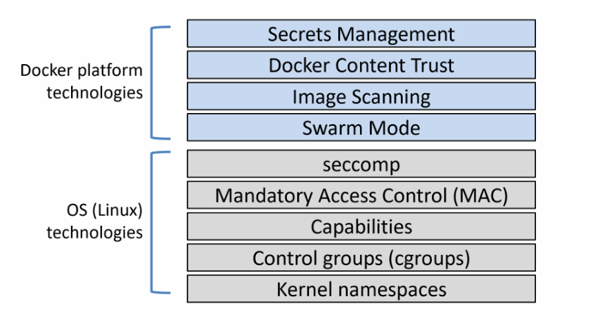
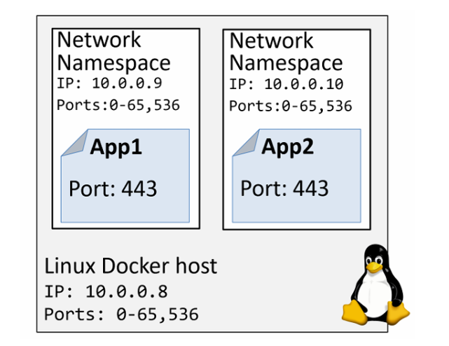

# SECURITY IN DOCKER

## I. SECURITY IN DOCKER - The TLDR

Cũng như Linux. Docker cung cấp nhiều lớp bảo mật khác nhau:

Trên Linux, Docker tận dụng hầu hết các công nghệ bảo mật và cô lập tiến trình phổ biến:

- namespace (tách biệt tài nguyên như process, network, filesystem)
- cgroups (control groups) (giới hạn tài nguyên như CPU, RAM)
- capabilities (chia nhỏ quyền root)
- MAC - Mandatory Access Control (Ví dụ: SELinux)
- seccomp (lọc system call để hạn chế hành vi nguy hiểm)

Docker cũng bổ sung thêm nhiều công nghệ bảo mật rất tốt.

Docker Swarm Mode được bảo mật mặc định như:

- ID node được mã hóa, xác thực 2 chiều, tự động cấu hình CA, lưu trữ cluster được mã hóa, mạng được mã hóa, ..
- Docker Content Trust (DCT) cho phép bạn ký image và xác minh tính toàn vẹn cũng như nguồn phát hành của các image mà bạn sử dụng.

## II. SECURITY IN DOCKER - The deep dive

Tìm hiểu về các công nghệ bảo mật của:

- Linux:

  - Namespaces
  - Control Groups
  - Capabilities
  - Mandatory Access Contorl
  - seccomp

- Docker:

  - Swarm mode
  - Image scanning
  - Docker Content Trust
  - Docker Secrets

### 1. Linux security technologies

Namespaces

Kernel namespaces là nền tảng cốt lõi của container. Chúng chia nhỏ 1 hệ điều hành sao cho nó trông và hoạt động như nhiều hệ điều hành riêng biệt, được cô lập với nhau.

Ví dụ:

- Namespaces cho phép chạy nhiều web server, mỗi cái đều dùng port `443`, trên cùng 1 OS. Để làm điều này, bạn chỉ cần chạy mỗi web server trong network namespace riêng. Điều này hoạt động vì mỗi network namespace có địa chỉ IP riêng và dải port đầy đủ. Bạn có thể cần map chúng ra các port khác nhau trên Docker host, nhưng mỗi web server vẫn có thể chạy mà không cần sửa code hay cấu hình lại port.

Docker giúp cho việc làm với namespaces trở nên đơn giản hơn 
