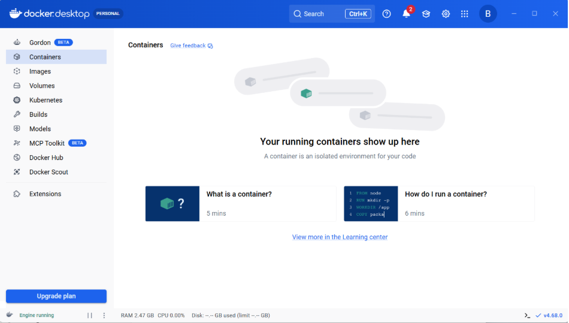
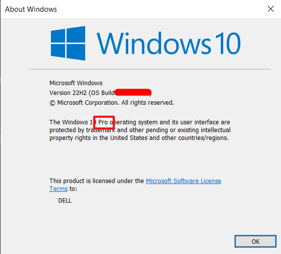
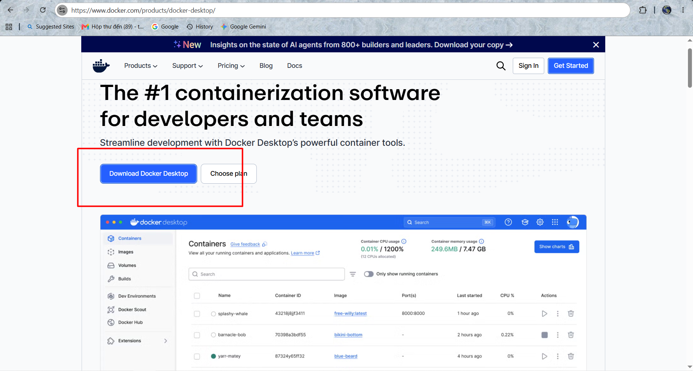
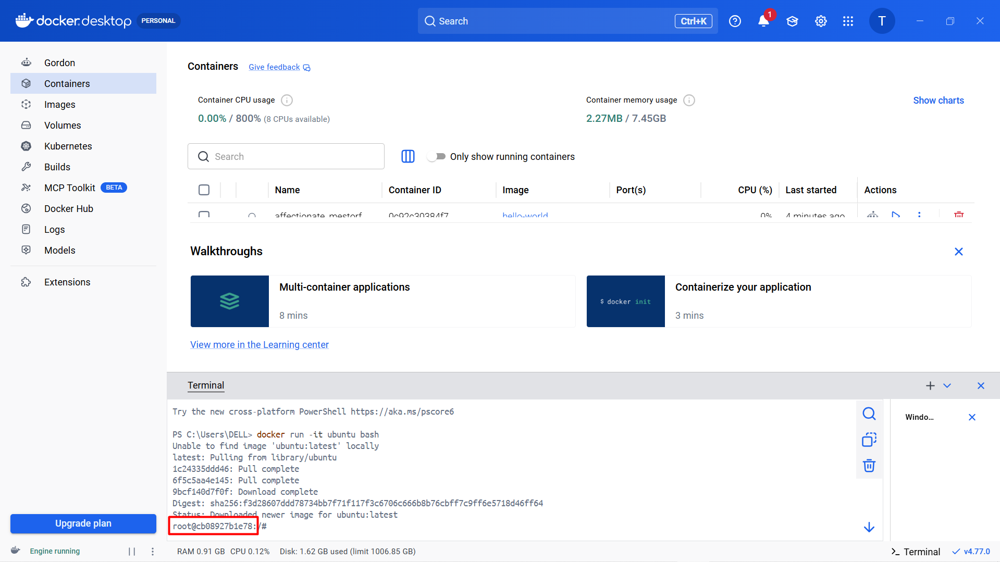

# INSTALLING DOCKER

Có rất nhiều cách và môi trưởng để cài đặt Docker: Windows, Mac và Linux.

Bạn có thể cài trên cloud, on-premises (tại chỗ), hoặc trên laptop.

Ngoài ra còn có cài đặt thủ công, cài đặt bằng script, cài đặt qua wizard, ...

Ta sẽ đề cập đến các nội dung sau:

Docker Desktop cài đặt trên:

- Windows 10

  - Mac

- Cài đặt trên server:

  - Linux

- Play with Docker

## I. DOCKER DESKTOP

Docker Desktop là một sản phẩm đóng gói của Docker, Inc.. Nó chạy trên các phiên bản 64-bit của Windows 10 và Mac, rất dễ tải về cũng như cài đặt

Docker Desktop **trên Windows 10** có thể chạy cả **container Windows** gốc lẫn **container Linux**. Docker Desktop **trên Mac** chỉ có thể chạy **container Linux**.

### 1. Windows pre-reqs

Docker Desktop trên Windows yêu cầu tất cả các điều sau:

- Phiên bản Windows 10 64-bit thuộc các bản Pro / Enterprise / Education (không hoạt động với bản Home)
- Hệ thống phải bật hỗ trợ ảo hóa phần cứng (hardware virtualization) trong BIOS
- Các tính năng Hyper-V và Containers phải được bật trong Windows

**Installing Docker Desktop on Windows 10**:



Check xem phiên bản Window ta đang sử dụng thuộc các bản Pro / Enterprise / Education hay không

- nhấp `Win+R` gõ `winver` rồi **Enter** và trên màn hình sẽ hiện ra bản mà Window ta đang dùng



- Tiếp theo nhấn Restart lại Window + `F12` là sẽ vào giao diện BIOS và gõ trong thanh tìm kiếm `hardware virtualization` rồi tắt hỗ trợ ảo hoá phần cứng đi(Nhiều máy auto bật rồi) or chạy các lệnh sau trên powershell:

```powershell
dism /online /enable-feature /featurename:Microsoft-Windows-Subsystem-Linux /all /norestart
dism /online /enable-feature /featurename:VirtualMachinePlatform /all /norestart
dism /online /enable-feature /featurename:Hyper-V /all /norestart
bcdedit /set hypervisorlaunchtype auto

# Xong restart lại máy để nhận config
```

- Sau đó kiểm tra nhanh Hyper-V có sẵn không, trên cmd:

```cmd
systeminfo 
```


- Ý nghĩa:

  - VM Monitor Mode Extensions: Yes → CPU hỗ trợ VT-x/AMD-V.
  - Virtualization Enabled In Firmware: Yes → Đã bật ảo hóa trong BIOS/UEFI.
  - Second Level Address Translation: Yes → Hỗ trợ SLAT (bắt buộc với Hyper-V hiện đại).
  - Data Execution Prevention Available: Yes → Hỗ trợ DEP/NX.

- Tiếp theo, Nhấp vào link sau [đây](https://www.docker.com/products/docker-desktop/) và tải bản dành cho Desktop



- Cài WSL 2 nếu chúng ta dùng thay Hyper-V(Nhớ mở shell = quyền `admin`):

```powershell
wsl --update
```

- Chạy file cài đặt vừa được tải, khi được hỏi `Use WSL 2 instead of Hyper-V` thì chọn Hyper-V or WSL 2 cũng được(khuyên khích WSL2 hơn)

- Mở DockerDesktop ra và đăng kí account (khuyến khích đăng kí personal để lab)

- Cuối cùng, kiểm tra Docker bằng cách mở PowerShell:

```powershell
docker version
docker run hello-world
```


- Nhìn output sau ta có thể chạy Ubuntu Container, mở shell hoặc mở terminal ngay trên Docker Desktop:


```bash
docker run -it ubuntu bash
# Docker engine tiến hành pull image từ runtime
```



- Sau khi pull images về thì ta có thể thấy ta đã tạo 1 container mới và vào thẳng môi trường Linux thông qua dòng `root@cb08927b1e78`

- Với môi trường container production này ta có thể làm:

  - Môi trường `/test/dev` để build production

## 2. Installing DockerDesktop on MAC

## INSTALL DOCKER ON LINUX


