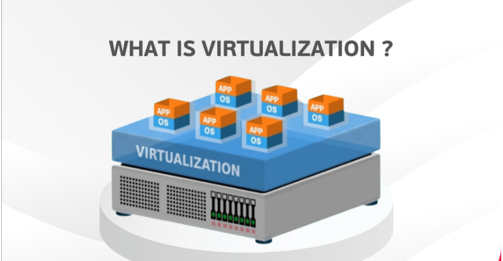
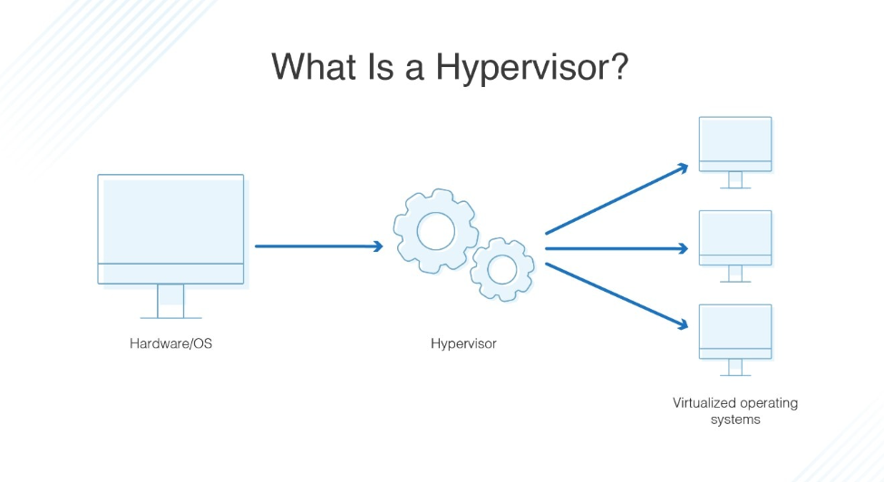
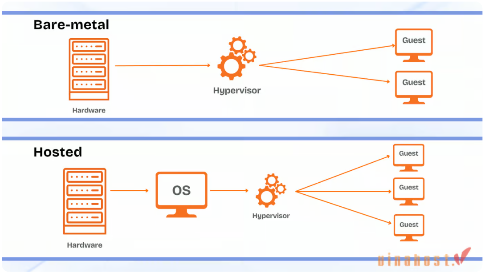
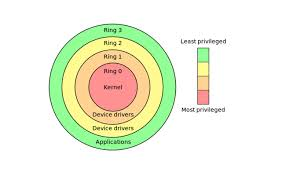
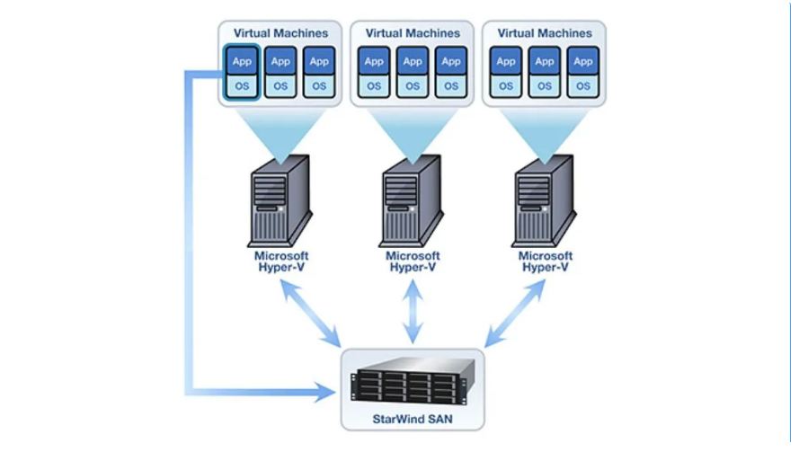
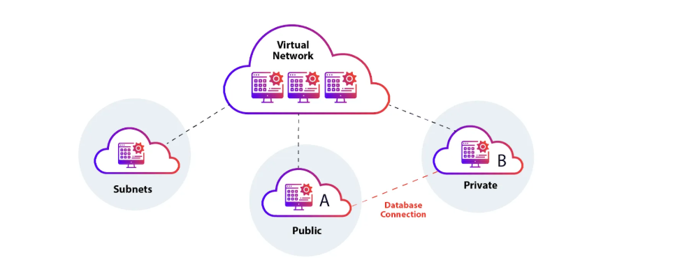
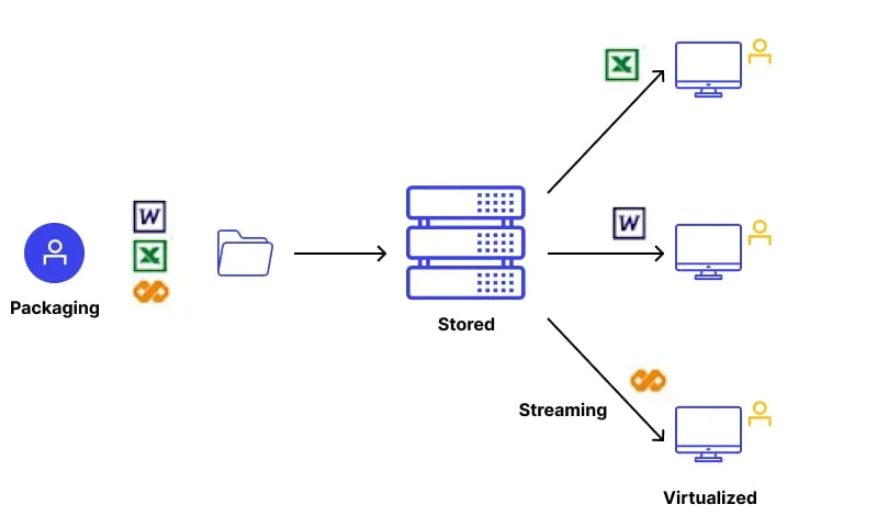
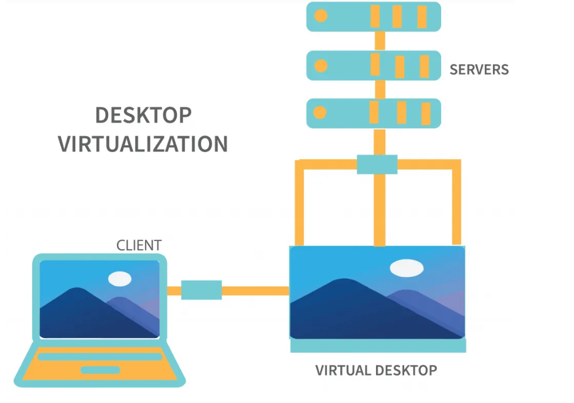
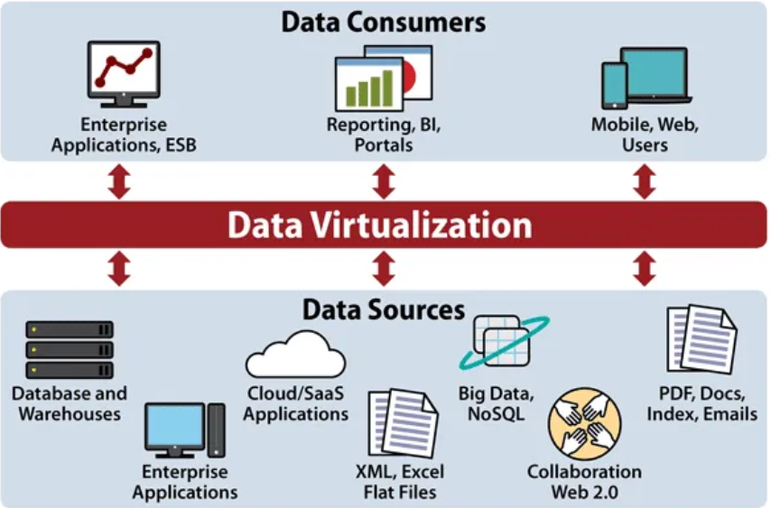
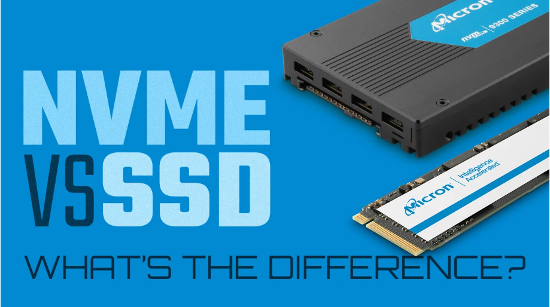

# TÌM HIỂU VỀ VIRTUALIZATION - ẢO HOÁ

## I. TỔNG QUAN VỀ ẢO HOÁ

### 1. Ảo hoá là gì ?

**Ảo hoá (Virtualization)**: là công nghệ cho phép tạo ra các phiên bản ảo của tài nguyên vật lý như máy chủ, lưu trữ, hoặc mạng.

Thay vì sử dụng trực tiếp tài nguyên vật lý, ảo hóa tạo ra các tài nguyên "ảo" để tối ưu hóa việc sử dụng phần cứng, **nâng cao hiệu suất và khả năng quản lý.**

Công nghệ này sử dụng phần mềm mô phỏng chức năng phần cứng để tạo ra hệ thống ảo.

### 2. Mục đích sử dụng (Chức năng)

- **Tối ưu tài nguyên**: Có thể chia nhỏ một máy chủ vật lí thành nhiều máy chủ ảo (tránh lãng phí tài nguyên)

- **Tăng linh hoạt**: Chạy được nhiều hệ điều hành trong 1 máy

- **Quản lí đơn giản**: Cấu hình dễ hơn, nhanh hơn máy chủ vật lí.

- **Phục hồi thảm hoạ**: Khôi phục nhanh môi trường ảo hoá sau sự cố.

- **Hỗ trợ điện toán đám mây**: Cung cấp nền tảng cho điện toán đám mây, tăng khả năng mở rộng và quản lý cơ sở hạ tầng.

- **Kiểm thử và phát triển**: Tạo môi trường ảo để thử nghiệm phần mềm, hệ điều hành mà không ảnh hưởng hệ thống chính.

- **Bảo mật**: Cô lập môi trường ảo, giảm rủi ro lây lan phần mềm độc hại, tăng kiểm soát truy cập.

### 3. Cơ chế hoạt động của Virtualization

1. **Lớp ảo hoá (Hypervisor)**: Phần mềm hoặc phần cứng (hypervisor) tạo và quản lí máy ảo. Hypervisor tách biệt tài nguyên phần cứng vật lí (CPU, RAM, lưu trữ, mạng).Hay còn gọi Hypervisor là trình quản lí máy ảo VMM(Virtual Machine Monitor)

2. **Máy ảo (VM)**: Mỗi máy ảo là môi trường độc lập, mô phỏng phần cứng ảo (CPU, RAM, ổ cứng, card mạng), chạy hệ điều hành và ứng dụng riêng.

3. **Phân bổ tài nguyên**: **Hypervisor** chia sẻ tài nguyên phần cứng giữa các máy ảo, đảm bảo chúng hoạt động độc lập, không xung đột.

4. **Mô phỏng phần cứng**: Phần mềm ảo hoá mô phỏng chức năng phần cứng

5. **Quản lý và giao tiếp**: Hypervisor giám sát, quản lý hiệu suất, và cung cấp giao diện để cấu hình, tạo, xóa máy ảo. Máy ảo giao tiếp với phần cứng qua **hypervisor**.

## II. TỔNG QUAN VỀ HYPERVISOR

### 1. Hypervisor là gì?

**Hypervisor** là trình quản lí máy ảo (VMM - Virtual Machine Monitor) là phần mềm hoặc phần cứng trung gian, giúp tạo và quản lý nhiều máy ảo (VM) trên một máy chủ vật lý.

Hypervisor cho phép chia sẻ tài nguyên vật lý (CPU, RAM, Disk, NIC...) cho nhiều máy ảo mà vẫn đảm bảo sự tách biệt, an toàn và hiệu quả.

Ví dụ: Nền tảng hạ tầng như 1 toà nhà chung cư . Thì:

- CPU,RAM,... - Cơ sở hạ tầng vật lí toà nhà
- VM - Các phòng trong chung cư
- KVM - quản lí toà nhà có nhiệm vụ chia các phòng (to,nhỏ,...v.v)

### 2. Chức năng của Hypervisor

| Chức năng           | Mô tả                                                  |
|---------------------|--------------------------------------------------------|
| Tạo máy ảo (VM)     | Tạo vCPU, vRAM, ổ cứng ảo, NIC ảo cho mỗi máy ảo       |
| Quản lý tài nguyên  | Phân phối CPU, RAM, Disk… giữa các VM                  |
| Cô lập và bảo vệ VM | Đảm bảo VM không ảnh hưởng nhau                        |
| Giao tiếp phần cứng | Là trung gian giữa VM và phần cứng                     |
| Tính năng nâng cao  | Hỗ trợ snapshot, rollback, live migration, HA, scaling |

### 3. Phân loại Hypervisor

#### Hypervisor loại 1 (Bare-metal Hypervisor or Native Hypervisor)

- Đặc điểm:

  - Được cài đặt trực tiếp trên phần cứng của máy chủ, không cần hệ điều hành máy chủ (hostOS) bên dưới. Nó truy cập và quản lí trực tiếp tài nguyên phần cứng.
  - Nó được khởi động trước cả hệ điều hành và tương tác trực tiếp với kernel
  - Hiệu suất cao vì không có hệ điều hành nào cạnh tranh tài nguyên máy với nó. Tuy nhiên, hệ thống cũng chỉ được sử dụng để chạy các VM vì hypervisor luôn phải chạy ngầm bên dưới.

- Cấu trúc: `phần cứng vật lí`-> `Type 1 Hypervisor` -> `Các Máy ảo (Guest OS)`.

- Ứng dụng: Thường được sử dụng trong môi trường doanh nghiệp, trung tâm dữ liệu để ảo hóa máy chủ (server virtualization).

Ví dụ: VMware vSphere ESXi, Microsoft Hyper-V (trên Windows Server), Citrix XenServer, Xen (một Type 1 Hypervisor mã nguồn mở).

#### Hypervisor loại 2 (Hosted Hypervisor)

- Đặc điểm:

  - Được cài đặt trên 1 máy host, mà trong đó hệ điều hành đã được cài đặt
  - Nó chạy như 1 ứng dụng trên máy tính, có thể quản lý và chạy nhiều máy ảo cùng lúc.
  - Nó có thể được bật hoặc thoát khi cần để giải phóng tài nguyên cho host. Tuy nhiên, vì chạy trên hệ điều hành nên hiệu suất có thể thấp hơn so với native.

## III. TÌM HIỂU VỀ RING

- **Hierarchical Protection Domains(hay Protection Rings)** là cơ chế nhằm bảo vệ dữ liệu của 1 chương trình tránh khỏi nguy cơ bị truy cập trái phép bởi các chương trình khác.

- Môt **Protection Ring** là 1 mức độ truy cập tài nguyên hệ thống

- Các **Ring** được sắp xếp có thứ bậc, `0` là đặc quyền nhiều nhất(**trusted-software**), được đánh số **cao nhất** là **ít đặc quyền nhất**(**untrusted-software**)

- Các chương trình hoạt động tại Ring `0` có đặc quyền cao nhất, có thể tương tác trực tiếp với phần cứng CPU, RAM, ...

- Các ứng dụng nằm ở Ring cao muốn truy cập tài nguyên được quản lý bởi Ring thấp hơn phải dùng các cổng `gate` đặc biệt. Ví dụ `system call` giữa các Ring.

## IV. PHÂN LOẠI VIRTUALIZATION

### 1. Ảo hoá máy chủ(Server Virtualization)

**Ảo hóa máy chủ (Server Virtualization)** là công nghệ tạo nhiều máy chủ ảo trên một máy chủ vật lý duy nhất thông qua phần mềm ảo hóa (hypervisor). Mỗi máy chủ ảo hoạt động độc lập, chạy hệ điều hành và ứng dụng riêng, sử dụng tài nguyên phần cứng được phân bổ (CPU, RAM, lưu trữ, mạng).

Đặc điểm:

- **Hypervisor quản lý**: Phân chia tài nguyên phần cứng giữa các máy ảo.
- Tách biệt: Các máy ảo hoạt động độc lập, không ảnh hưởng lẫn nhau.
- Tối ưu hóa: Tăng hiệu suất sử dụng phần cứng, giảm số lượng máy chủ vật lý.

### 2. Ảo hoá mạng (Network Virtualization)

**Ảo hóa mạng (Network Virtualization)** là công nghệ tạo ra các mạng ảo độc lập trên cùng một cơ sở hạ tầng mạng vật lý. Nó tách biệt các tài nguyên mạng (băng thông, địa chỉ IP, thiết bị mạng) thông qua phần mềm, cho phép mỗi mạng ảo hoạt động riêng biệt với cấu hình, chính sách và dịch vụ riêng.

Đặc điểm:

- **Hypervisor hoặc phần mềm quản lý**: Tạo và quản lý mạng ảo, phân bổ tài nguyên mạng.
- **Tách biệt logic**: Các mạng ảo độc lập, không xung đột, dù chạy trên cùng phần cứng.
- **Mô phỏng thiết bị mạng**: Cung cấp switch, router, firewall ảo hóa.

### 3. Ảo hóa lưu trữ (Storage Virtualization)

**Ảo hóa lưu trữ (Storage Virtualization)** là công nghệ tổng hợp nhiều thiết bị lưu trữ vật lý thành một hệ thống lưu trữ ảo thống nhất, được quản lý thông qua phần mềm.

Đặc điểm:

- **Lớp trừu tượng**: Phần mềm ảo hóa tạo ra một giao diện logic, che giấu sự phức tạp của các thiết bị lưu trữ vật lý.
- **Tích hợp đa dạng**: Kết hợp ổ cứng, SSD, NAS, SAN từ nhiều nhà cung cấp thành một nhóm lưu trữ chung.
- **Quản lý tập trung**: Điều khiển phân bổ, sao lưu, và di chuyển dữ liệu qua một giao diện duy nhất.

### 4. Ảo hoá hệ điều hành (Operating System Virtualization)

Cho phép **chạy nhiều hệ điều hành trên cùng một nhân** (kernel) duy nhất. Các hệ điều hành này được gọi là **containers**.

Containerization: `Docker`, `LXC` (Linux Containers).

### 5. Ảo hóa ứng dụng (Application Virtualization)

**Ảo hóa ứng dụng (Application Virtualization)** là công nghệ tách biệt ứng dụng khỏi hệ điều hành, cho phép ứng dụng chạy trong môi trường ảo độc lập trên máy tính hoặc máy chủ.

Đặc điểm:

- **Môi trường ảo**: Ứng dụng được đóng gói với các thành phần cần thiết (thư viện, cấu hình) và chạy trong một container ảo.
- **Tách biệt**: Không cài đặt trực tiếp lên hệ điều hành, tránh xung đột với các ứng dụng khác.
- **Triển khai linh hoạt**: Ứng dụng có thể chạy trên nhiều thiết bị mà không cần cài đặt riêng.

### 6. Ảo hóa máy tính (Desktop Virtualization)

**Ảo hóa máy tính (Desktop Virtualization)** là công nghệ cung cấp môi trường máy tính để bàn ảo, chạy trên máy chủ từ xa thay vì thiết bị vật lý của người dùng. Mỗi máy tính để bàn ảo hoạt động độc lập, mô phỏng hệ điều hành và ứng dụng, được truy cập qua mạng từ các thiết bị như PC, laptop, hoặc thiết bị mỏng (thin client). Bằng các ảo hoá CPU,GPU

Đặc điểm:

- **Chạy trên máy chủ**: Hypervisor hoặc phần mềm ảo hóa (VD: VMware Horizon, Citrix Virtual Desktops) quản lý nhiều máy tính để bàn ảo trên máy chủ trung tâm.
- **Truy cập từ xa**: Người dùng kết nối đến máy tính ảo qua giao thức mạng (RDP, VDI).
- **Tách biệt**: Mỗi máy tính ảo độc lập, có hệ điều hành, ứng dụng riêng.

### 7. Ảo hoá dữ liệu(data Virtualization)

**Ảo hóa dữ liệu (Data Virtualization)** là công nghệ tích hợp và cung cấp dữ liệu từ nhiều nguồn khác nhau (cơ sở dữ liệu, API, tệp, đám mây) dưới dạng một giao diện ảo thống nhất mà không cần sao chép hoặc di chuyển dữ liệu vật lý.

Đặc điểm:

- **Lớp ảo hóa**: Phần mềm tạo ra một lớp trừu tượng, tổng hợp dữ liệu từ các nguồn dị biệt.
- **Truy cập thời gian thực**: Cung cấp dữ liệu tức thì mà không cần lưu trữ vật lý trung gian.
- **Tích hợp linh hoạt**: Kết nối các hệ thống khác nhau (SQL, NoSQL, API) thành một nguồn dữ liệu logic.

### 8. Ảo hoá thiết bị I/O

**Ảo hóa thiết bị I/O (I/O Virtualization)** là công nghệ cho phép nhiều máy ảo chia sẻ và sử dụng các thiết bị đầu vào/đầu ra (I/O) vật lý (như card mạng, thiết bị lưu trữ, GPU) trên một máy chủ vật lý thông qua lớp ảo hóa.

Đặc điểm:

- **Lớp trung gian**: Hypervisor hoặc phần mềm ảo hóa (VD: SR-IOV, VMware vSphere) quản lý và phân bổ tài nguyên I/O giữa các máy ảo.
- **Mô phỏng hoặc trực tiếp**: Có thể mô phỏng thiết bị I/O ảo hoặc cung cấp truy cập trực tiếp (pass-through) đến phần cứng.
- **Chia sẻ tài nguyên**: Nhiều máy ảo sử dụng cùng thiết bị I/O mà không xung đột.

### 9. Ảo hoá đám mây

Bằng cách ảo hóa máy chủ, lưu trữ và các tài nguyên vật lý khác của trung tâm dữ liệu, các nhà cung cấp dịch vụ điện toán đám mây có thể cung cấp cho khách hàng một loạt dịch vụ, bao gồm những dịch vụ sau:

- **Cơ sở hạ tầng như một dịch vụ (Infrastructure as a Service – IaaS)**: Mô hình cung cấp IaaS đem đến tài nguyên máy chủ ảo, lưu trữ ảo và mạng ảo có thể tự cấu hình theo yêu cầu của mình.
- **Nền tảng như một dịch vụ (Platform as a Service – PaaS)**: Mô hình dịch vụ PaaS cung cấp các công cụ phát triển ảo, cơ sở dữ liệu và các dịch vụ đám mây khác để xây dựng ứng dụng và giải pháp trên nền tảng đám mây.
- **Phần mềm như một dịch vụ (Software as a Service – SaaS)**: Phần mềm như một dịch vụ đề cập đến các ứng dụng được lưu trữ trên đám mây. SaaS là mô hình dịch vụ đám mây được sử dụng rộng rãi nhất.

## V. CÁC MỨC ĐỘ ẢO HOÁ

### 1. 1. Ảo hóa toàn phần (Full Virtualization)

**Ảo hóa toàn phần (Full Virtualization)** là công nghệ ảo hóa mô phỏng hoàn toàn phần cứng của máy tính, cho phép máy ảo chạy hệ điều hành và ứng dụng mà không cần chỉnh sửa, như một máy vật lý thực thụ.

Đặc điểm:

- **Mô phỏng toàn bộ**: Hypervisor tạo môi trường phần cứng ảo (CPU, RAM, ổ cứng, mạng) cho mỗi máy ảo.
- **Tương thích cao**: Hỗ trợ hầu hết hệ điều hành (Windows, Linux, v.v.) mà không cần thay đổi mã nguồn.
- **Độc lập**: Máy ảo hoạt động hoàn toàn tách biệt với hệ thống chủ.

Lợi ích:

- Chạy nhiều hệ điều hành khác nhau trên cùng phần cứng.
- Dễ triển khai, không cần tùy chỉnh hệ điều hành khách.

Nhược điểm:

- Hiệu suất thấp hơn do mô phỏng toàn bộ phần cứng.
- Tiêu tốn tài nguyên hơn so với các phương pháp khác.

### 2. Ảo hoá bán phần (Paravirtualization)

**Ảo hóa bán phần (Para-Virtualization)** là công nghệ ảo hóa trong đó máy ảo sử dụng hệ điều hành được chỉnh sửa để tương tác trực tiếp với hypervisor, thay vì mô phỏng toàn bộ phần cứng.

Đặc điểm:

**Hệ điều hành chỉnh sửa**: Hệ điều hành khách cần được tối ưu hóa để nhận biết **hypervisor**, sử dụng các driver hoặc API đặc biệt (như `VirtIO` trong KVM).
**Tương tác trực tiếp**: Máy ảo giao tiếp với **hypervisor**, giảm chi phí mô phỏng phần cứng.
**Hiệu suất cao**: Ít tài nguyên hơn so với ảo hóa toàn phần.

Lợi ích:

- Hiệu suất gần với máy vật lý, đặc biệt cho I/O (mạng, lưu trữ).
- Tối ưu tài nguyên CPU và RAM.
- Phù hợp cho môi trường doanh nghiệp yêu cầu hiệu năng cao.

Nhược điểm:

- Yêu cầu chỉnh sửa hệ điều hành khách, không hỗ trợ mọi hệ điều hành.
- Phức tạp hơn trong triển khai so với ảo hóa toàn phần.

### 3. Ảo hóa hỗ trợ phần cứng (Hardware-Assisted Virtualization)

**Ảo hóa hỗ trợ phần cứng (Hardware-Assisted Virtualization)** là công nghệ ảo hóa sử dụng các tính năng tích hợp trong phần cứng (như `Intel VT-x`, `AMD-V`) để hỗ trợ máy ảo truy cập trực tiếp tài nguyên phần cứng, thay vì mô phỏng hoàn toàn.

Đặc điểm:

- **Hỗ trợ từ CPU**: Phần cứng (CPU) cung cấp các lệnh đặc biệt để hypervisor quản lý máy ảo hiệu quả.
- **Truy cập trực tiếp**: Máy ảo sử dụng CPU, RAM, và I/O gần giống máy vật lý, giảm chi phí mô phỏng.
- **Hệ điều hành không cần chỉnh sửa**: Hỗ trợ mọi hệ điều hành mà không cần tối ưu hóa.

Lợi ích:

- Hiệu suất cao, gần với máy vật lý.
- Tương thích rộng, không yêu cầu chỉnh sửa hệ điều hành khách.
- Tối ưu tài nguyên, phù hợp cho môi trường doanh nghiệp và đám mây.

Nhược điểm:

- Phụ thuộc vào phần cứng hỗ trợ (CPU phải có `Intel VT-x` hoặc `AMD-V`).
- Yêu cầu cấu hình hypervisor phù hợp.

### 4. Ảo hoá song song

**Ảo hoá song song (Hybrid Virtualization)** là sự kết hợp giữa **ảo hóa toàn phần (Full Virtualization)** và **ảo hóa hỗ trợ phần cứng (Hardware-Assisted Virtualization)** hoặc **ảo hóa bán phần (Para-Virtualization)** để tối ưu hiệu suất và tính tương thích.

Đặc điểm:

- **Kết hợp kỹ thuật**: Sử dụng **mô phỏng phần cứng (full virtualization)** cho hệ điều hành không hỗ trợ chỉnh sửa, đồng thời tận dụng công nghệ phần cứng (`Intel VT-x`, `AMD-V`) hoặc **driver para-virtualized (như VirtIO)** để tăng hiệu suất.
- **Linh hoạt**: Hypervisor chuyển đổi giữa chế độ toàn phần và hỗ trợ phần cứng/bán phần tùy theo hệ điều hành khách.
- **Hiệu suất cân bằng**: Kết hợp hiệu suất cao của ảo hóa hỗ trợ phần cứng với khả năng tương thích của ảo hóa toàn phần.

Lợi ích:

- Hiệu suất tốt hơn ảo hóa toàn phần, gần với máy vật lý.
- Hỗ trợ đa dạng hệ điều hành mà không cần chỉnh sửa nhiều.
- Phù hợp cho môi trường hỗn hợp (các hệ điều hành cũ và mới).

Nhược điểm:

- Phức tạp hơn trong cấu hình hypervisor.
- Phụ thuộc vào phần cứng hỗ trợ (như `Intel VT-x`, `AMD-V`).

## VI. TÌM HIỂU Ổ CỨNG NVME VÀ SO SÁNH VỚI HDD,SSD

### 1. Khái niệm NVMe

**Non-Volatile Memory Express (NVMe)** là **một chuẩn giao tiếp** dành cho ổ lưu trữ flash, được **thiết kế để khai thác tối đa tốc độ của bus PCIe**.

**NVMe** giúp **giảm độ trễ** và **tăng số lượng lệnh xử lý song song** so với **chuẩn SATA truyền thống**.

Đặc điểm chính:

- Sử dụng giao tiếp PCIe
- Độ trễ cực thấp
- Tốc độ đọc ghi rất cao
- Hỗ trợ nhiều hàng đợi I/O song song
- NVMe thường được sử dụng cho các ổ SSD NVMe trong server, workstation và hệ thống cloud.

### 2. So sánh NVMe, SSD và HDD

| Tiêu chí        | Hard Disk Drive (HDD) | Solid State Drive (SSD SATA) | Non-Volatile Memory Express (NVMe SSD) |
| --------------- | --------------------- | ---------------------------- | -------------------------------------- |
| Công nghệ       | Đĩa từ quay cơ học    | Bộ nhớ flash NAND            | Bộ nhớ flash NAND                      |
| Chuẩn giao tiếp | SATA / SAS            | SATA                         | PCIe                                   |
| Tốc độ đọc/ghi  | 80 – 160 MB/s         | 400 – 550 MB/s               | 1500 – 7000 MB/s                       |
| Độ trễ          | Cao                   | Thấp                         | Rất thấp                               |
| IOPS            | ~100 – 200            | ~50k                         | ~500k+                                 |
| Độ bền          | Dễ hỏng do cơ học     | Bền hơn HDD                  | Bền                                    |
| Giá thành       | Rẻ nhất               | Trung bình                   | Cao                                    |
| Ứng dụng        | Lưu trữ dữ liệu lớn   | PC, laptop                   | Server, cloud, virtualization          |

### 3. Ứng dụng của NVMe trong Virtualization

Vai trò của NVMe:

#### Tăng hiệu năng VM

Máy ảo thường truy cập ổ đĩa liên tục. NVMe giúp:

- Giảm latency
- Tăng IOPS (ố lượng thao tác đọc và ghi dữ liệu mà ổ đĩa có thể thực hiện trong 1 giây)
- Tăng tốc boot VM

#### Hỗ trợ nhiều VM cùng lúc

Khi nhiều VM chạy đồng thời, NVMe có thể xử lý hàng trăm nghìn request I/O.

Điều này giúp:

- Tránh nghẽn disk
- Tăng khả năng mở rộng hệ thống.

### 5. Ứng dụng của NVMe trong Hypervisor

Vai trò của NVMe:

#### Tăng tốc I/O cho datastore

Datastore lưu:

- Disk VM
- Snapshot
- Log

-> NVMe giúp truy cập dữ liệu nhanh hơn.

#### Tăng hiệu năng storage backend

Trong hệ thống cloud như: `OpenStack`

NVMe thường dùng cho:

- Storage backend
- Cache layer
- High-performance volume

#### Hỗ trợ Live Migration

NVMe giúp quá trình **Live Migration** VM nhanh hơn do tốc độ truyền dữ liệu cao.
