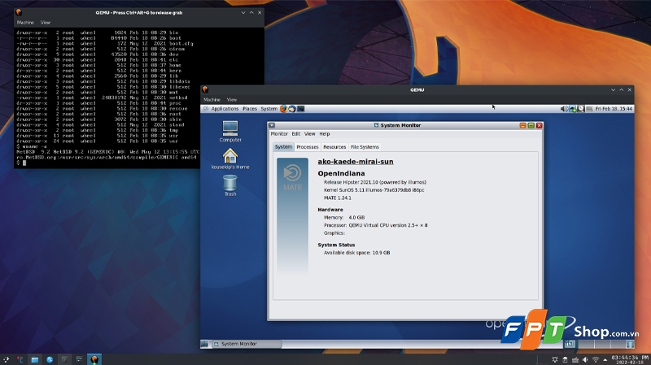
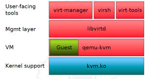
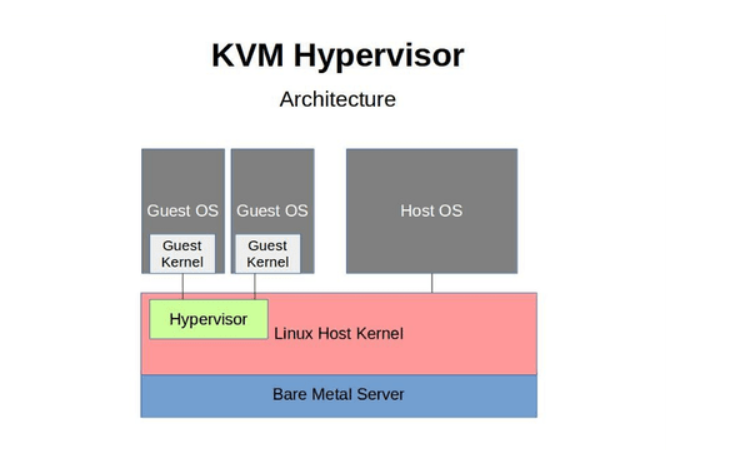

# TÌM HIỂU CƠ BẢN VỀ KVM

## 1. KVM là gì ?



**KVM(Kernel-based Virtual Machine)** là một module của nhận Linux, biến nhân Linux thành hypervisor loại native để tạo và quản lý máy ảo. Sử dụng công nghệ ảo hóa phần cứng (Intel VT-x, AMD-V) để máy ảo truy cập trực tiếp tài nguyên (CPU, RAM).

Đặc điểm:

- **Hỗ trợ phần cứng**: Sử dụng công nghệ ảo hóa phần cứng (Intel VT-x, AMD-V) để máy ảo truy cập trực tiếp tài nguyên (CPU, RAM).
- **Mô-đun nhân**: KVM là mô-đun trong nhân Linux, hoạt động với QEMU để mô phỏng phần cứng ảo (mạng, lưu trữ).
- **Driver VirtIO**: Cung cấp driver hiệu suất cao (gần giống para-virtualization) cho I/O của máy ảo.
- **Mở và miễn phí**: Là phần mềm mã nguồn mở, tích hợp trong hầu hết bản phân phối Linux.

## 2. KVM dùng để làm gì ?

KVM cũng có mọi chức năng mà của 1 Hypervisor lên có:

- **Tạo và quản lý máy ảo**: Chạy nhiều hệ điều hành (Linux, Windows, v.v.) trên một máy chủ vật lý, tối ưu tài nguyên phần cứng.

- **Tối ưu hiệu suất**: Sử dụng ảo hóa hỗ trợ phần cứng (Intel VT-x, AMD-V) và VirtIO để đạt hiệu suất gần với máy vật lý.

- **Hỗ trợ đám mây**: Cung cấp nền tảng cho các dịch vụ đám mây (VD: OpenStack, Proxmox) để triển khai máy ảo linh hoạt.

- **Kiểm thử và phát triển**: Tạo môi trường ảo để thử nghiệm phần mềm, hệ điều hành, hoặc cấu hình mà không ảnh hưởng hệ thống chính.

- **Quản lý tập trung**: Dùng công cụ như libvirt, virt-manager để cấu hình, giám sát, và sao lưu máy ảo dễ dàng.

- **Tiết kiệm chi phí**: Giảm số lượng máy chủ vật lý, tiết kiệm điện, không gian, và chi phí bảo trì.

- **Bảo mật**: Cô lập máy ảo, giảm rủi ro lây lan mã độc, tận dụng tính năng bảo mật của Linux.

## 3. KVM thuộc loại ảo hoá nào ?

**KVM (Kernel-based Virtual Machine)** thuộc loại ảo hóa Type 1 Hypervisor (hoặc bare-metal hypervisor).

Mặc dù KVM là một module của nhân Linux, nhưng nó hoạt động như một hypervisor Type 1 vì những lý do sau:

- **Tích hợp trực tiếp vào kernel Linux**: KVM là một module của nhân Linux, không phải ứng dụng chạy trên OS host. Khi KVM được kích hoạt, Linux kernel trở thành hypervisor, hoạt động tương tự ESXi hay Hyper-V bare-metal.

- **Truy cập trực tiếp phần cứng (hardware virtualization)**: KVM sử dụng VT-x (Intel) hoặc AMD-V (AMD) để cho phép VM chạy lệnh CPU trực tiếp trên phần cứng, không qua lớp OS trung gian như Type-2 hypervisor.

- **VM chạy như tiến trình Linux nhưng được cô lập hoàn toàn**: Mỗi VM là một tiến trình trong Linux, tận dụng bộ lập lịch (scheduler), quản lý bộ nhớ và driver thiết bị của kernel, đảm bảo hiệu suất cao và cách ly tốt.

- **Kết hợp QEMU để giả lập thiết bị (I/O virtualization)**: KVM cung cấp ảo hóa CPU/memory, QEMU giả lập các thiết bị phần cứng (BIOS, NIC, VGA…) tạo thành giải pháp ảo hóa đầy đủ.

## 4. So sánh KVM với các Hypervisor khác

| Tiêu chí            | KVM                                            | VMware ESXi                                   | Microsoft Hyper-V                                                   | VirtualBox                                                |
|---------------------|------------------------------------------------|-----------------------------------------------|---------------------------------------------------------------------|-----------------------------------------------------------|
| Loại hypervisor     | Type-1 (kernel-based)                          | Type-1 (bare-metal)                           | Type-1 (bare-metal) hoặc Type-2 (Windows host)                      | Type-2 (hosted)                                           |
| Cách cài đặt        | Module tích hợp trong Linux kernel             | HĐH riêng (ESXi OS)                           | Cài như role trên Windows Server (Type-1) hoặc app Windows (Type-2) | Cài như phần mềm trên Windows/Linux/Mac                   |
| OS host             | Linux (kernel = hypervisor)                    | Không có OS host, ESXi tự là OS               | Windows Server hoặc Windows 10/11 Pro                               | Windows, Linux, MacOS                                     |
| Quản lý VM          | virsh, virt-manager, libvirt, OpenStack        | vSphere Client, vCenter                       | Hyper-V Manager, SCVMM                                              | GUI VirtualBox                                            |
| Chi phí             | Miễn phí, open-source                          | Mất phí (license cao)                         | Miễn phí (basic Hyper-V) + phí Windows license                      | Miễn phí                                                  |
| Hiệu năng           | Gần native (tốt)                               | Rất cao (được tối ưu riêng)                   | Cao                                                                 | Thấp – Trung bình                                         |
| Hỗ trợ guest OS     | Linux, Windows, BSD                            | Linux, Windows, BSD, macOS (hạn chế)          | Windows, Linux                                                      | Linux, Windows, BSD, macOS                                |
| Ứng dụng chính      | Datacenter Linux, Cloud (OpenStack), hosting   | Datacenter doanh nghiệp lớn, ảo hóa server    | Doanh nghiệp dùng Windows Server, datacenter                        | Học tập, lab, dev local                                   |
| Yêu cầu phần cứng   | CPU hỗ trợ VT-x hoặc AMD-V                     | CPU hỗ trợ VT-x hoặc AMD-V                    | CPU hỗ trợ SLAT (Intel EPT/AMD RVI)                                 | Không yêu cầu đặc biệt (nhưng hỗ trợ VT-x tăng hiệu năng) |
| Tính năng nổi bật   | Tích hợp kernel, dễ mở rộng cloud, open-source | Hiệu năng cực cao, tính năng vMotion, HA, DRS | Tích hợp Active Directory, Replica, Cluster                         | Dễ dùng, GUI trực quan, snapshot nhanh                    |
| Khả năng mở rộng    | Rất cao (cloud-native, OpenStack)              | Rất cao (datacenter lớn)                      | Cao (Windows ecosystem)                                             | Thấp – chỉ phù hợp lab/dev                                |
| Bản chất hypervisor | Kernel module biến Linux thành hypervisor      | Hệ điều hành riêng của VMware                 | Role trong Windows kernel (Type-1) hoặc app (Type-2)                | Phần mềm giả lập chạy trên OS host                        |

## 4. Các thành phần dùng trong KVM

Mô hình kiến trúc:

```bash
     +--------------------+
     |   virt-manager     |     <- Giao diện người dùng (GUI)
     |     virsh          |     <- User-facing tools layer
     +--------------------+
               ↓
         +------------+
         |   libvirt  |     <- Công cụ quản lý or Management layer
         +------------+
               ↓
     +--------------------+
     |     QEMU + KVM     |     <- Thực thi VM. Hay còn gọi VM Layer
     +--------------------+
               ↓
         +----------+
         |  Kernel  |     <- Có mô-đun KVM. Hay còn gọi lớp này là Kernel Support Layer
         +----------+
               ↓
         +----------+
         | Hardware |
         +----------+
```

Hoặc:



**Phân tích rõ từng lớp một**:

### a. User-facing tools Layer

Là công cụ mà người dùng trực tiếp sử dụng quản lí máy ảo trên KVM. Bao gồm:

- `virt-manager`: giao diện đồ họa (GUI) giúp tạo, khởi động, tắt, snapshot và cấu hình máy ảo dễ dàng.

- `virsh`: công cụ dòng lệnh (CLI) mạnh mẽ, hỗ trợ gần như toàn bộ chức năng quản lý máy ảo thông qua libvirt.

- `virt-tools`: tập hợp các công cụ hỗ trợ bổ sung cho việc quản lý, cài đặt và cấu hình máy ảo (bao gồm virt-install, virt-clone…).

Các công cụ này không tương tác trực tiếp với KVM mà sẽ gửi yêu cầu đến libvirt để thực hiện thao tác quản lý VM.

### b. Management Layer

Lớp quản lý bao gồm thư viện `libvirt` và `daemon libvirtd`, cung cấp API chuẩn để các công cụ user-facing tools có thể giao tiếp với hypervisor.

Chức năng:

- Quản lý vòng đời máy ảo: tạo, start, stop, pause, resume, snapshot.
- Quản lý storage pool, network pool.
- Cung cấp API đa ngôn ngữ (C, Python, Go) cho lập trình và tích hợp hệ thống.

KVM chỉ cung cấp khả năng ảo hóa CPU và memory, không có chức năng quản lý VM, vì vậy `libvirt` đóng vai trò lớp quản lý trung gian, orchestrator giữa user tools và hypervisor.

### c. Virtual machine Layer

**Máy ảo (Virtual Machine)** là **hệ điều hành khách (guest OS**) mà người dùng tạo ra và vận hành trên hạ tầng ảo hóa KVM.

- Nếu không sử dụng các công cụ như `virsh` hay `virt-manager`, KVM sẽ được phối hợp với QEMU

  - `QEMU` (Quick Emulator):

    - Phần mềm mô phỏng phần cứng ảo (ổ cứng, mạng, GPU) cho máy ảo.
    - Kết hợp với KVM để xử lý I/O và cung cấp môi trường ảo hoàn chỉnh.

- Mỗi VM thực chất là một tiến trình user-space trên Linux, chạy dưới dạng qemu-kvm process, nhưng có tài nguyên riêng biệt và được KVM cô lập, đảm bảo an toàn.

=> VM hoạt động dựa trên `qemu-kvm`: QEMU giả lập phần cứng máy ảo, KVM tăng tốc xử lý lệnh CPU để đạt hiệu năng gần native.

### d. Kernel-Support Layer

Lớp hỗ trợ trong kernel Linux cho phép KVM hoạt động như một hypervisor.

Thành phần chính:

- `kvm.ko`: module kernel chính, cung cấp hạ tầng ảo hóa cơ bản, xử lý tạo vCPU, context switching giữa guest và host.

- `kvm-intel.ko` / `kvm-amd.ko`: module kernel đặc thù cho CPU Intel hoặc AMD, hỗ trợ tập lệnh VT-x (Intel) hoặc AMD-V (AMD) để thực thi ảo hóa phần cứng.

**Kernel support** là nền tảng để KVM hoạt động, biến Linux kernel thành hypervisor Type-1 thực sự, cho phép VM thực thi lệnh CPU trực tiếp trên phần cứng với mức độ bảo mật và hiệu năng cao.

### e. Other

#### `VirIO`

- Bộ driver hiệu suất cao (giống para-virtualization) cho máy ảo, tối ưu hóa I/O (mạng, lưu trữ).
- Giảm chi phí mô phỏng, tăng tốc độ truy cập tài nguyên.
- `VirtIO` không phải là thành phần độc lập như KVM module hay QEMU, mà là giải pháp driver và backend nằm trong guest và QEMU để tối ưu hiệu suất I/O.

```text
Guest OS
   │
VirtIO drivers (cài trong Guest OS)
   │
VirtIO backend (trong QEMU)
   │
QEMU giao tiếp với phần cứng thật qua Linux host
```

## 5. Cơ chế hoạt động của KVM



### Bare Metal Server (phần màu xanh dưới cùng)

- Là phần cứng vật lý thực sự: CPU, RAM, ổ cứng, v.v.
- KVM hoạt động trực tiếp trên phần cứng này.

### Linux Host Kernel (màu đỏ)

- Là hệ điều hành Linux cài đặt trên máy chủ vật lý, nơi KVM được bật như một mô-đun kernel.
- KVM thực tế là một mô-đun trong kernel Linux, biến kernel Linux thành một hypervisor (kiểu 1).

### Hypervisor (Màu xanh lá)

- Phần này đại diện cho KVM kernel module - nó cho phép tạo
- Chạy trong không gian kernel của hệ điều hành Linux.

### HostOS

- Là hệ điều hành chính (Linux) cài trực tiếp trên máy chủ.
- Bạn có thể chạy các dịch vụ, ứng dụng như bình thường.

### Guest OS & Guest Kernel

- Là các máy ảo (Virtual Machines) do KVM quản lý.
- Mỗi máy ảo có:

  - `Guest Kernel`: kernel riêng của hệ điều hành máy ảo (Windows, Linux,...).
  - `Guest OS`: hệ điều hành máy ảo.

### Các bước hoạt động cơ bản

1.**Khởi động hệ thống**: Khi hệ thống khởi động, Kernel Based Virtual Machine được khởi động cùng với nhân Linux.  
2. **Tạo máy ảo**: Người dùng sử dụng các công cụ quản lý VM như `libvirt` hoặc `virsh` để tạo các máy ảo VM.  
3. **Cấu hình máy ảo**: Người dùng cần cấu hình các thông số cho VM như hệ điều hành, CPU, RAM, ổ đĩa, mạng,...  
4. **Khởi động máy ảo**: Khi VM được khởi động, KVM sẽ tạo một môi trường ảo riêng biệt cho VM.  
5. **Chạy hệ điều hành khách**: Hệ điều hành khách được cài đặt và chạy trong môi trường ảo.  
6. **Quản lý máy ảo**: Người dùng có thể sử dụng các công cụ quản lý VM để theo dõi, điều khiển và quản lý các VM.

### Các bước hoạt động chi tiết

- **KVM sử dụng mô hình hypervisor dựa trên mô-đun**: Mô-đun KVM được tích hợp vào nhân Linux, cho phép KVM tận dụng tối đa các tính năng và hiệu suất của hệ thống.
- **KVM sử dụng QEMU để giả lập phần cứng**: QEMU là một trình giả lập phần cứng mã nguồn mở, cung cấp khả năng giả lập các thiết bị phần cứng như CPU, RAM, ổ đĩa, mạng,... cho các VM.
- **KVM sử dụng libvirt để quản lý VM**: Libvirt là một thư viện quản lý VM mã nguồn mở, cung cấp giao diện lập trình ứng dụng (API) để thao tác với các VM.
- **KVM sử dụng virsh để quản lý VM dòng lệnh**: Virsh là một công cụ quản lý VM dòng lệnh, cho phép người dùng tạo, khởi động, dừng, quản lý và cấu hình các VM.

## 6. Mối quan hệ giữa KVM và OS (Operating System)

### a. KVM là một phần Linux Kernel

- KVM không phải là 1 phần mềm riêng biệt chạy trên hệ điều hành như Virtual Box
- Nó là một mô-đun được tích hợp vào nhân (kernel) của Linux, bắt đầu từ phiên bản 2.6.20.
- Khi được bật, Linux kernel có thể hoạt động như một hypervisor Type 1 (giống như **VMware ESXi** hay **Hyper-V**).

### b. Linux là một môi trường host (Host OS)

Người dùng cài đặt Linux OS trên máy chủ vật lý. Sau đó bật/tải mô-đun KVM.
KVM tận dụng các tính năng của Linux như:

- Quản lý bộ nhớ.
- Lập lịch CPU.
- Hệ thống tập tin.
- Driver thiết bị.

Vì vậy, Linux OS vừa là một hệ điều hành đầy đủ, vừa là nền tảng để KVM tạo và quản lý máy ảo.

### c. Từ Linux host, có thể tạo các máy ảo (Guest OS)

Sau khi KVM được kích hoạt, có thể tạo các máy ảo sử dụng các công cụ như `libvirt`, `virt-manager`, `virsh` hoặc dùng `QEMU` trực tiếp.

Mỗi máy ảo có thể cài đặt hệ điều hành riêng biệt: Linux, Window, BSD,...v.v

| Thành phần          | Vai trò                                                                         |
|---------------------|---------------------------------------------------------------------------------|
| **Linux OS (Host)** | Hệ điều hành chủ, nơi mô-đun KVM hoạt động, cung cấp tài nguyên hệ thống        |
| **KVM**             | Một mô-đun trong kernel Linux, biến hệ điều hành Linux thành hypervisor         |
| **Guest OS**        | Các máy ảo chạy trên KVM, có thể là bất kỳ hệ điều hành nào                     |
