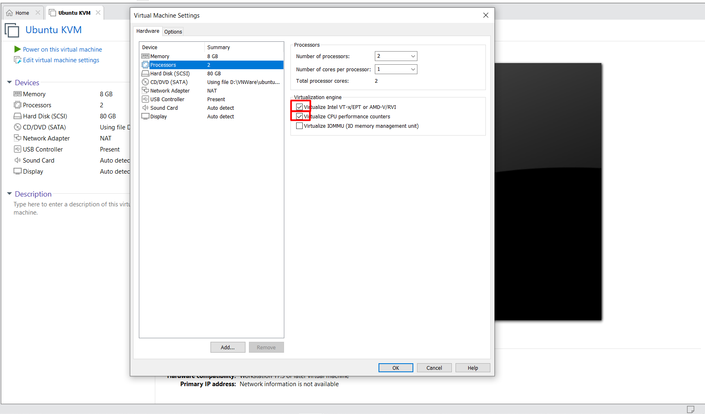
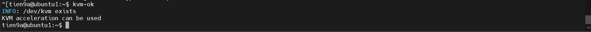
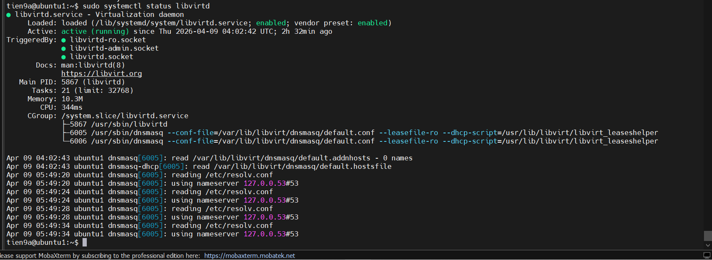

# INSTALL KVM

**KVM** : một **hypervisor** rất nổi tiếng và được sử dụng rộng rãi trong các mô hình Cloud thực tế.

Với **KVM** một thiết bị vật lý có thể được chia nhỏ thành các thiết bị ảo độc lập với nhau, và được dùng để phân phối tới người sử dụng theo mô hình cơ sở hạ tầng như một dịch vụ(**IaaS**).

## 1. Kiểm tra tính tương thích với KVM

**KVM** yêu cầu:

- **CPU** phải hỗ trợ ảo hoá phần cứng.
- **Virtualization** phải bật trong **BIOS/UEFI**.
- **CPU** phải hỗ trợ **Second Level Address Translation**.
- **RAM** đủ lớn.(`>=8GB`)

Lệnh để kiểm tra xem máy có hỗ trợ cài KVM không (OS:`Ubuntu`):

```bash
egrep -c '(vmx|svm)' /proc/cpuinfo
```

Nếu kết quả trả về là `0` thì máy không hỗ trợ cài **KVM**, nếu kết quả khác `0` là máy có hỗ trợ cài `KVM`.

## 2. Cài KVM

Ta tạo **VM** trên **VMWare** với dung lượng `80GB` đủ để ta tạo 4 con VM trong **Host KVM** và xài hệ điều hành `Ubuntu 22.04.`. Ngoài ra, Ta sẽ set cấu hình **RAM** **8GB** để sau này host KVM có thể cung cấp cho **VM**.

**Lưu ý**: Khi tạo máy ảo trong **VMWare** ta cần bật ảo hoá CPU lên:



Sau đó, ta cài các gói cần thiết:

```bash
sudo apt update
sudo apt -y install bridge-utils cpu-checker libvirt-clients virtinst virt-manager libvirt-daemon-system qemu-system-x86 qemu-utils qemu-kvm
```

|Tên gói|Chức năng chính|
|-------|----------------|
|`qemu-kvm`|Thành phần cốt lõi. Cung cấp sự giao tiếp giữa **QEMU** và **KVM** (**Kernel-based Virtual Machine**) để **tận dụng tăng tốc phần cứng từ CPU**.|
|`libvirt-daemon-system`| "Chạy dưới dạng dịch vụ hệ thống (**daemon**). Nó quản lý các tệp cấu hình, khởi động/dừng máy ảo và quản lý mạng ảo."|
|`libvirt-clients`| "Các công cụ dòng lệnh để tương tác với **libvirt**, nổi bật nhất là lệnh **virsh** thần thánh."|
|`virt-manager`| Giao diện đồ họa (**GUI**) cực kỳ tiện lợi để tạo và quản lý máy ảo nếu bạn không muốn gõ lệnh.|
|`virtinst`| "Cung cấp lệnh **virt-install**, giúp tạo máy ảo nhanh chóng thông qua terminal."|
|`bridge-utils`| "Giúp **tạo Bridge Networking**, **cho phép máy ảo có IP cùng lớp mạng với máy vật lý**."|
|`cpu-checker`| Cung cấp lệnh **kvm-ok** để kiểm tra xem CPU của bạn có hỗ trợ và đã bật ảo hóa (`VT-x` hoặc `AMD-V`) trong `BIOS` chưa.|
|`qemu-system-x86`| Trình giả lập kiến trúc `x86` đầy đủ.|
|`qemu-utils`| "Các tiện ích xử lý ổ đĩa ảo (như **qemu-img** để chuyển đổi định dạng đĩa `.qcow2`, `.raw`, `.vmdk`)."|

Kiểm tra **KVM**:

```bash
kvm-ok
```



Khởi động chạy KVM:

```bash
sudo systemctl start libvirtd
sudo systemctl enable libvirtd
```

### 3. Cấp quyền sử dụng KVM cho tài khoản USER đang sử dụng trên máy tính

```bash
sudo adduser $USER libvirt
sudo adduser $USER kvm
# Ở đây là cho user tien9a
```

### 4. Kiểm tra xem quá trình cài đặt KVM thành công chưa

```bash
virsh or sudo systemctl status libvirtd
```



=> Nếu kết quả trả về trạng thái **active**(running) thì quá trình cài đặt đã thành công.
