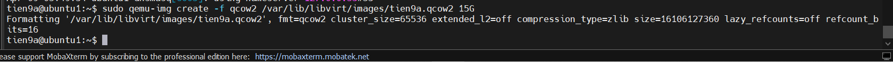
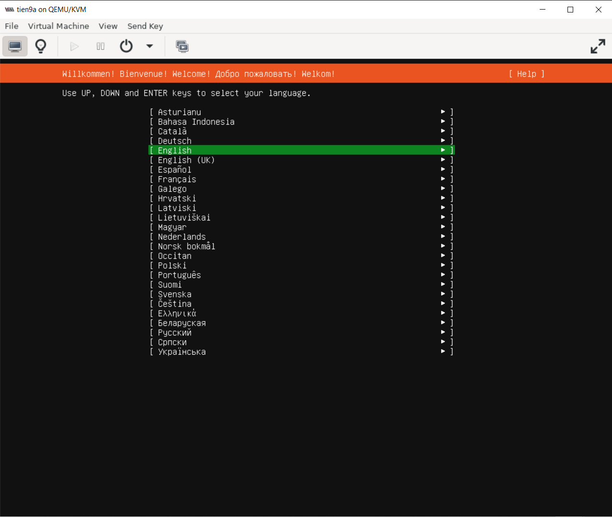
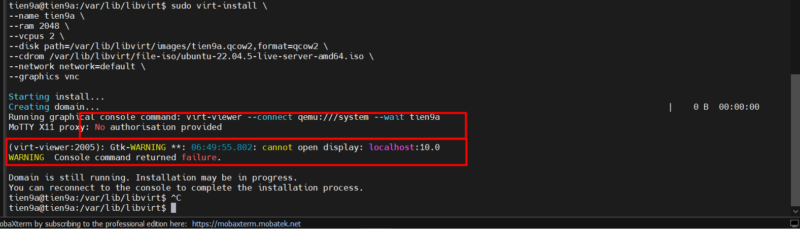
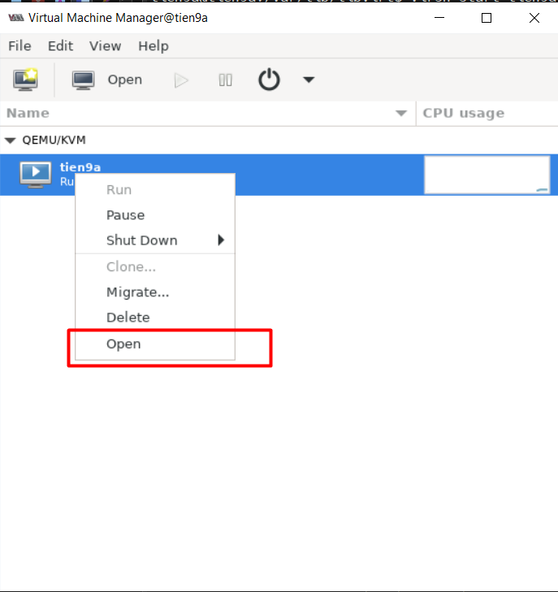
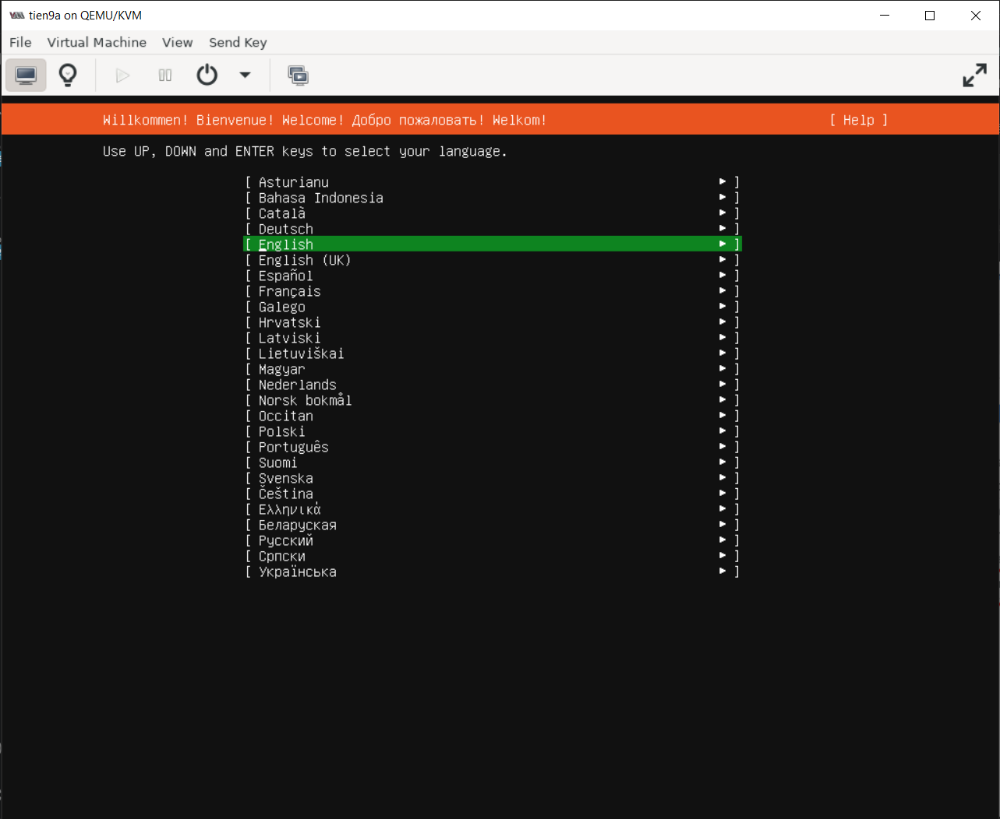
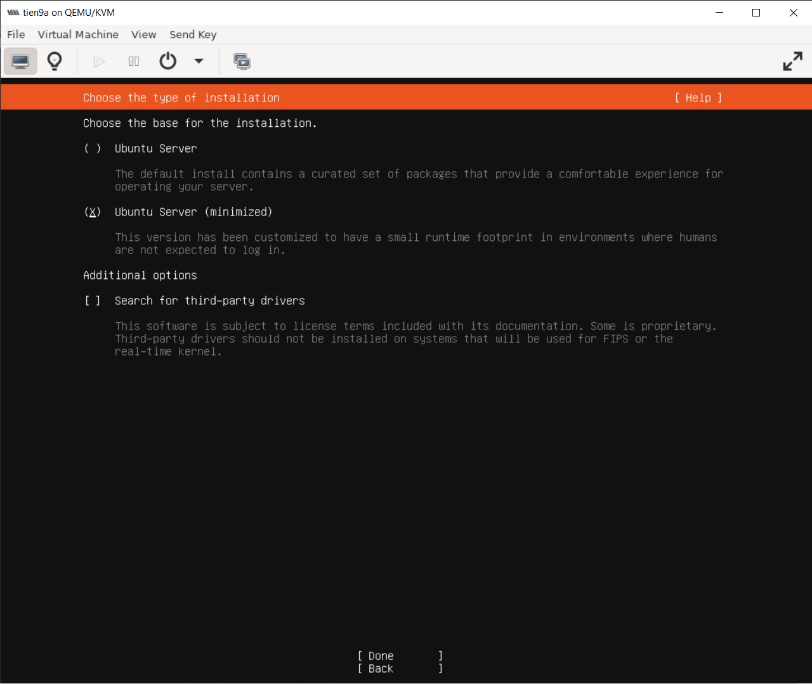

# Tạo máy ảo VM

Sau khi KVM đã được cài đặt thành công trên thiết bị, ta bắt đầu sử dụng nó để tạo/cung cấp ra các máy ảo (**Virtual Machine**/ **VM**) **tùy theo nhu cầu sử dụng mô phỏng theo mô hình IaaS**.

## 1. Khởi tạo ổ cứng ảo(Virtual Storage) cho VM

```bash
sudo qemu-img create -f qcow2 /var/lib/libvirt/images/tien9a.qcow2 20G
```



Giải thích câu lệnh trên:

|Name             | Định nghĩa                                      |
|-----------------|-------------------------------------------------|
| `qemu-img`      | Sử dụng công cụ `qemu-img`                      |
| `create`        | Sử dụng lệnh "khởi tạo"                         |
| `-f qcow2`      | Ám chỉ kiểu đĩa ảo là `qcow2`                   |
| `tien9a.qcow2`  | Tên ổ đĩa ảo                                    |
| `20`           | Dung lượng yêu cầu của ổ đĩa ảo, ở đây là `20GB` |

Tải file **ISO** :

```bash
cd /var/lib/libvirt
sudo mkdir file-iso
sudo wget -c https://releases.ubuntu.com/22.04/ubuntu-22.04.5-live-server-amd64.iso
```

## 2. Cấu hình cho máy ảo

Chuyển file `.iso` vào đường dẫn `/var/lib/libvirt/file-iso/`. Rồi sau đó cấu hình máy ảo:

```bash
# Chuyển iso file vào path sau
sudo mv ubuntu-22.04.5-live-server-amd64.iso /var/lib/libvirt/file-iso

# Cấu hình máy ảo
sudo virt-install \
--name tien9a \
--ram 2048 \
--vcpus 2 \
--disk path=/var/lib/libvirt/images/tien9a.qcow2,format=qcow2 \
--cdrom /var/lib/libvirt/file-iso/ubuntu-22.04.5-live-server-amd64.iso \
--network network=default \
--graphics vnc
```

Trong đó:

- `virt-install`: là lệnh chính tạo và cài đặt 1 máy ảo mới trong môi trường **KVM/QEMU**.

- `--name tien9a`: Là đang đặt tên cho máy ảo đó là `tien9`.

- `--ram`: Cấp phát RAM cho máy ảo

- `--vcpus 2`: Cấp phát số lượng core CPU ảo.

- `--disk path=/var/lib/libvirt/images/tien9a.qcow2,format=qcow2`: Là phần cấu hình ổ cứng cho máy ảo. Trong đó:
  
  - `path=...`: Đường dẫn lưu file ổ cứng ảo. Đuôi `.qcow2` là định dạng phổ biến nhất của KVM.
  - `format=qcow2:`: Xác định định dạng là **QCOW2** (loại ổ cứng này có ưu điểm là dung lượng file sẽ tăng dần theo dữ liệu thực tế, giúp tiết kiệm không gian đĩa máy vật lý).
  - Lưu ý: Nếu file `tien9a.qcow2` chưa tồn tại, bạn nên thêm tham số `size=20` (ví dụ `20GB`) để lệnh tự tạo file cho bạn.

- `--cdrom /var/lib/libvirt/file-iso/ubuntu-22.04.5-live-server-amd64.iso \`: Gắn một ổ đĩa CD ảo vào máy ảo và "nhét" file **ISO** cài đặt Ubuntu 22.04 vào đó.(Khi máy ảo khởi động lần đầu, nó sẽ boot từ file ISO này để bạn tiến hành cài đặt hệ điều hành.)

- `--network network=default`: Kết nối card mạng của máy ảo vào mạng ảo tên là `default`.(Ở đấy `default` chỉ mạng NAT và thường có dải `192.168.122.x` và ta có thể thay đổi dải nếu ta cấu hình trước đó)

- `--graphics vnc`: Thiết lập chế độ hiển thị màn hình cho máy ảo.(Sử dụng giao thức **Virtual Network Computing** dùng các phần mềm **VNC Viewer** hoặc tính năng "Console" trong `virt-manager` để nhìn thấy màn hình cài đặt Ubuntu.)

Sau đó ta bật máy ảo đó lên sẽ thấy hiện ra CLI của máy ảo đó:



## 2.5 Note

Đôi khi tạo máy ảo ta sẽ gặp lỗi không hiện VM ở `virt-manager` như trường hợp sau:



Nguyên nhân:

- Ở phần `.Xauthority`, khi bạn chạy lệnh bằng sudo, danh tính của bạn bị chuyển từ tien9a sang root.

  - User tien9a: Có "chìa khóa" (cookie) để mở cửa sổ đồ họa trên MoTTY.
  - User root: Không có chìa khóa đó.

=> Vì vậy, khi `virt-install` cố gắng gọi `virt-viewer` (một ứng dụng đồ họa) để hiện màn hình máy ảo lên, nó bị hệ thống từ chối quyền truy cập hiển thị.

Cách sửa:

Vào file cấu hình ssh

```bash
sudo nano /etc/ssh/sshd_config

# Xoá comment các dòng sau để chạy config
X11Forwarding yes    # Bật X11 forwarding
X11DisplayOffset 10  # quy định số thứ tự cổng (Display number) bắt đầu để SSH dùng cho X11 Forwarding.  
X11UseLocalhost yes  # SSH sẽ buộc các ứng dụng đồ họa phải kết nối thông qua địa chỉ loopback của máy chủ  
PermitTTY yes        # cho phép người dùng mở các phiên làm việc có tính tương tác như KVM(Interactive terminal).

# Xong dùng virt-manager sẽ hiện VM
virt-manager
```

Có 1 cách nhanh hơn đó là cấp quyền cho user `root` dùng X11:

```bash
cd ~
sudo apt install x11-server-utils
xhost +si:localuser:root
cd /var/lib/libvirt
virt-manager
```

## 3. Tạo máy ảo bằng giao diện GUI

Vào **virt-manager** để cấu hình VM (Gõ `Virt-manager` vào **CLI**)

```bash
virt-manager
```

Chọn `File` -> `New Virtual Machine`



Làm tương tự như tạo máy ảo trên **VM**.

## 4. Tiến hành Setup và cài đặt nốt



Nhớ cài `Minimized Install` cho `UbuntuServer`:



## 5. Một số lệnh làm việc giao diện CLI với VM

### 5.1 Hiển thị danh sách máy ảo

```bash
virsh list --all
```


=> thấy hiện tên máy ảo và có chữ `running` là `OKE`

### 5.2 Bật/Tắt VM

```bash
# Bật VM
virsh start <tên_máy_ảo>

# Tắt VM
virsh shutdown <tên_máy_ảo>
```


### 5.3 Reboot/ Delete VM

```bash
#Reboot VM
virsh reboot <tên_máy_ảo>

# Delete VM
virsh undefine <tên_máy_ảo>
```

### 5.4 Tạo Snapshot

```bash
virsh snapshot-create-as --domain tên_máy --name tên_bản_snapshot --description "mô tả bản snapshot"
```


**Note**: **Snapshot** chỉ tạo được khi định dạng **disk ảo** của ta sử dụng là **Qcow2** chính vì vậy nếu bạn đang sử dụng định dạng **Raw** mà muốn tạo **Snapshot** thì cần phải chuyển sang định dạng **Qcow2**.

### 5.5 Xem danh sách các bản Snapshot trên 1 VM

```bash
virsh snapshot-list <tên_máy_ảo>
```


### 5.6 Xem thông tin chi tiết bản Snapshot

```bash
virsh snapshot-info --domain <tên_máy_ảo> --snapshotname <tên_bản_snapshot>
```


### 5.7 Revert để chạy lại một bản snapshot đã tạo(giống Rollback)

```bash
virsh snapshot-revert <tên_máy_ảo> <tên-bản-snapshot>
```


### 5.8 Xoá 1 bản Snapshot

```bash
virsh snapshot-delete --domain <tên_máy_ảo> --snapshotname <tên_bản_snapshot>
```


### 5.9 Sửa thông tin CPU hoặc Memory

```bash
virsh edit <tên_VM>
```


### 5.10 Xem thông tin chi tiết về file disk của VM

```bash
qemu-img info <đường_dẫn_file-disk>
```


### 5.11 Xem thông tin cơ bản của 1 VM

```bash
virsh dominfo <tên_VM>
```


