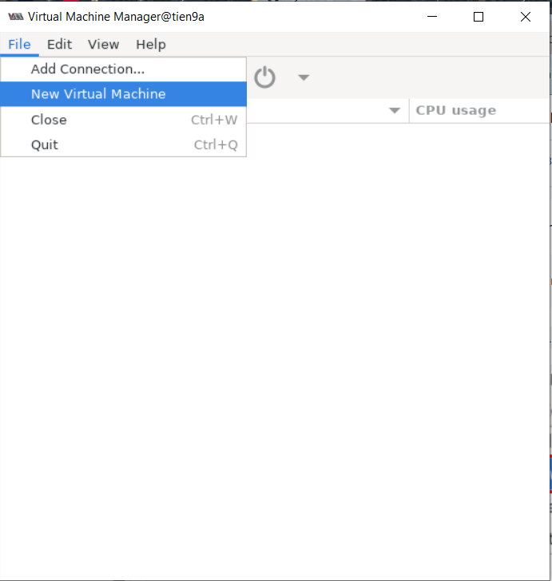
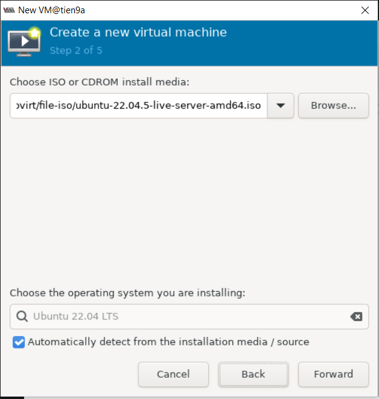
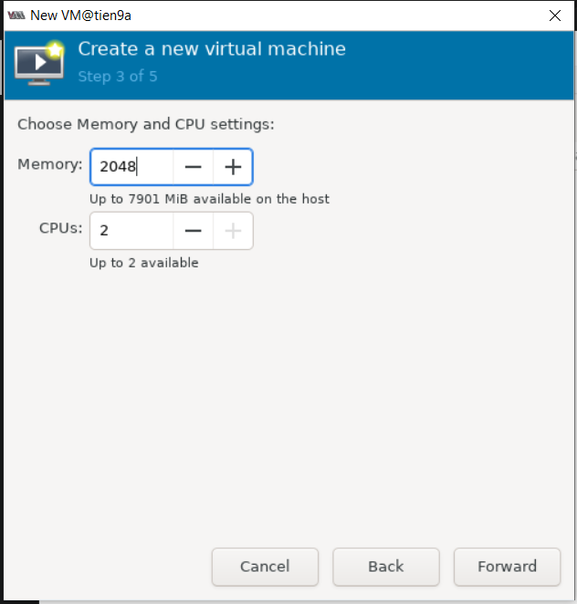
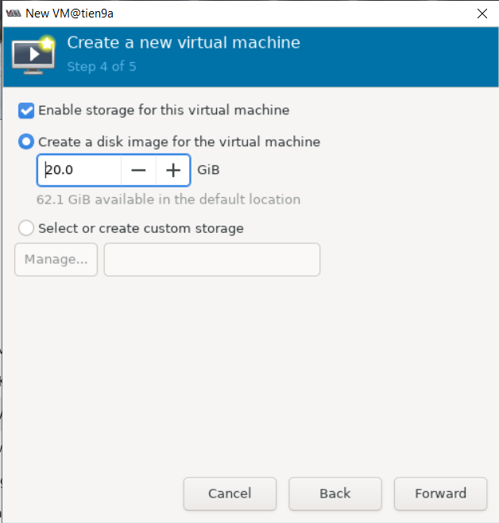
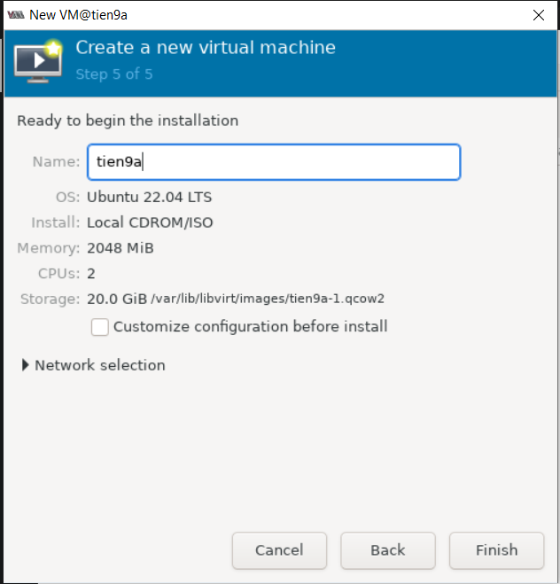
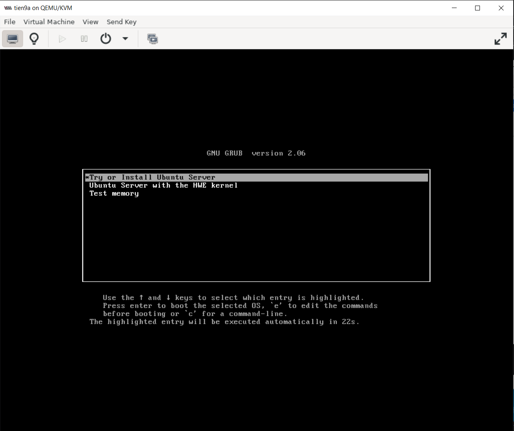

# TẠO MÁY ẢO BẰNG VIRT-MANAGER

Ta chuẩn bị sẵn file `.iso` Ubuntu 22.04

```bash
# Tải file iso
wget -c https://releases.ubuntu.com/22.04/ubuntu-22.04.5-live-server-amd64.iso

# Tạo file-iso
cd /var/lib/libvirt
mkdir file-iso

# Chuyển file vào trong file iso
cd ~
sudo mv ubuntu-22.04.5-live-server-amd64.iso /var/lib/libvirt/file.iso
```

Vào **virt-manager** để cấu hình VM:

```bash
virt-manager
```

Chọn file -> `New Virtual Machine`:



Chọn browser để chỉ ra vị trí lưu file `.iso` -> `Forward`:



Chọn dung lượng **RAM** và số số **Core** cho **VM** -> `Forward`:



Chọn dung lượng ổ cứng cho máy ảo -> `Forward`:



Chọn finish để tải máy ảo:





=> Ta sẽ thấy màn hình boot của **VM**
