# CREATE NETWORK CARD MODE IN KVM

Sau đây là các bước cấu hình mạng chế độ **Host-Only**, **NAT** trên **KVM** và các chế độ khác làm tương tự.

## I. STEP TO CONFIG AND CREATE HOST-ONLY(ISOLATED) NETWORK CARD MODE IN QEMU/KVM

Mặc định khi cài xong **KVM**, ta sẽ có một mạng ảo **NAT** mang tên `default`. Check mạng hiện có bằng lệnh sau:

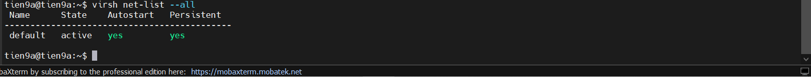

Ta có thể add một mạng ảo với mô hình **NAT** khác. Chạy lệnh

```bash
virt-manager
```

Nhấp VM -> Chọn `Edit` -> `Connection Details`. Chọn tab `Virtual Network`, ta thấy danh sách các mạng ở bên trái. Để thêm mạng, ta click biểu tượng `+` :

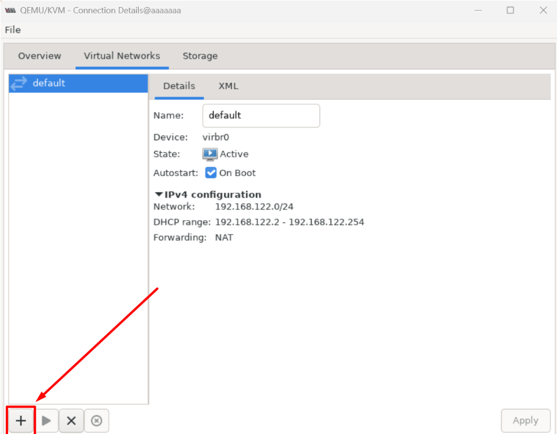

- Nhập tên cho mạng mới `Dilms`
- Chọn dải mạng định tạo. Sau đó, chọn dải cấp cho máy ảo, hoặc có thể - chọn đặt IP tĩnh
- Mode ta chọn `Isolated` (`Host-Only`)
- Ở đây chúng ta không dùng IP tĩnh
- Chọn Mô hình mạng theo các mô hình dưới đây và cấu hình như sau:

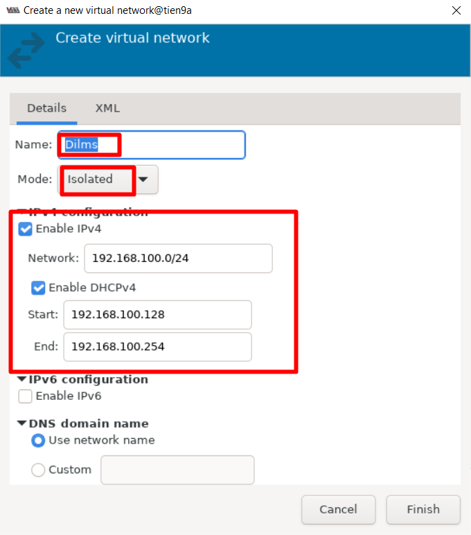

Sau khi tạo thành công, ta sẽ thấy mạng ở trên giao diện Network của Virt-manager

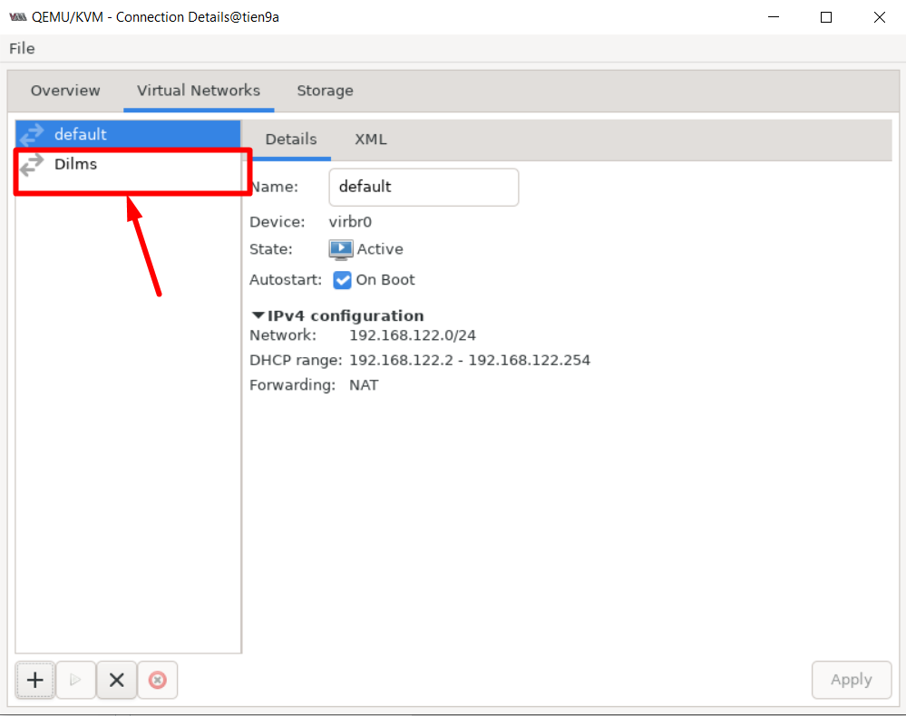

**Trên VM** : Ta vào phần thiết lập thông số Card mạng:

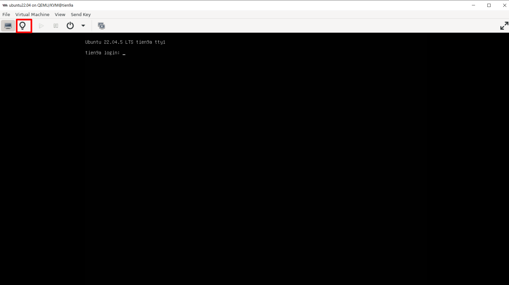

Rồi chọn mạng mode **isolated** tên `Dilms` vừa tạo => Apply

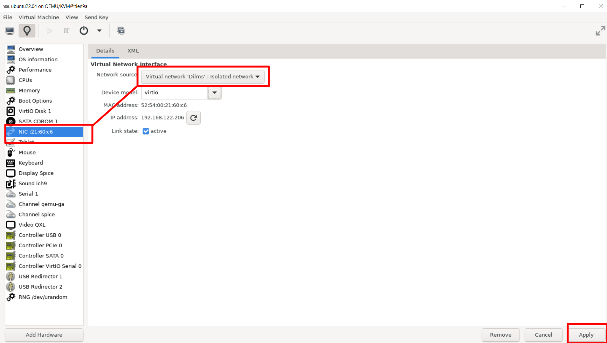

Cuối cùng ta reboot lại **VM** để ăn config và check **IP**:

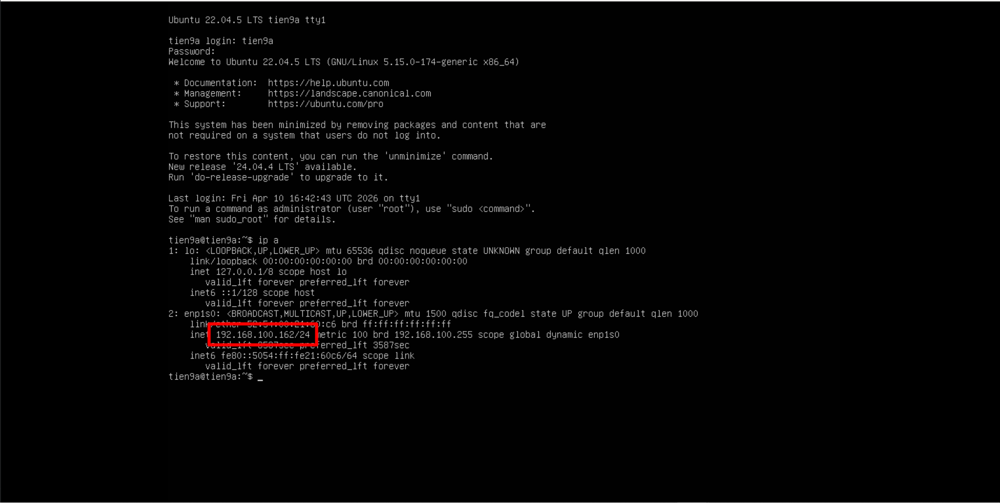

=> Nếu nhận đúng dải ta đã cấu hình là `OKE`

## II. STEP TO CONFIG AND CREATE NAT NETWORK CARD MODE IN KVM HOST

### 1. Kiểm tra mạng hiện có

```bash
virsh net-list --all
```


### 2. Tạo một mạng `NAT`

Tạo file xml: `sudo nano lab.xml`, ở đây là `lab.xml` với nội dung:

```bash
<network>
  <name>lab</name>
  <bridge name='virbr100' stp='on' delay='0'/>
  <domain name='lab.local'/>
  <ip address='192.168.100.1' netmask='255.255.255.0'>
    <dhcp>
      <range start='192.168.100.50' end='192.168.100.200'/>
    </dhcp>
  </ip>
</network>
```

Trong đó:

- `name`: tên network đặt.
- `bridge name`: interface ảo mà libvirt tạo( ở đây là `virbr100`).
- `ip`: IP của bridge trên máy Ubuntu (host). Máy ảo sẽ nhận IP trong subnet này.
- `stp`: ON để tránh loop

Vậy Network này sẽ tạo:

```bash
VM network: 192.168.100.0/24
Gateway:    192.168.100.1
DHCP range: 192.168.100.50-200
Bridge:virbr100
```

### 2.1 Tạo một mạng `NAT`

Thêm dòng forward:

```bash
  <name>lab-net</name>
  <forward mode='nat'/>
  <bridge name='virbr100' stp='on' delay='0'/>
  <domain name='lab.local1'/>

  <ip address='192.168.100.1' netmask='255.255.255.0'>
    <dhcp>
      <range start='192.168.100.50' end='192.168.100.200'/>
    </dhcp>
  </ip>
</network>
```

### 2.2 Tạo một mạng `Host-Only`

```bash
<network>
  <name>lab-net</name>
  <bridge name='virbr100' stp='on' delay='0'/>
  <domain name='lab.local1'/>
  
  <ip address="192.168.125.1" netmask="255.255.255.0">
    <dhcp>
      <range start="192.168.125.128" end="192.168.125.254"/>
    </dhcp>
  </ip>
</network>
```

=> Không thêm thẻ `<forward>` thì mặc định mạng đó KVM sẽ để isolated network

### 2.3 Tạo một mạng `bridge`

Chú ý trước khi tạo 1 mạng ảo chế độ `bridge` thì ta phải tạo 1 switch ảo chế độ bridge trước (Ví dụ: Ở đây ta sẽ tạo 1 switch ảo có tên `br0`) rồi sau đó ta mới add thêm cái bridge `br0` đó vào cấu hình file `.xml` và cho **VM** nhận cấu hình thì mới nhận cấu hình mạng **Bridge**.

Trước hết tạo một cái switch ảo mặc định tên `br0`:

```bash
sudo ip link add name br0 type bridge
```

Sau đó, khai báo con switch `br0` vào file `.xml` để libvirt hiểu đó là con switch để dùng cấu hình cho mạng **Bridge**

```bash
<network>
  <name>lab-net</name>
  <forward mode='bridge'/>
  <bridge name='br0'/>
</network>
```

**Lưu ý**: Khi chúng ta sử dụng thẻ `<forward mode='bridge'/>`, libvirt sẽ trao toàn bộ quyền quản lí **IP** và **DHCP** cho cái `Br0` mà ta vừa tạo lên ta không thể cấu hình **IP** và **DHCP** vào file `.xml` được mà thay vào đó ta phải dùng các công cụ trực tiếp như `nmcli`, `iproute2(iplink)` or `brctl` để cấu hình trực tiếp `br0` đó.

Ngoài ra trên máy VMW cài Host KVM phải có quyền **DHCP**:

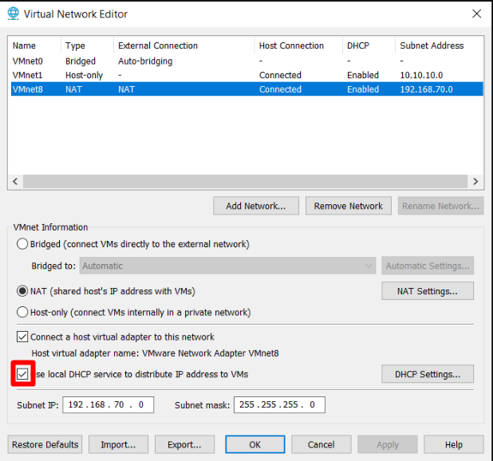

### 3.Định nghĩa và bật mạng

```bash
virsh net-define isolated.xml
virsh net-autostart lab-net  # viết theo tên mạng (Thẻ <name> trong file xml)
virsh net-start lab-net      # viết theo tên mạng (Thẻ <name> trong file xml)
```

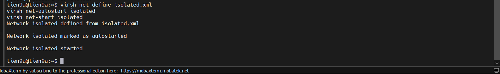

### 4.Gán máy ảo `tien9a` sang mạng vừa tạo

Vào file cấu hình máy ảo:

```bash
virsh edit tien9a
```

Trong phần , sửa từ:

```bash
<interface type='network'>
  <source network='default'/>
```

Sửa thành:

```bash
<interface type='network'>
  <source network='isolated'/>   # Tuỳ theo xml bạn đặt
```

### 5. Detach NIC cũ (default)

Check MAC interface:

```bash
virsh domiflist tien9a
```

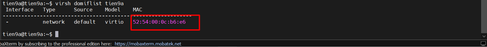

=> Ta cần địa chỉ **MAC** để gỡ **NIC** mình cần gỡ ra.

Gỡ Interface cũ:

```bash
virsh detach-interface --domain tien9a --type network --mac 52:54:00:0c:b6:e6 --persistent   # Tuỳ theo MAC vè tên VM
```

### 6. Attach NIC mới (Isolated)

```bash
virsh attach-interface --domain tien9a --type network --source isolated --model virtio --persistent # Tuỳ theo tên source file xml(Thẻ tên mạng) và tên VM
```

Trong đó:

- `virsh attach-interface`: Lệnh gắn interface vô máy ảo
- `domain`: chỉ định tên máy ảo
- `type`: xác định là nguồn mạng ảo cố định có sẵn trong KVM/Libvirt
- `source`: xác định tên mạng bạn muốn gắn vào
- `model`: Chỉ định driver cho card mạng là `virtio`(tốt nhất trong KVM)
- `persistent`: đảm bảo thay đổi này sẽ được lưu lại vĩnh viễn vào file cấu hình **XML**(Kể cả khi reboot cũng không mất card)

### 7. Kiểm tra lại

```bash
virsh domiflist tien9a
```

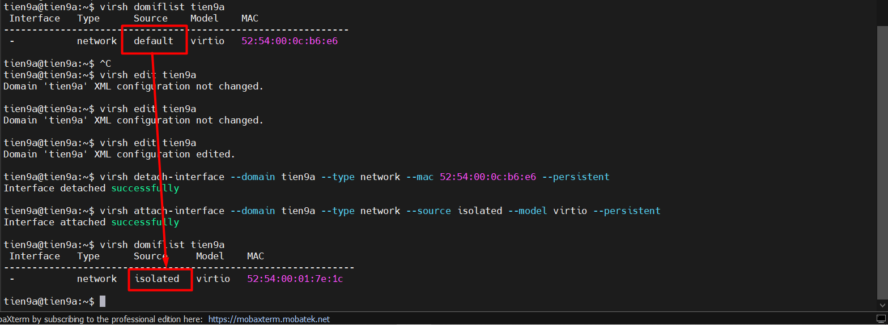

### 8. Khởi động lại VM

```bash
virsh reboot tien9a
```

=> Các **networkmode khác** cũng làm tương tự chỉ thay chữ **isolated** thành chế độ bạn mong muốn.

### 9. Lưu ý quan trọng đối với chế độ Bridge

Sau khi cấu hình xong chế độ Bridge thì ta dùng lệnh `ip a` để check xem VM sẽ nhận card mạng của Host KVM chưa ? (bằng cách check địa chỉ `MAC` interface máy ảo với interface của Host KVM)

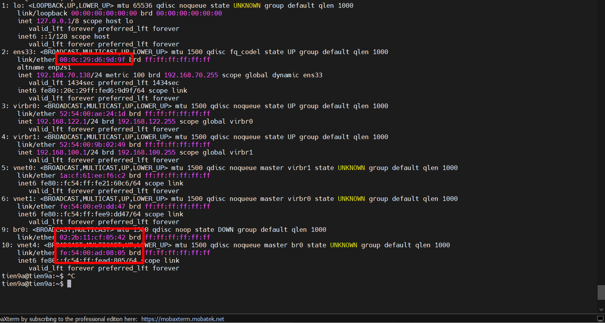

=> Như ta có thể thấy interface của VM trong Host KVM chưa thông ra mạng bên ngoài là mạng NAT của VMW.

**Lí do**: chúng ta chưa kết nối interface `ens33` vào switch ảo `br0` cho lên nó chưa kế thừa `MAC` của `ens33`

**Cách khắc phục**: Để cả ngay khi ta reset con KVM Host thì `br0` cũng không mất IP của interface `ens33` thì ta cấu hình trong `netplan` hoặc nếu chỉ muốn cấu hình tạm thời thì ta chỉ cần sử dụng các công cụ như `ip link`, `brctl`:

- `Bước 1`: Đảm bảo VM ở hạ tầng vật lí VMW được **settings** mạng như sau:(Bằng cách run **VM** trên **VMW** với quyền `"Run as administrator"`)

  - **Promiscuous mode**: `Accept` (Cho phép card mạng nghe lén mọi gói tin).
  - **MAC address changes**: `Accept` (Cho phép đổi MAC).
  - **Forged transmits**: `Accept` (Cho phép gửi gói tin với MAC giả - chính là MAC của máy ảo KVM).

=> Chạy `"Run as administrator"` VMW là **Được**

- `Bước 2`: Cấu hình để xoá IP ở interface `ens33` và chuyển sang `br0` nắm giữ. Ta dùng câu lệnh:

```bash
## Tạo một bridge ảo tên là br0 (Bước này đã làm ở trên rồi)
sudo ip link add name br0 type bridge

# Cắm card mạng ens33 vào br0
sudo ip link set ens33 master br0

# Bật br0 lên
sudo ip link set br0 up

# Xoá IP cũ trên ens33 và Gán IP cũ  lại cho br0
sudo ip addr del 192.168.70.138/24 dev ens33
sudo ip addr add 192.168.70.138/24 dev br0

# Thiết lập lại default gateway (nhớ check gateway trên VMW đuôi gì)
sudo ip route add default via 192.168.70.2 dev br0

# Thiết lập DNSServer (nếu vẫn chưa ra mạng được)
sudo resolvectl dns br0 8.8.8.8 1.1.1.1

# Thiết lập MAC cũ của ens33 thành MAC mới của br0
sudo ip link set dev br0 address 00:0c:29:d6:9d:9f

# Bật tắt br0 để nó reset config
sudo ip link set br0 down
sudo ip link set br0 up

# Check
resolvectl status br0
ip a
ip r
brctl-show

# Tất cả những cách trên ta có thể dùng tool net-tools cho gọn và cũng bỏ qua bước tạo file .xml(Chỉ cần add br0 vào VM trong phần cấu hình mạng)
sudo apt net-tools
sudo brctl addbr br0
sudo brctl addif br0 ens33
sudo ifconfig ens33 0
sudo ip addr add 192.168.70.138/24 dev testbr
sudo ip link set ens33 up
sudo ip route add default via 192.168.70.2
```

=> Lúc này ta thấy **Linux Bridge** (`Br0`) đã nhận địa chỉ **MAC** và **IP** của giao diện cũ (`ens33`). Ta có thể hiểu `br0` đã đảm nhiệm vai trò thay giao diện mạng `ens33` ở **VM** ngoài trên **VMW**.

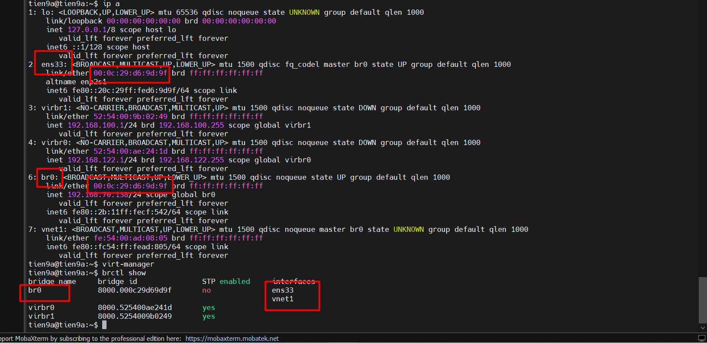

-> Sơ đồ ta có thể hình dung như sau:

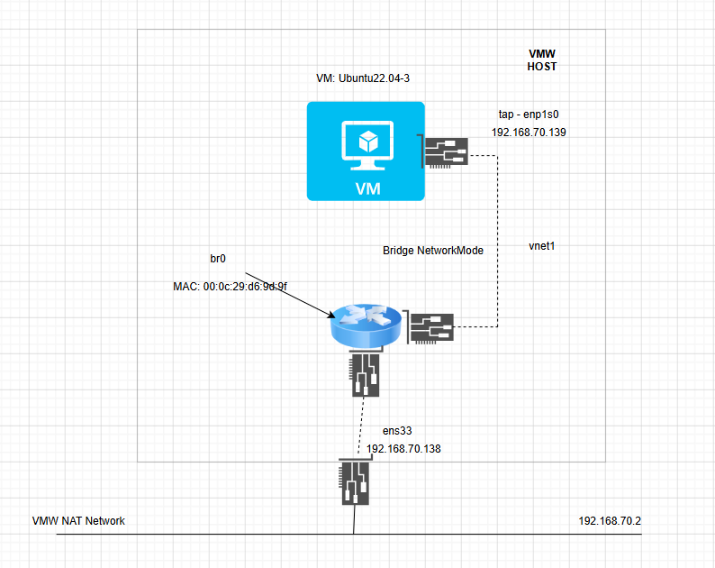

- `Bước 3`: Check xem VM ping được ra mạng ngoài qua dải VMW network NAT chưa ! và có tồn tại giao diện `tap enp1s0` không:


- `Bước 4`: Để có thể giữ cấu hình ngay cả khi reboot máy ảo thì ta lên cấu hình vào file `/etc/netplan` cho con KVM Host:

```bash
# Tạo file cấu hình để disable tính năng network của cloud-init
sudo echo "network: {config: disabled}" | sudo tee /etc/cloud/cloud.cfg.d/99-disable-network-config.cfg

# Đổi file tên file netplan sang 1 tên "chính chủ"(vd:60-bridge.yaml)
sudo mv /etc/netplan/50-cloud-init.yaml /etc/netplan/60-bridge.yaml

# Mở file netplan mới
sudo nano /etc/netplan/60-bridge.yaml

# Chèn or sửa cấu hình như sau
network:
  version: 2
  renderer: networkd
  ethernets:
    ens33:
      dhcp4: no
      # Tắt toàn bộ IP trên ens33 để nhường cho br0
  bridges:
    br0:
      interfaces: [ens33]
      dhcp4: no
      addresses:
        - 192.168.70.138/24
      routes:
        - to: default
          via: 192.168.70.2
      nameservers:
        addresses: [8.8.8.8, 1.1.1.1]
      parameters:
        stp: true
        forward-delay: 0
      # Ép br0 nhận MAC cũ của ens33 để VMware không "block"
      macaddress: 00:0c:29:d6:9d:9f

# Thử cấu hình
sudo netplan try

# Reboot lại máy ảo KVM Host
sudo reboot
```
