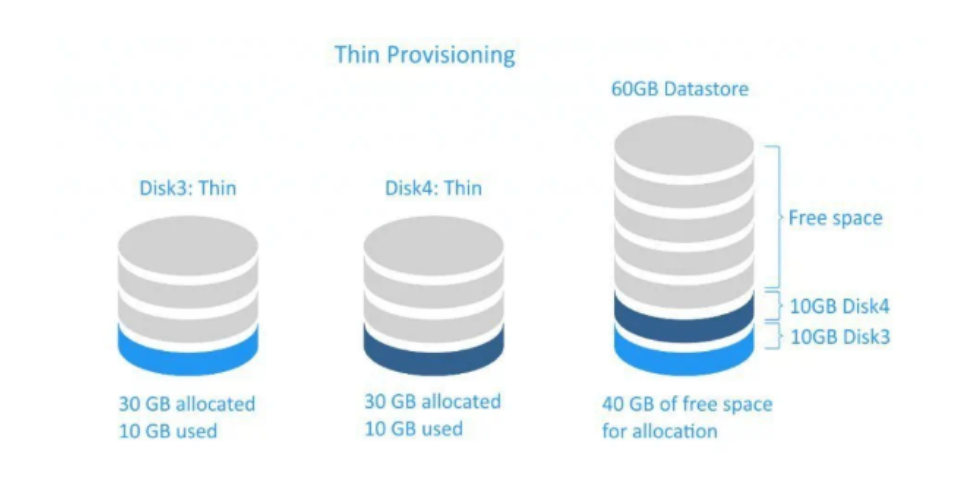
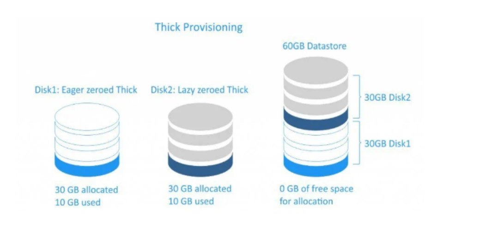

# CƠ CHẾ LƯU THIN & THICK STORAGE

## I. THIN PROVISIONING

### 1. Định nghĩa

**Thin provisionning** (**cấp phát động**) là một công nghệ quản lý lưu trữ cực kỳ phổ biến trong ảo hóa và hệ thống lưu trữ hiện đại (như LVM, SAN, hay Cloud). Thay vì chiếm dụng ngay lập tức toàn bộ dung lượng được yêu cầu, nó chỉ lấy đúng phần dung lượng thực tế đang có dữ liệu.

Dưới đây là chi tiết về cơ chế, ưu nhược điểm và cách nó vận hành:

### 2. Cơ chế hoạt động

Trong lưu trữ truyền thống (**Thick Provisioning**), nếu bạn tạo một ổ đĩa `100GB`, hệ thống sẽ cắt đúng `100GB` từ ổ cứng vật lý và để dành riêng cho ổ đĩa đó, ngay cả khi bạn chưa lưu file nào.

Với **Thin Provisioning**:

- **Ảo hóa dung lượng**: Khi bạn tạo ổ đĩa `100GB`, hệ điều hành chỉ nhìn thấy con số `100GB` "ảo". Thực tế, **dung lượng vật lý bị chiếm dụng ban đầu gần như bằng** `0`.

- **Cấp phát theo nhu cầu (Just-in-time)**: Khi bạn bắt đầu chép `10GB` dữ liệu vào, hệ thống lúc này mới tìm trên ổ đĩa vật lý `10GB` trống để ghi vào.

- **Pool lưu trữ chung**: Nhiều **ổ đĩa ảo** (**VM, Container**) sẽ cùng **dùng chung** một "bể" **dung lượng vật lý** (**Storage Pool**).

### 3. ĐẶc điểm

#### 3.1 Ưu điểm

- **Tối ưu hóa chi phí (ROI)**: Bạn không cần mua quá nhiều ổ cứng ngay từ đầu. Bạn có thể hứa cấp cho người dùng `10TB` trong khi thực tế chỉ có `2TB` vật lý, miễn là họ chưa xài hết ngay.

- **Linh hoạt cao**: Dễ dàng mở rộng dung lượng ảo mà không cần quan tâm đến việc định dạng lại phân vùng vật lý ngay lập tức.

- **Giảm lãng phí**: Tránh tình trạng **"dung lượng chết"** khi người dùng yêu cầu ổ đĩa lớn nhưng chỉ sử dụng một phần nhỏ.

#### 3.2 Nhược điểm và rủi ro pháp lí

**Nguy cơ tràn đĩa (Out of Space)**: Đây là rủi ro lớn nhất. Nếu **tổng dữ liệu thực tế của tất cả các ổ ảo vượt quá dung lượng vật lý hiện có**, **toàn bộ hệ thống** sẽ bị **treo** hoặc **lỗi ghi** (**IO Error**).

- **Phân mảnh dữ liệu**: Vì dữ liệu **được ghi rải rác** theo **từng đợt cấp phát nhỏ**, nó có thể **gây phân mảnh** trên **bề mặt đĩa vật lý** **cao hơn** so **với Thick Provisioning**.

- **Hiệu năng (Performance Overhead)**: Hệ thống phải tốn thêm tài nguyên **CPU/RAM** để **quản lý bảng ánh sơ đồ** (**mapping**) **giữa địa chỉ ảo** và **địa chỉ vật lý** mỗi khi có dữ liệu mới được ghi.

### 4. Các thuật ngữ trong Thin Provisioning

| Thuật ngữ                 | Ý nghĩa |
|---------------------------|---------|
| Over-provisioning         | Hành động cấp phát tổng dung lượng ảo lớn hơn dung lượng vật lý thực tế có (ví dụ: có 1TB nhưng cấp cho 5 VM mỗi con 500GB). |
| Storage Pool              | Nhóm các ổ đĩa vật lý lại thành một khối chung để **Thin Provisioning** rút dung lượng từ đó. |
| Threshold / Alert         | Các ngưỡng cảnh báo (thường là `80%` hoặc `90%`) để quản trị viên biết khi nào cần lắp thêm ổ cứng vật lý. |
| Zero Reclaim / UNMAP      | Cơ chế thu hồi dung lượng. Khi bạn xóa file trong ổ ảo, hệ thống gửi lệnh (`TRIM`/`UNMAP`) để báo cho tầng vật lý giải phóng không gian đó. |

### 5. Ứng dụng thực tế

- **Trong LVM (Linux)**: Sử dụng `thin-pool`. Bạn tạo một cái pool lớn, sau đó tạo các `thin volume` bên trong.

- **Trong ảo hóa (KVM, VMware, Proxmox)**: Các file định dạng như `.qcow2` bản chất là **Thin provisioning** (file sẽ phình to dần khi có dữ liệu), ngược lại với định dạng `.raw` thường là **Thick provisioning**.

- **Trong Cloud (AWS, Google Cloud)**: Các ổ đĩa `EBS` hay `Block Storage` hầu hết đều dùng cơ chế này để tối ưu hạ tầng của họ.

### 6. Lời khuyên

Nếu bạn đang **quản trị hệ thống dùng Thin Provisioning**, việc **thiết lập Monitoring (giám sát) là bắt buộc**. Bạn không bao giờ được phép để **Storage Pool** vật lý đầy `100%`, vì hậu quả thường là sập toàn bộ các máy ảo đang chạy trên đó.

## II. THICK PROVISIONING

### 1. Khái niệm

**Thick Provisioning (cấp phát dày)** chính là kiểu "cấp phát ngay tức thì". Đây là phương pháp truyền thống và an toàn nhất trong quản trị lưu trữ. Dưới đây là chi tiết về cơ chế, ưu nhược điểm và cách nó vận hành:

### 2. Cơ chế H/Động

Khi bạn khởi tạo một ổ đĩa (**Virtual Disk**) bằng **Thick Provisioning** với dung lượng `100GB`:

- **Chiếm dụng ngay lập tức**: Hệ thống sẽ **cắt đúng** `100GB` từ **không gian lưu trữ vật lý** và **gán riêng cho ổ đĩa đó**.

-**Không chia sẻ**: **Dù bạn chưa lưu một byte dữ liệu nào**, `100GB` đó cũng **không thể được sử dụng bởi bất kỳ máy ảo (VM)** hay **ứng dụng nào khác**.

- **Định danh rõ ràng**: Trên bề mặt đĩa vật lý, các **khối dữ liệu** (**blocks**) được **đánh dấu** là **"đã sử dụng"** đối với **hệ thống quản lý tổng**.

### 3. Phân loại Thick Provisioning

Trong các môi trường ảo hóa chuyên nghiệp (như `VMware`), **Thick Provisioning** thường chia làm 2 loại nhỏ:

#### 3.1 Lazy Zeroed (Lười xóa):

- Hệ thống chiếm dụng không gian nhưng **không xóa** dữ liệu cũ còn sót lại trên đĩa vật lý.

- **Dữ liệu cũ** **chỉ được ghi đè** (`zero out`) khi bạn bắt đầu **ghi dữ liệu mới** vào **từng block** đó.

- **Ưu điểm**: Tạo ổ đĩa rất nhanh.

- **Nhược điểm**: Hiệu năng ghi lần đầu hơi chậm vì phải tốn công xóa dữ liệu cũ trước khi ghi mới.

#### 3.2 Eager Zeroed (Xóa ngay):

- Hệ thống chiếm dụng không gian và xóa sạch (ghi số `0`) **toàn bộ** `100GB` ngay **lúc khởi tạo**.

- **Ưu điểm**: Hiệu năng tốt nhất và ổn định nhất. **An toàn bảo mật** vì dữ liệu cũ bị xóa sạch hoàn toàn. hỗ trợ các tính năng cao cấp như **Fault Tolerance**.

- **Nhược điểm**: **Mất nhiều thời gian** để tạo ổ đĩa (ổ càng lớn càng lâu).

### 4. Đặc điểm

#### 4.1 Ưu điểm

- **Hiệu năng ổn định (Deterministic Performance)**: **Không tốn tài nguyên CPU để tính toán cấp phát** `"on-the-fly"` như **Thin Provisioning**. Độ trễ (**latency**) **thấp hơn**.

- **An toàn tuyệt đối**: Bạn **không** bao giờ phải **lo** lắng về việc **hệ thống bị sập do** **"tràn đĩa"** (out of space) vì dung lượng đã được đảm bảo ngay từ đầu.

- **Giảm phân mảnh**: Do các block thường được cấp phát liên tục trên đĩa vật lý, việc truy xuất dữ liệu diễn ra mượt mà hơn.

#### 4.2 Nhược điểm

- **Lãng phí tài nguyên**: Đây là nhược điểm lớn nhất. Nếu bạn cấp `1TB` nhưng người dùng chỉ xài `10GB`, thì `990GB` còn lại bị bỏ hoang mà không ai khác dùng được.

- **Chi phí đầu tư cao**: Bạn phải mua đủ số ổ cứng vật lý tương ứng với tổng dung lượng đã cấp phát cho các máy ảo.

- **Kém linh hoạt**: Khó thu hẹp dung lượng ổ đĩa sau khi đã cấp phát theo kiểu Thick.

### 5. Bảng so sánh nhanh

| Đặc điểm           | Thick Provisioning                                      | Thin Provisioning                                      |
|--------------------|---------------------------------------------------------|--------------------------------------------------------|
| Dung lượng vật lý  | Bị chiếm dụng ngay 100%                                 | Chỉ chiếm theo lượng dữ liệu thực tế                   |
| Hiệu năng ghi      | Cao và ổn định                                          | Thấp hơn (do độ trễ cấp phát)                          |
| Rủi ro hệ thống    | Thấp (không lo hết đĩa đột ngột)                        | Cao (dễ sập nếu không giám sát tốt)                    |
| Tốc độ khởi tạo    | Chậm (đặc biệt là Eager Zeroed)                         | Cực nhanh                                              |
| Chi phí            | Đắt (mua nhiều phần cứng)                               | Rẻ (tận dụng tối đa phần cứng)                         |

### 6. Ứng dụng thực tiễn

- **Cơ sở dữ liệu (Database)**: Các hệ quản trị như SQL Server, Oracle cần hiệu năng I/O cực cao và ổn định.

- **Hệ thống tải cao (High Load)**: Những ứng dụng có tần suất ghi đĩa liên tục.

- **Môi trường yêu cầu độ sẵn sàng cao (High Availability)**: Để tránh rủi ro treo máy do hết dung lượng vật lý bất ngờ.

- **Ổ đĩa ảo làm Swap/Pagefile**: Nơi cần tốc độ truy xuất cực nhanh để hỗ trợ RAM.
