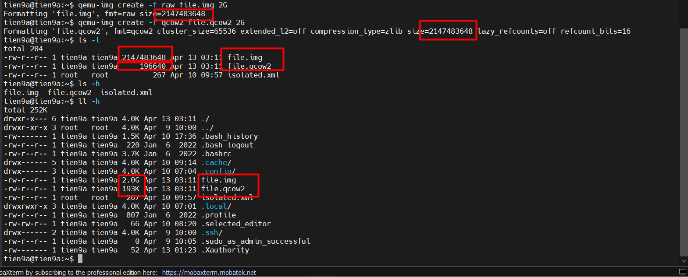
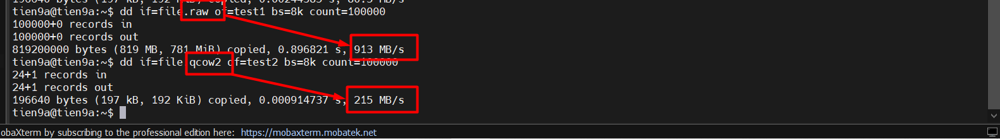
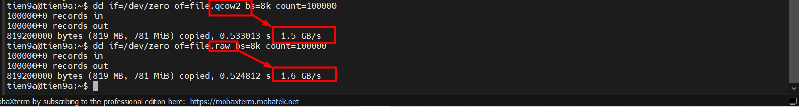
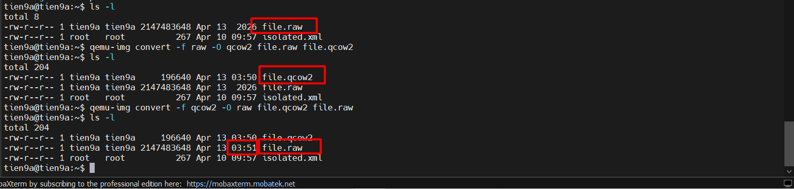

# TEST PERFORMANCE RAW AND QCOW2

## I. CHECK DUNG LƯỢNG

Để kiểm tra dung lượng của 2 định dạng này, ta sẽ dùng lệnh `qemu-img` để tạo ra một file có định dạng `raw` và một file có định dạng `qcow2`, cả 2 file nàu đều có dung lượng là `2G`.

**File** `RAW`:

```bash
qemu-img create -f raw file.raw 2G
```

**File** `QCOW2`:

```bash
qemu-img create -f qcow2 file.qcow2 2G
```



## II. CHECK HIỆU NĂNG

Để test hiệu năng giữa 2 định dạng này, sử dụng lệnh `dd` để **đọc** và **ghi dữ liệu** từ các file trên.

### 1. Đọc dữ liệu (`raw` > `qcow2`)

Lệnh:

```bash
dd if=file.raw of=test1 bs=8k count=100000
dd if=file.qcow2 of=test2 bs=8k count=100000
```

Trong đó:

- `dd`: dùng để sao chép dữ liệu ở cấp độ thấp giữa file hoặc thiết bị
- `if=file.raw` → input file là file `.raw` (tương tự `.qcow2`)
- `of=test1` → output file là `test1`
- `bs=8k` → block size là `8 kilobyte` (1 block = 8192 byte)
- `count=100000` → sao chép 100000 block

=>  Tổng dung lượng sao chép `8KB * 100000` = `800MB` -> đang đọc `800MB` từ `file.raw` và ghi vào `test1`, với block size `8KB`.



### 2. Ghi dữ liệu (`raw` > `qcow2`)

```bash
dd if=/dev/zero of=file.raw bs=8k count=100000
dd if=/dev/zero of=file.qcow2 bs=8k count=100000
```



## III. TẠO SNAPSHOT

Chỉ có `qcow2` hỗ trợ tạo snapshot.

## IV. CHUYỂN ĐỔI GIỮA `raw` VÀ `qcow2` (NGƯỢC LẠI)

### 1. Chuyển từ `raw` sang `qcow2`

```bash
qemu-img convert -f raw -O qcow2 file.raw file.qcow2
```

### 2. Chuyển từ `qcow2` sang `raw`

```bash
qemu-img convert -f qcow2 -O raw file.qcow2 file.raw
```



### 3. Lưu ý

- Máy ảo phải tắt (shutdown) trước khi convert để tránh lỗi dữ liệu.
- Cần đảm bảo đủ dung lượng ổ đĩa khi chuyển sang `RAW` (vì RAW = full size).
- `QCOW2` có snapshot → khi convert sang `RAW` sẽ mất snapshot.

## V. CÁC LỆNH PHỔ BIẾN THÔNG DỤNG

### 1. Đối với file `.raw`

Hiển thị thông tin file disk:

```bash
qemu-img info disk.raw
```

Gắn file `.raw` vào hệ thống để xem dữ liệu:

```bash
losetup -fP disk.raw
mount /dev/loop0p1 /mnt/data
```

### 2. Đối với file `.qcow2`

Tạo snapshot:

```bash
qemu-img snapshot -c point_in_time_1 disk.qcow2
```

Kiểm tra thông tin file:

```bash
qemu-img info disk.qcow2
```

Convert và tối ưu(nén Qcow2):

```bash
qemu-img convert -c -f raw -O qcow2 disk.raw disk.qcow2
```

Convert với tiến trình hiển thị:

```bash
qemu-img convert -p -f qcow2 -O raw disk.qcow2 disk.raw
```
