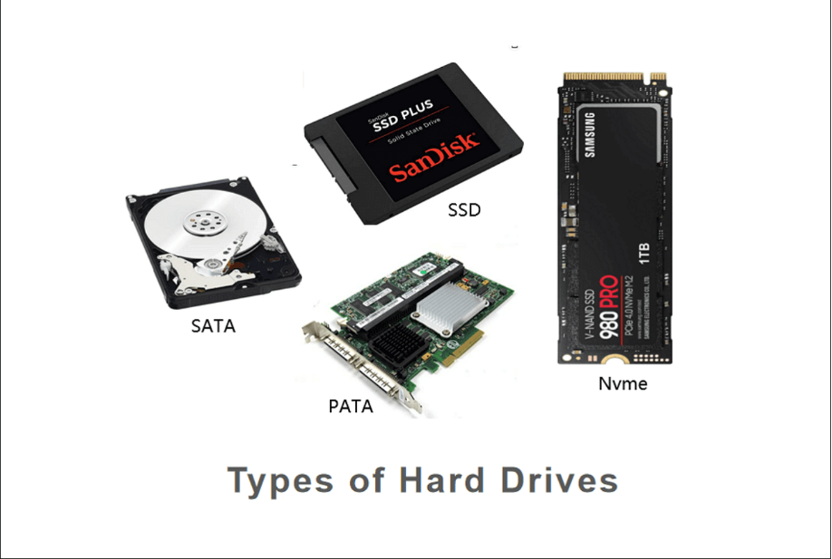
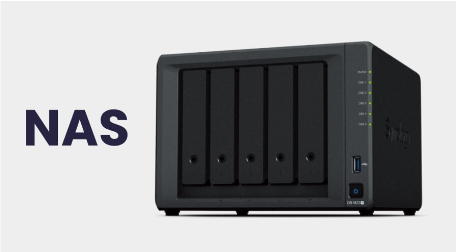
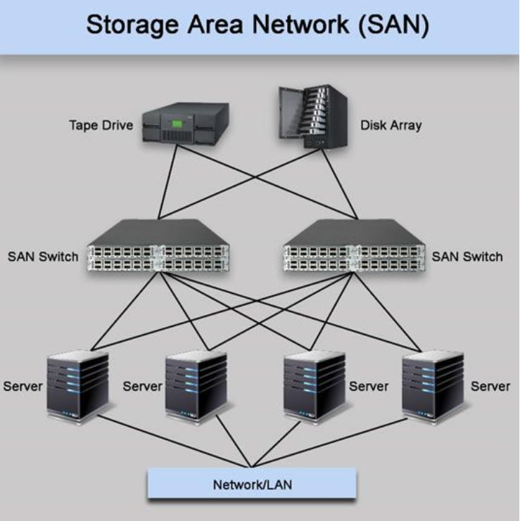
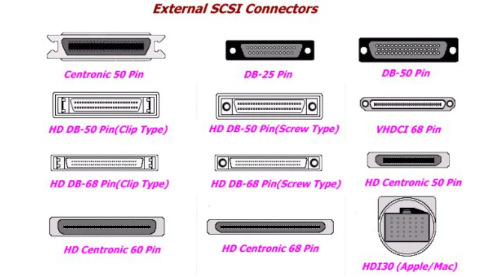
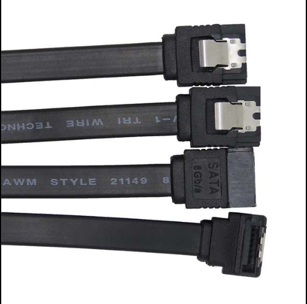
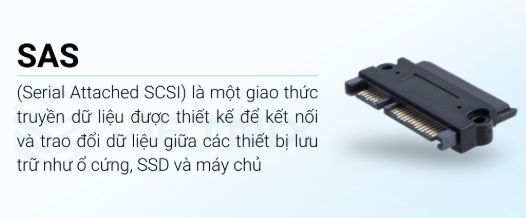
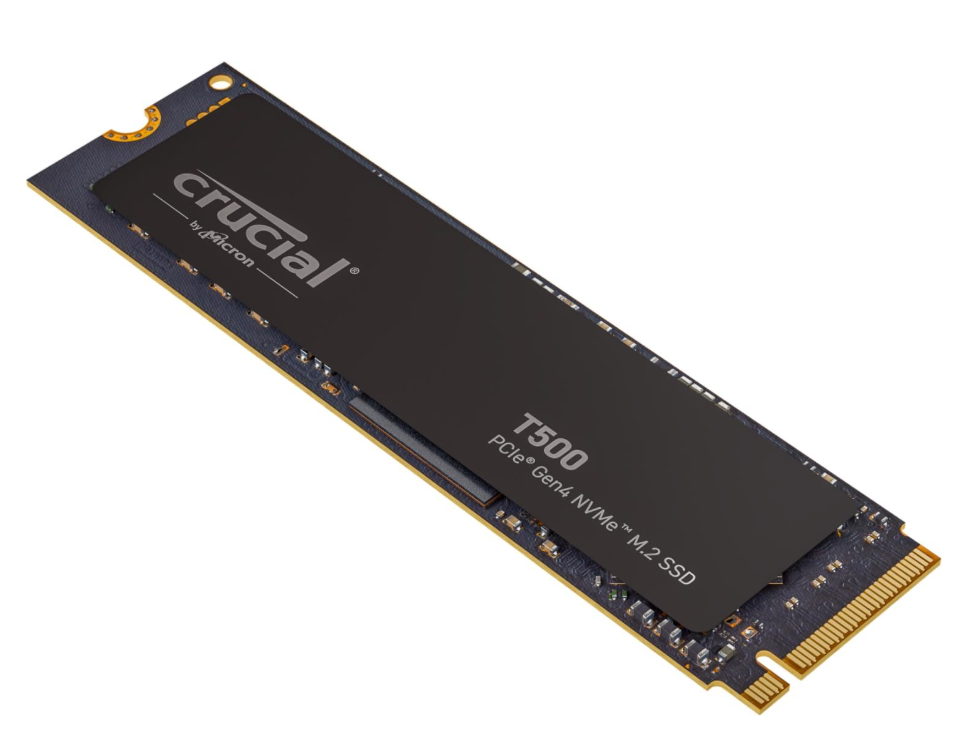

# OVERVIEW ABOUT TYPE DISK IN SYSTEM DESIGN

## I. PHÂN LOẠI THEO CÔNG NGHỆ PHYSICAL DISK

Đây là lớp vật lý mà bạn có thể cầm nắm được, quyết định tốc độ đọc/ghi (I/O) của hệ thống. Chúng gồm các công nghệ sau:

- **HDD** (Hard Disk Drive): Sử dụng đĩa từ quay. Ưu điểm là dung lượng lớn, giá rẻ nhưng tốc độ chậm và dễ hư hỏng do va chạm vật lý.
- **SSD** (Solid State Drive): Sử dụng chip nhớ Flash. Tốc độ vượt trội, không tiếng ồn.

  - **SATA SSD**: Giới hạn băng thông khoảng `6Gbps`.
  - **NVMe** (Non-Volatile Memory express): Kết nối qua cổng PCIe, cho tốc độ cực nhanh, là tiêu chuẩn cho các hệ thống Server hiện đại
  
**SAS** (Serial Attached SCSI): Thường dùng trong doanh nghiệp/Server, độ bền cao và khả năng hoạt động liên tục 24/7 tốt hơn ổ cứng tiêu dùng.

## II. PHÂN LOẠI THEO PHƯƠNG THỨC KẾT NỐI (STRORAGE INTERFACE)

Cách hệ thống "nhìn" thấy đĩa từ bên ngoài hoặc qua mạng:

- **DAS** (Direct Attached Storage): Đĩa gắn trực tiếp vào mainboard (như ổ cứng laptop, USB).

**NAS** (Network Attached Storage): Lưu trữ qua mạng cấp độ tệp tin (File-level). Ví dụ: Giao thức NFS, SMB/CIFS.

**SAN (Storage Area Network)**: Lưu trữ qua mạng cấp độ khối (Block-level). Hệ thống coi nó như một ổ đĩa vật lý gắn trực tiếp dù nó nằm ở một tủ đĩa từ xa. Ví dụ: iSCSI, Fibre Channel.

## III. Phân loại theo quản lí logic

**Local Storage Concepts** gồm:

- **Physical Volume** (**PV**): Ổ đĩa vật lý chưa chia tách.

- **Partition** (**Phân vùng**): Chia ổ đĩa thành các phần (Primary, Extended, Logical) bằng bảng băm **MBR** hoặc **GPT**.

- **LVM** (**Logical Volume Manager**): Cơ chế quản lý linh hoạt, cho phép gom nhiều ổ đĩa vật lý thành một cụm và tăng/giảm dung lượng phân vùng mà không cần định dạng lại.

**Cloud & Virtualization Storage** gồm:

- **Ephemeral Disk** (**Đĩa tạm thời**): Dữ liệu sẽ mất khi tắt hoặc xóa máy ảo (thường dùng cho Swap hoặc bộ nhớ đệm).

- **Persistent Disk** (Đĩa bền vững): Dữ liệu vẫn tồn tại ngay cả khi máy ảo bị xóa.

- **Block Storage**: Các khối đĩa có thể gắn (Attach) vào instance (như EBS của AWS hoặc Cinder trong OpenStack).

- **Object Storage**: Lưu trữ dưới dạng đối tượng (không phải cấu trúc cây thư mục truyền thống), phù hợp cho dữ liệu không cấu trúc. Ví dụ: S3, Ceph Object Gateway.

## IV. PHÂN lOẠI CƠ CHẾ DỰ PHÒNG

Hệ thống thường không dùng một đĩa đơn lẻ mà kết hợp chúng lại để tăng tốc độ hoặc an toàn dữ liệu:

**RAID 0 (Striping)**: Gộp đĩa để tăng tốc, không có dự phòng (hỏng 1 đĩa là mất hết).

**RAID 1 (Mirroring)**: Ghi đĩa này sao chép sang đĩa kia (dự phòng cao).

**RAID 5/6**: Kết hợp giữa tốc độ và an toàn bằng cách sử dụng các khối kiểm tra (Parity).

**RAID 10**: Kết hợp giữa **Mirroring** và **Striping**.

## V. DISK IN OS

**RAM Disk**: Sử dụng một phần RAM để làm ổ đĩa. Tốc độ cực nhanh nhưng mất dữ liệu khi mất điện.

**Swap Disk/Partition**: Sử dụng một phần ổ cứng để làm "RAM ảo" khi bộ nhớ RAM thật bị đầy.

**Virtual Disk** (`VHD`, `VMDK`, `QCOW2`): Các tệp tin giả lập ổ đĩa cứng dành cho máy ảo.

## VI. CÁC CHUẨN BUS INTERFACE

### 1. Bus interface là gì?

**Bus Interface** là sự kết hợp giữa phần cứng vật lý và giao thức logic để truyền tải dữ liệu giữa các thành phần trong hệ thống máy tính (Ở đây ta tìm hiểu về Disk thì **bus interface** là đường dẫn để ta kết nối máy ảo với Disk trên máy **local**)

### 2. Chuẩn cổ điển và phổ thông

#### IDE (Integrated Drive Electronics) / PATA

**Thời kỳ**: Thập niên 90 và đầu 2000.

**Đặc điểm**: Dùng cáp dẹt to bản. Tốc độ rất chậm (tối đa `133 MB/s`).

Trong ảo hóa: Khi ta tạo máy ảo (VM) mà chọn chuẩn IDE, nó sẽ giả lập một hệ thống cực kỳ cũ. Thường chỉ dùng khi cài các hệ điều hành "đồ cổ" như Windows XP hoặc Linux kernel đời đầu vì chúng không cần driver đặc biệt để nhận đĩa.

#### SCSI (Small Computer System Interface)

**Thời kỳ**: Song hành cùng IDE nhưng dành cho phân khúc `Server/Workstation`.

**Đặc điểm**: Hỗ trợ kết nối nhiều thiết bị trên cùng một dây (Daisy-chain). Thông minh hơn **IDE** vì nó có chip xử lý riêng, không bắt CPU phải làm việc quá nhiều.

**Trong ảo hóa**: Đây là chuẩn "quốc dân" cho VM. Hầu hết các hệ điều hành hiện đại (Windows Server, Linux) đều chạy tốt nhất khi giả lập đĩa chuẩn **SCSI** vì nó hỗ trợ xếp hàng lệnh (**Command Queuing**) tốt.

### 3. Các chuẩn hiện đại (Mainstream & Enterprise)

#### SATA

**SATA** (Serial ATA)
Tốc độ: SATA 3 đạt khoảng `6 Gbps` (thực tế tầm `550 MB/s`).

**Đặc điểm**: Thay thế IDE với cáp nhỏ gọn hơn, hỗ trợ Hot-swap (rút nóng). Sử dụng giao thức AHCI để giao tiếp.

**Thực tế**: Đây là chuẩn phổ biến nhất cho HDD và SSD 2.5 inch thông thường.

#### SAS (Serial Attached SCSI)

**Đặc điểm**: Là sự kết hợp giữa sự bền bỉ của `SCSI` và tốc độ của `SATA`.

**Ưu điểm**: Có thể chạy ở tốc độ `12 Gbps` hoặc hơn. Hỗ trợ "Dual-port" – tức là một ổ đĩa có thể nối với 2 Controller khác nhau để dự phòng (nếu 1 Controller chết, dữ liệu vẫn còn đường khác để đi).

**Thực tế**: Chỉ thấy trong các tủ đĩa (Storage) hoặc Server chuyên dụng.

### 4. Chuẩn NVMe - Non-Volatile Memory express

**Cơ chế**: Không chạy qua các Controller cũ kỹ của SATA/SAS nữa mà cắm thẳng vào **PCIe** (đường cao tốc nối trực tiếp với CPU).

**Sức mạnh**:

- **SATA**: Có 1 hàng đợi (queue), mỗi hàng chứa 32 lệnh.

- **NVMe**: Có tới 65,535 hàng đợi, mỗi hàng chứa 65,535 lệnh.

**Trong ảo hóa**: Nếu ta dùng NVMe Passthrough (**cho VM dùng trực tiếp phần cứng), tốc độ sẽ gần như không có độ trễ**. Đây là **chuẩn bắt buộc cho các hệ thống cần IOPS cao** như **Database** hay **Cloud siêu tốc**.

### 5. Chuẩn đặc biệt trong ảo hoá: `VirtIO`

Nếu ta học sâu về `KVM/QEMU` hay OpenStack, mày sẽ nghe cái này suốt: `VirtIO-blk` hoặc `VirtIO-scsi`.

- Đây là một driver "giả lập nhưng không giả lập".

- Thay vì máy ảo phải giả vờ nó là một cái ổ SATA (rất tốn tài nguyên để xử lý các lớp trung gian), `VirtIO` cho phép máy ảo biết luôn nó đang chạy trên môi trường ảo hóa.

=> Kết quả: Nó mở một đường tắt (**hypercall**) để đẩy dữ liệu trực tiếp giữa **Guest** và **Host**. Hiệu năng của `VirtIO` luôn **đứng đầu trong các loại chuẩn Disk của máy ảo**.

## V. CÁC CHUẨN CỦA DISK TRONG VM

### 1. `vd*` (`vda`, `vdb`, `vdc`...) – VirtIO Disk

Đây là chuẩn mày sẽ thấy nhiều nhất khi làm việc với **KVM**, **Proxmox**, **OpenStack** hoặc các Cloud Provider như AWS, DigitalOcean.

**Ký tự**: `vd` = Virtual Disk (sử dụng driver `VirtIO`).

**Đặc điểm**: Đây là chuẩn "paravirtualized" (nửa ảo hóa). Thay vì giả lập một cái ổ cứng SATA thật (rất chậm vì phải qua nhiều lớp), nó dùng một lối tắt để máy ảo nói chuyện trực tiếp với máy thật (Host).

**Hiệu năng**: Tốt nhất trong môi trường ảo hóa.

### 2. `sd*` (`sda`, `sdb`, `sdc`...) – SCSI/SATA/SAS Disk

Ta sẽ thấy cái này trên VMware, VirtualBox, Hyper-V hoặc khi máy ảo được cấu hình giả lập các chuẩn phần cứng phổ thông.

**Ký tự**: `sd` = SCSI Device (mặc dù hiện nay nó dùng cho cả SATA và SAS).

**Đặc điểm**: Linux sử dụng driver `SCSI` để điều khiển các ổ đĩa này. Trong máy ảo, điều này có nghĩa là Hypervisor đang giả lập một bộ điều khiển (Controller) `SATA` hoặc `SCSI` cho máy ảo dùng.

**Thực tế**: Hầu hết các ổ cứng vật lý hiện nay trên Linux (SSD, HDD cắm cổng SATA) đều hiển thị là `sd*`.

### 3. `hd*` (`hda`, `hdb`...) – IDE Disk (Legacy)

Bây giờ hiếm gặp hơn, chủ yếu ở các hệ thống rất cũ.

**Ký tự**: `hd` = Hard Disk (thường ám chỉ chuẩn `IDE/PATA`).

**Đặc điểm**: Giả lập chuẩn IDE cổ đại. Tốc độ rất kém và không hỗ trợ nhiều tính năng hiện đại.

### 4. `nvme*` (`nvme0n1`, `nvme0n2`...) – NVMe Disk

Ta sẽ thấy cái này trên các Instance đời mới của AWS (như dòng t3, c5) hoặc các Server chạy ổ NVMe thật mà được dùng cơ chế **Passthrough**.

**Ký tự**: `nvme` = Non-Volatile Memory express.

**Cấu trúc**: `nvme0n1` nghĩa là Controller số 0, `Namespace` số 1. Nó không theo quy tắc `a`, `b`, `c` như các chuẩn cũ.

### 5. Giải mã hậu tố: Tại sao lại là "a", "1", "2"?

Cấu trúc đầy đủ của một thiết bị thường là: `/dev/vda1`

1. Tiền tố (`vd` / `sd`): Loại driver/giao tiếp (như đã giải thích ở trên).

2. Ký tự thứ ba (a, b, c...): Thứ tự của ổ đĩa.

- `vda`: Ổ đĩa thứ nhất.
- `vdb`: Ổ đĩa thứ hai.

3. Con số cuối cùng (`1`, `2`, `3`...): Thứ tự của **Phân vùng** (**Partition**) trên ổ đĩa đó.

- `vda1`: Phân vùng số 1 trên ổ đĩa thứ nhất.
- `vda2`: Phân vùng số 2 trên ổ đĩa thứ nhất.

## VI. CÁC CHUẨN CỦA FILESYSTEM

### 1. EXT4 (Fourth Extended Filesystem)

Đây là chuẩn mặc định cho hầu hết các bản phân phối Linux hiện nay (Ubuntu, Debian, Fedora...)

- **Ưu điểm**: Cực kỳ ổn định, hỗ trợ kích thước tệp lên tới 16 TB và phân vùng lên tới 1 EB ($1 \text{ EB} = 1,048,576 \text{ TB}$)
- **Tính năng đặc biệt**: Sử dụng "Journaling" (Ghi nhật ký). Nếu máy bị mất điện đột ngột, nó sẽ dựa vào nhật ký này để khôi phục dữ liệu nhanh chóng mà không cần quét lại toàn bộ ổ đĩa.

### 2.XFS

Thường là lựa chọn mặc định cho RHEL (Red Hat Enterprise Linux) hoặc CentOS.

- Ưu điểm: Xử lý các tệp tin cực lớn và các hoạt động song song (Input/Output) rất tốt. Nó mạnh hơn `EXT4` khi làm việc với các hệ thống lưu trữ khổng lồ.
- Nhược điểm: Khó thu nhỏ (shrink) phân vùng hơn so với `EXT4`.

### 3. Btrfs (Butter FS)

Được coi là File System của tương lai cho Linux.

- **Tính năng**: Hỗ trợ "Snapshot" (chụp ảnh hệ thống tại một thời điểm), tự sửa lỗi (self-healing), và tích hợp sẵn khả năng quản lý nhiều ổ đĩa (giống `RAID`).
