# KVM MANAGEMENT TOOLS

## 1. Kiểm tra máy có hỗ trợ ảo hóa hay không

```bash
egrep -c "svm|vmx" /proc/cpuinfo
```

Nếu kết quả trả về khác `0` thì máy có hỗ trợ ảo hóa, còn bằng `0` tức là không hỗ trợ.

## 2. Cài đặt các gói cần thiết

```bash
yum -y install qemu-kvm libvirt virt-install bridge-utils virt-manager
```

## 3. Truy cập Virt-manager để cấu hình VM

```bash
virt-manager
```

- Tạo 1 máy ảo: `File -> New Virtual Machine`

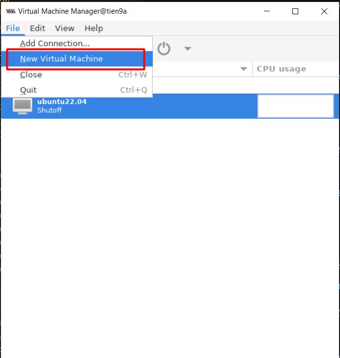

- Chọn `Local install media (ISO image or CDROM)`

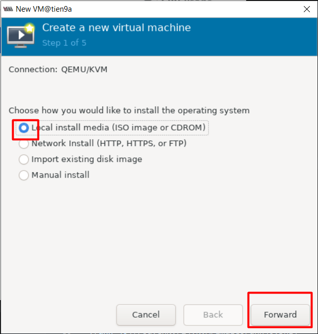

- Chọn đường dẫn file ISO ta đã tải ở trên

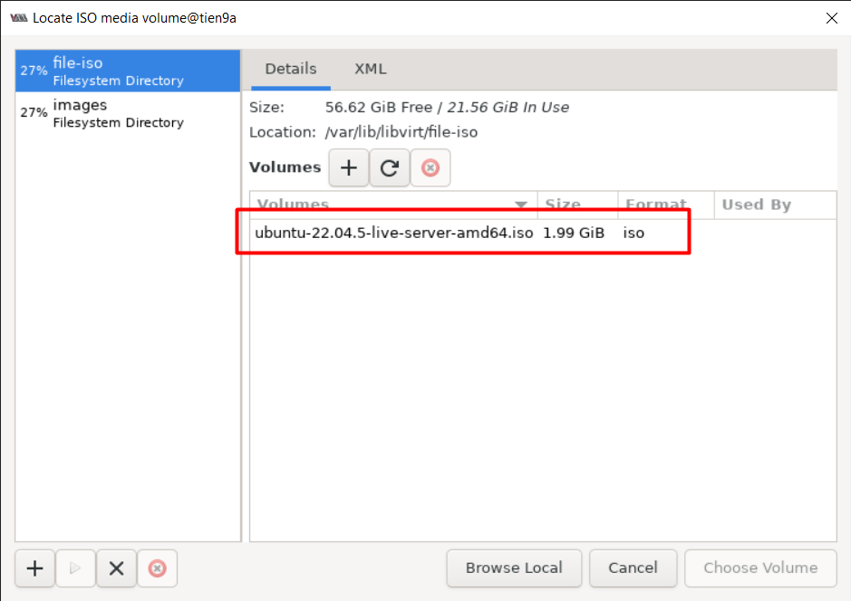

- Sau đó, ta cài đặt các thông số cho máy ảo

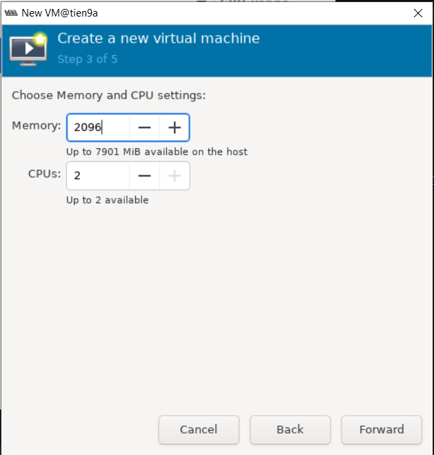

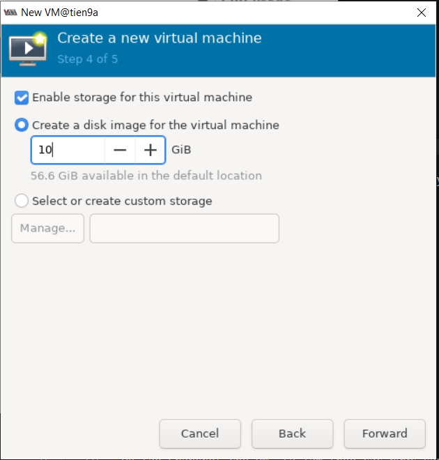

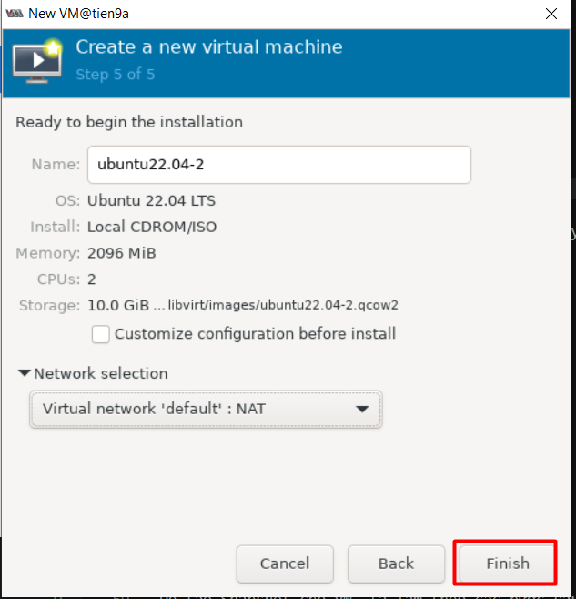

- Tiến hành cài đặt `Ubuntu 22.04`

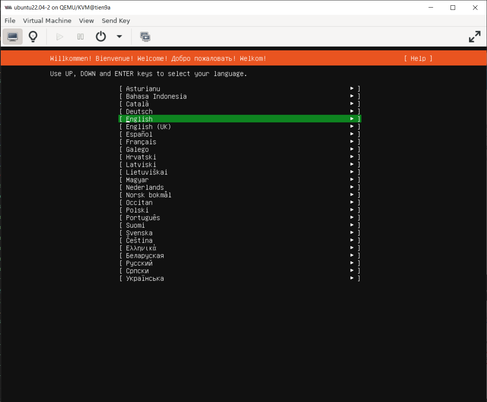

## 4. Một số thao tác

### 4.1 Quản lí các máy ảo đã tạo tại giao diện `virt-manager`

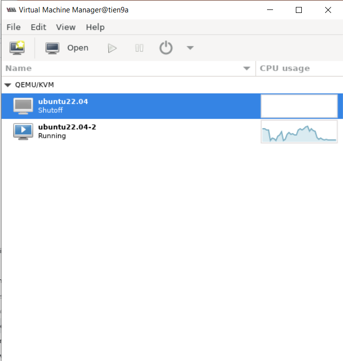

### 4.2 Snapshot

Để tạo Snapshot cho VM, ta làm theo các bước sau

Chọn vào mục `Manager VM Snapshot`:

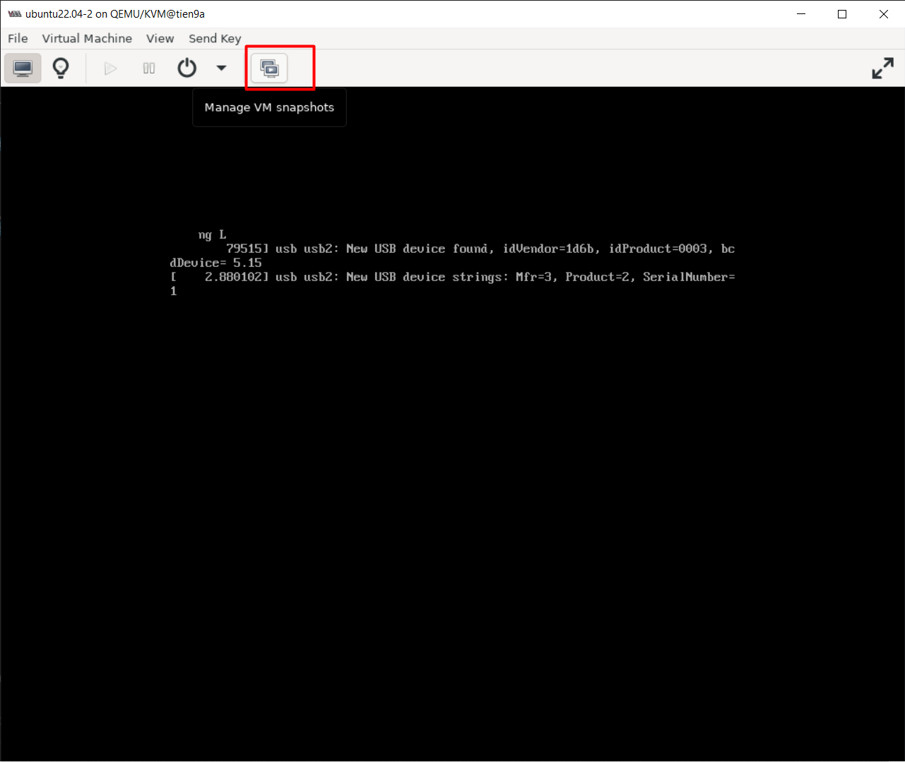

Click chọn thêm Snapshot

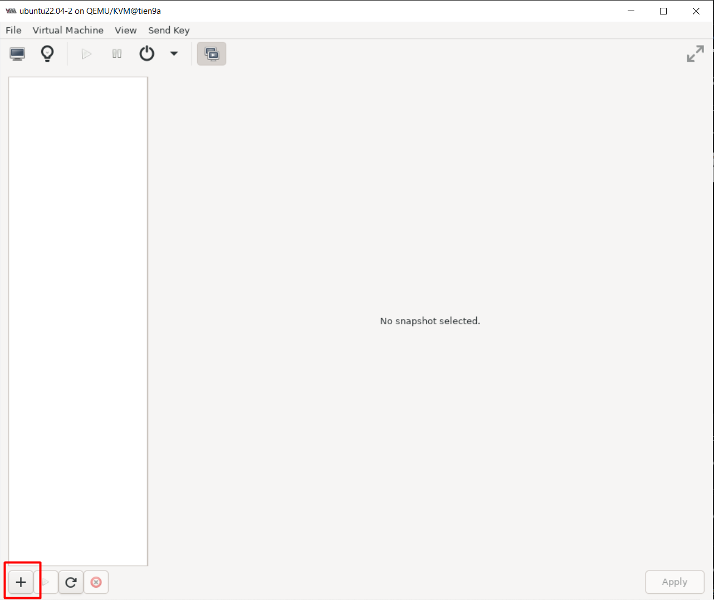

Điền tên cho Snapshot -> `Finish`

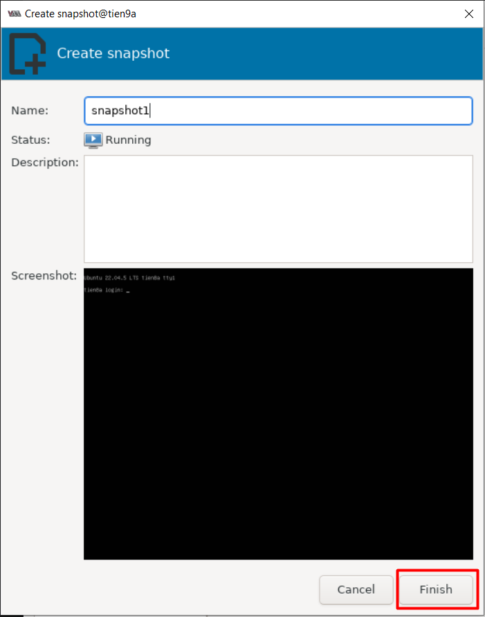

Snapshot được tạo:

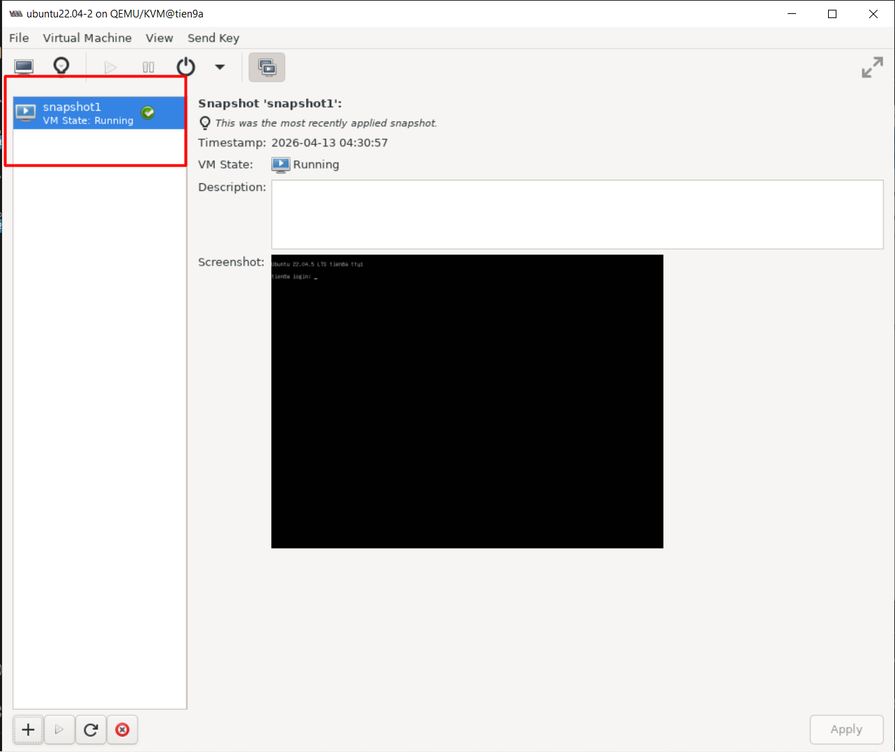

### 4.3 Xem thông tin phần cứng

Click biểu tượng như trong hình

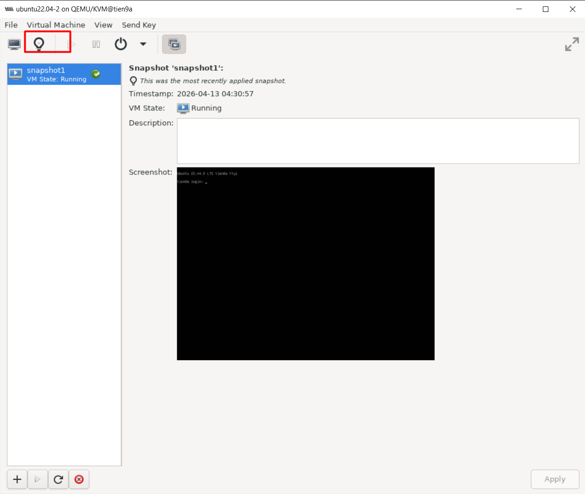

Ở đây, ta có thể xem các thông số phần cứng của máy ảo

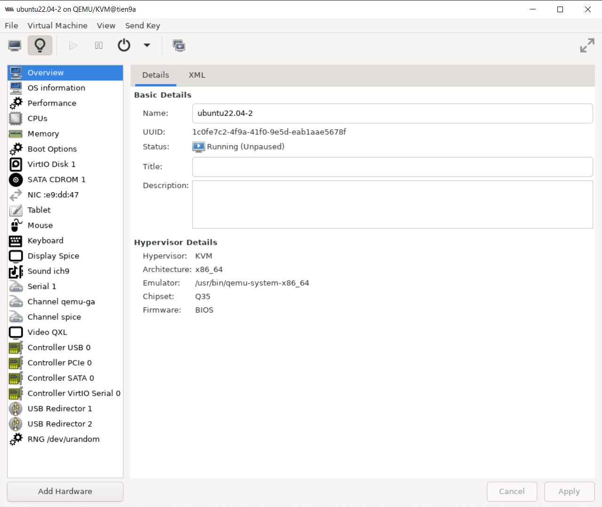

### 4.4 Tools Bar

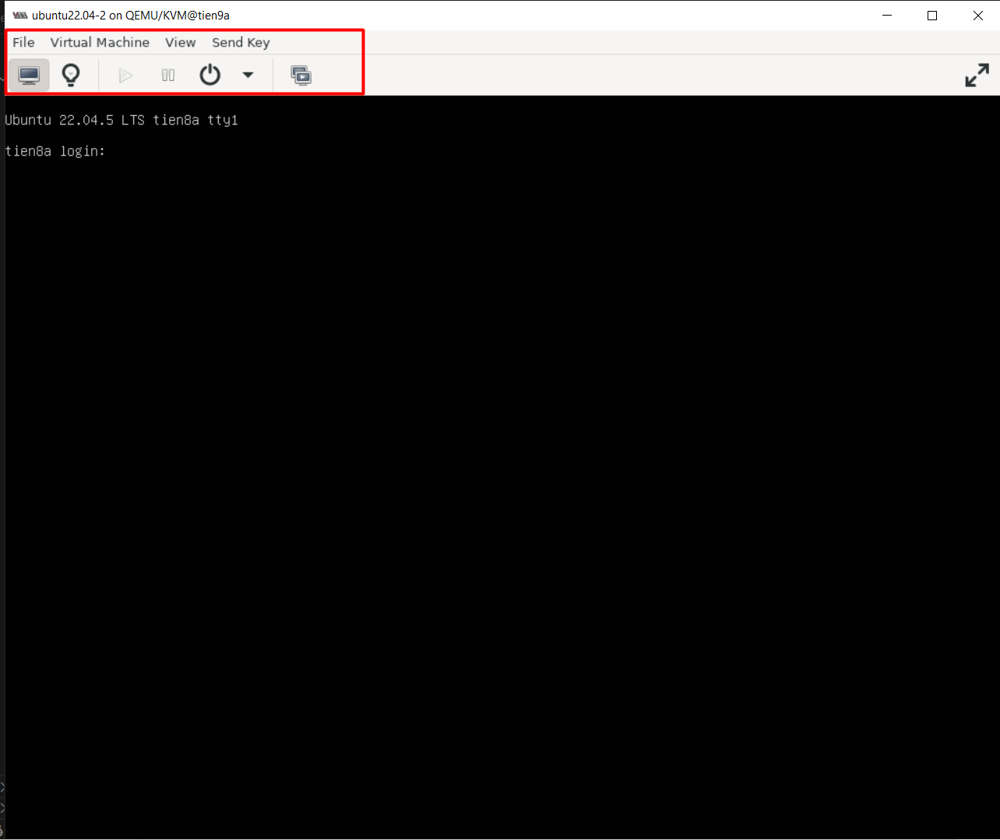

=> Có các ToolBar tương tự như VMW.
