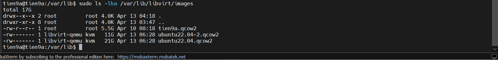
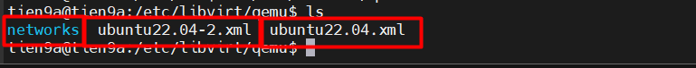
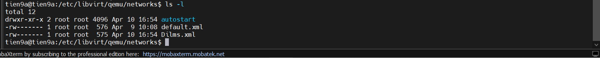
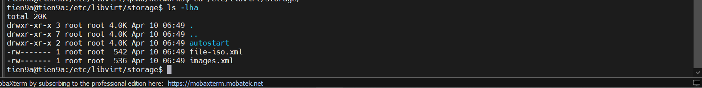
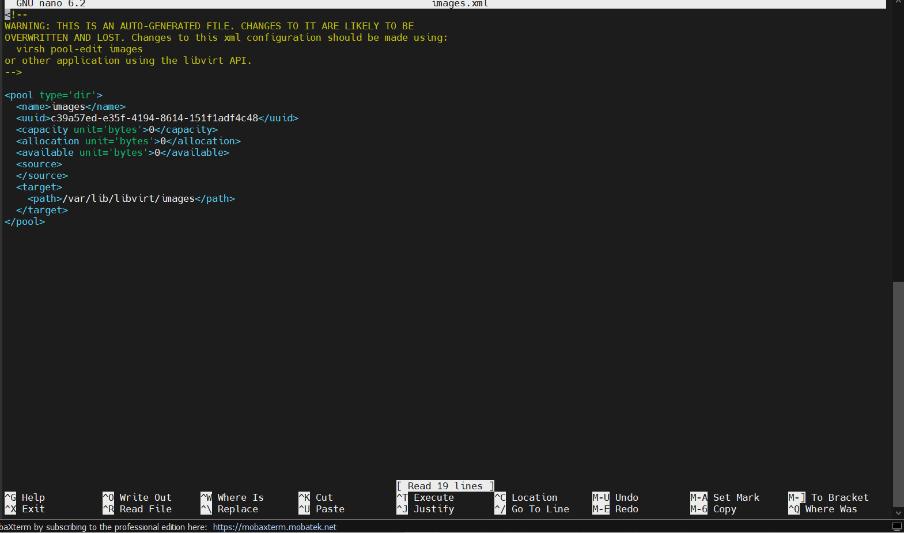
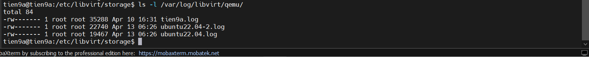
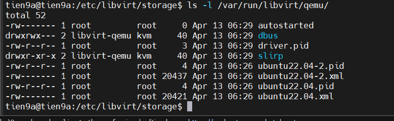
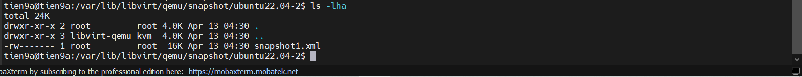

# TỔ CHỨC FILE TRONG KVM

|Đặc điểm      |    `/etc/libvirt/`                |           `/var/lib/libvirt/`                  |
|--------------|-----------------------------------|------------------------------------------------|
| Loại dữ liệu | Cấu hình (Configuration)          | Trạng thái (Runtime State)                     |
| Định dạng    | Tệp XML                           | "Tệp Log, Socket, RAM dump, NVRAM"             |
| Mục đích     | Định nghĩa máy ảo là gì?          | Máy ảo đang làm gì và chạy ra sao?             |
| Khi nào xóa? | Chỉ khi bạn undefine (xóa) máy ảo.| Thường chứa dữ liệu tạm thời khi máy đang chạy.|

## 1. Thư mục lưu các disk của VM

```bash
/var/lib/libvirt/images
```



## 2. Thư mục chứa các file `.xml` thông số kỹ thuật của VM

```bash
/etc/libvirt/qemu/file.xml
```



## 3. Thư mục chứa các file liên quan đến cấu hình network

```bash
/etc/libvirt/qemu/networks/file.xml
```



## 4. Thư mục lưu các storage

```bash
/etc/libvirt/storage/file.xml
```



- Thư mục `/etc/libvirt/storage/` là **Storage pool KHÔNG lưu dữ liệu**, nó chỉ là Nơi **chỉ định chỗ để lưu dữ liệu VM**
- Bên trong thường có các file `.xml`, mỗi file đại diện cho một **storage pool**:

```bash
/etc/libvirt/storage/
├── default.xml
├── images.xml
autostart
```

Trong đó: Mỗi file `.xml` mô tả

- Tên storage pool (vd: default)
- Kiểu storage:

  - `dir` → thư mục (phổ biến nhất)
  - `logical` → `LVM`
  - `netfs` → `NFS`
  - `iscsi` → `iSCSI`

- Đường dẫn thực tế trên host



Ngoài ra, còn thư mục `autostart` là **Symlink** đến file nào sẽ được tự động kích hoạt khi boot.

### 5. File Log và PID của máy ảo đang chạy

```bash
/var/log/libvirt/qemu/  # log files cho mỗi VM
```



```bash
/var/run/libvirt/qemu/  # PID files cho các VM đang chạy
```



### 6. Thư mục lưu các bản snapshot của các VM

```bash
/var/lib/libvirt/qemu/snapshot
```


