# TÌM HIỂU VỀ XML VÀ TẠO 1 VM BẰNG FILE DOMAIN XML

## I. TÌM HIỂU XML

### 1. Khái niệm

**XML**(**eXtensible Markup Language**) là một loại file có khả năng lưu trữ nhiều loại dữ liệu khác nhau. Mục đích của file `XML` là đơn giản hóa việc chia sẻ dữ liệu giữa các hệ thống khác nhau, đặc biệt là các hệ thống được kết nối với internet.

Trong KVM, file `XML` là thành phần cốt lõi để định nghĩa và quản lý các máy ảo (**VMs**) và mạng ảo. `libvirt`(daemon quản lý KVM) sử dụng các file `XML` này như một bản **blueprint** để biết cách **tạo** và **chạy** một **VM** hoặc một **Network**

### 2. XML trong KVM

Một VM trong KVM có 2 thành phần chính đó là:

- **VM's defination** được lưu dưới dạng file XML và nằm trong thư mục `/etc/libvirt/qemu`:

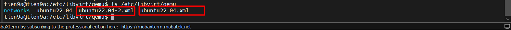

- **VM's storage** lưu dưới dạng file image:

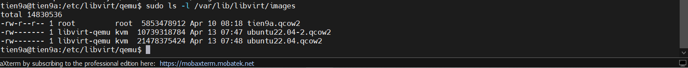

Ngoài ra, **File domain XML** chứa các thông tin về máy ảo như (số CPU, RAM, các thiết lập của I/O, card mạng, ...)

Ngoài **file domain XML** còn có các file XML khác để lưu thông tin **network**, **storage**, ...

## II. STRUCTURE OF FILE DOMAIN XML OF VM

Sử dụng `virsh edit` để mở và chỉnh sửa các file XML của máy ảo:

```bash
virsh edit <ten_file> # chú ý tên file bỏ phần đuôi .xml
```

Hoặc không sử dụng `nano` thì không cần bớt đuôi `.xml`:

```bash
sudo nano /etc/libvirt/qemu/ubuntu22.04.xml
```

Sau đó, ta thấy file cấu hình gồm rất nhiều thẻ sau đây:

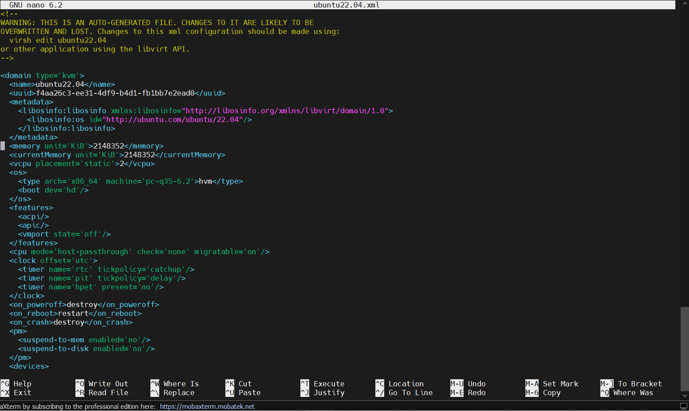

Có rất nhiều **thẻ** và **thành phần** trong file `xml` này. Ở đây, ta sẽ tìm hiểu một số thành phần chính sau:

Các **thẻ** cơ bản mà **VM** nào cũng có:

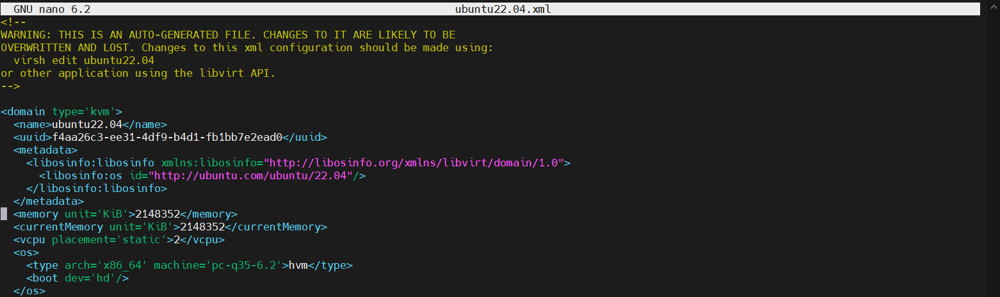

- `name`: tên của VM
- `uuid`: uuid của VM
- `memory`: dung lượng RAM của VM
- `unit='KiB'`: đơn vị đo dung lượng RAM, có thể sử dụng các đơn vị khác
- `currentMemory`: dung lượng RAM hiện tại
- `vcpu`: số CPU ảo được cài đặt
- `os`: hệ điều hành đang cài đặt trên máy ảo

Phần `devices`: các thông số của device trên VM

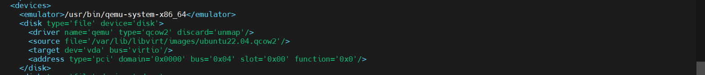

- `disk`: thông tin disk
  - `source`: nơi lưu VM

Phần `interface`: phần card mạng của VM

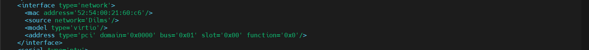

- `interface type`: kiểu card mạng
- `mac`: địa chỉ MAC của card
- `source`: tên card

## III. TẠO VM BẰNG 1 FILE DOMAIN XML

### 1. Chuẩn bị file XML

Chuẩn bị file XML, lưu tại thư mục `/etc/libvirt/qemu`

```bash
#tạo file xml cấu hình máy ảo tên: newVM
sudo nano /etc/libvirt/qemu/newVM.xml

# Dán
<domain type='kvm'>
  <name>newVM</name>
  <uuid>72b73c32-1c62-11f1-96ac-df8813e2872a</uuid>
  <memory unit='KiB'>524288</memory>
  <currentMemory unit='KiB'>524288</currentMemory>
  <vcpu placement='static'>1</vcpu>
  <os>
    <type arch='x86_64' machine='pc-q35-4.2'>hvm</type>
    <boot dev='hd'/>
  </os>
  <features>
    <acpi/>
    <apic/>
    <vmport state='off'/>
  </features>
  <cpu mode='host-model' check='partial'/>
  <clock offset='utc'>
    <timer name='rtc' tickpolicy='catchup'/>
    <timer name='pit' tickpolicy='delay'/>
    <timer name='hpet' present='no'/>
  </clock>
  <on_poweroff>destroy</on_poweroff>
  <on_reboot>restart</on_reboot>
  <on_crash>destroy</on_crash>
  <pm>
    <suspend-to-mem enabled='no'/>
    <suspend-to-disk enabled='no'/>
  </pm>
  <devices>
    <emulator>/usr/bin/qemu-system-x86_64</emulator>
    <disk type='file' device='disk'>
      <driver name='qemu' type='qcow2'/>
      <source file='/var/lib/libvirt/images/newVM.qcow2'/>
      <target dev='vda' bus='virtio'/>
      <address type='pci' domain='0x0000' bus='0x03' slot='0x00' function='0x0'/>
    </disk>
     <disk type="file" device="cdrom">
      <driver name="qemu" type="raw"/>
      <source file="/var/lib/libvirt/file-iso/ubuntu-22.04.5-live-server-amd64.iso"/>
      <target dev='sda' bus='sata'/>
      <readonly/>
      <address type='drive' controller='0' bus='0' target='0' unit='0'/>
    </disk>
    <controller type='usb' index='0' model='ich9-ehci1'>
      <address type='pci' domain='0x0000' bus='0x00' slot='0x1d' function='0x7'/>
    </controller>
    <controller type='usb' index='0' model='ich9-uhci1'>
      <master startport='0'/>
      <address type='pci' domain='0x0000' bus='0x00' slot='0x1d' function='0x0' multifunction='on'/>
    </controller>
    <controller type='usb' index='0' model='ich9-uhci2'>
      <master startport='2'/>
      <address type='pci' domain='0x0000' bus='0x00' slot='0x1d' function='0x1'/>
    </controller>
    <controller type='usb' index='0' model='ich9-uhci3'>
      <master startport='4'/>
      <address type='pci' domain='0x0000' bus='0x00' slot='0x1d' function='0x2'/>
    </controller>
    <controller type='sata' index='0'>
      <address type='pci' domain='0x0000' bus='0x00' slot='0x1f' function='0x2'/>
    </controller>
    <controller type='pci' index='0' model='pcie-root'/>
    <controller type='pci' index='1' model='pcie-root-port'>
      <model name='pcie-root-port'/>
      <target chassis='1' port='0x10'/>
      <address type='pci' domain='0x0000' bus='0x00' slot='0x02' function='0x0' multifunction='on'/>
    </controller>
    <controller type='pci' index='2' model='pcie-root-port'>
      <model name='pcie-root-port'/>
      <target chassis='2' port='0x11'/>
      <address type='pci' domain='0x0000' bus='0x00' slot='0x02' function='0x1'/>
    </controller>
    <controller type='pci' index='3' model='pcie-root-port'>
      <model name='pcie-root-port'/>
      <target chassis='3' port='0x12'/>
      <address type='pci' domain='0x0000' bus='0x00' slot='0x02' function='0x2'/>
    </controller>
    <controller type='pci' index='4' model='pcie-root-port'>
      <model name='pcie-root-port'/>
      <target chassis='4' port='0x13'/>
      <address type='pci' domain='0x0000' bus='0x00' slot='0x02' function='0x3'/>
    </controller>
    <controller type='pci' index='5' model='pcie-root-port'>
      <model name='pcie-root-port'/>
      <target chassis='5' port='0x14'/>
      <address type='pci' domain='0x0000' bus='0x00' slot='0x02' function='0x4'/>
    </controller>
    <controller type='pci' index='6' model='pcie-root-port'>
      <model name='pcie-root-port'/>
      <target chassis='6' port='0x15'/>
      <address type='pci' domain='0x0000' bus='0x00' slot='0x02' function='0x5'/>
    </controller>
    <controller type='virtio-serial' index='0'>
      <address type='pci' domain='0x0000' bus='0x02' slot='0x00' function='0x0'/>
    </controller>
    <interface type='network'>
      <source network='default'/>
      <model type='virtio'/>
    </interface>
    <serial type='pty'>
      <target type='isa-serial' port='0'>
        <model name='isa-serial'/>
      </target>
    </serial>
    <console type='pty'>
      <target type='serial' port='0'/>
    </console>
    <channel type='unix'>
      <target type='virtio' name='org.qemu.guest_agent.0'/>
      <address type='virtio-serial' controller='0' bus='0' port='1'/>
    </channel>
    <channel type='spicevmc'>
      <target type='virtio' name='com.redhat.spice.0'/>
      <address type='virtio-serial' controller='0' bus='0' port='2'/>
    </channel>
    <input type='tablet' bus='usb'>
      <address type='usb' bus='0' port='1'/>
    </input>
    <input type='mouse' bus='ps2'/>
    <input type='keyboard' bus='ps2'/>
    <graphics type='spice' autoport='yes'>
      <listen type='address'/>
      <image compression='off'/>
    </graphics>
    <sound model='ich9'>
      <address type='pci' domain='0x0000' bus='0x00' slot='0x1b' function='0x0'/>
    </sound>
    <video>
      <model type='qxl' ram='65536' vram='65536' vgamem='16384' heads='1' primary='yes'/>
      <address type='pci' domain='0x0000' bus='0x00' slot='0x01' function='0x0'/>
    </video>
    <redirdev bus='usb' type='spicevmc'>
      <address type='usb' bus='0' port='2'/>
    </redirdev>
    <redirdev bus='usb' type='spicevmc'>
      <address type='usb' bus='0' port='3'/>
    </redirdev>
    <memballoon model='virtio'>
      <address type='pci' domain='0x0000' bus='0x04' slot='0x00' function='0x0'/>
    </memballoon>
    <rng model='virtio'>
      <backend model='random'>/dev/urandom</backend>
      <address type='pci' domain='0x0000' bus='0x05' slot='0x00' function='0x0'/>
    </rng>
  </devices>
</domain>
```

File domain XML này sẽ tạo ra máy ảo với những thông số sau:

- 512 MB RAM, 1 vCPU
- Đường dẫn tới ổ đĩa: `/var/lib/libvirt/images/newVM.qcow2`
- Máy ảo được boot từ CD-ROM: `/var/lib/libvirt/file-iso/ubuntu-22.04.5-live-server-amd64.iso`
- Sử dụng network name là: `default`.
- Mã `uuid`, ta có thể download package `uuid` rồi sử dụng lệnh `uuid` để sinh ra 1 mã `uuid`.
- Ngoài ra, ta có thể tạo 1 file `.xml`bằng việc `dump` từ một máy ảo đang chạy bằng câu lệnh:

```bash
virsh dumpxml ubuntu22.04 > newUbuntu22.04.xml
```

### 2. Tạo ổ đĩa

Dùng câu lệnh sau để tạo ổ đĩa dung lượng 10G vơi định dạng qcow2

```bash
qemu-img create -f qcow2 /var/lib/libvirt/images/newVM.qcow2 10G
```

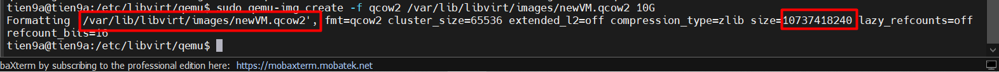

### 3. Khởi tạo máy ảo

Dùng câu lệnh `virsh create <Ten_file_Domain>.xml` để khởi tạo máy ảo:

```bash
cd /etc/libvirt/qemu
virsh create newVM.xml
```

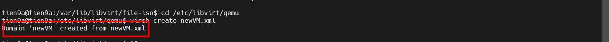

Sử dụng virt-manager để quản lý VM:

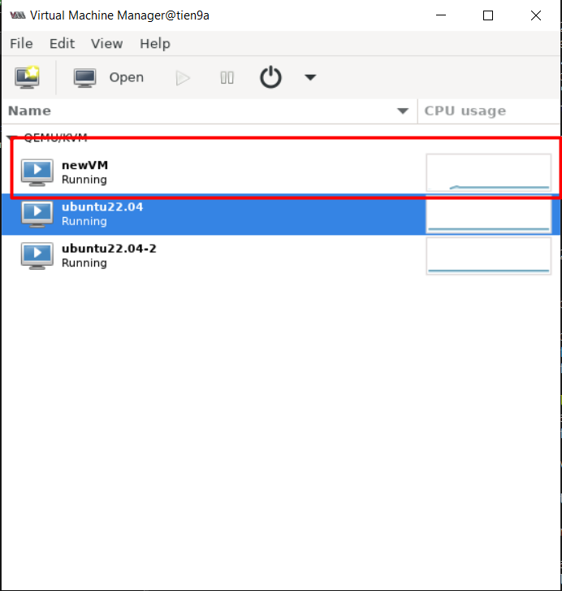

## IV. CHỈNH SỬA CẤU HÌNH MÁY ẢO BĂNG FILE XML

Trước khi tiến hành chỉnh sửa cấu hình file XML thì sẽ tắt VM trước.

Ta dùng lệnh `virsh edit <tên_vm>` hoặc có thể sử dụng `nano` để edit `file.xml` của VM.

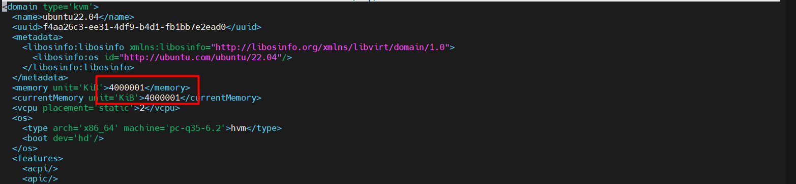

Ở đây, ta sẽ thay đổi dung lượng RAM của `ubuntu22.04` về 1G(Cũ: `2GB`). Sau đó `define` lại `ubuntu22.04`

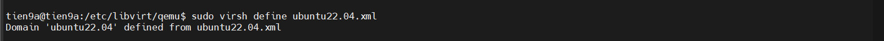

Sau đó, start `ubuntu22.04` trở lại và kiểm tra lại dung lượng RAM:

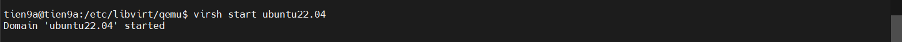

Kiểm tra lại máy ảo:

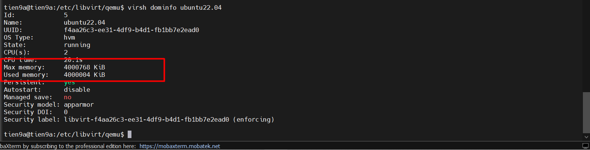
