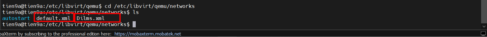
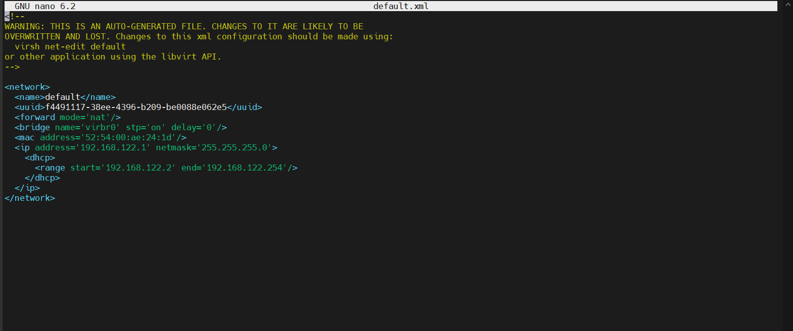

# TÌM HIỂU VỀ FILE XML NETWORK VÀ TẠO XML NETWORK BẰNG FILE XML

## I. FILE XML NETWORK

Thư mục chứa file XML network:

```bash
/etc/libvirt/qemu/networks
```

Các file ở đây là mạng ảo trong KVM



Ta sẽ xem file `Default.xml`



`name`: tên mạng
`forward mode`: kiểu mạng
`bridge`: card sử dụng
`mac`: địa chỉ MAC
`ip`: thông số IP của mạng
`dhcp`: thông tin dhcp của mạng
`range`: dải cấp dhcp cho các VM

## II. TẠO VIRTUAL NETWORK BẰNG FILE XML

Do đã cấu hình ở phần trên rồi lên ta thực hiện theo các bước sau [đây](https://github.com/tiend9/system-intership/blob/master/TienHA/15.KVM/03.KVM_network_card_modes/02.Create_Network_cardmode.md)
