# THÊM DISH, CARD VÀO VM

## I. THÊM DISK VÀO VM

### 1. Thêm Disk vào VM trên KVM Host

Các bước sẽ làm:

- Tạo đĩa ảo
- Gán đĩa ảo vào VM.

#### Kiểm tra số lượng Disk của VM

```bash
fdisk -l | grep sda
```

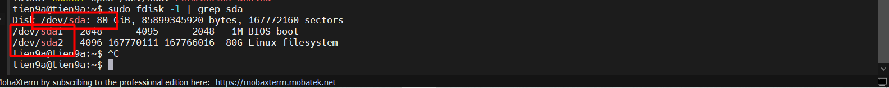

**Phân tích tổng quan**:

- Tổng quan về ổ cứng trên KVM Host: `Disk /dev/sda: 80 GiB, 85899345920 bytes, 167772160 sectors`

  - `/dev/sda`: Đây là tên thiết bị ổ cứng vật lý đầu tiên của mày (SATA/SCSI).
  - `80 GiB`: Tổng dung lượng tính theo hệ nhị phân (GiB).
  - `85899345920 bytes`: Tổng dung lượng tính theo đơn vị byte (con số tuyệt đối).
  - `167772160 sectors`: Tổng số "Sector" (mỗi `sector` thường là 512 bytes). Máy tính nó đọc ổ cứng dựa trên các con số này.

- Phân tích ổ cứng vùng `dev/sda1`: `/dev/sda1   2048      4095      2048   1M BIOS boot`. Trong đó:

  - `2048` (Start): Sector bắt đầu. Nó chừa ra 2048 sector đầu tiên để làm Master Boot Record (MBR) và các bảng partition.
  - `4095` (End): Sector kết thúc.
  - `2048` (Sectors): Tổng số sector của phân vùng này (4095 - 2048 + 1).
  - `1M` (Size): Dung lượng cực nhỏ, chỉ 1 Megabyte.
  - `BIOS boot`: Đây là phân vùng dành riêng cho **GRUB** khi ta dùng bảng phân vùng **GPT** trên một hệ thống chạy **Legacy BIOS**. Nó chứa mã thực thi của trình khởi động. Không có phần này là máy không boot được vào Linux.

- Phân tích ổ cứng vùng `dev/sda2`: `/dev/sda2   4096 167770111 167766016  80G Linux filesystem`. Trong đó:

  - `4096` (Start): Bắt đầu ngay sau thằng `sda1`.
  - `167770111` (End): Gần chạm mốc sector cuối cùng của ổ cứng.
  - `167766016` (Sectors): Tổng số sector dùng cho dữ liệu.
  - `80G (Size)`: Nó chiếm gần như trọn vẹn ổ cứng (trừ đi `1MB` lẻ kia).
  - `Linux filesystem`: Đây là nơi chứa toàn bộ OS, file `/etc/netplan` mày vừa sửa, và quan trọng nhất là thư mục `/var/lib/libvirt/images` - nơi mày định nhét các ổ cứng máy ảo vào đấy.

**Nhận xét Output**: Ổ cứng được chia làm 2 phần đó là `sda1` và `sda2`. Trong đó:

- `sda1` dùng để chứa các file boot
- `sda2` dungc để chưa các file images của máy ảo ta tạo trên KVM Host

=> Ta sẽ có 2 Cách thêm Disk cho VM phổ biến nhất hiện nay. Đó là:

- `Cách 1`: Tạo File Image (như `.qcow2`) nằm bên trong cái `dev/sda2` này.

- `Cách 2`: Add thêm 1 ổ Hard Disk mới (ví dụ `20GB` nữa) vào con **KVM Host** này. Lúc đó sẽ xuất hiện thêm `/dev/sdb` trắng tinh để ta triển khai phân vùng LVM và gán nó vào VM trên **KVM Host**.

#### `Cách 1`: Tạo Disk `vdb` trên phân vùng `sda2` và gán nó vào VM trên KVM Host

##### `Bước 1`: Tắt VM trên KVM Host mà ta muốn cấu hình

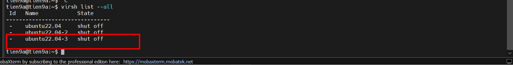

##### `Bước 2`: Tạo 1 đĩa ảo trên Host KVM bằng lệnh `qemu-ing`

Tạo 1 đĩa ảo dung lượng `3GB` và lưu tại `/var/lib/libvirt/images`

```bash
cd /var/lib/libvirt/images
sudo qemu-img create -f qcow2 tien7a.qcow2 3G
```

Chỉnh sửa file `.xml` của KVM:

```bash
virsh edit ubuntu22.04-3

# Tìm thẻ <disk> và thêm vào sau nó
<disk type='file' device='disk'>
    <driver name='qemu' type='qcow2'/>
    <source file='/var/lib/libvirt/images/tien7a.qcow2'/>
    <target dev='vdb' bus='virtio'/>
</disk>
```

Trong đó:

- `<driver name='qemu' type='qcow2'/>`: Tên driver và kiểu disk
- `<source file='/var/lib/libvirt/images/tine7a.qcow2'/>`: đường dẫn tới disk ảo trên host KVM
- `<target dev='vdb' bus='virtio'/>` : cần tạo tên khác với những disk ảo đã có của VM. Như ở đây, ta đặt là `vdb`.

Ngoài ra, thay vì sửa file `.xml` có thể dùng lệnh `virsh` để **attach**:
(**Lưu ý**: Chọn cách nào chỉ làm đúng cách đó)

```bash
# Ép (attach) disk này vào máy ảo đang chạy với tên là sdb
virsh attach-disk ubuntu22.04-3 /var/lib/libvirt/images/tien7a.qcow2 vdb --persistent --subdriver qcow2
```

Rồi sau đó,**Apply** cấu hình:

```bash
# Nếu attach bằng file xml
virsh define /etc/libvirt/qemu/ubuntu22.04-3.xml

# Nêu dùng lệnh virsh thì chỉ cần khởi động lại máy ảo
virsh start ubuntu22.04-3
```

##### `Bước 3`: Start VM và kiểm tra disk ta tạo trên VM

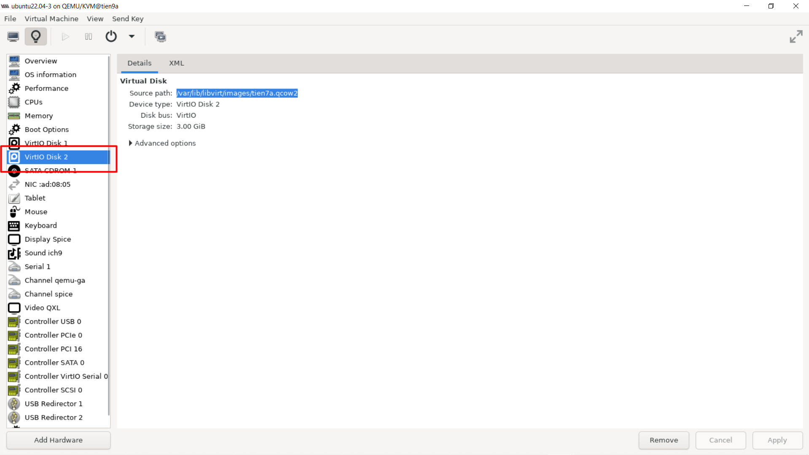

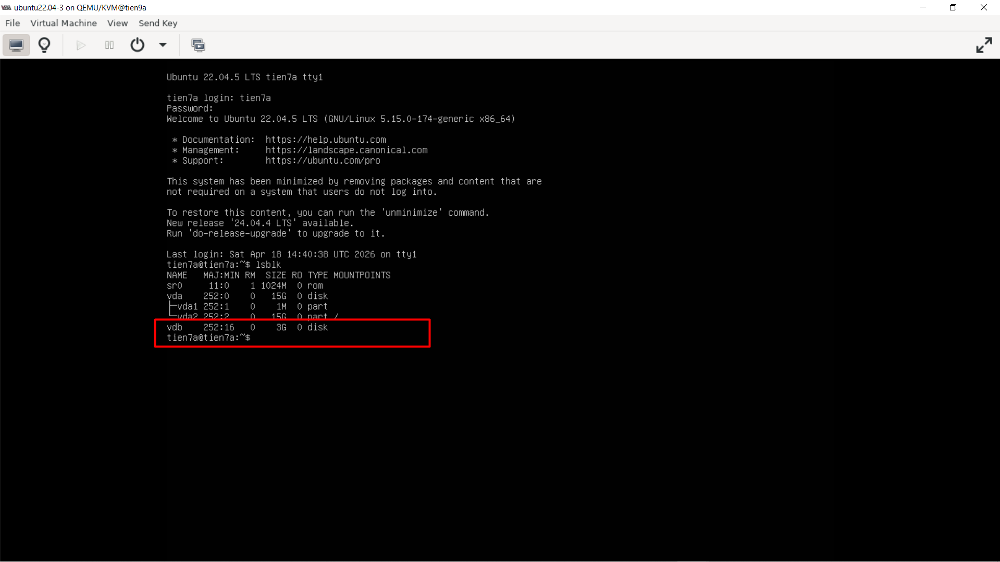

##### Đánh giá của cách này

**Ưu điểm**: Dễ quản lý. Mày có thể copy file `.qcow2` này đi máy khác, hoặc làm Snapshot cực kỳ dễ dàng (trước khi phá máy thì chụp lại phát, lỗi thì revert).

**Nhược điểm**: Hiệu năng bị giảm (Overhead). Gói tin phải đi qua: File System của máy ảo -> File `.qcow2` -> File System của KVM Host (`sda2`) -> `VMware`.

#### `Cách 2`: Pass-through Block Device & Dùng LVM (Chuẩn Enterprise)

Thay vì tạo file ảo, ta vào thẳng **VMware** cắt thêm cho con KVM Host một ổ cứng vật lý mới. Sau đó, mày cấp nguyên cái ổ cứng đó (hoặc chia nhỏ bằng LVM) cho con máy ảo `ubuntu22.04-3`. Đây là cách các hệ thống Storage lớn thực sự vận hành.

Sau đây là các bước thực hiện:

##### `Bước 1`: Thêm 1 Ổ cứng mới trên KVM Host (Hay trên VM trên VMW Workstation mà ta làm việc)

- Tắt KVM Host trước:

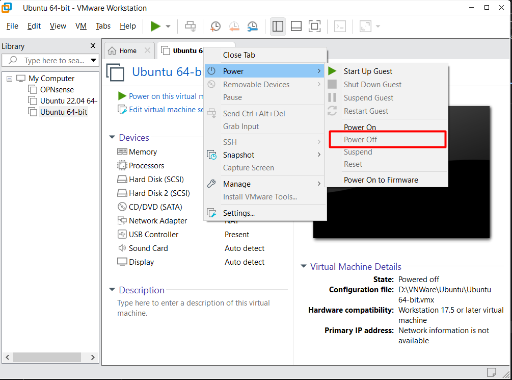

- Vào `Edit Virtual Machine Settings`-> Vào `Add` -> Thêm `Hard Disk` -> Chọn Virtual Disk Type:`SCSI` -> `Create New Virtual Disk` -> `Store VD as sigle file` -> Đặt tên cho disk -> Next xong là `OKE`.

- Check trên KVM Host xem Disk được tạo chưa:

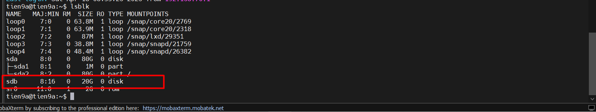

##### `Bước 2`: Đưa ổ `sdb` cho LVM quản lí (Logical Volume Manager) để dễ dàng scale

```bash
# Tắt VM trước đã 

# Biến sdb thành ổ vật lý cho LVM
sudo pvcreate /dev/sdb

# tạo 1 volume group tên vg_storage
sudo vgcreate vg_storage /dev/sdb

# cắt ra 10G từ volume group này để làm ổ cứng cho máy ảo
sudo lvcreate -n lv_ubuntu22.04-3_disk -L 10G vg_storage

# Attach ổ LVM vào máy ảo
virsh attach-disk ubuntu22.04-3 /dev/vg_storage/lv_ubuntu22.04-3_disk vdc --persistent

# Bật lại VM
virsh start ubuntu22.04-3
```

##### `Bước 3`: Start VM và kiểm tra disk ta tạo ở VM

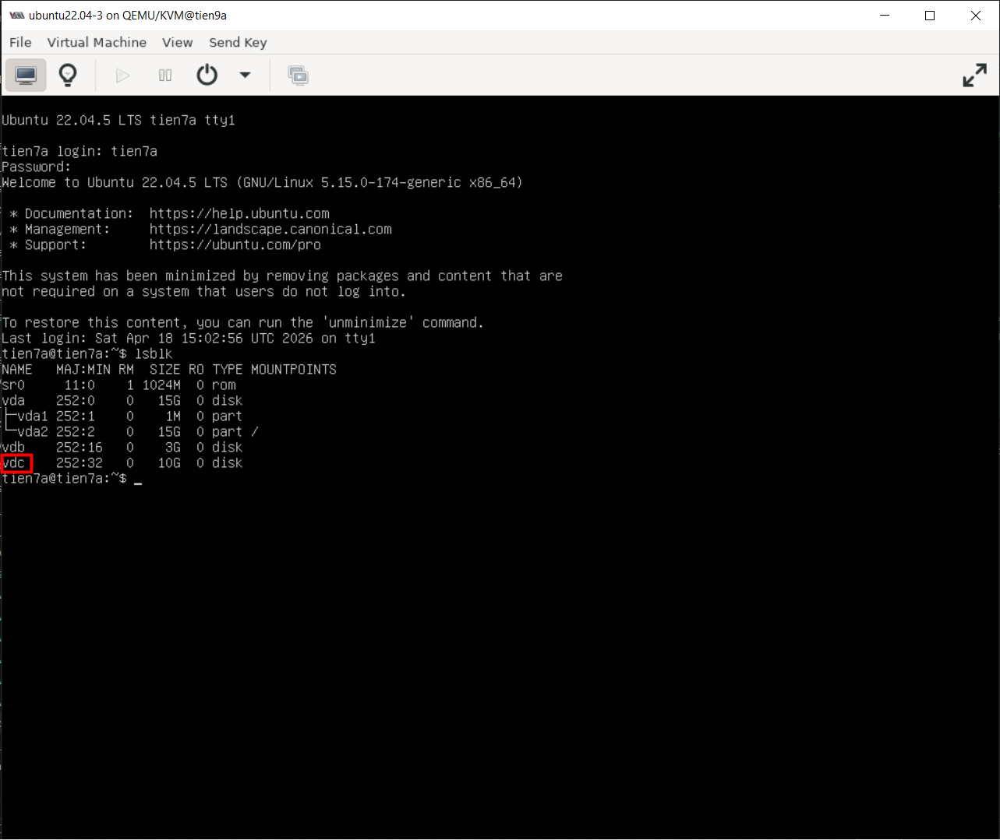

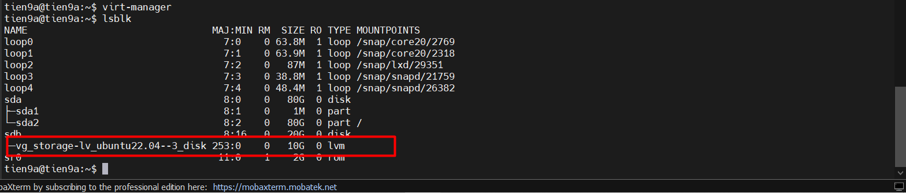

##### Đánh giá khi dùng cách này

- **Ưu điểm**: Tốc độ `I/O` cực cao (**Block-level storage**) vì nó bỏ qua lớp file system của **KVM Host**. Cực kỳ sát với thực tế đi làm (quản lý LVM, cấp phát **Block Storage** cho **VM**).

- Nhược điểm: Mất tính năng Snapshot nội bộ của file `.qcow2` (Tuy nhiên LVM bản thân nó cũng hỗ trợ Snapshot riêng).

### 2. Cách phân vùng Disk trên VM của KVM Host

Trên VM mới thêm disk `vdb`, ta thực hiện phân vùng:

```bash
sudo fdisk /dev/vdb

Command (m for help): # Dùng kí tự để vào tuỳ chọn

# Ghi n. Để vào tuỳ chọn tạo phân vùng mới
n

# Ghi p. Để vào tuỳ chọn chỉ định phân vùng chính
p

# Tiếp theo chọn phân vùng có sẵn. Ở đây ta chọn phân vùng 2 (vdb2)
2

# Chỉ định sector đầu
2028

# Chỉ định sector cuối để quyết định dung lượng cho phân vùng mới
6291455

# ghi w để hoàn tất thay đổi
w

# Định dạng phân vùng với hệ thống file ext4
mkfs -t ext4 /dev/vdb2
```

Check lại xem cấu hình như mong muốn chưa:

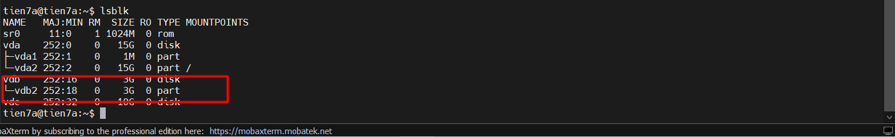

## III. THÊM CARD MẠNG CHO VM

### 1. Thêm card mạng

- Xem những card mạng hiện tại có trên VM

    ```bash
    virsh domiflist ubuntu22.04-3
    ```

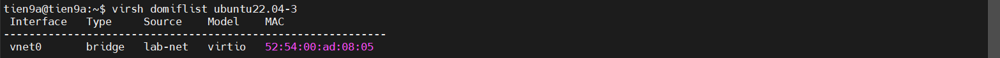

- Chỉnh sửa file `.xml` của VM
- Thêm đoạn `interface` như sau vào file `.xml`

    ```bash
    <interface type='network'>
        <source network='hostonly'/>
        <model type='virtio'/>
    </interface>
    ```

- Trong đó:

  - `interface type`: kiểu card mạng
  - `source`: dải mạng mà card cắm vào

- Define file xml của VM và khởi động lại VM

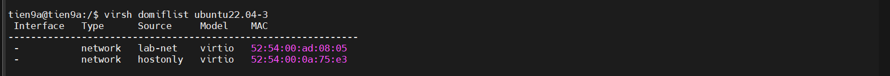

- Trên VM:

  - Bật interface và xin cấp ip `sduo dhclient -v`:

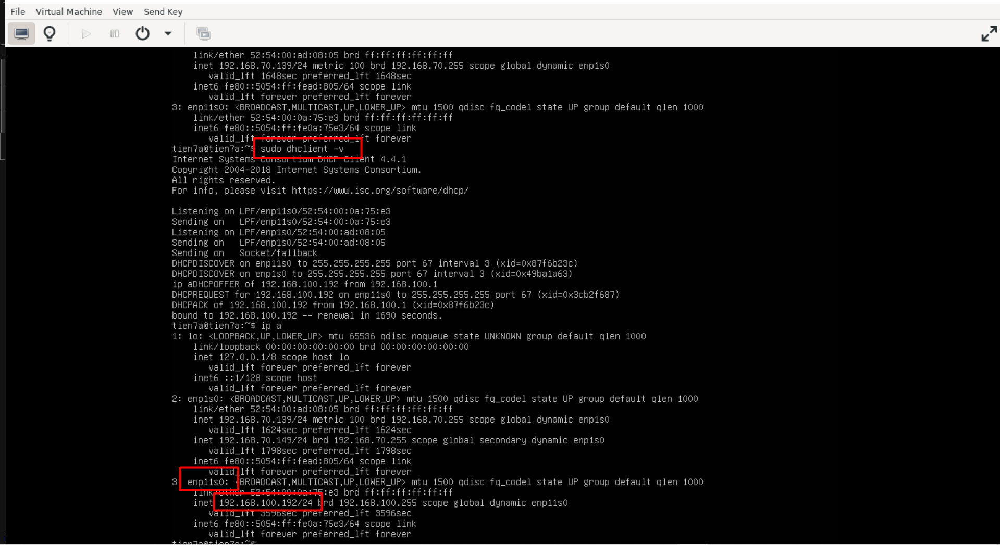

### 2. Xóa card mạng

Ta có thể xóa card mạng bằng 2 cách:

- Xóa trong file `.xml` của VM
- Sử dụng lệnh:

    ```bash
    virsh detach-interface --domain ubuntu22.04-3 --type network --mac 52:54:00:0a:75:3e --config
    ```
