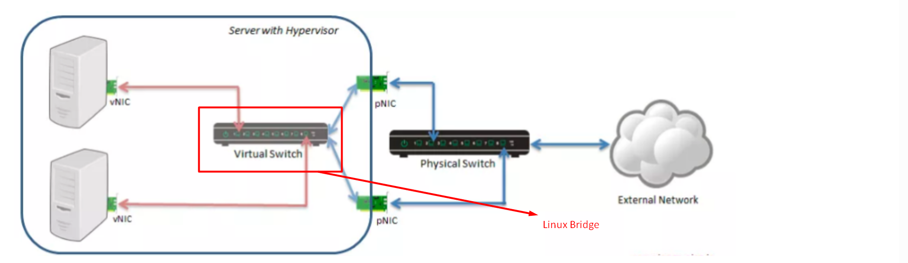
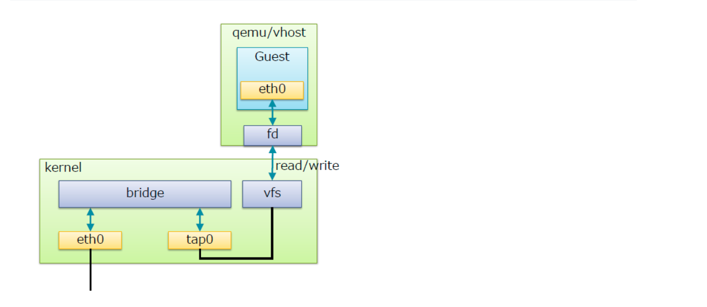
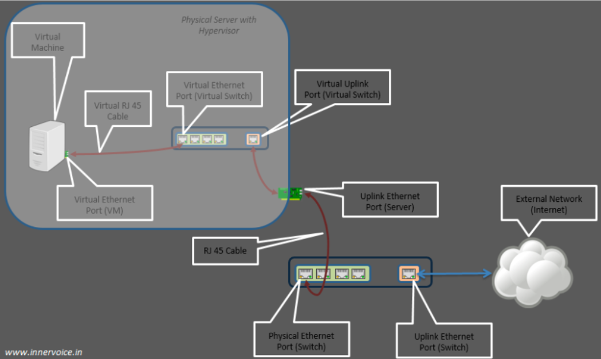
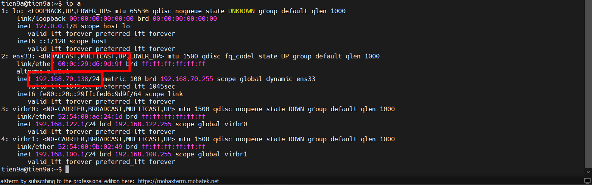
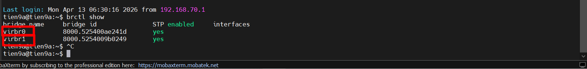
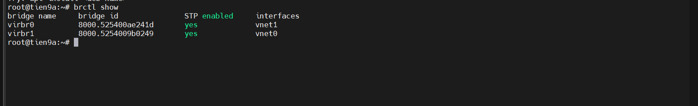

# TÌM HIỂU VỀ LINUX BRIDGED

## I. TỔNG QUAN VỀ LINUX BRIDGED

### 1. Định nghĩa

**Linux Bridge**: là một công nghệ **cung cấp switch ảo** để giải quyết vấn đề ảo hóa Network bên trong các máy vật lí.

Ta có thể thấy có một con switch được tạo ra nằm trong bên máy vật lí. Các VM kết nối đến đây để có thể liên lạc được với nhau. Nếu muốn liên lạc ra bên ngoài ta có thể kết nối con switch này với card mạng trên máy vật lý của ta (giống như ta dùng dây kết nối switch với router). Ta có thể kết nối switch với 1 hoặc nhiều port.

Chú ý: Ta không thể kết nối switch ảo với card wireless do HĐH không hỗ trợ.

### 2. Bản chất của Linux Bridge

**Linux Bridge** hoạt động ở **Layer 2 (Data Link Layer)** trong mô hình OSI. Nhiệm vụ chính của nó là kết nối các interface mạng (vật lý hoặc ảo) lại với nhau để chúng có thể trao đổi dữ liệu như thể đang cắm chung vào một cái Hub hay Switch vật lý.

- **MAC Learning**: Nó học địa chỉ MAC của các thiết bị kết nối vào các port của nó và lưu vào bảng **FDB** (Forwarding Database).

- **Forwarding**: Khi nhận được một frame, nó kiểm tra bảng **FDB** để biết nên đẩy frame đó ra port nào. Nếu không biết (hoặc là gói tin Broadcast), nó sẽ đẩy ra tất cả các port còn lại (flooding).

### 3. Các thành phần chính trong Linux Bridge

Để hiểu Linux Bridge, bạn cần phân biệt được 3 thực thể này:

- **Bridge Interface** (ví dụ: `br0`): Đây là cái "Switch ảo". Bản thân nó cũng là một interface mạng có địa chỉ MAC. Bạn có thể gán IP cho chính cái interface này để host có thể giao tiếp với mạng đó.

- **Ports** (Enslaved interfaces): Các interface (như `eth0`, `veth0`, `tap0`) được "cắm" vào bridge. Một khi đã là port của bridge, các interface này thường **không cần** (và không nên) có IP riêng.

- **STP** (Spanning Tree Protocol): Linux Bridge hỗ trợ STP để **chống loop** (vòng lặp) trong mạng, cực kỳ quan trọng nếu bạn có nhiều bridge kết nối chéo với nhau.

### 3. Các công cụ quản lý

Có hai bộ công cụ chính để quản lí Linux Bridge:

#### `Cổ điển: bridge-utils (brctl)`

Đây là bộ công cụ cũ nhưng vẫn cực kỳ phổ biến trong các tutorial.

- `brctl addbr br0`: Tạo bridge.

- `brctl addif br0 eth0`: Thêm interface vào bridge.

- `brctl show`: Xem danh sách bridge.

#### `Hiện đại: iproute2 (ip link)`

Đây là cách "chuẩn" hiện nay trên các distro mới.

- `ip link add name br0 type bridge`: Tạo bridge.

- `ip link set eth0 master br0`: Đưa interface vào bridge.

- `bridge link show`: Xem chi tiết các link đang kết nối vào bridge.

## II. CẤU TRÚC VỀ LINUX BRIDGE

Trong đó:

- `bridge`: ở đây là **switch ảo**
- `tap` : (`tap` interface) là **giao diện mạng** để các VM kết nối với switch do Linux bridge tạo ra(hoạt động ở lớp 2 của mô hình OSI)
- `fd`:(Forward data) có nhiệm vụ chuyển dữ liệu từ VM đến switch. Switch ảo do Linux bridge tạo ra có chức năng tương tự như 1 con switch vật lí.
- `vfs`: (Virtual File System)là một lớp trừu tượng trong kernel Linux. Đóng vai trò như “cầu nối chung” giữa các chương trình (ở đây là QEMU) và hệ thống tài nguyên phía dưới (network, file, device).

**Mô hình LinuxBridge đóng vai trò kết nối ra mạng ngoài**:

Ta có thể thấy rõ hơn cách kết nối của VM ra ngoài internet. Khi máy vật lý của ta có card mạng kết nối với internet(`không phải card wireless`):

Dùng lệnh `brctl show` xem "bản đồ" các Switch ảo đang có trên hệ thống.

Trong đó:

- `bridge name`: Tên của Bridge (Switch ảo). Ở đây bạn có virbr0 và virbr1. Tiền tố virbr (Virtual Bridge) cho thấy chúng được tạo ra bởi libvirt (thường đi kèm với `KVM/QEMU`).

- `bridge id`: Một định danh duy nhất dài 64-bit. Nó thường có định dạng {priority}.{MAC_address}. Ví dụ: `8000` là độ ưu tiên mặc định, còn `525400ae241d` chính là địa chỉ MAC của cái Bridge đó.

- `STP enabled`: Trạng thái của **Spanning Tree Protocol**. Nếu là yes, Bridge sẽ tự động phát hiện và chặn các vòng lặp (loop) trong mạng để tránh làm sập hệ thống. Trong ảo hóa, nó thường được bật mặc định.

- **interfaces**: Danh sách các card mạng (vật lý như eth0 hoặc ảo như `vnet0`) đang được "cắm" vào **Bridge** này.

=> Phân tích trạng thái hiện tại:

- Interfaces đang trống: Cả `virbr0` và `virbr1` đều không có interface nào liệt kê bên dưới. Điều này có nghĩa là:

  - Chưa có máy ảo (VM) nào đang chạy và kết nối vào các switch này.
  - Chưa gán bất kỳ card mạng vật lý nào vào Bridge để thông ra mạng ngoài.

- `virbr0` & `virbr1`: * `virbr0` thường là mạng mặc định (Default Network) của libvirt, dùng chế độ NAT để máy ảo có internet nhưng bên ngoài không truy cập thẳng vào máy ảo được.

  - `virbr1`: là một mạng con khác mới tạo thêm.

- Khi ta bật 2 con VM kết nối với máy này lên (1 con kết nối vào `virbr1` và 1 con kết nối vào `virbr2`) ta dùng lệnh `brctl show` sẽ hiện kết quả như sau:

- Nhưng ta có thể thấy chưa có `br0` nào được tạo cho lên ta có thể kết luận rằng 2 Con **VM** mới chỉ đang để chế độ `NAT` hoặc `Host-Only`

=> Vì vậy ta tạo thử 1 con VM mới và cấu hình 1 mạng **Bridge** cho nó thì ta mới có thể thấy được `br0`

