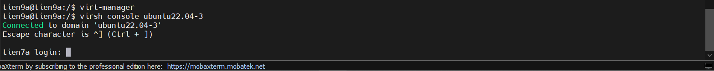
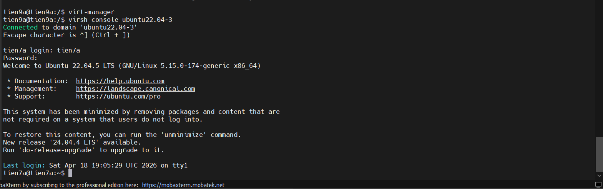

# Tìm hiểu về virsh client

## 1. Giới thiệu về Virsh

**virsh client** hay **virsh** là một công cụ dòng lệnh (CLI) của dự án libvirt, cung cấp giao diện để quản lý và điều khiển các môi trường ảo hóa trên Linux, đặc biệt là các hypervisor như `KVM/QEMU`, `Xen`, `LXC`...

**Virsh** làm nhiệm vụ kết nối đến libvirt daemon (`libvirtd`) để thực hiện các thao tác quản lý trên máy ảo (domain), mạng ảo (virtual network), storage pool (kho lưu trữ), và nhiều thành phần khác của hạ tầng ảo hóa.

Việc sử dụng **virsh** giúp quản trị viên dễ dàng thao tác, tự động hóa các công việc quản lý máy ảo thông qua dòng lệnh hoặc kịch bản **shell**.

## 2. Các khái niệm cơ bản trong Virsh

- `Domain`: đại diện cho một máy ảo hoặc container do libvirt quản lý.

- `Storage Pool`: nơi lưu trữ các tập tin disk image hoặc ổ đĩa ảo cho máy ảo.

- `Network`: mạng ảo dùng để kết nối các máy ảo hoặc kết nối máy ảo với mạng ngoài.

## 3. Cách kết nối với libvirt qua Virsh

Mặc định, khi gọi `virsh`, nó kết nối đến `libvirtd` trên máy chủ local.

Nếu muốn kết nối đến một host khác, có thể dùng cú pháp:

```bash
virsh -c qemu+ssh://username@remotehost/system
```

`-c` (connection) chỉ định URI kết nối tới hypervisor trên remote.

=> Dùng lệnh này có thể truy cập giao diện virsh của máy chủ **KVM Host** khác.

## 4. Các lệnh cơ bản

### 4.1 Quản lý Domain (máy ảo)

| Lệnh                      | Mục đích                                                 |
| ------------------------- | -------------------------------------------------------- |
| `virsh list`              | Liệt kê các máy ảo đang chạy                             |
| `virsh list --all`        | Liệt kê tất cả máy ảo (chạy và tắt)                      |
| `virsh start <domain>`    | Khởi động máy ảo đã được định nghĩa                      |
| `virsh shutdown <domain>` | Tắt máy ảo một cách mềm dẻo (gửi tín hiệu ACPI)          |
| `virsh destroy <domain>`  | Xoá máy ảo ngay lập tức                                  |
| `virsh suspend <domain>`  | Tạm dừng máy ảo                                          |
| `virsh resume <domain>`   | Tiếp tục máy ảo đã tạm dừng                              |
| `virsh reboot <domain>`   | Khởi động lại máy ảo                                     |
| `virsh undefine <domain>` | Xóa cấu hình máy ảo khỏi libvirt (không xóa dữ liệu đĩa) |
| `virsh define <file.xml>` | Định nghĩa máy ảo mới từ file cấu hình XML               |
| `virsh dominfo <domain>`  | Hiển thị thông tin chi tiết về máy ảo                    |
| `virsh console <domain>`  | Mở giao diện console truy cập vào máy ảo                 |

### 4.2 Quản lý mạng ảo (Virtual Network)

| Lệnh                       | Mục đích                              |
| -------------------------- | ------------------------------------- |
| `virsh net-list`           | Liệt kê các mạng ảo đang hoạt động    |
| `virsh net-list --all`     | Liệt kê tất cả mạng ảo kể cả đang tắt |
| `virsh net-start <net>`    | Khởi động mạng ảo                     |
| `virsh net-destroy <net>`  | Dừng mạng ảo                          |
| `virsh net-define <file>`  | Định nghĩa mạng ảo mới từ file XML    |
| `virsh net-undefine <net>` | Xóa cấu hình mạng ảo                  |

### 4.3 Quản lý Storage Pool và Volume

| Lệnh                         | Mục đích                                |
| ---------------------------- | --------------------------------------- |
| `virsh pool-list`            | Liệt kê các storage pool đang chạy      |
| `virsh pool-list --all`      | Liệt kê tất cả storage pool             |
| `virsh pool-start <pool>`    | Khởi động storage pool                  |
| `virsh pool-destroy <pool>`  | Dừng storage pool                       |
| `virsh pool-define <file>`   | Định nghĩa storage pool mới từ file XML |
| `virsh pool-undefine <pool>` | Xóa cấu hình storage pool               |
| `virsh vol-list <pool>`      | Liệt kê các volume trong storage pool   |

## 5. Cách truy cập consol VM

Cần khởi động dịch vụ trên VM

```bash
systemctl enable serial-getty@ttyS0.service
systemctl start serial-getty@ttyS0.service
```

Trên Host KVM

```bash
virsh console <tên_VM>
```

Nhấn phím enter:



Nhập tài khoản và mật khẩu đăng nhập cho VM:



Muốn quay lại host ta nhập tổ hợp phím: `CTRL + ]`
