# LAB LIVE MIGRATE TRÊN KVM

## I. CHUẨN BỊ

### 1. Cấu hình cần thiết cho KVM Host và NFS Server (Chuẩn bị môi trường)

Sử dụng lệnh dưới đây để tắt firewall và selinux (dùng trong môi trường lab nên tắt):

```bash
sudo ufw disable
sudo setenforce 0
```

Nếu firewall được bật lại trong tương lai, mở các cổng NFS:

```bash
sudo firewall-cmd --permanent --add-service=nfs
sudo firewall-cmd --reload
```

Trên 2 máy **KVM Host** nhớ **bật ảo hoá KVM**

### 2 Mô hình bài lab

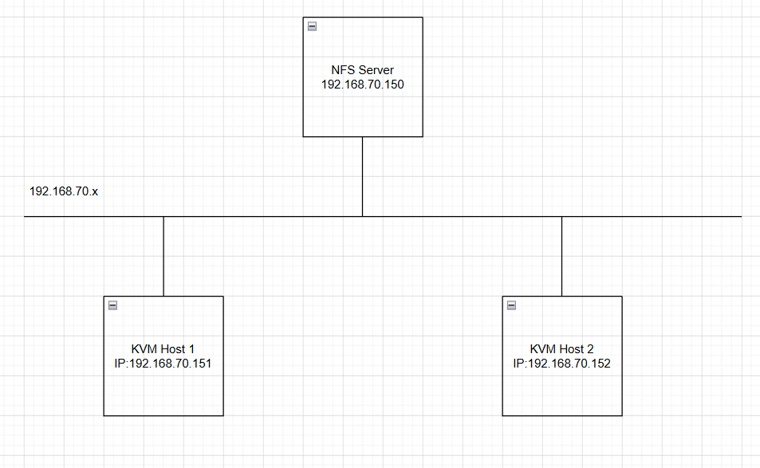

### 3. Quy hoạch địa chỉ IP

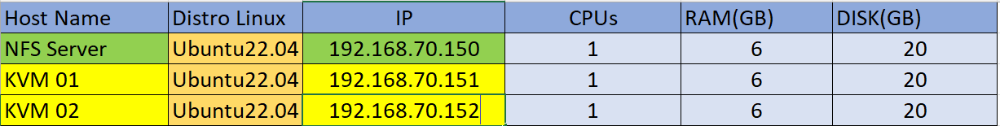

### 4. Nắm rõ cơ chế cơ bản của Live Migrate

Về cơ bản cơ chế di chuyển vm khi vm vẫn đang hoạt động. Quá trình trao đổi diễn ra nhanh các phiên làm việc kết nối hầu như không cảm nhận được sự gián đoạn nào. Quá trình **Live Migrate** được diễn ra như sau:

- Bước đầu tiên của quá trình Live Migrate: **1 ảnh chụp** ban đầu của **VM** cần chuyển trên **Host1** được chuyển **sang VM trên host2**.
- Trong trường hợp người dùng đang truy cập VM tại **Host1** thì **những sự thay đổi** và **hoạt động trên host2** vẫn **diễn ra bình thường**, tuy nhiên những thay đổi này sẽ không được ghi nhận.
- **Những thay đổi** của **VM** trên **host1** được **đồng bộ liên tục đến host2**.
- Khi đã **đồng bộ xong** thì **VM** trên **host1** sẽ **offline** và **các phiên truy cập** trên **host1** được chuyển **sang host2**.

## II THỰC HIỆN BÀI LAB

### 1. `Bước 1`: Cấu hình phân giải tên miền

Để có thể live migrate giữa 2 KVM host thì 2 máy cần biết tên miền của nhau. Ta có thể cấu hình DNS phân dải tên miền cho cả 2 máy, tuy nhiên đây là mô hình lab nhỏ nên ta có thể cấu hình thẳng vào `file host` trên 2 máy: `sudo nano /etc/hosts`

Trên **KVM Host 1**:

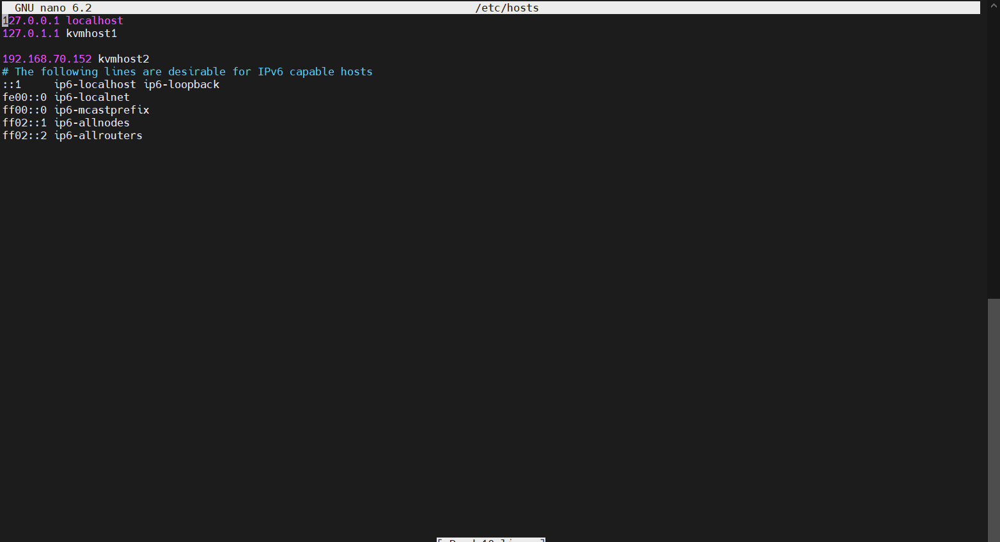

Trên **KVM Host 2**:

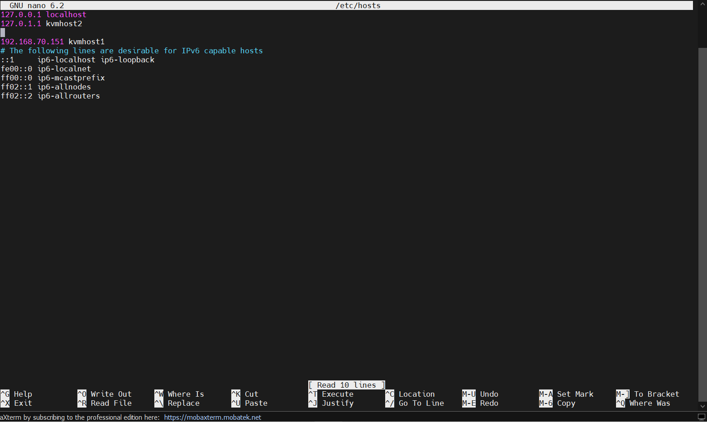

### 2. `Bước 2`: Cài đặt NFSServer/ Cấu hình NFS cho 2 KVM Host

Trên **NFSServer**:

```bash
sudo apt update
sudo apt install -y nfs-kernel-server
```

Ở đây ta Tạo 1 thư mục để làm thư mục Share (Tạo một thư mục có dir `/root/storage`):

```bash
sudo mkdir /root/storage
```

Chia sẻ thư mực này với các máy KVM host bằng cách ghi các thông tin như sau vào trong file `/etc/exports`:

```bash
sudo nano /etc/exports

# Thêm
/root/storage 192.168.70.151/24(rw,sync,no_subtree_check,no_root_squash)
/root/storage 192.168.70.152/24(rw,sync,no_subtree_check,no_root_squash)
```

Trong đó:

- `rw`:Cho phép đọc/ghi.
- `sync`: Ghi dữ liệu vào ổ cứng rồi mới báo thành công.
- `no_subtree-check`:Tăng độ ổn định trong lúc client đổi tên file khi đang mount.
- `no_root_squash`: Cho Client có thể truy cập file này mà không vướng quyền `root`.
- Địa chỉ bên trên là địa chỉ 2 máy **KVM Host**.

Cập nhật lại file vừa chỉnh sửa:

```bash
exportfs -a
```

Khởi động lại dịch vụ NFS:

```bash
sudo systemctl enable nfs-server
sudo systemctl start nfs-server
sudo systemctl status nfs-server
```

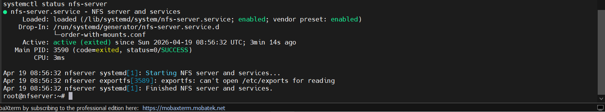

Trên **2 máy KVM Host**:

Cài gói `NFS-common`(Gói cho các KVMHost có thể cấu hình lấy file share từ **NFSServer**):

```bash
sudo apt install -y nfs-common
```

Ở đây ta tạo thư mục mới để mount **file share** trên **NFSServer**:

```bash
sudo mkdir -p /mnt/storage

# Cấp quyền
sudo chmod 777 /mnt/storage

```

Cuối cùng ta **mount file share trên NFSServer** với **file mới** ta vừa tạo trên **KVM Host**:

```bash
sudo mount -t nfs -o vers=3,rw,sync,noatime 192.168.70.150:/root/storage /mnt/storage
```

Tạo storage pool trong libvirt

```bash
sudo apt update
sudo apt install libvirt-clients
sudo apt install libvirt-daemon-system -y
sudo systemctl daemon-reload
sudo systemctl enable --now libvirtd
sudo virsh pool-define-as nfs-pool dir - - - - /mnt/storage
sudo virsh pool-start nfs-pool
sudo virsh pool-autostart nfs-pool
sudo virsh pool-list --all
```

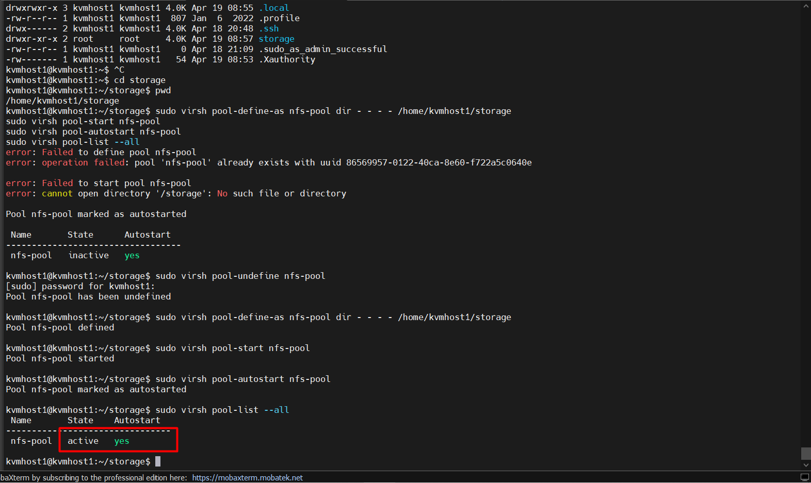

=> Xuất hiện chữ `active` và `yes` là thành công

Mount tự động khi khởi động:

```bash
echo "192.168.70.150:/root/storage/ /mnt/storage nfs defaults 0 0" | sudo tee -a /etc/fstab
```

**Lưu ý quan trọng**: Nếu không làm bước này sau khi khởi động lại mount tự ngắt, khi mount lại disk lưu ở **NFS Server** sẽ dẫn đến lỗi -> phải cài lại máy ảo từ đầu.

### 3. Cài đặt VM trên KVM Host

Đầu tiên ta cài các gói cần thiết cho KVM tham khảo [tại đây](https://github.com/tiend9/system-intership/blob/master/TienHA/15.KVM/02.KVM_basics/02.KVM_Install.md)

Tiếp theo là bước tạo 1VM trên mỗi **KVM Host**, ta tham khảo tại [đây](https://github.com/tiend9/system-intership/blob/master/TienHA/15.KVM/02.KVM_basics/03.Create_VM_in_KVM_Host.md)

Thực hiện cài đặt trên cả 2 máy **KVMHost**:

Tạo trước trên **KVM Host1** một con VM:

```bash
sudo qemu-img create -f qcow2 /mnt/storage/testvm.qcow2 10G
sudo virt-install \
--name testvm \
--ram 2048 \
--vcpus 2 \
--disk path=/mnt/storage/testvm.qcow2 \
--cdrom /var/lib/libvirt/file-iso/ubuntu-22.04.5-live-server-amd64.iso \
--network network=default \
--graphics vnc
```

- Vào file `/etc/ssh/sshd_config` để bật X11

- Khi cài đặt VM ta cần lưu file disk của VM vào thư mục đã mount với thư mục được share của NFSServer.

Khi cài máy ảo xong và boot xong ta cần thêm thông tin sau vào trong file `.xml` bằng cách dùng lệnh:

```bash
virsh edit <tên-VM>
```

- Thêm vào `cache='none'` để tránh trường hợp migrate bị mất dữ liệu:

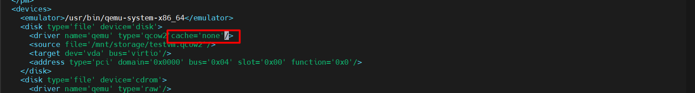

=> Sau đó define file `.xml` rồi reboot lại **VM**.

### 4. Kết nối giữa 2 KVM Host

Thực hiện trên 2 **KVMHost**:

```bash
sudo sed -i 's/#listen_tls = 0/listen_tls = 0/g' /etc/libvirt/libvirtd.conf 
sudo sed -i 's/#listen_tcp = 1/listen_tcp = 1/g' /etc/libvirt/libvirtd.conf
sudo sed -i 's/#tcp_port = "16509"/tcp_port = "16509"/g' /etc/libvirt/libvirtd.conf
sudo sed -i 's/#listen_addr = ""/listen_addr = "0.0.0.0"/g' /etc/libvirt/libvirtd.conf
sudo sed -i 's/#auth_tcp = "sasl"/auth_tcp = "none"/g' /etc/libvirt/libvirtd.conf
sudo sed -i 's/#libvirtd_opts="--listen"/libvirtd_opts="--listen"/g' /etc/default/libvirtd
```

Trong đó:

- `listen_tls = 0`: Tắt chế độ bảo mật **TLS**. Điều này có nghĩa là ta không cần chứng chỉ (certificate) để kết nối. (Lưu ý: Chỉ nên dùng trong Lab vì nó không mã hóa).
- `listen_tcp = 1`: Mở cổng TCP để cho phép các kết nối mạng không mã hóa.(`1`/`0` là trạng thái tắt/mở)
- `tcp_port = "16509"`: Đây là **cổng mặc định của Libvirt**. Ta mở cửa để lắng nghe cổng này.
- `listen_addr = "0.0.0.0"`: Ép Libvirt nghe trên tất cả các địa chỉ IP của máy Host (bao gồm cả IP của card Bridge, NAT, và Host-only).
- `auth_tcp` = `"none"`: Tắt xác thực. Ai cũng có thể SSH, trên product không lên dùng lệnh này.

Ngoài ra, cần thay đổi trong file cấu hình mặc định của `libvirtd`:

```bash
sudo nano /etc/default/libvirtd

# Chỉnh dòng
libvirtd_opts="--listen"

# Dòng này cực kỳ quan trọng. Nó bảo hệ điều hành rằng: "Khi khởi động dịch vụ Libvirtd, hãy thêm tham số --listen vào". Nếu không có dòng này, dù ta sửa file .conf ở trên VM (KVMHost)cũng sẽ không bao giờ mở cổng TCP.
```

Nếu mà ta chưa tắt `ufw` hay có cấu hình `iptables`(Ở trên ta đã tắt rồi) thì ta sẽ cấu hình cho phép mở port sau:(Còn trong bài hướng dẫn mình disable `ufw` lên không cần làm bước này!)

```bash
sudo ufw allow 16509/tcp
sudo ufw allow 5900:5999/tcp
sudo ufw reload
```

Restart lại libvirtd trên cả 2 máy:

```bash
sudo systemctl restart libvirtd
```

Check xem các port đã mở chưa:

```bash
sudo ss -tulpn | grep 16509

# Nó hiện chữ Listen thì OKE
```

### 5. Tiến hành Live Migrate

Kiểm tra trên VM **KVM Host 1**

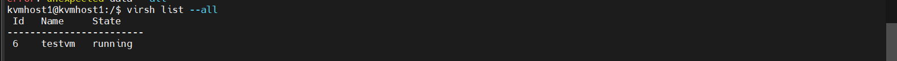

Kiểm tra trên **KVM Host 2** không có VM nào:

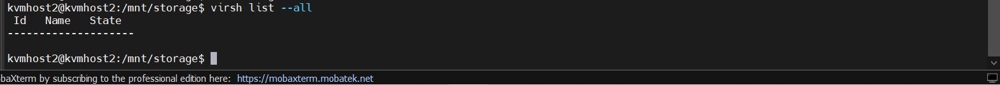

Trước khi migrate, ta chạy lệnh ping trên ubuntu 22.04 của **KVMHost1**


Live Migrate từ **KVM Host1**(`192.168.70.151`) sang **KVM Host 2**(`192.168.70.152`) Thực hiện câu lệnh trên **KVM Host 1**:

```bash
virsh migrate --live testvm qemu+tcp://192.168.70.152/system
```

=> Sau khi quá trình hoàn tất, VM trên **KVMHost 1** sẽ ở trạng thái **Shutoff** và VM chuyển sang **KVMHost 2** ở trạng thái **Running**.

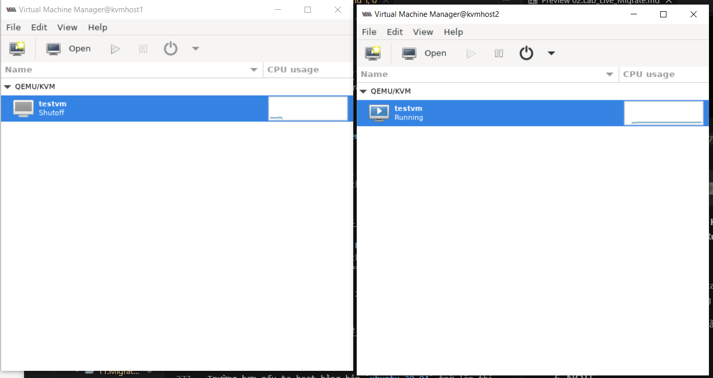

Lúc này ta mở VM ở trên **KVM Host 2** ta sẽ thấy lệnh ping `8.8.8.8` đang chạy do trạng thái lúc cuối **KVM Host 1** ta đang ping đã chuyển sang cho **Host2**.

Sau khi chuyển qua **KMV Host 2**, **VM** vẫn giữ nguyên IP và dữ liệu cũ.

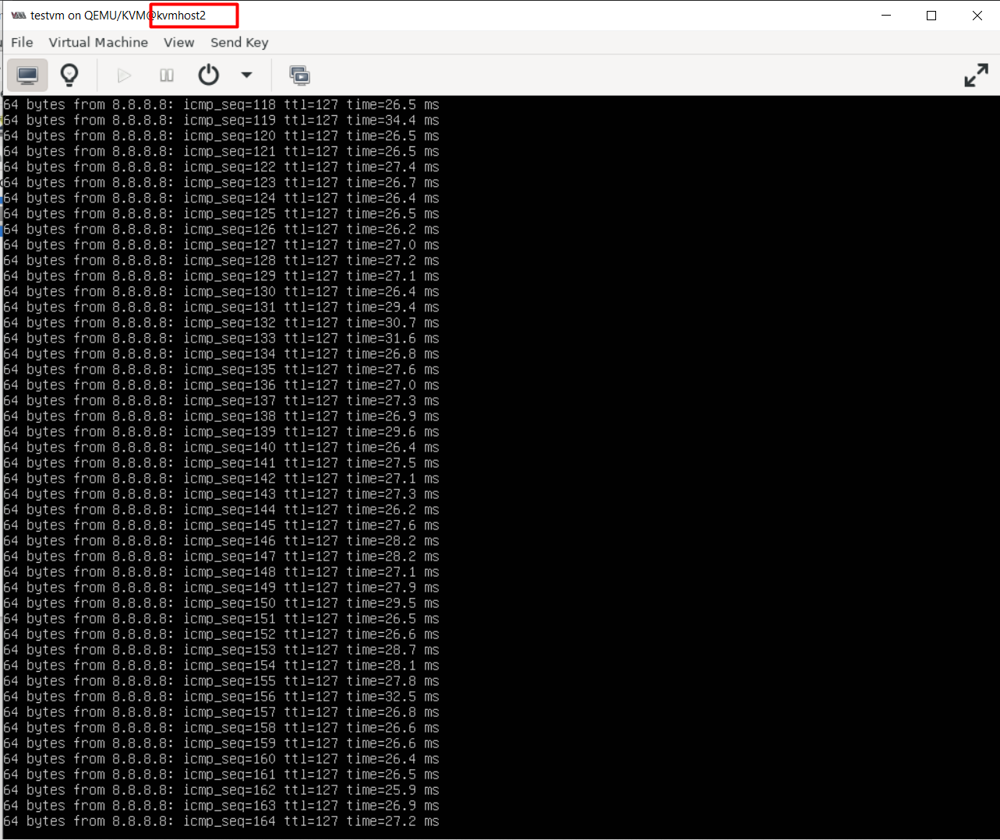

### 6. NOTE

Trường hợp nếu ta boot bằng bản `ubuntu 20.04` trở lên thì khả năng ngoài cấu hình file `default` của libvirt ra thì Libvirt quản lý việc mở port thông qua **systemd sockets**. Nếu socket này chưa chạy, `port 16509` sẽ không bao giờ mở.

Ngoài ra, ta lên để cho **systemd sockets** quản lí `port 16509` thôi thay vì để `libvirtd` quản lí(Không sẽ xảy ra xung đột). Các bước khắc phục như sau:(Trên **Host2** - tuỳ theo host nào nhận)

`Bước 1`: Dừng hết các dịch vụ liên quan

Ta cần giải phóng cổng `16509` hoàn toàn trước khi cấu hình lại:

```bash
sudo systemctl stop libvirtd
sudo systemctl stop libvirtd.socket
sudo systemctl stop libvirtd-tcp.socket
sudo systemctl stop libvirtd-ro.socket
```

`Bước 2`: Vô hiệu hóa cấu hình TCP trong file `.conf`

1. Mở file: `sudo nano /etc/libvirt/libvirtd.conf`

2. Tìm và thêm dấu # vào các dòng sau:

```bash
#listen_tcp = 1

#tcp_port = "16509"

#listen_addr = "0.0.0.0"
```

3. Nhưng phải giữ nguyên (không được comment) dòng này để không bị hỏi mật khẩu:

```bash
auth_tcp = "none"
```

`Bước 3`: Khởi động lại theo thứ tự ưu tiên

Đây là bước quyết định. Mày phải gọi thằng Socket lên trước để nó đi "đặt chỗ" cổng 16509 cho hệ thống.

```Bash
# Reload lại cấu hình hệ thống
sudo systemctl daemon-reload

# Bật socket TCP trước
sudo systemctl enable --now libvirtd-tcp.socket

# Sau đó mới bật dịch vụ chính
sudo systemctl start libvirtd
```

`Bước4`: Kiểm tra cổng đã mở chưa

=> Nếu hiện `LISTEN` thì đã thành công

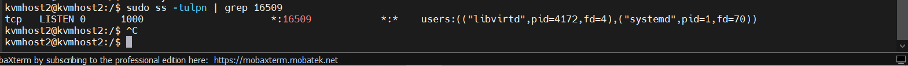
