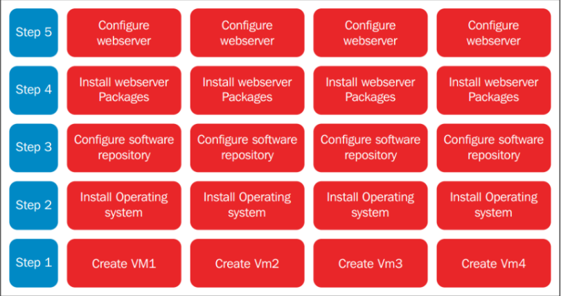
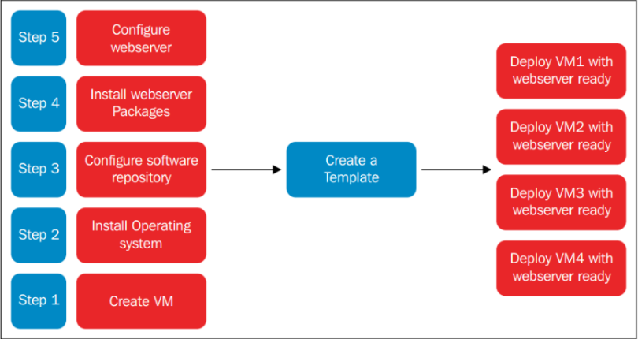

# TÌM HIỂU TEMPLATE VM

## I. TEMPLATE LÀ GÌ ?

### 1. Khái niệm

**VM template** (virtual machine template) là một bản sao được chuẩn bị sẵn của một máy ảo (VM). Nó bao gồm hệ điều hành đã được cài đặt, các ứng dụng, cấu hình mạng và các thiết lập khác, được dùng làm cơ sở để tạo nhanh các máy ảo mới.

Thay vì phải cài đặt và cấu hình thủ công từng máy ảo từ đầu, người dùng có thể sử dụng một template để sao chép hàng loạt các máy ảo giống hệt nhau. Điều này giúp tiết kiệm thời gian, đảm bảo tính nhất quán và giảm thiểu sai sót trong quá trình triển khai.

### 2. Đặc điểm của VM template

- **Read-only**: Template thường được đánh dấu chỉ đọc, để không ai vô tình khởi động hay thay đổi nó.
- **Chuẩn hóa**: VM được tạo từ **template** đều có cấu hình **OS**, **phần mềm**, **driver**… giống nhau.
- **Nhanh chóng**: Thay vì cài đặt OS từ đầu, bạn chỉ việc deploy từ **template** → tiết kiệm thời gian.
- **Tự động hóa**: Kết hợp với công cụ như **cloud-init** (Linux) hoặc **Sysprep** (Windows), các máy ảo sinh ra từ template sẽ tự động đổi hostname, user, IP… để tránh bị trùng lặp.

**Ví dụ**:



Đây là các bước để tạo VM thông thường. Bước `2-5` đều lặp lại => tốn thời gian.Cho nên gộp bước `2-5` thành 1 cái **template** chứa các gói cần cài sẵn



### 3. Mục đích

- Điều này giúp tạo nhiều **VM** có cấu hình đồng nhất.
- Tiết kiệm thời gian thay vì cài đặt OS từ ISO mỗi lần.
- Đảm bảo tính nhất quán trong môi trường Lab hoặc Production.

### 4. Sự khác nhau giữa Clone và Template

#### 4.1 Clone VM

- **Định nghĩa**: Là một bản **VM** đã được chuẩn hoá (Cấu hình OS, phần mềm cơ bản,update sẵn...) rồi được chuyển sang trạng thái **Read-only** để dùng làm mẫu.

- **Mục đích**: Dùng để triển khai nhiều VM giống nhau nhanh chóng mà không phải cài đặt lại từ đầu.

- **Đặc điểm**:

  - Có thể clone cả VM đang chạy (**hot clone**) hoặc VM đã tắt (**cold clone**).
  - Bản clone giữ nguyên mọi thứ: **hostname**, **IP**, **config**, **dữ liệu**.
  - Nếu không chỉnh sửa sau **clone** → dễ gây trùng lặp (IP trùng, hostname trùng).
  - Clone nhanh chóng nhưng không “chuẩn hóa” như **template**.

#### 4.2 Template VM

- **Định nghĩa**: Là bản sao chép nguyên xi (copy) từ 1 **VM** đang chạy hoặc đã tắt.

- **Mục đích**: Dùng khi muốn nhân đôi 1 **VM**  cụ thể (bao gồm cả trạng thái OS, dữ liệu, ứng dụng hiện tại).

- **Đặc điểm**:

  - Không dùng trực tiếp để chạy (Thường không boot **Template**)
  - Khi cần **VM** mới  -> Ta deploy từ **Template**.
  - Đảm bảo tính thống nhất (các VM sinh ra **Template** giống nhau)
  - Trong các hệ thống lớn như **vSphere**, **Promox**, **KVM** + **OpenStack** -> **Template** giúp tạo **cloud-init** hoặc **sysprep** để tự động thay hostname, IP, user,...

### 5. Hai phương thức triển khai máy ảo

#### 5.2 Thin

**VM mới không sao chép toàn bộ disk của template**, mà **dùng chung disk gốc** và **chỉ ghi phần thay đổi**.

- **Cách hoạt động**:

```bash
Base Image (gốc, read-only)
        ↓
Overlay (VM1)
Overlay (VM2)
```

- **Ưu điểm**: Tiết kiệm dung lượng, tạo VM cực nhanh.
- **Nhược điểm**:

  - Không phụ thuộc vào nhau, xoá 1 cái không ảnh hưởng cái còn lại
  - Tuy nhiên, bị tốn dung lượng và tạo chậm.

#### 5.3 Clone (full-clone)

**VM mới copy toàn bộ disk** của **VM cũ**

- **Ưu điểm**:

  - Tạo file disk mới (qcow2/img)
  - Copy toàn bộ dữ liệu từ máy gốc
  - 2 VM độc lập hoàn toàn
  - Không còn bị phụ thuộc vào nhau
- **Nhược điểm**: Tốn dung lượng vào tạo chậm

## II. VIRT-SYSPREP

### 1. Virt-sysprep là gì?

**Virt-sysprep** là một công cụ thuộc bộ **libguestfs** trong Linux, được dùng để chuẩn bị (**sysprep** = **system preparation**) một máy ảo hoặc một disk image trước khi dùng làm **template** hoặc **clone**.

### 2. Chức năng chính

`virt-sysprep` sẽ **xoá** hoặc **reset** các **thông tin nhạy cảm/định danh** trong máy ảo để **tránh bị trùng** khi nhân bản nhiều VM.

- Hostname
- SSH host-key
- Machine-id
- Lịch sử bash
- Log hệ thống
- MAC/IP
- User password

Tool này được dùng khi:

- Trước khi biến một **VM** -> **template VM**.
- Trước khi clone một **VM** -> **VM Mới** không bị trùng định danh mạng (MAC, hostname)
- Khi muốn **làm sạch** một **VM** khi phát hành ra 1 môi trường mới.

### 3. Cách sử dụng (Quan trọng)

Để cho dễ hình dung **ta lấy ví dụ**:

- Ta có disk image `ubuntu22.04.5.qcow2` muốn chuẩn bị làm **Template**:

```bash
virt-sysprep -a /var/lib/libvirt/images/ubuntu22.04.5.qcow2
```

=> Câu lệnh `virt-sysprep` giúp: xóa hoặc reset các thông tin đặc trưng của máy để VM trở thành **Template** sạch.

**Lưu ý**: Có 2 options để dùng `virt-sysprep`đó là `-a` và `-d`:

- `-a` : Được dùng với đường dẫn tới ổ đĩa máy ảo.
- `-d` : Được dùng với tên hoặc **UUID** của máy ảo.
