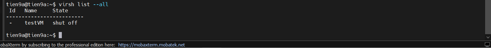
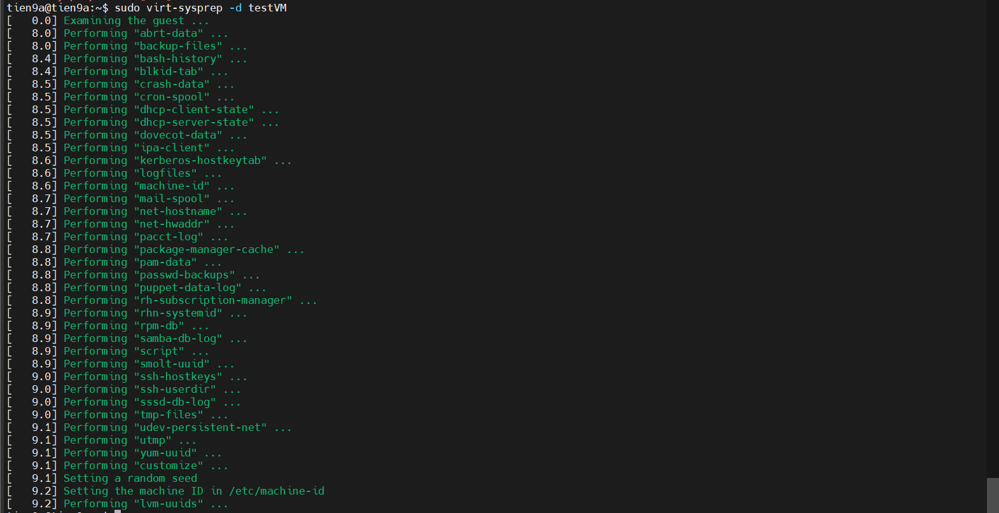
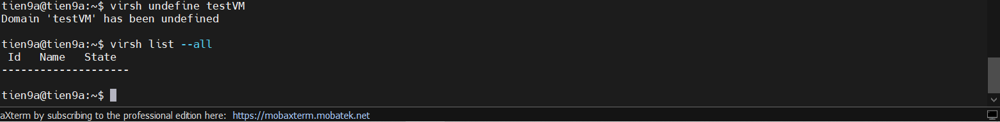
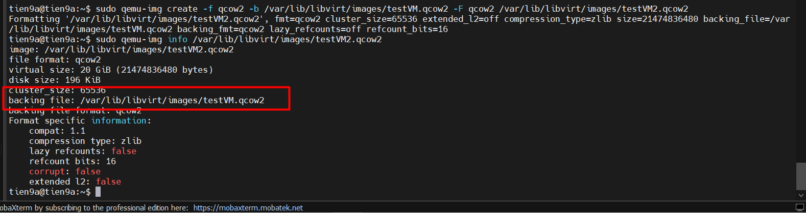
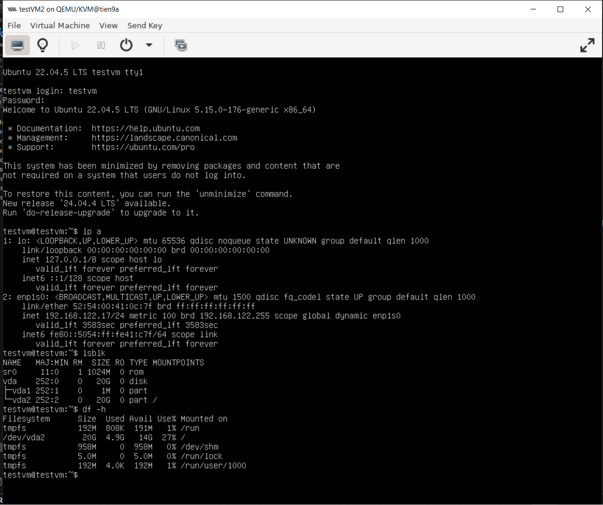

# LAB CREATE TEMPLATE VM

## I. MỤC TIÊU

Trên **Host KVM** ta tạo một VM có tên `testVM` và cài các gói cần thiết. Rồi sau đó:

- Tạo template từ chính máy ảo `testVM`
- Rồi từ cái temple đó ta tạo một VM mới nhưng với thông tin định danh mới

## II. CREATE TEMPLATE FROM ACTIVE VM

### 1. `Bước 1`: Tạo VM `testVM` trên HostKVM có sẵn

Cài đặt 01 VM tên `testVM` (ubuntu 22.04) trên **Host KVM**. Cài đặt các gói cần thiết dùng làm **Template**(Ví dụ `iputils-ping`, `net-tools`, `ssh`,...v.v):

### 2. `Bước 2`: Cấu hình trên KVM Host để tạo ra Template

Shutdown VM:

```bash
virsh shutdown testVM
```

-> Tắt máy để tránh xung đột khi sửa.



Cài đặt gói `libguestfs-tools`:

```bash
sudo apt install -y libguestfs-tools
```

Chạy `virt-sysprep` để loại bỏ những thông tin định danh của hệ thống đồng thời niêm phong và biến máy ảo trở thành template

```bash
sudo virt-sysprep -d testVM
```



Ta back up cho file `.xml` để tái sử dụng:

```bash
# Tạo folder lưu trữ template
sudo mkdir -p /etc/libvirt/templates

# Lưu file XML của VM làm template
virsh dumpxml testVM > /etc/libvirt/templates/testVM-template.xml
```

Cuối cùng **undefine VM**:

```bash
virsh undefine testVM
```

=> Xóa định nghĩa VM khỏi libvirt, giữ image làm template (`/var/lib/libvirt/images/testVM.qcow2`).



## III. CREATE VM FROM TEMPLATE

### `Bước 1`: Tạo file image mới từ template

```bash
sudo qemu-img create -f qcow2 -b /var/lib/libvirt/images/testVM.qcow2 -F qcow2 /var/lib/libvirt/images/testVM2.qcow2
```

Kiểm tra **Backing File**:

```bash
sudo qemu-img info /var/lib/libvirt/images/testVM2.qcow2
```



Dùng `virsh-clone` để tạo máy ảo mới từ file `.xml`:

```bash
virt-clone --original-xml /etc/libvirt/templates/testVM-template.xml --file /var/lib/libvirt/images/testVM2.qcow2 --name testVM2 --preserve-data
```

- Nếu muốn VM có Disk tách hẳn ra, ta thay `--preserve-data` thành `--auto-clone`

Kiểm tra máy ảo đã tạo:



-> Tiến hành download 1 số thứ rồi kiểm ta dung lượng. Máy ảo được tạo ra sẽ có dung lượng file image đúng bằng dung lượng file bạn vừa down. Cơ chế hoạt động giống như **Thin Provisioning** giúp tiết kiệm bộ nhớ tuy nhiên nếu **file template** bị remove, các máy ảo tạo từ nó cũng sẽ không thể chạy được nữa.
