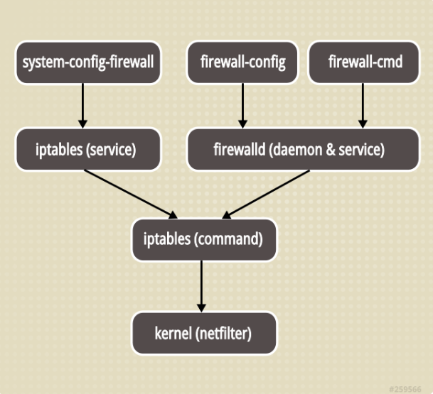
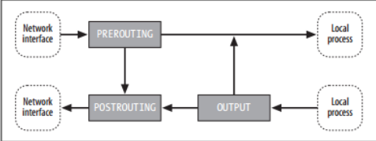
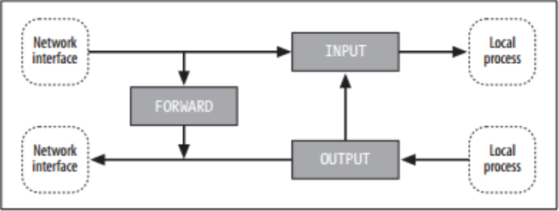
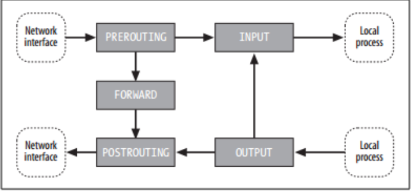
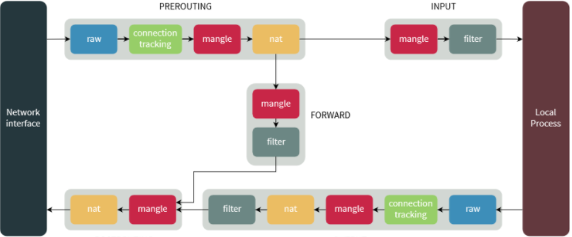
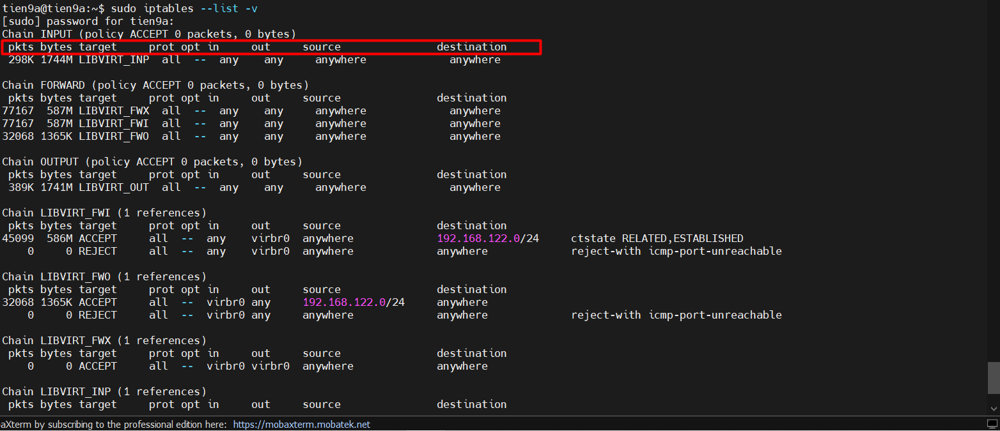
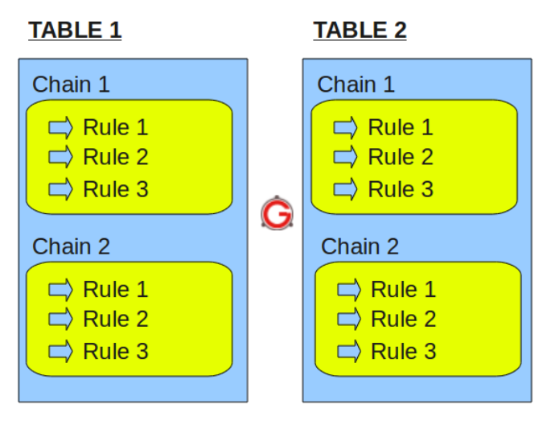
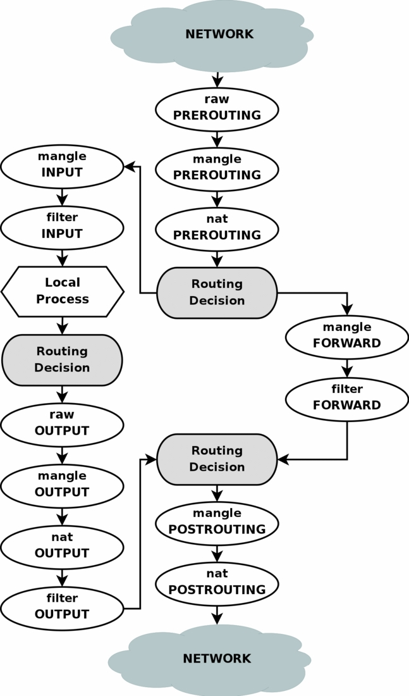
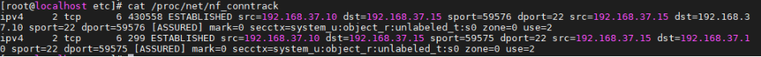

# TIMF HIỂU VỀ IPTABLES

## I. IPTABLES LÀ GÌ ?

### 1. Định nghĩa

**Iptables** là **firewall software cơ bản** được dùng nhiều nhất trong linux, được dùng để tạo tưởng lửa cho máy linux của bạn, nó **có các chức năng lọc gói tin**, nat gói tin qua đó để giúp làm nhiệm vụ bảo mật thông tin cá nhân tránh mất mát thông tin và áp dụng những chính sách đối với người sử dụng. **Iptables** hoạt động bằng cách giao tiếp với **packet filtering hooks** trong **Linux kernel's networking stack**. Các **hooks** này là **netfilter framework**.

**Netfilter** là **packet filtering framework** bên trong **Linux kernel 2.4.x** và các phiên bản tiếp theo. Đây là phiên bản nâng các của **ipchains** cũng như **ipfwadm** trong những phiên bản **linux kernel 2.0.x** và **2.2.x netfilter** là một danh sách các **hooks** nằm bên trong **Linux kernel**, nó cho phép **kernel modules** thực hiện các tác vụ đối với **Network stack**.

Về cơ bản, **IPtables** chỉ là giao diện dòng lệnh để tương tác với **packet filtering** của **netfilter framework**. Cơ chế **packet filtering** của **IPtables** hoạt động gồm 3 thành phần là **Tables**, **Chains** và **Targets**.

Các **firewall software** khác chỉ đơn giản là **sử dụng lại cơ chế** hoặc **cung cấp GUI interface** để người dùng thao tác với **iptables**.


### 2.Các tính năng chính

Gồm 3 tính năng chính đó là:

- stateless packet filtering (IPv4 & IPv6)
- stateful packet filtering (IPv4 and IPv6)
- all kinds of network address and port translation

Trong đó:

- `stateful filter` sẽ giữ 1 danh sách các connections đã được thiết lập, nó được cho là có hiệu quả hơn trong việc phát hiện các gói tin giả mạo

- `stateless filter` không giữ danh sách ấy, mọi packet đều được process một cách độc lập với nhau. Nó được cho là sẽ xử lí gói tin nhanh hơn.

### 3. Chắc năng của Iptables

- Xây dựng một hệ thống tưởng lửa cho hệ thống dựa trên stateless và stateful packet filtering
- Triển khai một cụm cluster stateless và stateful firewall
- Dùng NAT để chia sẻ kết nối internet
- Dùng NAT để xây dựng transparent proxies
- Thực hiện một số tác vụ với packet như thay đổi TOS/DSCP/ECN trong IP header

## II. SỰ KHÁC BIỆT GIỮA IPTABLES VÀ FIREWALL

**Firewalld** là phiên bản **firewall** mới mặc định được sử dụng trong các phiên bản **RHEL** để thay thế cho interface của **iptables**. Về bản chất, nó vẫn kết nối tới **netfilter kernel code**. **Firewalld** tập trung chủ yếu vào việc cải thiện vấn đề quản lí rules bằng cách cho phép thay đổi cấu hình mà không bị mất các kết nối hiện tại.

Hình dưới đây mô tả tổng quan mối quan hệ giữa **iptables** và **firewalld**:



### 1. Điểm giống

Như vậy cả 2 đều sử dụng **iptables tool** để giao tiếp với **kernel packet filter**

### 2. Điểm khác

Chúng nó có 2 nơi lưu cấu hình khác nhau. Đối với:

- **iptables service** lưu config ở `/etc/sysconfig/iptables` và `/etc/sysconfig/ip6tables`
- **firewalld** là các file `.xml` lưu trong `usr/lib/firewalld`.

### 3. Lưu ý

- `/etc/sysconfig/iptables` không tồn tại nếu chưa cài đặt **iptables service** bởi mặc định **firewalld** mới là dịch vụ được cài đặt.

- Đối với **iptables**, mỗi một thay đổi **đồng nghĩa với việc hủy bỏ toàn bộ** các **rules cũ** và **load lại** một loạt các **rules mới** trong file `/etc/sysconfig/iptables`. Trong khi đó với **firewalld**, chỉ những thay đổi mới được **applied**. Vì thế **firewalld** có thể thay đổi cài đặt trong thời gian runtime mà không làm mât bất cứ kết nối nào.

## III. CÀI ĐẶT IPTABLES

**Lưu ý quan trọng**:

- Đối với các phiên bản **CentOS/RHEL7** trở lên, **firewalld** đã được dùng để thay thế cho **iptables**. Tuy nhiên, ta vẫn có thể cài đặt và sử dụng **iptables** thay cho **firewalld**.(Với ubuntu là **ufw**)

- Chỉ nên dùng 1 trong 2 service này. (hoặc là dùng **iptables**, hoặc là dùng **firewall**)

- Đối với **CentOS/RHEL7**, khi bạn tắt **firewalld** (mặc định) hoặc tắt **iptables service**. Các **iptables rules** cũng sẽ biến mất -> Một số service hoạt động dựa trên nó như **network default** của **KVM** (LB) cũng sẽ bị ảnh hưởng.

- Đối với **Ubuntu/Debian**, **ufw** là **firewall mặc định**. Tuy nhiên khi **disable ufw**, các **iptables rules** không bị mất đi. Mặc dù vậy, để có thể lưu lại các **iptables rules** đã cấu hình, bạn cần cài thêm gói `iptables-persistent`

### 1. `Bước 1`: Cài đặt gói iptables

```bash
yum install -y iptables-services
```

### 2. `Bước 2`: Disable firewalld service

```bash
systemctl stop firewalld
systemctl disable firewalld
```

### `Bước 3`: Cho phép iptables service khởi động cùng hệ thống và khởi chạy nó

```bash
systemctl enable iptables
systemctl start iptables
```

### `Bước 4`: cấu hình cho iptables để có thể lưu lại các rule đã tạo ra khi ta restart lại iptables

```bash
vi /etc/sysconfig/iptables-config
```

Tìm đến 2 dòng sau:

```bash
IPTABLES_SAVE_ON_STOP="no"
IPTABLES_SAVE_ON_RESTART="no"
```

-> Chuyển `no` sang `yes` để vẫn lưu config khi restart

```bash
IPTABLES_SAVE_ON_STOP="yes"
IPTABLES_SAVE_ON_RESTART="yes"
```

## IV. CÁC KHÁI NIỆM CƠ BẢN

### 1. NAT

**Mô hình packet đi qua hệ thống để NAT**:



- Mỗi một kết nối trước khi được xử lý đều có **địa chỉ nguồn** (**source ip address**) và **địa chỉ đích** (**destination ip address**) được chứa trong thông tin của các gói tin. NAT trong **netfilter** đơn giản là việc thực hiện **thay đổi địa chỉ đích** và **port** theo một cách mong muốn.

- Khi các gói tin được nhận, các kết nối cũng sẽ được thực so sánh lại một lần nữa với địa chỉ đích (bao gồm cả port). Việc không phân mảnh cũng là một yêu cầu quan trọng dành cho NAT. (Nếu cần thiết, các gói tin IPv4 cũng sẽ được sắp xếp lại theo ngăn xếp giống như bình thường)

### 2. Filtering



- Là quá trình chặn bắt gói tin theo một số tiêu chí mà ta đề ra.

- **Giả sử**: Khi một gói tin đi đến sẽ chứa các giá trị về **địa chỉ IP nguồn** (**source address**), **địa chỉ IP đích** (**destination address**) và các **port tương ứng** (**port nguồn** và **port đích**). Khi ta thực hiện **filtering** gói tin theo tiêu chí địa chỉ **IP nguồn**. Thì các gói tin có địa chỉ **IP nguồn khớp** với **địa chỉ IP mà ta đề ra** sẽ được **giữ lại để chờ xử lý**.

### 3. Mangle



Là quá trình bóc tách gói tin và chịu trách nhiệm thay đổi bits của **QoS** (Quality of Services) trong **IP Header** bởi vì `mangle` làm việc với các gói tin IP.

### 4. table

Trong kiến trúc của **iptable** có sử dụng các bảng để quy định các **chain** cùng thực hiện các chức năng trong một không gian nhất định với công việc nhất định.

**iptable** cung cấp 5 loại table:

- `NAT` table
- `FILTER` table
- `MANGLE` table
- `RAW` table
- `Security` table

**Iptables** thường dùng 3 bảng chính: `filter`, `mangle`, và `nat`.

| Table  | Description                                                                                                                                                                                                                                                                            |
| ------ | -------------------------------------------------------------------------------------------------------------------------------------------------------------------------------------------------------------------------------------------------------------------------------------- |
| nat    | dùng để NAT, thường dựa vào địa chỉ nguồn hoặc đích. Nó có 3 chains là: `OUTPUT`, `POSTROUTING` và `PREROUTING`                                                                                                                                                                        |
| filter | dùng để thiết lập policy cho các traffic vào, qua và ra khỏi hệ thống. Iptables lấy đây làm table default, nếu bạn không khai báo bất cứ thông tin gì về table trong câu lệnh, iptables sẽ mặc định áp dụng nó cho filter table. Nó bao gồm các chains: `FORWARD`, `INPUT` và `OUTPUT` |
| mangle | Dùng để thay đổi một số thông tin cụ thể của packet. Nó có các chains là: `FORWARD`, `INPUT`, `OUTPUT`, `POSTROUTING` và `PREROUTING`                                                                                                                                                  |

### 5.Chain

- `chain` là một quy tắc xử lý các gói tin bao gồm nhiều rules có liên quan tới nhau.

- Mỗi **table** sẽ được tạo với một hoặc nhiều chain. chain cho phép lọc gói tin tại các điểm khác nhau. **iptable** có thể được thiết lập đối với các loại `chain` như sau:

  - `PREROUTING` : các rule thuộc chain này sẽ được áp dụng ngay sau khi gói tin vừa đi vào đến dải mạng(Network interface). chain này chỉ có thể có ở table `NAT`, `RAW`, `MANGLE`.
  - `INPUT` : Các rule thuộc chain này sẽ áp dụng cho các gói tin ngay trước khi gói tin đi vào hệ thống. chain này có trong table `MANGLE` và `FILTER`.
  - `OUTPUT`: Các rule thuộc chain này áp dụng ngay cho các gói tin đi ra từ hệ thống. chain có trong table `MANGLE`, `RAW` và`FILTER`.
  - `FORWARD`: Các rule thuộc chain này áp dụng các gói tin được chuyển tiếp qua hệ thống. chain có trong table `MANGLE`.
  - `POSTROUTING` : Các rule thuộc chain này áp dụng cho các gói tin tới dải mạng (Network Interface). chain này có trong table `MANGLE` và `NAT`

Hình ảnh dưới đây thể hiện thứ tự xử lý các table và chain trong khi xử lý gói tin:



### 6. Rules

`rule` là một luật, hành động cụ thể xử lý gói tin ứng với mỗi trường hợp, tiêu chí mà ta đề ra.

Ta sẽ xem mỗi rule có các trường nào: `iptables --list -v`



Như trên hình, ta thấy các cột: `target`, `prot`, `opt`, `in`, `out`, `source`, `destination`.

Trong đó:

- `target` : hành động sẽ thực thi cho mỗi rule
- `prot` : viết tắt của protocol. Tức là các giao thức áp dụng thực thi rule này. Có 3 lựa chọn : all, tcp, udp (các giao thức như ssh, ftp, ... đều là kiểu giao thức TCP)
- `opt` : Ít khi được sử dụng, nó mô tả các tùy chọn có liên quan đến IP
- `in` : thiết bị mạng nhận kết nối vào được áp rule. Ví dụ : lo, virbr0, eth0, ...
- `out` : thiết bị mạng gửi yêu cầu kết nối ra ngoài được áp rule. Ví dụ : any, br0, ...
- `source` : địa chỉ nguồn được áp rule
- `destination` : địa chỉ đích được áp rule

### 7. Match

Có vô số các match có thể sử dụng với iptables. Ví dụ như Internet Protocol (IP) matches (protocol, source, hoặc destination address).

### 8. Port

- `Port` là một vị trí nào đó mà gói tin `TCP/UDP` vào và ra trong thiết bị. Một địa chỉ IP có rất nhiều port.

- Tất cả các port đều được định danh bởi các con số `-port` number

- Một vài dịch vụ và port nó sử dụng:

|Services|Port number|
|--------|-----------|
|DNS     |53         |
|HTTP    |80         |
|FTP     |20/21      |
|SSH     |22         |
|Telnet  |23         |
|ICMP    |5813       |
|POP3    |110        |
|SMTP    |25         |

### 9. Target

- Mỗi một `chain` là một danh sách các luật có thể được thiết lập cho các gói tin. Mỗi một `rule` sẽ cần phải khai báo những gì cần phải làm với gói tin được gọi là `target`.

- Nói một cách đơn giản thì là các hành động áp dụng cho các gói tin được gọi là `target` . Đối với những gói tin đúng theo `rule` mà chúng ta đặt ra thì các hành động (`target`) có thể thực hiện được đó là:

  - `ACCEPT` : chấp nhận gói tin, cho phép gói tin đi qua hay đi vào hệ thống
  - `DROP` : loại bỏ gói tin, không phản hồi lại gói tin giống như việc gói tin đó được gửi đến một hệ thống không tồn tại.
  - `RETURN` : dừng thực thi và áp dụng rule tiếp theo trong chain hiện tại đối với gói tin. Việc kiểm soát sẽ được trả về đối với `chain` đang gọi
  - `REJECT` : Thực hiện loại bỏ gói tin và gửi lại gói tin phản hồi thông báo lỗi. Ví dụ: 1 bản tin “connection reset” đối với gói `TCP` hoặc bản tin “destination host unreachable” đối với gói `UDP` và `ICMP`.
  - `LOG`: Chấp nhận gói tin và có ghi lại log.

## V. CƠ CHẾ HOẠT ĐỘNG CỦA IPTABLE

Cấu trúc cơ bản của **Iptable**



**Iptables** hoạt động bằng cách so sánh**network traffic** với một danh sách các rules. Rule định nghĩa các **tính chất mà packet cần có để match với rule** kèm theo**những hành động** sẽ được **thực thi** với những **matching packets**.

Có rất nhiều các **options** để **thiết lập** rule sao cho nó **match với packets** đi qua như **protocol**, **ip**, **interface**... **Khi một packet match**, `target` được **thực thi**. `Target` có thể là quyết định cuối cùng áp dụng đối với packet ví dụ như `ACCEPT` hoặc `DROP`. Nó cũng có thể chuyển **packet** tới `chain`khác để xử lí hoặc đơn giản log lại.

**Các rules** này được **gộp lại** thành nhóm gọi là `chains`. `Chains` là **danh sách các rules** và nó sẽ được check lần lượt. Khi một **packet match** với **1 rules**, nó sẽ được **thực thi với hành động tương ứng** và **không cầ**n phải **check với các rules còn lại**.

Mỗi `chain` có thể có **một hoặc nhiều rule** nhưng mặc định nó **sẽ có 1 policy**. Trong trường hợp **packets không match** với bất cứ **rules nào**, **policy** sẽ được **thực thi**, bạn có thể `accept` hoặc `drop` nó.

## VI. QUÁ TRÌNH XỬ LÝ GÓI TIN TRONG IPTABLE

### 1. Những gói tin có đích đến là server của bạn

| Step | Table | Chain | Mô tả |
|------|-------|-------|-------|
| 1 | | | Trên đường mạng (Internet) |
| 2 | | | Tới interface |
| 3 | raw | PREROUTING | Chain này được dùng để kiểm soát gói tin trước khi thiết lập giám sát đường truyền (connection tracking). |
| 4 | | | Thiết lập giám sát đường truyền |
| 5 | mangle | PREROUTING | Dùng để mangle gói tin vd như thay đổi TOS... |
| 6 | nat | PREROUTING | Sử dụng chủ yếu cho DNAT, không dùng filter ở chain này vì một số gói tin có thể bypassed |
| 7 | | | Các routing decision được thiết lập để xác định đích đến  gói tin |
| 8 | mangle | INPUT | mangle gói tin sau khi route nhưng vẫn chưa được gửi tới process trên máy |
| 9 | filter | INPUT | Đây là nơi ta filter với mọi gói tin được gửi đến server. Lưu ý rằng mọi packets có đích đến là server đều phải đi qua chain này |
| 10 | | | Quá trình xử lí trên máy (Local process or application) |

### 2. Những gói tin bắt đầu từ server của bạn

| Step | Table | Chain | |
|------|-------|-------|-|
| 1 | | | Local process/application |
| 2 | | | Routing decision được đưa ra. Source address, interface nào sẽ được sử dụng... |
| 3 | raw | OUTPUT | đây là nơi bạn có thể đưa ra một số quyết định trước khi gói tin được thiết lập trạng thái giám sát |
| 4 | | | Thiết lập trạng thái giám sát |
| 5 | mangle | OUTPUT | Nơi ta có thể mangle packets |
| 6 | nat | OUTPUT | Sử dụng để nat các gói tin đi từ phía firewall ra ngoài |
| 7 | | | Thêm routing decision bởi có thể quá trình mangle và nat làm thay đổi đích đến của gói tin |
| 8 | filter | OUTPUT | Nơi ta filter các gói tin đi từ phía Local |
| 9 | mangle | POSTROUTING | Được sử dụng chủ yếu nếu ta muốn mangle gói tin sau khi nó được route nhưng chưa rời khỏi host |
| 10 | nat | POSTROUTING | Nơi ta SNAT |
| 11 | | | Đi ra một interface |
| 12 | | | Ra đường truyền |

### 3. Các gói tin được forward

| Step | Table | Chain | |
|------|-------|-------|-|
| 1 | | | Trên đường mạng (Internet) |
| 2 | | | Tới interface |
| 3 | raw | PREROUTING | Chain này được dùng để kiểm soát gói tin trước khi thiết lập giám sát đường truyền (connection tracking). |
| 4 | | | Thiết lập giám sát đường truyền |
| 5 | mangle | PREROUTING | Dùng để mangle gói tin vd như thay đổi TOS... |
| 6 | nat | PREROUTING | Sử dụng chủ yếu cho DNAT, không dùng filter ở chain này vì một số gói tin có thể bypassed |
| 7 | | | Các routing decision được thiết lập để xác định đích đến  gói tin |
| 8 | mangle | FORWARD | dùng để mangle các packet sau khi routing decision được đưa ra nhưng trước routing decision cuối cùng |
| 9 | filter | FORWARD | sau khi đã được route thì chỉ những forwarded packets mới có thể tới chain này, đây là nơi ta filter |
| 10 | mangle | POSTROUTING | dùng để mangle các gói tin sau khi tất cả routing decision được thiết lập nhưng vẫn chưa ra khỏi host |
| 11 | nat | POSTROUTING | dùng cho SNAT |
| 12 | | | Đi ra một interface |
| 13 | | | Ra đường truyền |

Dưới đây là mô hình miêu tả quá trình gói tin **traverse** qua **iptables**



**Lưu ý**: mọi gói tin sẽ đều phải **đi qua một hoặc nhiều path** trong mô hình trên. Nếu bạn có `DNAT` cho nó quay về network ban đầu thì nó cũng phải đi hết các `chain`.

## VII. STATE MACHINE

Về bản chất, có thể coi **iptables** là một **stateful packets filtering firewall**. Nó **có cơ chế giám sát các kết nối đi qua**.

Với **iptables**, có 4 trạng thái của các kết nối đó là: `NEW`, `ESTABLISHED`, `RELATED` và `INVALID`

**Iptables** sử dụng một framework trong kernel có tên gọi là `conntrack`, nó có thể được load như một module hoặc cũng có thể là 1 phần của kernel. Tất cả các giám sát kết nối đều được thực hiện ở chain `PREROUTING`, trừ những packet từ local đi ra thì được kiểm soát bởi chain `OUTPUT`.

**Ví dụ**: Ta có 1 gói tin gửi đi, nó sẽ có trạng thái `NEW` ở chain `OUTPUT`, khi nó được phản hồi về, trạng thái của nó ở chain `PREROUTING` sẽ là `ESTABLISHED`.

- File `/proc/net/nf_conntrack` chứa toàn bộ những **entries** trong `conntrack database`.



```bash
ipv4     2 tcp      6 430558 ESTABLISHED src=192.168.37.10 dst=192.168.37.15 sport=59576 dport=22 src=192.168.37.15 dst=192.168.37.10 sport=22 dport=59576 [ASSURED] mark=0 secctx=system_u:object_r:unlabeled_t:s0 zone=0 use=2
```

=> Ví dụ trên cho ta biết contrack module quản lí các connection cụ thể như nào :

- Đầu tiên, Ta có protocol - Ở đây là TCP. Tiếp theo, cùng giá trị nhưng ở dạng **decimal coding**. Sau đó là khoảng thời gian mà `contrack entry` có thể tồn tại. Sau đó chính là trạng thái , ở đây là `ESTABLISHED`. Tiếp đó ta thấy **source** cùng với **destination IP**, **port** kèm theo những gì chúng ta mong đợi của **packet** trả về (thông số được đảo ngược lại)

`[ASSURED]` cho ta biết rằng `entry` này sẽ được bảo đảm không bị xóa kể cả khi ta đạt đến con số maximum các entries có thể lưu. Con số này phụ thuộc vào số ram bạn có. Mặc định thì `128MB` sẽ lưu được khoảng 8192 entries. Bạn có thể xem con số tối đa và sửa nó tại `/proc/sys/net/netfilter/nf_conntrack_max`.

### User-land states

|State|Mô tả|
|-----|-----|
|`NEW`|Trạng thái này cho ta biết đó là packet đầu tiên mà conntrack module thấy (những packet có cờ SYN)|
|`ESTABLISHED`|Điều kiện để có trạng thái này đơn giản là 1 host gửi packet đi và nhận lại reply từ host khác|
|`RELATED`|Kết nối ở trạng thái này khi nó liên quan tới kết nối khác ở trạng thái `ESTABLISHED`. Đầu tiên ta có 1 kết nối đã `ESTABLISHED`, sau đó kết nối này tiếp tục tạo ra một kết nối khác ra bên ngoài kết nối chính. Kết nối mới này được coi là `RELATED`|
|`INVALID`|Có nghĩa rằng packet không thể được xác nhận hoặc nó không có bất cứ trạng thái nào, thông thường những paket như này sẽ bị drop|
|`UNTRACKED`|Đây là những packet được đánh dấu trong bảng raw với target là `NOTRACK`. Sau đó nó sẽ được đánh dấu state là `UNTRACKED`|
