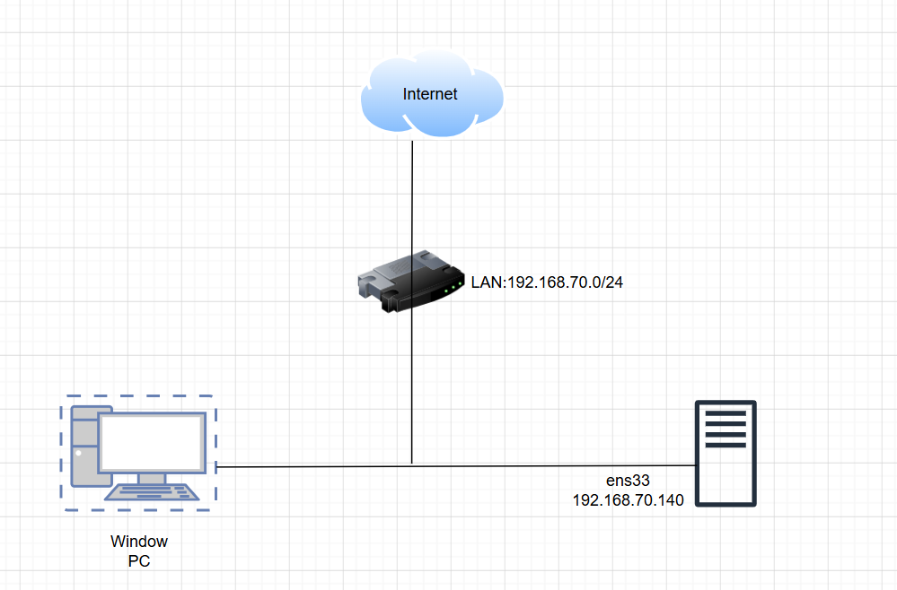
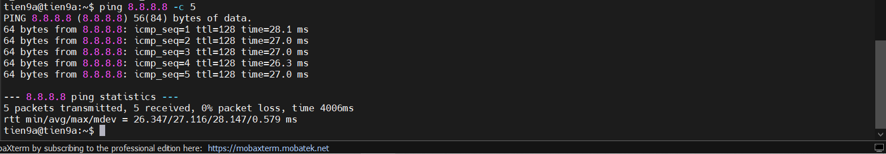

# BÀI LAB 01

## 1. Mô hình lab



Môi trường lab : VMware

|          |   OS      |NIC  |IP            |
|----------|-----------|-----|--------------|
|**Server**|Ubuntu22.04|ens33|192.168.70.140|
|**PC**    |Win 10     |     |              |

### Yêu cầu

- `DROP` các `INPUT` traffic mặc định tới server(từ chối các kết nối tới máy chủ)
- `ACCEPT` các `OUTPUT` traffic mặc định từ server(Cho phép gói tin đi ra từ hệ thống)
- `ACCEPT` các traffic đã kết nối (`ESTABLISHED`) (cho phép thiết lập các kết nối đi vào hệ thống)
- `ACCEPT` kết nối từ **loopback**
- `ACCEPT` các **kết nối ping 5 lần 1 phút từ internal network** (192.168.70.0/24)
- `ACCEPT` các kết nối **SSH** từ **internal network** (192.168.70.0/24)

## 2. Thực hiện

`Bước 1`: ta sẽ `disable ufw` và `start iptables.services`.

`Bước 2`: Ta sẽ viết 1 file script rules cho iptables

```bash
sudo nano iptables.sh

# Viết
#!/bin/bash

# Khai báo biến
my_LAN='192.168.70.0/24'
server_host='192.168.70.140'

# 1. Xóa các quy tắc cũ
/sbin/iptables -F
/sbin/iptables -X

# 2. Thiết lập chính sách mặc định (Default Policy)
/sbin/iptables -P INPUT DROP
/sbin/iptables -P OUTPUT ACCEPT
/sbin/iptables -P FORWARD DROP

# 3. Chấp nhận các kết nối đã thiết lập (ESTABLISHED)
/sbin/iptables -A INPUT -m state --state ESTABLISHED,RELATED -j ACCEPT

# 4. Chấp nhận kết nối từ loopback (nội bộ máy)
/sbin/iptables -A INPUT -i lo -j ACCEPT

# 5. Chấp nhận Ping có giới hạn từ mạng nội bộ
/sbin/iptables -A INPUT -p icmp --icmp-type echo-request -s $my_LAN -d $server_host -m limit --limit 1/m --limit-burst 5 -j ACCEPT

# 6. Chấp nhận kết nối SSH từ mạng nội bộ
/sbin/iptables -A INPUT -p tcp -m state --state NEW -s $my_LAN -d $server_host --dport 22 -j ACCEPT 

# 7. Lưu quy tắc vào file hệ thống của Ubuntu
netfilter-persistent save
systemctl restart netfilter-persistent

echo "Cấu hình IPTABLES hoàn tất!"
```

`Bước 3`: Chạy script và kiểm tra

```bash
chmod +x iptables.sh
./iptables.sh
```

`Bước 4`: Kiểm tra

- Từ server ta sẽ thử kết nối ra ngoài internet:


