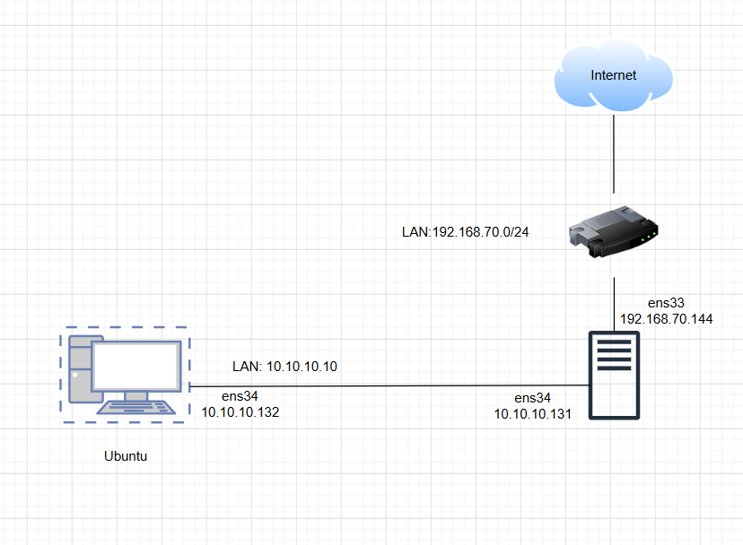
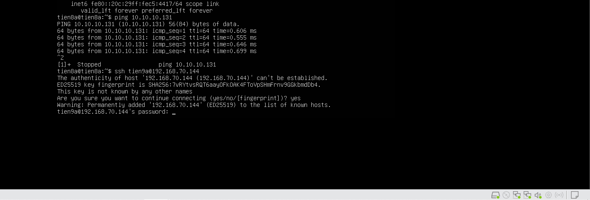
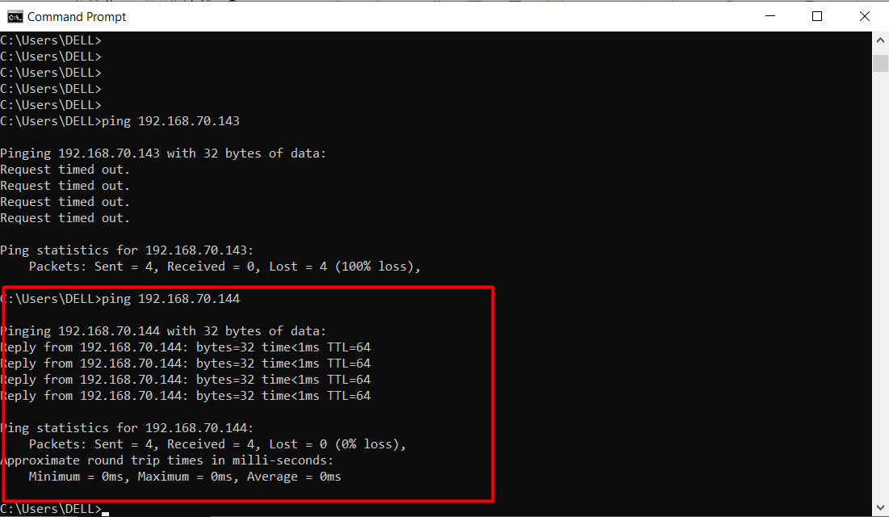

# BÀI LAB 02

## 1. Mô hình lab



Môi trường lab : VMware

|          |   OS      |NIC  |IP            |
|----------|-----------|-----|--------------|
|**Server**|Ubuntu22.04|ens33|192.168.70.144|
|          |           |ens34|10.10.10.131  |
|**PC**    |Ubuntu     |ens34|10.10.10.132  |

## 2.Yêu cầu

`DROP` các `INPUT` traffic mặc định tới server
`ACCEPT` các `OUTPUT` traffic mặc định từ server
`DROP` các traffic forward mặc định
`ACCEPT` các traffic đã kết nối (`ESTABLISHED`)
`ACCEPT` các kết nối loopback
`ACCEPT` các kết nối ping 5 lần 1 phút từ internal network (`192.168.70.0/24`)
`ACCEPT` các kết nối ssh từ internal network (`192.168.70.0/24`)
`ACCEPT` các kết nối ra ngoài từ internal network và chuyển đổi địa chỉ nguồn

## 3. Thực hiện

`Bước 1`: ta sẽ `disable ufw` và `start iptables.services` trên con Server.

`Bước 2`: Ta sẽ viết 1 file script rules cho **iptables** trên con Server.

```bash
sudo nano iptables.sh

# Viết
#!/bin/bash

# 1. Khai báo biến chính xác theo mô hình
wan_net='192.168.70.0/24'      # Mạng bên ngoài
lan_net='10.10.10.0/24'        # Mạng nội bộ (chứa máy PC)
server_ip='192.168.70.144'     # IP của Server hướng ra WAN

# 2. Bật chức năng Router
echo 1 > /proc/sys/net/ipv4/ip_forward

# 3. Xóa các rule cũ
/sbin/iptables -F
/sbin/iptables -t nat -F
/sbin/iptables -X

# 4. Chính sách mặc định
/sbin/iptables -P INPUT DROP 
/sbin/iptables -P OUTPUT ACCEPT
/sbin/iptables -P FORWARD DROP 

# 5. CẤU HÌNH FORWARD (Cho phép LAN nội bộ đi ra WAN)
# SỬA LẠI: Source phải là mạng LAN nội bộ ($lan_net)
/sbin/iptables -A FORWARD -i ens34 -o ens33 -s $lan_net -j ACCEPT
/sbin/iptables -A FORWARD -m state --state ESTABLISHED,RELATED -j ACCEPT

# 6. CẤU HÌNH INPUT (Bảo vệ Server)
/sbin/iptables -A INPUT -m state --state ESTABLISHED,RELATED -j ACCEPT
/sbin/iptables -A INPUT -i lo -j ACCEPT

# Cho phép ping từ dải mạng WAN (192.168.70.x) vào Server
/sbin/iptables -A INPUT -p icmp --icmp-type echo-request -s $wan_net -d $server_ip -m limit --limit 1/m --limit-burst 5 -j ACCEPT

# Cho phép SSH từ dải mạng WAN (192.168.70.x) vào Server
/sbin/iptables -A INPUT -p tcp -m state --state NEW -s $wan_net -d $server_ip --dport 22 -j ACCEPT

# 7. CẤU HÌNH NAT
# SỬA LẠI: Đóng giả (Masquerade) các IP từ mạng LAN ($lan_net) khi đi ra cổng ens33
/sbin/iptables -t nat -A POSTROUTING -o ens33 -s $lan_net -j MASQUERADE

# 8. Lệnh lưu Rule trên Ubuntu 22.04 (Thay cho service iptables save)
netfilter-persistent save
systemctl restart netfilter-persistent

echo "Cau hinh Iptables Router thanh cong!"
```

`Bước 3`: Chạy script và kiểm tra

```bash
chmod +x iptables.sh
./iptables.sh
```

`Bước 4`: Kiểm tra

- Từ PC cùng LAN với server ta sẽ SSH và Ping vào server:



- Từ server ngoài mạng ta ping thử vào con Server ta thiết lập:


