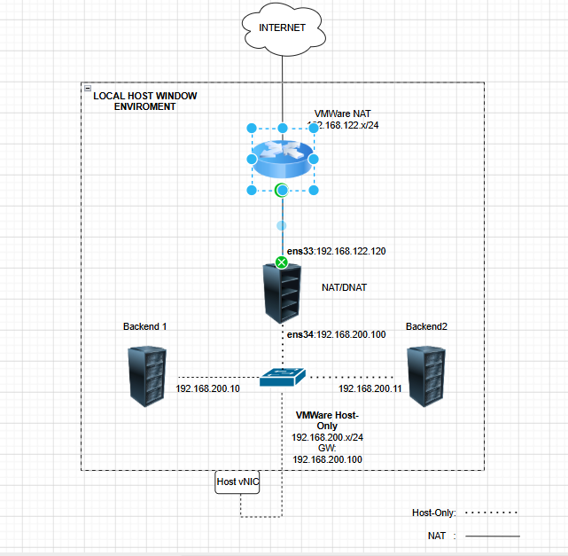
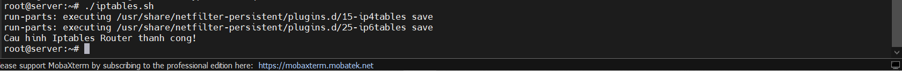
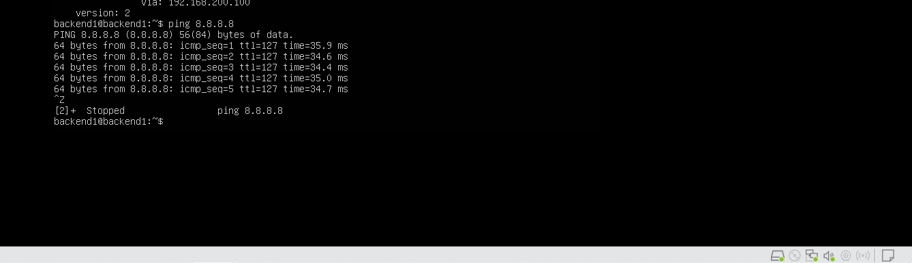
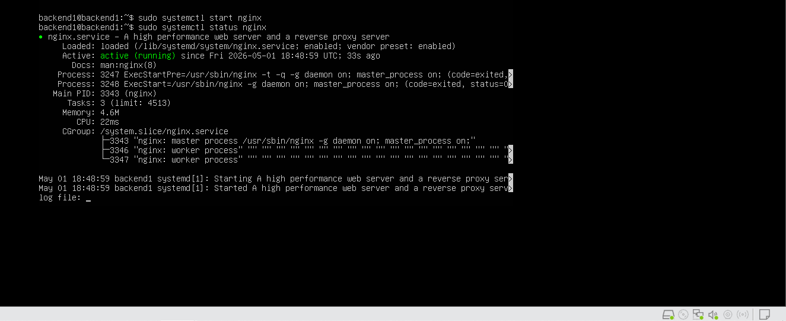
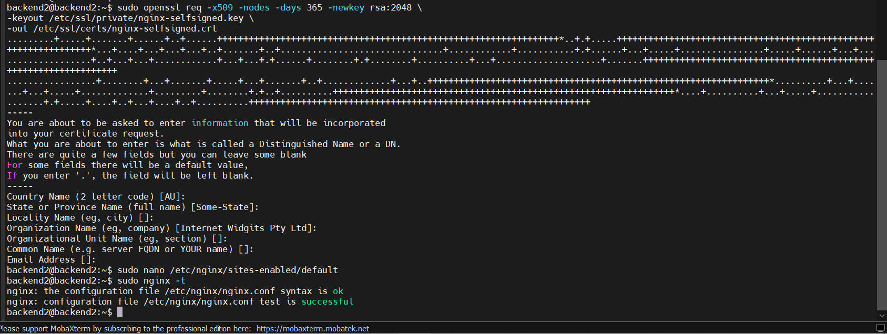
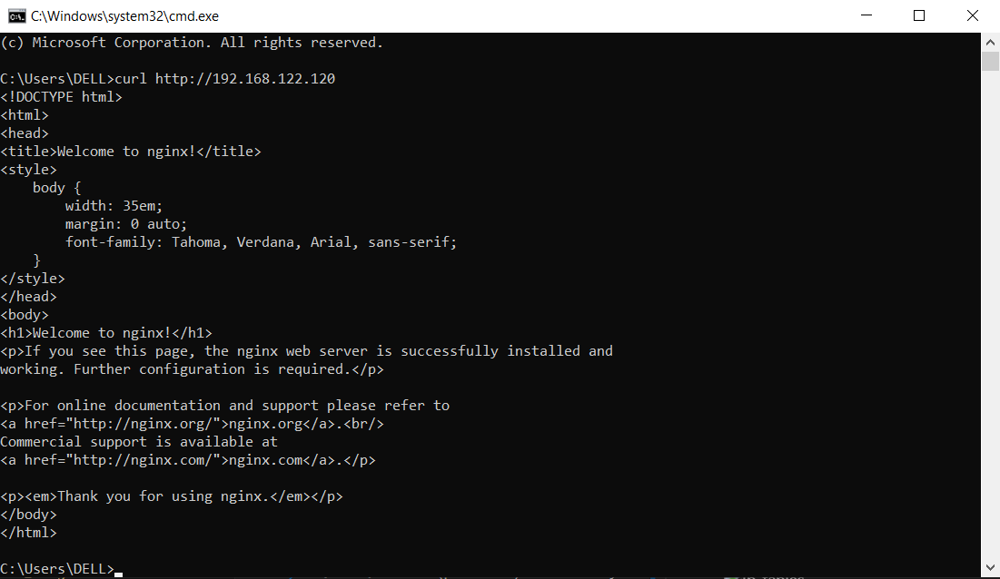
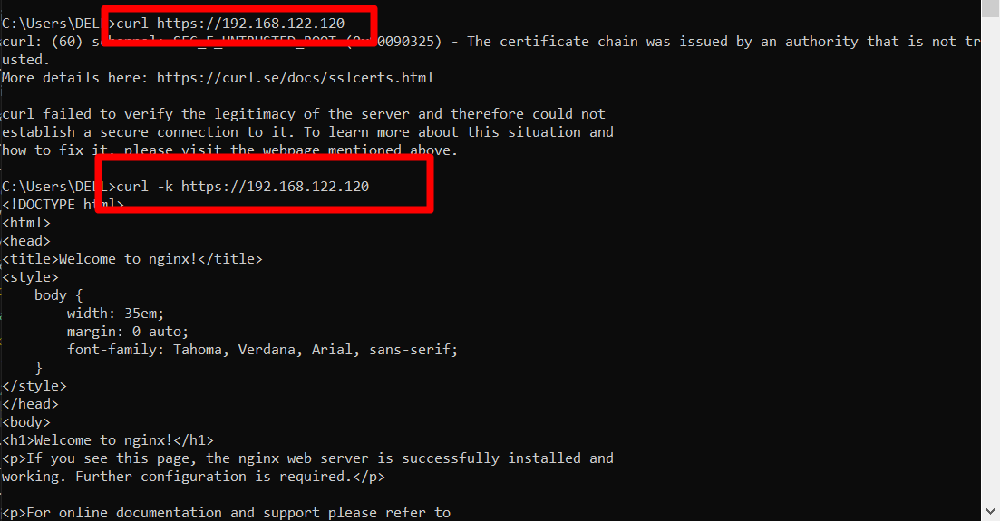
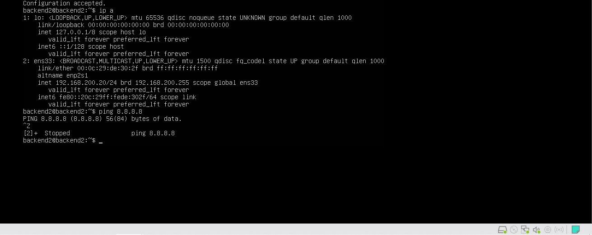
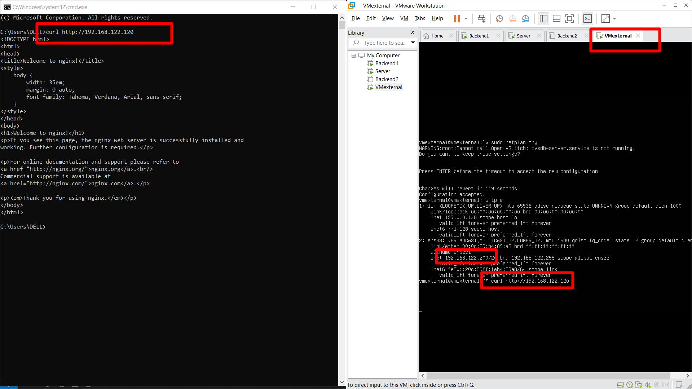

# BÀI LAB 03

## 1. Mô hình lab



Môi trường lab: `VMware / KVM`

| Máy ảo         |   OS        | Card mạng | IP Address        | Gateway           |
|----------------|-------------|-----------|-------------------|-------------------|
| **SERVER**     | Ubuntu22.04 |  `ens33`  | `192.168.122.120` | `192.168.122.2`   |
|                |             |  `ens34`  | `192.168.200.100` | -                 |
| **Backend 1**  | Ubuntu22.04 |  `ens34`  | `192.168.200.10`  | `192.168.200.100` |
| **Backend 2**  | Ubuntu22.04 |  `ens34`  | `192.168.200.11`  | `192.168.200.100` |

## 2. Yêu cầu

- `DROP` các `INPUT` traffic mặc định vào server
- `ACCEPT` các `OUTPUT` traffic mặc định từ server
- `DROP` các traffic forward mặc định
- `ACCEPT` các traffic đã kết nối (`ESTABLISHED`)
- `ACCEPT` kết nối từ loopback
- `FORWARD` các packet từ port `80` `ens33` tới `Backend1` trên cùng port
- `FORWARD` các packet từ port `443` `ens33` tới `Backend2` trên cùng port
- `DROP` các packet từ địa chỉ `192.168.122.200`
- `ACCEPT` các kết nối ping 5 lần 1 phút từ internal network (`192.168.200.0/24`)
- `DROP` các packet từ địa chỉ `192.168.200.20`
- `ACCEPT` các kết nối ra ngoài từ internal network và chuyển đổi địa chỉ nguồn

## 3. Thực hiện

`Bước 1`: Tắt ufw (nếu có) và`start iptables.services` trên con Server.Rồi chuẩn bị viết script trên con SERVER.

`Bước 2`: Ta sẽ viết 1 file script rules cho **iptables** trên con Server.

```bash
sudo nano iptables.sh

# Viết
#!/bin/bash

# 1. Khai báo biến
WAN_IF="ens33"
LAN_IF="ens34"
LAN_NET="192.168.200.0/24"
BE1_IP="192.168.200.10"
BE2_IP="192.168.200.11"

# 2. Bật chức năng Router
echo 1 > /proc/sys/net/ipv4/ip_forward

# 3. Xóa các rule cũ
/sbin/iptables -F
/sbin/iptables -t nat -F
/sbin/iptables -X

# 4. Chính sách mặc định
/sbin/iptables -P INPUT DROP 
/sbin/iptables -P OUTPUT ACCEPT
/sbin/iptables -P FORWARD DROP 

# 5. CÁC RULE DROP CỤ THỂ (Nên đặt lên đầu để chặn ngay lập tức)
# DROP các packet từ địa chỉ 192.168.122.200
/sbin/iptables -A INPUT -s 192.168.122.200 -j DROP
/sbin/iptables -A FORWARD -s 192.168.122.200 -j DROP

# DROP các packet từ địa chỉ 192.168.200.20
/sbin/iptables -A INPUT -s 192.168.200.20 -j DROP
/sbin/iptables -A FORWARD -s 192.168.200.20 -j DROP

# 6. CẤU HÌNH INPUT
# ACCEPT kết nối từ loopback
/sbin/iptables -A INPUT -i lo -j ACCEPT

# ACCEPT các traffic đã kết nối (ESTABLISHED)
/sbin/iptables -A INPUT -m state --state ESTABLISHED,RELATED -j ACCEPT

# ACCEPT các kết nối ping 5 lần 1 phút từ internal network
/sbin/iptables -A INPUT -p icmp --icmp-type echo-request -s $LAN_NET -m limit --limit 5/m -j ACCEPT

# 7. CẤU HÌNH FORWARD VÀ DNAT
# ACCEPT các traffic đã kết nối (ESTABLISHED) cho FORWARD
/sbin/iptables -A FORWARD -m state --state ESTABLISHED,RELATED -j ACCEPT

# FORWARD các packet từ port 80 enp1s0 tới Backend1 trên cùng port
/sbin/iptables -t nat -A PREROUTING -i $WAN_IF -p tcp --dport 80 -j DNAT --to-destination $BE1_IP:80
/sbin/iptables -A FORWARD -i $WAN_IF -o $LAN_IF -p tcp -d $BE1_IP --dport 80 -j ACCEPT

# FORWARD các packet từ port 443 enp1s0 tới Backend2 trên cùng port
/sbin/iptables -t nat -A PREROUTING -i $WAN_IF -p tcp --dport 443 -j DNAT --to-destination $BE2_IP:443
/sbin/iptables -A FORWARD -i $WAN_IF -o $LAN_IF -p tcp -d $BE2_IP --dport 443 -j ACCEPT

# ACCEPT các kết nối ra ngoài từ internal network
/sbin/iptables -A FORWARD -i $LAN_IF -o $WAN_IF -s $LAN_NET -j ACCEPT

# 8. CẤU HÌNH NAT (SNAT)
# Chuyển đổi địa chỉ nguồn từ internal network khi ra ngoài
/sbin/iptables -t nat -A POSTROUTING -o $WAN_IF -s $LAN_NET -j MASQUERADE

# 9. Lệnh lưu Rule trên Ubuntu 22.04 (Thay cho service iptables save)
netfilter-persistent save
systemctl restart netfilter-persistent

echo "Cau hinh Iptables Router thanh cong!"
```

`Bước 3`: Chạy script và kiểm tra

```bash
chmod +x iptables.sh
./iptables.sh
```



`Bước 4`: Cài đặt dịch vụ và Kiểm tra (Testing)

**A. Kiểm tra SNAT và cài đặt dịch vụ:** Sau khi chạy script trên Server, 2 máy Backend lúc này mới có kết nối Internet (nhờ tính năng `MASQUERADE`). Bạn tiến hành:

1. Ping từ máy Backend (192.168.200.10 hoặc 11) ra Internet `8.8.8.8` để kiểm tra SNAT đã thành công chưa(Nhớ 2 con backend có netplan trỏ DNS ra ngoài `8.8.8.8`).



2. Trên `Backend 1`, tải Nginx để test port 80: `sudo apt update && sudo apt install nginx -y`



3. Trên `Backend 2`, cài đặt dịch vụ SSL hoặc cấu hình Nginx lắng nghe port 443 để test.



**B. Kiểm tra DNAT (Từ mạng ngoài vào):**

- Từ một máy tính bên ngoài (VM_External) truy cập `http://192.168.122.120` để test dịch vụ Web (port 80) xem có đẩy vào Backend 1 không.



- Từ máy tính bên ngoài truy cập `https://192.168.122.120` để test dịch vụ HTTPS (port 443) xem có đẩy vào Backend 2 không.



**C. Kiểm tra các Rule DROP (Bảo mật):**

- Thử đổi IP một máy Backend thành `192.168.200.20` và ping ra ngoài, kết quả gói tin sẽ bị `DROP`.



- Thử thiết lập IP cho VM ở dải mạng External thành `192.168.122.200` rồi truy cập vào Server, kết quả cũng sẽ bị `DROP`.


