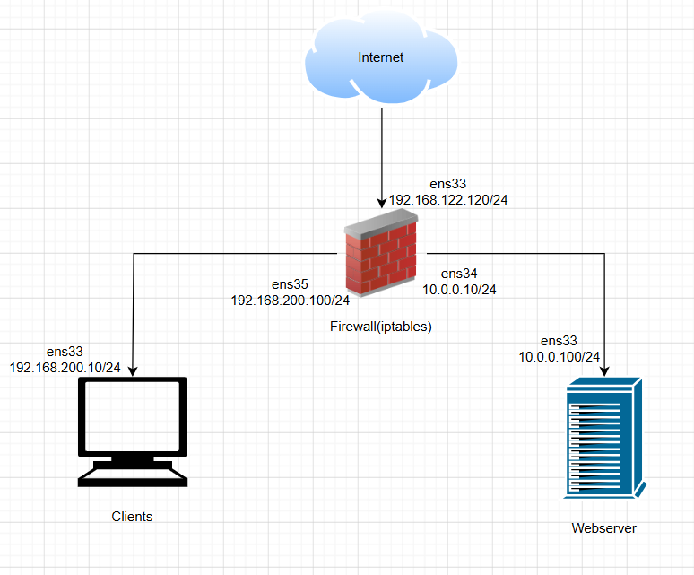
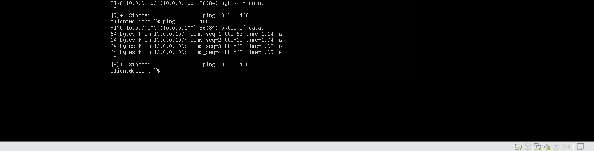
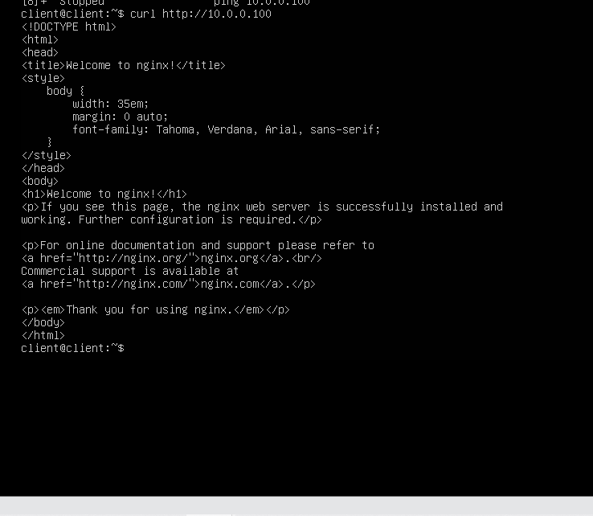
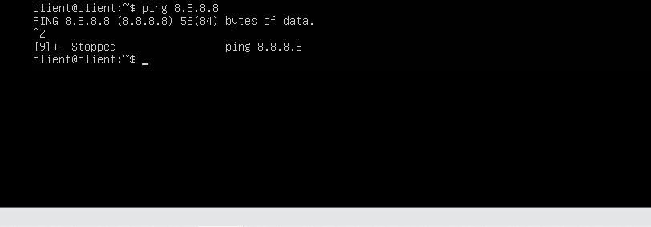
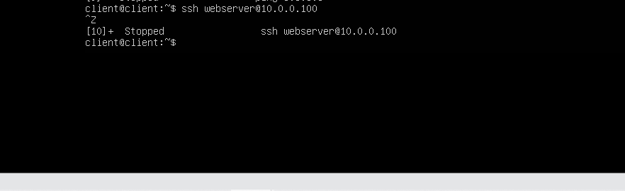
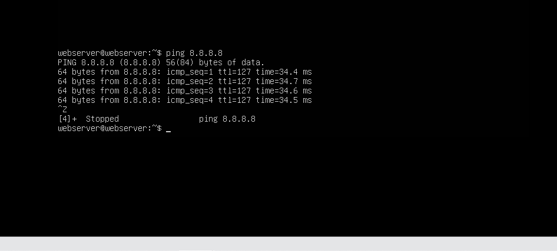
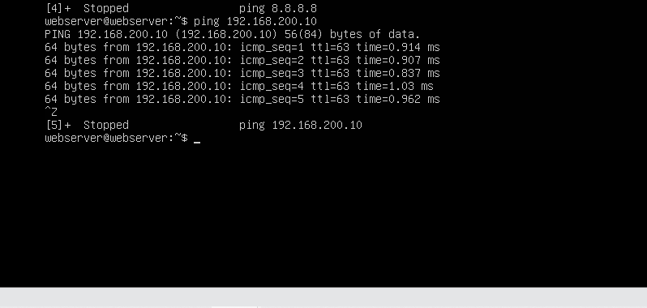
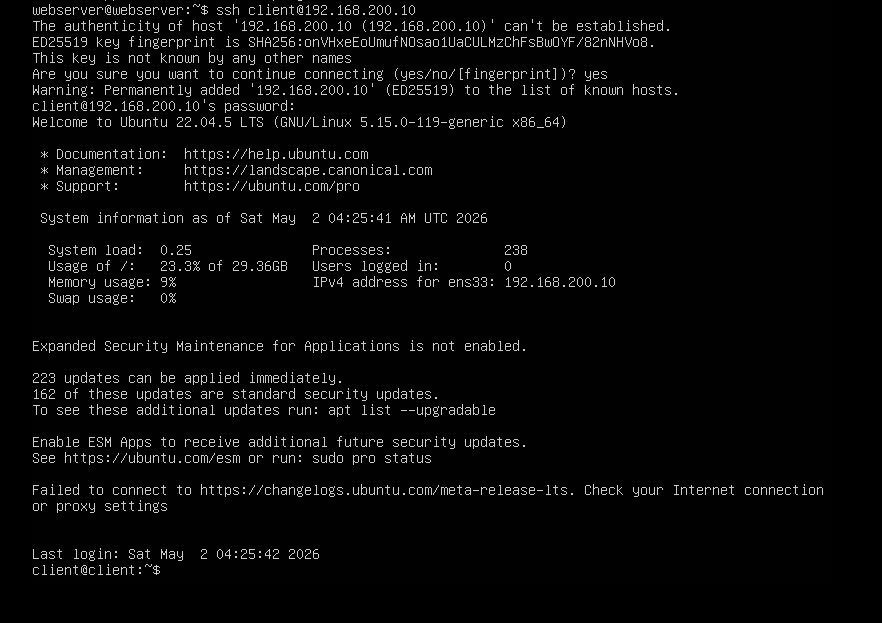

# BÀI LAB 04

## 1. Mô hình lab



## 2. Yêu cầu

- Tất cả việc cấu hình iptables đều thực hiện trên máy chủ firewall(iptables)
- Client và Webserver có 2 dải mạng **Host-only** khác nhau
- **Client**:
  - Chỉ được ping, access port `80` trên Webserver
  - Không ra được internet
  - Không có quyền ssh
- **Webserver**:
  - Có thể ra internet
  - Có thể ping, ssh sang Client

## 3. Thực hiện

`Bước 1`: Chuẩn bị môi trường và cấu hình mạng (Tắt `ufw` trên cả 3 máy)

Trên máy **Firewall**, bật tính năng IP Forwarding và cài đặt công cụ lưu rule (`iptables-persistent`):

```bash
# Tắt ufw và cài đặt iptables-persistent
sudo ufw disable
sudo apt update
sudo apt install iptables-persistent -y

# Bật IP Forwarding
echo 1 > /proc/sys/net/ipv4/ip_forward
```

Đảm bảo cấu hình định tuyến đúng trước khi chạy script:

- **Client** trỏ Gateway về IP của Firewall: `192.168.200.100`
- **Webserver** trỏ Gateway về IP của Firewall: `10.0.0.10`

`Bước 2`: Viết script Iptables trên máy chủ **Firewall**

```bash
sudo nano iptables_lab04.sh
```

Nội dung script:

```bash
#!/bin/bash

# 1. Khai báo biến
WAN_IF="ens33"
WEB_IF="ens34"
CLI_IF="ens35"

WEB_IP="10.0.0.100"
CLI_IP="192.168.200.10"

# 2. Xóa các rule cũ và đặt Policy
/sbin/iptables -F
/sbin/iptables -t nat -F
/sbin/iptables -X

# Chính sách mặc định: Chặn toàn bộ luồng đi vào (INPUT) và đi xuyên qua (FORWARD)
/sbin/iptables -P INPUT DROP
/sbin/iptables -P OUTPUT ACCEPT
/sbin/iptables -P FORWARD DROP

# 3. CẤU HÌNH INPUT (Bảo vệ Firewall)
/sbin/iptables -A INPUT -i lo -j ACCEPT
/sbin/iptables -A INPUT -m state --state ESTABLISHED,RELATED -j ACCEPT

# (Tùy chọn) Mở SSH vào trực tiếp Firewall để tiện quản trị
/sbin/iptables -A INPUT -p tcp --dport 22 -j ACCEPT

# 4. CẤU HÌNH FORWARD (Định tuyến luồng mạng)

# Luôn cho phép tất cả các luồng dữ liệu phản hồi (đã được thiết lập trước đó)
/sbin/iptables -A FORWARD -m state --state ESTABLISHED,RELATED -j ACCEPT

# --- YÊU CẦU DÀNH CHO CLIENT ---

# Client: Chỉ được ping sang Webserver
/sbin/iptables -A FORWARD -i $CLI_IF -o $WEB_IF -s $CLI_IP -d $WEB_IP -p icmp --icmp-type echo-request -j ACCEPT

# Client: Chỉ được access port 80 trên Webserver
/sbin/iptables -A FORWARD -i $CLI_IF -o $WEB_IF -s $CLI_IP -d $WEB_IP -p tcp --dport 80 -j ACCEPT

# (Do Default Policy của FORWARD là DROP, nên Client mặc nhiên KHÔNG ra được Internet và KHÔNG thể SSH đi đâu được nữa).

# --- YÊU CẦU DÀNH CHO WEBSERVER ---

# Webserver: Có thể ping sang Client
/sbin/iptables -A FORWARD -i $WEB_IF -o $CLI_IF -s $WEB_IP -d $CLI_IP -p icmp --icmp-type echo-request -j ACCEPT

# Webserver: Có thể ssh sang Client
/sbin/iptables -A FORWARD -i $WEB_IF -o $CLI_IF -s $WEB_IP -d $CLI_IP -p tcp --dport 22 -j ACCEPT

# Webserver: Có thể ra internet
/sbin/iptables -A FORWARD -i $WEB_IF -o $WAN_IF -s $WEB_IP -j ACCEPT

# 5. CẤU HÌNH NAT (Cho Webserver ra Internet)

# Cấp quyền SNAT (Masquerade) ĐỘC QUYỀN cho Webserver ra Internet
/sbin/iptables -t nat -A POSTROUTING -o $WAN_IF -s $WEB_IP -j MASQUERADE

# 6. Lưu Rule
netfilter-persistent save
systemctl restart netfilter-persistent

echo "Cau hinh Iptables Lab 04 thanh cong!"
```

`Bước 3`: Cấp quyền và chạy script trên Firewall

```bash
chmod +x iptables_lab04.sh
./iptables_lab04.sh
```

## 4. Cài đặt dịch vụ và Kiểm tra kết quả (Testing)

**A. Cài đặt các dịch vụ cần thiết:**

1. Đứng trên **Webserver**, kiểm tra ping ra `8.8.8.8`. Khi đã có mạng (nhờ Firewall NAT), tiến hành cài đặt Nginx:

```bash
# Trên con Firewall - Tạm thời mở NAT ra ngoài
sudo iptables -P FORWARD ACCEPT
sudo iptables -t nat -A POSTROUTING -o ens33 -j MASQUERADE

# Trên con Webserver
sudo apt update && sudo apt install nginx -y
sudo apt install iputils-ping net-tools -y
sudo apt install openssh-server -y
sudo systemctl start nginx
sudo systemctl start ssh
```

2. Đứng trên **Client**, đảm bảo máy đã có dịch vụ SSH (`sudo systemctl status ssh`). *(Lưu ý: Do yêu cầu bài Lab là Client bị chặn ra Internet, nên nếu máy Client chưa cài sẵn OpenSSH-Server từ trước, bạn sẽ phải tạm thời bypass rule để cho Client ra mạng tải gói cài đặt, hoặc cài offline nhé).*

```bash
# Trên con Firewall - Tạm thời mở NAT ra ngoài
sudo iptables -P FORWARD ACCEPT
sudo iptables -t nat -A POSTROUTING -o ens33 -j MASQUERADE

# Trên con Client
sudo apt update
sudo apt install iputils-ping net-tools -y
sudo apt install openssh-server -y
sudo systemctl start ssh
```

=> Sau khi đã cài đặt xong ta chạy file script để chỉnh rules lại.

**B. Kiểm tra từ phía Client (`192.168.200.10`):**

1. Ping thử sang Webserver: `ping 10.0.0.100` -> **Thành công**



2. Truy cập web của Webserver: `curl http://10.0.0.100` -> **Thành công** (thấy HTML)



3. Ping ra Internet: `ping 8.8.8.8` -> **Thất bại (Timeout/DROP)**



4. Thử SSH sang Webserver: `ssh webserver@10.0.0.100` -> **Thất bại (Timeout/DROP)**



**B. Kiểm tra từ phía Webserver (`10.0.0.100`):**

1. Ping ra Internet: `ping 8.8.8.8` -> **Thành công**



2. Ping ngược lại Client: `ping 192.168.200.10` -> **Thành công**



3. Thử SSH sang Client: `ssh client@192.168.200.10` -> **Thành công** (vào được terminal của Client)


