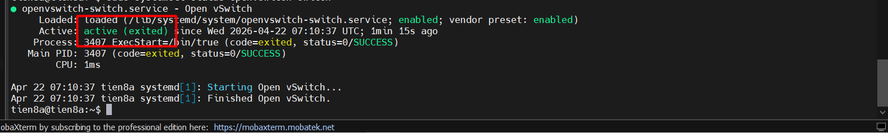
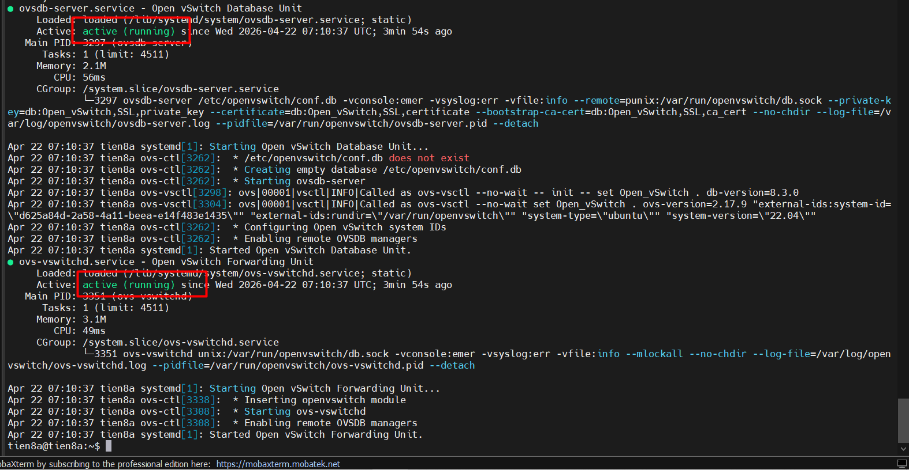
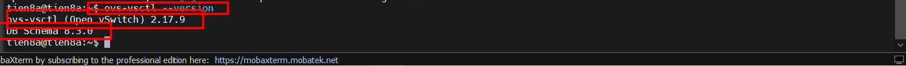
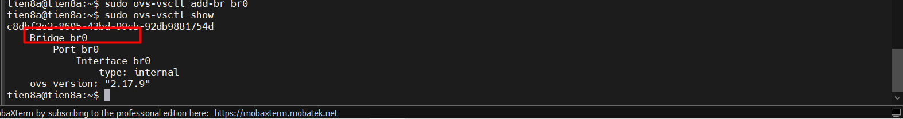
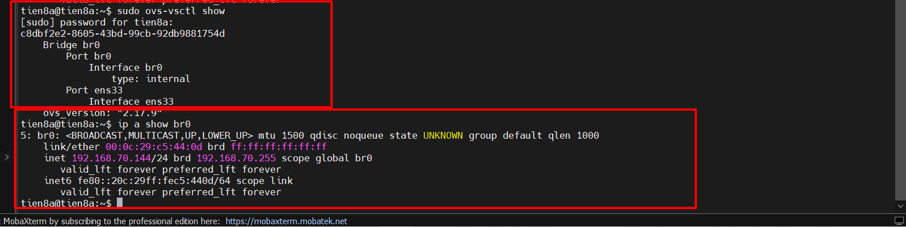

# INSTALL OPENVSWITCH

## I. CÀI ĐẶT OPENVSWITCH TRÊN UBUNTU 22.04

### 1. Cài đặt các gói cung cấp tiện ích OVS

```bash
sudo apt update
# Tải gói chính thức trong kho APT
sudo apt install -y openvswitch-switch openvswitch-common
```

- `openvswitch-common`: Chứa các tệp chung cần thiết cho **Open vSwitch**, bao gồm thư viện, tiện ích (`ovs-vsctl`, `ovs-ofctl`, v.v.) và tệp cấu hình cơ bản. Đây là gói cơ sở cho các thành phần **Open vSwitch**.

- Package `openvswitch-switch` sẽ cài:

  - `ovs-vswitchd` (daemon chính thực hiện switching).
  - `ovsdb-server` (database server để lưu cấu hình).
  - Các công cụ CLI (`ovs-vsctl`, `ovs-ofctl`, `ovs-appctl`).

### 2. Kiểm tra

Sau khi cài xong, kiểm tra trạng thái:

```bash
sudo systemctl status openvswitch-switch
```

Kết quả hiển thị dịch vụ đang chạy (`active`):



`openvswitch-switch` chỉ là unit khởi tạo (**wrapper**), nó chạy xong rồi thoát → báo `exited`.

Các **daemon** thật sự cần chạy là:

- `ovsdb-server`: database server.
- `ovs-vswitchd`: daemon chuyển mạch.

Kiểm tra 2 **daemon** này:

```bash
sudo systemctl status ovsdb-server
sudo systemctl status ovs-vswitchd
```

=> Nếu thấy `active=running` là chạy bình thường



### 3. Kiểm tra phiên bản OVS

```bash
ovs-vsctl --version
```



### 4. Tạo bridge ảo

Tạo switch ảo (bridge) tên `br0`:

```bash
sudo ovs-vsctl add-br br0
```

Kiểm tra:

```bash
sudo ovs-vsctl show
```



- br0 là virtual switch do OVS quản lý.
- Tương tự như br0 trong Linux Bridge, nhưng mạnh mẽ hơn.

### 5. Thêm card mạng vật lý vào Bridge

Card trên máy là `ens33` (kiểm tra bằng `ip a`):

```bash
sudo ovs-vsctl add-port br0 ens33
```

Sau khi gắn `ens33` vào `br0`, card vật lý này sẽ trở thành “port” của switch ảo.
IP sẽ phải gán cho bridge (br0), chứ không còn đặt trực tiếp trên `ens33`.

=> Đảm bảo sau bước này nếu ta đang SHH vào Server bằng MobaXTerm thì sẽ bị đứt kết nối ngay lập tức

### 6. Cấu hình IP cho Bridge bằng Netplan

Cấu hình file netplan:

```bash
network:
  version: 2
  renderer: networkd
  ethernets:
    ens33: {}
  bridges:
    br-0:
      interfaces: [ens33]
      addresses:
        - 192.168.70.144/24
      routes:
        - to: default
          via: 192.168.70.2
      nameservers:
        addresses:
          - 8.8.8.8
          - 8.8.4.4
```

Áp dụng cấu hình:

```bash
sudo netplan apply
```

- ens33 chỉ còn vai trò port vật lý.
- Toàn bộ cấu hình IP nằm trên `br0`.

=> Ngược lại lúc nãy, sau bước này thì ta sẽ lấy lại được kết nối SSH từ **MobaXTerm**

### 7. Kiểm tra hoạt động

Xem bridge:

```bash
sudo ovs-vsctl show
```

Xem IP:

```bash
ip a show br0
```

Ping thử Gateway:

```bash
ping -c 4 192.168.70.2
```



Nếu gặp lỗi Device or resource busy:

1. Tắt mạng mặc định của libvirt (virbr0) - muốn VM dùng OVS (br0) làm bridge chính:

```bash
sudo virsh net-destroy default
sudo virsh net-autostart --disable default
```

2. Sau đó, chỉ giữ `br0` của **OVS** và gắn **VM** vào đó.

3. Lúc này `ens33` chỉ tham gia một bridge duy nhất → `br0`, nên không bị **conflict**.

### 8. Một số lệnh quản lí hữu ích

#### a. Open vSwitch Daemon Commands

- Dùng để điều khiển toàn hệ thống OVS.
- Công cụ chính: ovs-vsctl (tương tác với ovs-vswitchd).
- Hiển thị toàn bộ bridge, port, interface trong OVS.

```bash
# Kiểm tra cấu hình hiện tại
sudo ovs-vsctl show
```

#### b. Bridge commands

- Dùng để quản lí **Virtual Switch**(Bridge):

```bash
# Tạo bridge mới
sudo ovs-vsctl add-br br0

# Xóa bridge
sudo ovs-vsctl del-br br0

# Xem danh sách bridge
sudo ovs-vsctl list-br
```

#### c. Port Commands

- Quản lí cổng port được gắn vào Bridge:

```bash
# Thêm port vật lý ens33 vào br0
sudo ovs-vsctl add-port br0 ens33

# Thêm port nội bộ (internal)
sudo ovs-vsctl add-port br0 br0-int -- set interface br0-int type=internal

# Xóa port
sudo ovs-vsctl del-port br0 ens33

# Liệt kê port của bridge
sudo ovs-vsctl list-ports br0
```

#### e. Interface Command

- Quản lý interface gắn với port:

```bash
# Liệt kê tất cả interfaces
sudo ovs-vsctl list interface

# Xem chi tiết interface cụ thể
sudo ovs-vsctl list interface ens33
```

#### f. Database Commands

- **OVS** sử dụng `ovsdb-server` để lưu trữ cấu hình trong dạng database.
- Các table chính: **Bridge**, **Port**, **Interface**, **Open_vSwitch**, **Flow_Table**...

```bash
# Liệt kê tất cả bảng trong database
sudo ovs-vsctl list-tables

# Liệt kê record trong bảng Bridge
sudo ovs-vsctl list Bridge

# Hiển thị chi tiết record theo cột
sudo ovs-vsctl list interface name,type

# Tìm kiếm record có name=br0 trong bảng Bridge
sudo ovs-vsctl find Bridge name=br0
```
