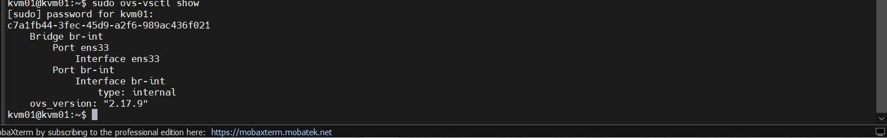

# LAB OPEN VSWITCH

## I. CHUẨN BỊ MÔI TRƯỜNG


- Host 1: `192.168.70.139` - VM: `10.0.0.1`
- Host 2: `192.168.70.140` - VM: `10.0.0.2`

## II. CÁC BƯỚC THỰC HIỆN

### 1. `Bước 1`: Cài đặt Open VSwitch trên cả 2 Host

```bash
# Ubuntu/Debian
apt update && apt install -y openvswitch-switch

# CentOS/RHEL
yum install -y openvswitch
systemctl enable --now openvswitch

# Kiểm tra
sudo ovs-vsctl show
sudo ovs-appctl -t ovsdb-server ovsdb-server/list-dbs
```


### 2. `Bước 2`: Tạo OVS Bridge và gán VM vào (trên cả 2 host)

```bash
# Tạo bridge br-int
sudo ovs-vsctl add-br br-int

# Xóa bridge
sudo ovs-vsctl del-br br-int

# Kiểm tra
sudo ovs-vsctl show
```


Trên 2 KVM Host:

- Tạo 1 máy VM trên KVM Host (`VM1`,`VM2`)
- Chỉ định interface VM kết nối vào `br-int`. Nếu VM đã chạy, lấy tên interface là `vnet0`:

```bash
virsh domiflist vm1
```



- Nếu VM dùng Linux bridge mặc định, chuyển sang OVS bridge:

```bash
# Xóa khỏi linux bridge cũ (nếu có)
brctl delif virbr0 vnet0

# Gán vào OVS bridge
ovs-vsctl add-port br-int vnet0
```

Hoặc:

```bash
virsh edit vm1
```

Thay đoạn interface (như LinuxBridge) bằng:

```bash
<interface type='bridge'>
  <mac address='52:54:00:a2:28:5e'/>  
  <source bridge='br-int'/>
  <virtualport type='openvswitch'/>
  <model type='virtio'/>
</interface>
```

### 3. `Bước 3`: Tạo VXLAN Tunnel

Trên Host KVM1 (remote = IP của Host 2):

```bash
ovs-vsctl add-port br-int vxlan0 -- \
  set interface vxlan0 \
  type=vxlan \
  options:remote_ip=192.168.70.146 \
  options:key=100 \
  options:dst_port=4789
```

Trên Host KVM2 (remote = IP của Host 1):

```bash
ovs-vsctl add-port br-int vxlan0 -- \
  set interface vxlan0 \
  type=vxlan \
  options:remote_ip=192.168.133.140 \
  options:key=100 \
  options:dst_port=4789
```

### 4. `Bước 4`: Cấu hình IP cho VM

```bash
# VM1 (trên Host 1)
ip addr add 10.0.0.1/24 dev enp1s0
ip link set enp1s0 up 

# VM2 (trên Host 2)
ip addr add 10.0.0.2/24 dev enp1s0
ip link set enp1s0 up 
```

### 5. `Bước 5`: Verify và test

- Kiểm tra cấu hình OVS:

```bash
# Xem toàn bộ cấu hình bridge
ovs-vsctl show

# Kiểm tra port và type
ovs-vsctl list interface vxlan0

# Xem flow table
ovs-ofctl dump-flows br-int

# Xem MAC table đã học
ovs-appctl fdb/show br-int
```

- Kiểm tra tunnel tự động:

```bash
# Trên Host 1 — capture packet VXLAN
tcpdump -i eth0 udp port 4789 -nn

# Ping từ VM1 sang VM2 (cùng host)
ping 10.0.0.2
```

### 6. `Bước 6`: Bắt gói tin bằng TCPdump

Bắt gói tin trên `VXLAN` Tunnel:


Bắt gói tin trên card `ens33` Tunnel:


**Nhận xét**: `VXLAN` = Layer 2 over Layer 3 (overlay)

- Bên trong: frame L2 (Ethernet)
- Bên ngoài: được encapsulate vào UDP/IP (L3) để đi qua mạng vật lý

`VXLAN` cần:

- **Underlay** (L3): 2 host phải reach được IP của nhau (HOST A phải ping được HOST B, UDP `port 4789` (`VXLAN`) không bị chặn)
- **Overlay** (L2): `VXLAN` tạo mạng ảo cho VM

Luồng Packet:

```bash
VM1 (ICMP 10.0.0.3 → 10.0.0.4)
   ↓
vxlan0
   ↓ (ENCAPSULATION)
UDP packet:
   SRC: 192.168.70.1
   DST: 192.168.70.2
   PORT: 4789 (VXLAN)
   Payload: Ethernet frame (ICMP 10.0.0.3 → 10.0.0.4)
   ↓
ens33 (physical NIC)
   ↓
Internet
   ↓
Host B vxlan0
   ↓
VM2 (10.0.0.4)
```

- Đổi IP khác subnet thì **ping fail** bởi `VXLAN` KHÔNG phải router: `VXLAN` chỉ làm: Extend Layer 2 (giống switch). Không làm Layer 3 routing.

-> `VXLAN` chỉ giúp 2 VM ở xa nhau giả vờ cùng switch L2, còn muốn đi subnet khác → phải có router thật.

