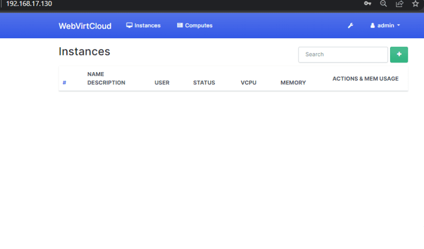

# OVERVIEW WEBVIRTCLOUD

## I. WEBVIRTCLOUD LÀ GÌ ?

Nó là một Giao diện Web (**Dashboard**) để quản lý các máy ảo KVM.

Thay vì ta phải ngồi gõ `virsh start`, `virsh edit`, hay lụi cụi tạo file XML cho VM, thì ta dùng **WebVirtCloud** để click chuột: Tạo VM, bật/tắt, chỉnh RAM/CPU, và đặc biệt là có sẵn màn hình **Console** (VNC/Spice) ngay trên trình duyệt.

**WebVirtCloud** không phải là một "phép màu", bản chất nó là một tập hợp các **services** ghép lại với nhau để chọc vào **libvirt**. Nếu ta tự cài tay (không dùng script tự động), ta sẽ phải dựng các thành phần sau:

- **Backend & Giao diện**: Viết bằng Python 3 sử dụng Framework **Django**.

- **Web Server / Reverse Proxy**: **Nginx**. **Nginx** đứng ngoài cùng hứng traffic ở port `80/443`, sau đó **proxy HTTP request** vào cho **Django** và **proxy WebSocket request** vào cho cái **Console**.

- **App Server (WSGI)**: **Gunicorn**. **Django** không tự chạy độc lập được mà phải qua **Gunicorn** để xử lý các **luồng** (workers).

- **Process Manager**: **Supervisor**. Nó đóng vai trò như một thằng quản đốc, giữ cho **Gunicorn** và **Websockify** (dịch vụ console) luôn chạy. Nếu sập, nó tự restart.

- Cầu nối (API): **libvirt-python**. Đây là thư viện cốt lõi giúp code Python của WVC dịch các cú click chuột của ta thành lệnh gọi vào **daemon libvirtd** trên các **KVM Host**.

## II. CÁC TÍNH NĂNG CHÍNH CỦA WEBVIRTCLOUD

Các tính năng chính **WebVirtCloud** bao gồm:

- **Quản lý tập trung** (Multi-host management): Ta có **Host 1**, **Host 2**, **Host 3**... Ta chỉ cần cài **WebVirtCloud** trên một máy duy nhất, sau đó add các Host kia vào qua **SSH**. Ta sẽ quản lý được tất cả **VM** của cả **cụm Host** trên chỉ trên một tab trình duyệt.

- **Web-based Console**: Đây là tính năng cứu cánh. Ta không cần cài `virt-viewer` hay mở **port VNC** phức tạp. Nó dùng **noVNC**, giúp ta console thẳng vào VM từ bất cứ đâu.

- **Quản lý Storage & Network**: Tạo **Storage Pool** (**LVM**, **ISO**, **Directory**) và **Network** (**Bridge**, **OVS**, **NAT**) cực nhanh.

- **Instance Customization**: Hỗ trợ Cloud-init (**tự động đặt pass**, **đặt IP** khi **mới tạo máy ảo**) – rất giống trải nghiệm dùng **AWS** hay **DigitalOcean**.

- **User Management**: **Phân quyền cho người khác** vào dùng chung tài nguyên (ví dụ: Ta tạo máy ảo rồi đưa link cho bạn vào dùng).

## III. CƠ CHẾ HOẠT ĐỘNG WEBVIRTCLOUD

**WebVirtCloud** hoạt động theo **2 kiểu kết nối chính** tới các **KVM Host**:

- **Local**: Cài **WebVirtCloud** trên chính máy chạy KVM.

- **SSH (Phổ biến nhất)**: **WebVirtCloud** dùng SSH Key để login vào các Host từ xa và chạy lệnh `libvirt`.

**Các bước** - **WebVirtCloud** quản lý các **Host KVM** từ xa qua **SSH Key**:

1. Khi cài **WebVirtCloud**, nó thường chạy dưới một user hệ thống (**ví dụ**: `nginx` hoặc `www-data`).

2. Tiến trình này sẽ sinh ra **một cặp khóa SSH** (**Private/Public Key**).

3. Để **WebVirtCloud** điều khiển được **KVM Host 1**, ta phải copy cái **Public Key** đó ném vào file `~/.ssh/authorized_keys` của user `root` (**hoặc user có quyền libvirt**) trên **Host 1**.

4. Mỗi khi ông bấm nút "`Start VM`", **WebVirtCloud** sẽ **mở một phiên SSH ngầm chạy lệnh API** gọi tới `qemu+ssh://root@192.168.70.139/system`.

## IV. ĐẶC ĐIỂM WVC

### 1. Ưu điểm

- **Cực nhẹ**: Nó không "nặng đô" và phức tạp như OpenStack hay oVirt.

- **Dễ cài**: Chỉ mất khoảng 5-10 phút với script tự động.

- **Giao diện sạch**: Đơn giản, trực quan, không màu mè.

### 2. Nhược điểm

**Tính năng nâng cao còn thiếu**: Không có sẵn tính năng **High Availability** (HA) hay **Live Migration** (dịch chuyển máy ảo đang chạy) mượt mà như Proxmox.

**Cấu hình Network phức tạp**: Nếu ta muốn dùng `OVS/VXLAN` như bài lab vừa rồi, ta vẫn phải cấu hình tay dưới Host trước, **WebVirtCloud** chỉ hỗ trợ "nhận diện" và gán vào thôi.

## V. SO SÁNH VỚI CÁC ĐỐI THỦ

| Tiêu chí   | WebVirtCloud           | Proxmox                  | Cockpit                   |
| ---------- | ---------------------- | ------------------------ | ------------------------- |
| Độ khó     | Dễ                     | Trung bình               | Rất dễ                    |
| Mục đích   | Quản lý nhiều Host KVM | OS chuyên dụng ảo hóa    | Quản lý 1 Server tổng thể |
| Môi trường | Lab, Cloud nhỏ         | Production, Doanh nghiệp | Quản lý cá                |
