# CÀI ĐẶT WEBVIRTCLOUD TRÊN UBUNTU 22.04

## I. MÔ HÌNH CÀI ĐẶT

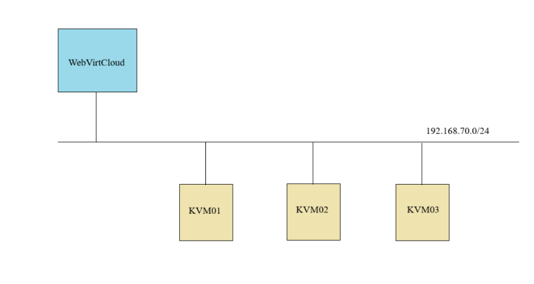

## II. PHÂN HOẠCH ĐỊA CHỈ IP

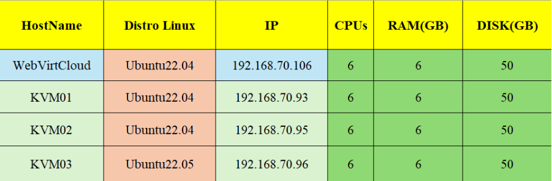

**Yêu Cầu Version tối thiểu:** `Python: 3.11` trở lên.

## III. CÁC BƯỚC CÀI ĐẶT

Trước khi cài đặt **WebVirtCloud** để quản lý hạ tầng máy chủ KVM ta phải có các máy chủ KVM (**KVMHost**) trước đó đã cài đặt.

### 1. `Bước 1`: Cấu hình KVM Host

Ta có thể tham khảo các bước cấu hình máy chủ KVM tại [đây](https://github.com/tiend9/system-intership/blob/master/TienHA/15.KVM/02.KVM_basics/02.KVM_Install.md)

### 2. `Bước 2`: Cấu hình để KVM Host có thể kết nối đến WebVirtCloud

Trường hợp nếu ta boot KVM Host bằng bản `Ubuntu20.04` trở lên thì khả năng ngoài cấu hình file `default` của `libvirt` ra thì Libvirt quản lý việc mở port thông qua **systemd sockets**.

Và ta chỉ cấu hình 1 trong 2 thằng để quản lí port cho máy chủ KVM kết nối đến **WebVirtCloud** (Không sẽ gây conflict) và ta sẽ chọn thằng **libvirt**.

- Chỉnh sửa file cấu hình libvirt như sau:

```bash
nano /etc/libvirt/libvirtd.conf

# Uncomment các dòng sau
listen_tls = 0
listen_tcp = 1
tcp_port = "16509"
listen_addr = "0.0.0.0"
auth_tcp = "none"
```

- Tắt **systemd sockets** đi:

```bash
sudo systemctl stop libvirtd
sudo systemctl stop libvirtd.socket
sudo systemctl stop libvirtd-tcp.socket
sudo systemctl stop libvirtd-ro.socket

sudo systemctl mask libvirtd
sudo systemctl mask libvirtd.socket
sudo systemctl mask libvirtd-tcp.socket
sudo systemctl mask libvirtd-ro.socket
```

- Sau đó mới, chỉnh sửa file `nano /etc/default/libvirtd`:

```bash
LIBVIRTD_ARGS="--listen"
```

- Cho phép port `16509` của libvirt và dải port `5900-5999` của VNC đi qua ufw:

```bash
ufw allow 16509/tcp
ufw allow 5900:5999/tcp
ufw reload
```

- Sau đó Restart lại `libvirtd`:

```bash
sudo systemctl daemon-reload
sudo systemctl restart libvirtd
```

=> Check port `ss -tulpn | grep 16509` có chữ `LISTEN` là oke.

### 3. `Bước 3`: Cài đặt WebVirtCloud trên Ubuntu22.04

#### 3.1 Cài đặt các gói cần thiết

```bash
apt update 
apt install -y git libvirt-dev libxml2-dev libxslt1-dev \
libxslt1-dev zlib1g-dev libffi-dev libssl-dev supervisor gcc \
pkg-config libsasl2-dev libssl-dev libldap2-dev
```

#### 3.2 Cài đặt python

```bash
sudo apt install python3 python3-pip python3-venv
```

#### 3.3 Cài đặt Nginx Webserver

Các bước cài đặt Webserver Nginx ta có thể tham khảo tại [đây](https://github.com/tiend9/system-intership/blob/master/TienHA/07.WebServer/02.Nginx/01.Install_Nginx.md)

#### 3.4 Cài đặt WebVirtCloud

```bash
# Sử dụng git để lấy source của **WebVirtCloud**:
git clone https://github.com/retspen/webvirtcloud.git

# Chuyển hướng tới **WebVirtCloud**:
cd webvirtcloud

# Tạo file `settings.py` từ template có sẵn:
cp webvirtcloud/settings.py.template webvirtcloud/settings.py

# Tiếp theo, tạo SECRET bằng cách sử dụng script Python đã được cung cấp:
SECRET=$(python3 conf/runit/secret_generator.py)

# Sử dụng sed để thêm SECRET vào file settings.py vừa tạo
sed -i "s|SECRET_KEY = \"\"|SECRET_KEY = \"$SECRET\"|" webvirtcloud/settings.py

# Mở file settings.py thêm hostname vào danh sách các nguồn đáng tin cậy:
nano webvirtcloud/settings.py
```

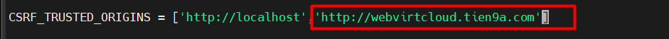

```bash
# Thay `webvirtcloud.tien9a.com` với hostname server của bạn và lưu vào file host:
nano /etc/hosts
192.168.70.106 webvirtcloud.tien9a.com

# Copy cấu hình file của `nginx` và `supervisord`:
sudo cp conf/nginx/webvirtcloud.conf /etc/nginx/conf.d
sudo cp conf/supervisor/webvirtcloud.conf /etc/supervisor/conf.d

# Mở file cấu hình nginx cho webvirtcloud sau đó cấu hình như sau:
nano /etc/nginx/conf.d/webvirtcloud.conf

# Cấu hình
server {
    listen 80;

    server_name webvirtcloud.tien9a.com;
    access_log /var/log/nginx/webvirtcloud-access_log;
    error_log /var/log/nginx/webvirtcloud-error_log;

    location /static/ {
        root /srv/webvirtcloud;
        expires max;
    }

    location / {
        proxy_pass http://127.0.0.1:8000;
        proxy_set_header X-Real-IP $remote_addr;
        proxy_set_header X-Forwarded-for $proxy_add_x_forwarded_for;
        proxy_set_header Host $host:$server_port;
        proxy_set_header X-Forwarded-Proto http;
        proxy_set_header X-Forwarded-Ssl off;
        proxy_connect_timeout 1800;
        proxy_read_timeout 1800;
        proxy_send_timeout 1800;
        client_max_body_size 1024M;
    }

    location /novncd/ {
        proxy_pass http://wsnovncd;
        proxy_http_version 1.1;
        proxy_set_header Upgrade $http_upgrade;
        proxy_set_header Connection "upgrade";
    }
    location /socket.io/ {
        proxy_pass http://wssocketiod;
        proxy_http_version 1.1;
        proxy_set_header Upgrade $http_upgrade;
        proxy_set_header Connection "upgrade";
    }
    location /websockify {
        proxy_pass http://wsnovncd;
        proxy_http_version 1.1;
        proxy_set_header Upgrade $http_upgrade;
        proxy_set_header Connection "upgrade";
    }
}

upstream wsnovncd {
      server 127.0.0.1:6080;
}
upstream wssocketiod {
      server 127.0.0.1:6081;
}

# Copy `webvirtcloud` vào thư mục `/srv`:
cd .. 
sudo mv webvirtcloud/ /srv

# Tạo môi trường ảo cho WebVirtCloud:
cd /srv/webvirtcloud
python3 -m venv venv

# Bật môi trường và tải requirements:
source venv/bin/activate

# Tải các gói phụ thuộc của python trong môi trường ảo:
pip3 install -r conf/requirements.txt

# Khởi tạo cấu trúc database và sinh static files bằng các lệnh sau đây:
pip3 install setuptools
python3 manage.py migrate
python3 manage.py collectstatic --noinput

# Set quyền cho user webserver
sudo chown -R www-data:www-data /srv/webvirtcloud

# Start và enable nginx và supervisor services:
sudo systemctl enable nginx supervisor
sudo systemctl restart nginx supervisor
```

Kiểm tra dịch vụ supervisor managed:

```bash
supervisorctl status
```

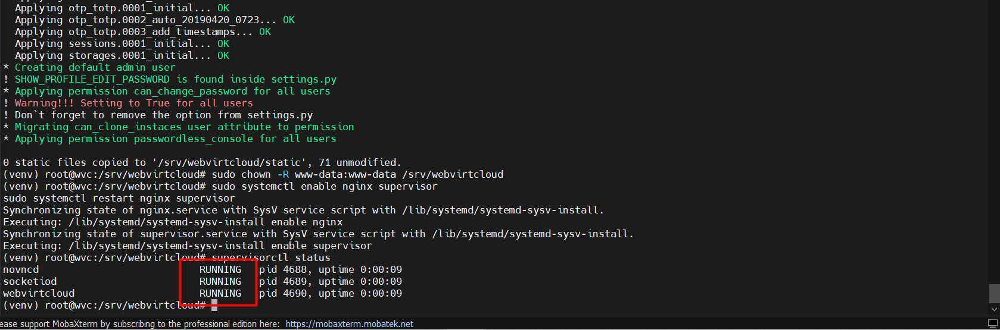

Thêm hostname vào file host trên máy local và truy cập theo đường dẫn:

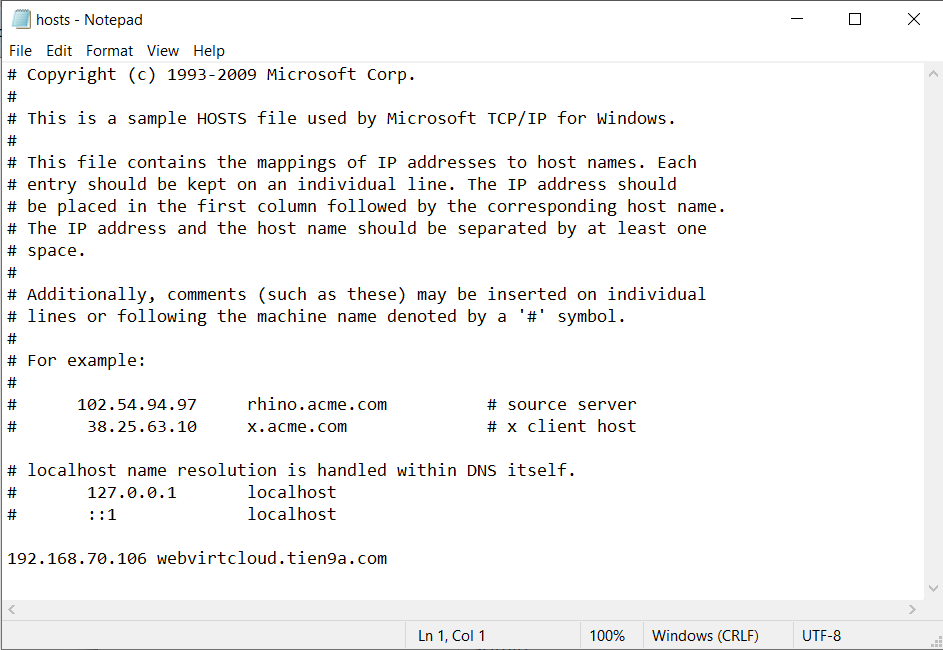

Truy cập trên trình duyệt với domain sau:

```text
http://webvirtcloud.tien9a.com
```

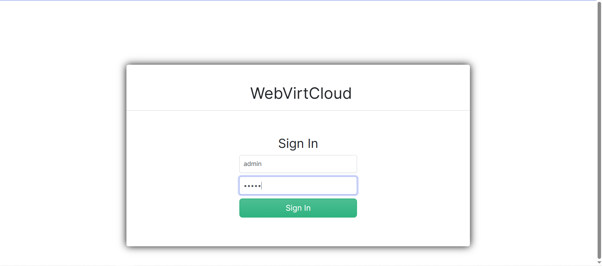

Đăng nhập bằng tài khoản mặc định:

- Username: `admin`
- Password: `admin`

#### 3.5 Thay đỏi password của admin

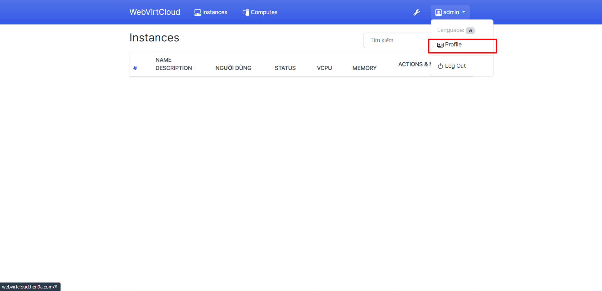

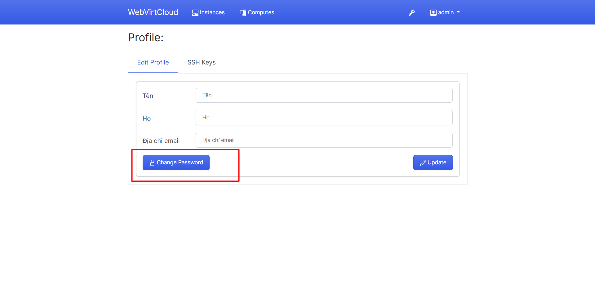

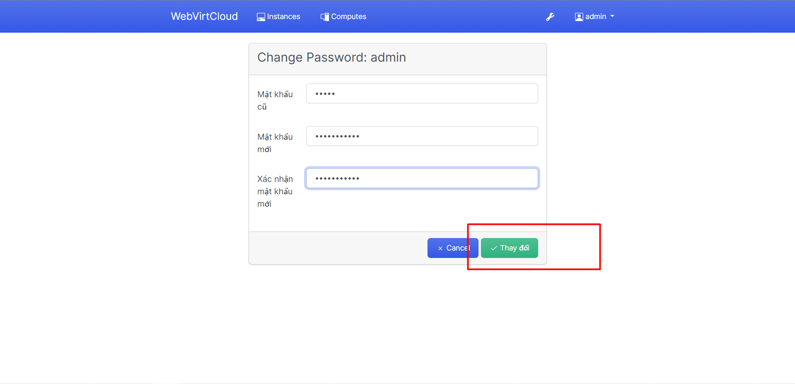

#### 3.6 Add các nodes KVM

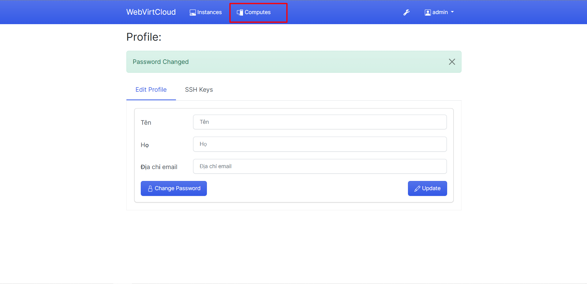

Chọn cách kết nối bằng TCP:

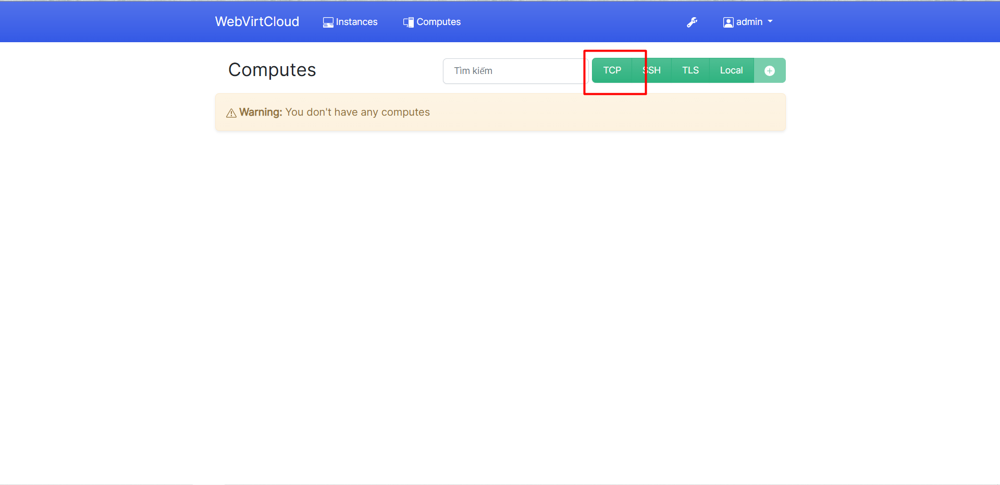

Khai báo thông tin TCP connect tới **libvirt**:

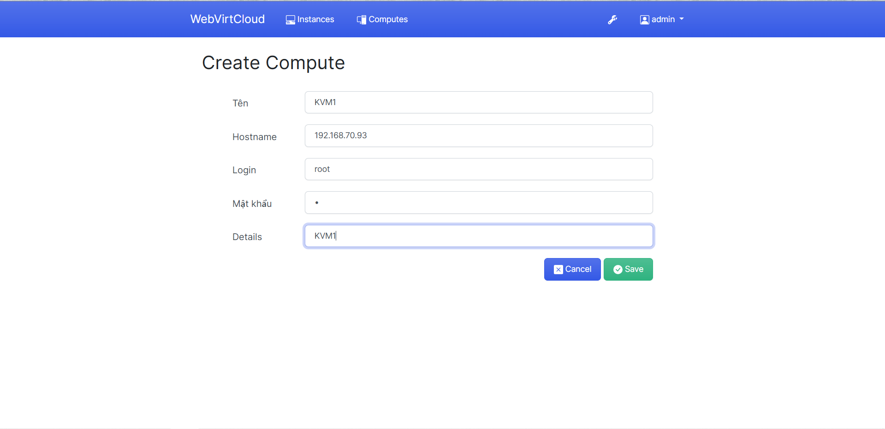

Ta có thể nhấp vào **instances** để xem các **nodes KVM** và các VM trên các nodes đó:

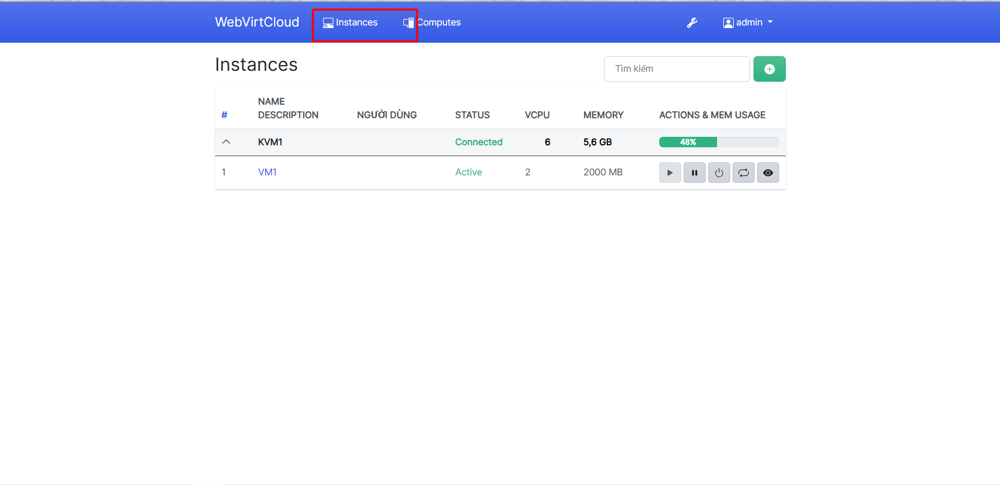
