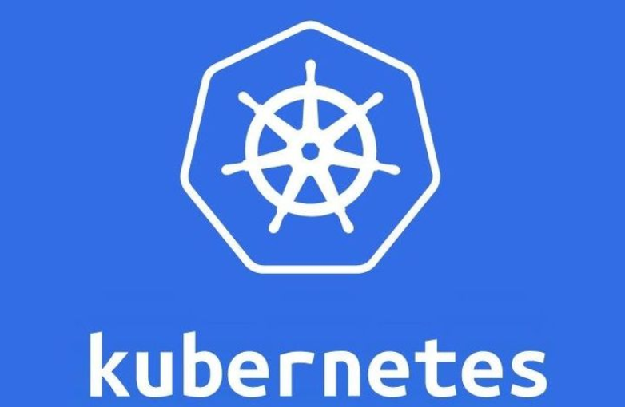
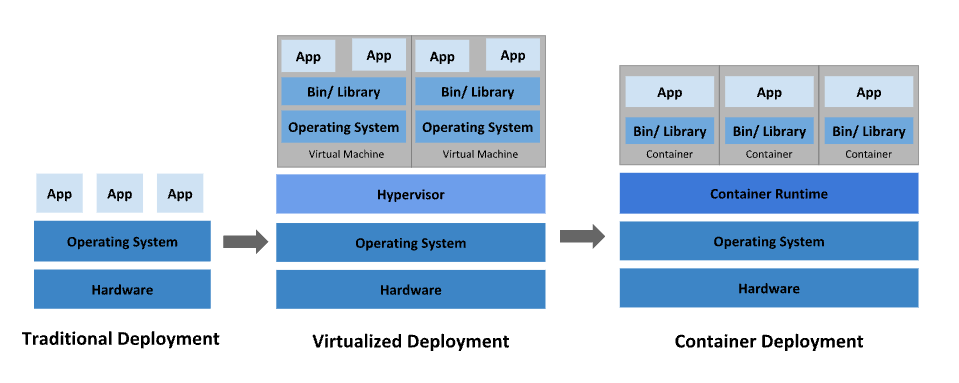

# OVERVIEW

## I. KHÁI NIỆM

**Kubernetes** là một nền tảng Container Orchestration( điều phối container), một nền tảng mã nguồn mở, linh hoạt và có thể mở rộng, dùng để quản lý các ứng dụng và dịch vụ được đóng gói dưới dạng container, giúp đơn giản hóa cả việc cấu hình khai báo(trạng thái mong muốn bằng file `YAML/JSON` để K8s tự đưa hệ thống về trạng thái đó) lẫn tự động hóa. Nền tảng này sở hữu một hệ sinh thái lớn và phát triển nhanh chóng. Các dịch vụ, công cụ hỗ trợ và giải pháp đi kèm với Kubernetes hiện rất phong phú và phổ biến.

- Docker là công nghệ tạo và đóng gói ứng dụng vào container
- K8s là người điều hành cả hàng hàng nghìn container đó.

| **Đặc điểm** | Docker| Kubernetes (K8s)|
|---------------|---------|--------------|
| Bản chất| Nền tảng đóng gói & chạy container (Container Runtime / Engine).| Hệ thống điều hành & quản lý nhiều container (Container Orchestrator).|
| Phạm vi| Hoạt động chủ yếu trên 1 máy (single node).| Quản lý trên cả một cụm nhiều máy (cluster).|
| Đơn vị quản lý| Từng Container riêng lẻ.| Các Pod (chứa một hoặc nhiều container).|
| Tính năng chính| "Đóng gói môi trường, tạo image, chạy container nhanh chóng."| "Self-healing, Auto-scaling, Load balancing, Rolling updates."|




## II. VAI TRÒ CỦA K8s

Container là một cách rất hiệu quả để đóng gói và triển khai ứng dụng. Tuy nhiên, trong môi trường **Production**, việc quản lý hàng trăm hoặc hàng nghìn container không thể thực hiện thủ công.

Vậy lên K8s giải quyết các bài toán như:

- **Bài toán "Sập nguồn & Lỗi ứng dụng" (High Availability)**: K8s liên tục kiểm tra sức khỏe (Health Check). Nếu container chết, nó tự khởi động lại. Nếu một máy chủ bị hỏng, K8s tự chuyển container sang máy chủ khác đang sống trong vòng vài giây.(Điều mà Docker phải làm thủ công)

- **Bài toán "Bão truy cập" (Scaling)**: K8s có tính năng Auto-scaling. Tùy vào mức độ ngốn CPU/RAM hoặc số lượng request, K8s sẽ tự động nhân bản từ 3 container lên 50 container, và khi hết giờ cao điểm lại tự động giảm xuống để tiết kiệm chi phí.(Ví dụ: ngày săn sale số lượng truy cập tăng đột ngột)

- **Bài toán "Cập nhật ứng dụng không gián đoạn" (Zero-Downtime Deployment)**: K8s hỗ trợ Rolling Update. Nó sẽ bật từng container mới lên, kiểm tra xem đã chạy tốt chưa rồi mới tắt dần từng container cũ. Người dùng hoàn toàn không nhận ra hệ thống vừa nâng cấp.

- **Bài toán "Quản lý mạng & Lưu trữ phức tạp"**: K8s có hệ sinh thái cực kỳ mạnh mẽ để quản lý traffic và cấu hình tập trung.

## III. TÁC DỤNG CỦA K8s

### 1. Service Discovery và Load Balancing

Kubernetes có thể **expose container** thông qua:

- DNS Name
- Địa chỉ IP riêng

Nếu lượng truy cập tăng cao, Kubernetes sẽ tự động cân bằng tải (Load Balancing) và phân phối lưu lượng đến nhiều Pod nhằm đảm bảo hệ thống luôn ổn định.

### 2. Storage Orchestration

**Kubernetes** cho phép tự động **gắn** (**mount**) nhiều loại lưu trữ khác nhau như:

- Local Storage
- NFS
- AWS EBS
- Azure Disk
- Google Persistent Disk
- Ceph
- Và nhiều hệ thống lưu trữ khác.

### 3. Automated Rollouts và Rollbacks

Bạn chỉ cần mô tả **Desired State** của hệ thống.

Ví dụ:

> Tôi muốn chạy 5 Pod phiên bản v2.

**Kubernetes** sẽ tự động:

- Tạo Pod mới.
- Thay thế Pod cũ.
- Rollback nếu phiên bản mới gặp lỗi.

Toàn bộ quá trình được thực hiện theo tốc độ an toàn nhằm tránh downtime.

### 4. Automatic Bin Packing

Bạn khai báo tài nguyên mà mỗi container cần, ví dụ:

- CPU
- RAM

Kubernetes sẽ tự động lựa chọn Node phù hợp để chạy container nhằm tối ưu việc sử dụng tài nguyên của toàn bộ Cluster.

### 5. Self-Healing

Đây là một trong những tính năng nổi bật nhất.

Nếu một Pod:

- Bị crash.
- Không phản hồi.
- Health Check thất bại.

**Kubernetes** sẽ:

- Khởi động lại Pod.
- Tạo Pod mới nếu cần.
- Loại Pod lỗi khỏi Load Balancer.
- Chỉ đưa Pod vào phục vụ khi Pod đã sẵn sàng (Ready).

### 6. Quản lý Secret và Configuration

**Kubernetes** cho phép lưu trữ:

- Password
- OAuth Token
- SSH Key
- API Key
- Certificate

thông qua:

- **Secret**
- **ConfigMap**

Nhờ vậy có thể thay đổi cấu hình hoặc Secret mà không cần build lại Docker Image.

### 7. Batch Execution

Ngoài các ứng dụng chạy liên tục (Service), **Kubernetes** còn hỗ trợ:

- Job
- CronJob
- CI/CD Workload

Nếu Job thất bại, **Kubernetes** có thể tự động chạy lại.

### 8. Horizontal Scaling

Ứng dụng có thể được mở rộng hoặc thu nhỏ bằng:

- Một lệnh `kubectl`
- Giao diện Dashboard
- Hoặc tự động dựa trên CPU, RAM hoặc các metric khác (HPA - Horizontal Pod Autoscaler)

### 9. IPv4 / IPv6 Dual Stack

**Kubernetes** hỗ trợ đồng thời:

- IPv4
- IPv6

**cho cả Pod và Service**.

### 10. Khả năng mở rộng (Extensibility)

Bạn có thể mở rộng Kubernetes bằng nhiều cơ chế như:

- CRD (Custom Resource Definition)
- Operator
- Admission Controller
- Scheduler Plugin
- CSI
- CNI
- Device Plugin

Mà không cần sửa mã nguồn **Kubernetes**.

## IV. K8s KHÔNG PHẢI LÀ GÌ ?

Kubernetes **không phải** là **một nền tảng PaaS (Platform as a Service) hoàn chỉnh**.

Nó chỉ cung cấp nền tảng để chạy container và để người dùng tự lựa chọn các thành phần phù hợp.

Cụ thể, Kubernetes:

- **Không giới hạn loại ứng dụng được triển khai**. Có thể chạy ứng dụng **Stateless**, **Stateful** hoặc **Data Processing**:

  - **Stateless Application** là ứng dụng **không lưu trạng thái (state) của người dùng hoặc request trong chính instance của ứng dụng**. **Mỗi request đều được xử lý độc lập và ứng dụng không cần biết những request trước đó đã xảy ra**.
  - **Stateful Application** là **ứng dụng cần lưu và duy trì trạng thái (state) theo thời gian**. Trạng thái đó có thể là dữ liệu, phiên làm việc (session), hoặc danh tính của chính instance đang chạy. Nếu mất trạng thái này, ứng dụng có thể hoạt động sai hoặc mất dữ liệu.
  - **Data Processing Application** là **ứng dụng có nhiệm vụ thu thập, xử lý, biến đổi, phân tích hoặc tổng hợp dữ liệu từ nhiều nguồn để tạo ra dữ liệu có giá trị hơn**.

- **Không build source code và cũng không triển khai quy trình CI/CD**. Người dùng có thể sử dụng Jenkins, GitLab CI, GitHub Actions, ArgoCD,...
- **Không tích hợp** sẵn **Middleware** như Kafka, RabbitMQ.
- **Không tích hợp** sẵn **Database** như MySQL.
- **Không tích hợp** sẵn **Cache** như Redis.
- **Không tích hợp** sẵn **hệ thống lưu trữ Cluster** như Ceph.
- **Không bắt buộc sử dụng một giải pháp Logging, Monitoring** hay **Alerting** cụ thể.
- **Không ép buộc người dùng phải sử dụng một ngôn ngữ cấu hình nhất định** ngoài Kubernetes API.
- **Không quản lý toàn bộ máy chủ vật lý** hay **hệ điều hành**.

Các thành phần trên đều có thể chạy **trên Kubernetes**, nhưng không phải là thành phần tích hợp sẵn.

## V. K8s KHÔNG CHỈ LÀ CÔNG CỤ ORCHESTRATION

Nhiều người cho rằng Kubernetes chỉ là một công cụ **Container Orchestration**, nhưng điều đó chưa hoàn toàn chính xác.

**Orchestration** truyền thống hoạt động theo một quy trình cố định:

```text
A → B → C
```

Ví dụ:

1. Tạo VM.
2. Cài Docker.
3. Chạy Container.

Trong khi đó, Kubernetes hoạt động theo mô hình **Desired State**.

Bạn chỉ cần khai báo:

> Tôi muốn có 10 Pod đang chạy.

Kubernetes sẽ liên tục so sánh:

- **Desired State**(Trạng thái mong muốn)
- **Current State**(Trạng thái hiện tại)

và tự động thực hiện các hành động cần thiết để **đưa hệ thống về đúng trạng thái mong muốn**.

## VI. Lịch sử phát triển của Kubernetes



### 1. Kỷ nguyên Physical Server

Ban đầu, mỗi ứng dụng được chạy trực tiếp trên một máy chủ vật lý.

#### Nhược điểm

- Không thể giới hạn tài nguyên cho từng ứng dụng.
- Một ứng dụng có thể chiếm toàn bộ CPU hoặc RAM.
- Các ứng dụng khác bị ảnh hưởng.
- Hiệu suất sử dụng phần cứng thấp.
- Chi phí đầu tư máy chủ rất cao.

### 2. Kỷ nguyên Virtual Machine

Để khắc phục các hạn chế trên, công nghệ **Virtualization** ra đời.

Một máy chủ vật lý có thể chạy nhiều **Virtual Machine (VM)**.

#### Ưu điểm

- Mỗi VM có hệ điều hành riêng.
- Ứng dụng được cô lập tốt hơn.
- Tận dụng tài nguyên tốt hơn.
- Dễ mở rộng và quản lý.

Tuy nhiên, mỗi VM vẫn phải chạy đầy đủ một hệ điều hành, khiến việc tiêu tốn CPU, RAM và dung lượng lưu trữ còn khá lớn.

### 3. Kỷ nguyên Container

Container kế thừa nhiều ưu điểm của VM nhưng nhẹ hơn rất nhiều.

Thay vì mỗi ứng dụng chạy trên một hệ điều hành riêng, các container cùng chia sẻ kernel của hệ điều hành chủ.

Mỗi container vẫn có:

- File System riêng
- Process riêng
- CPU riêng
- Memory riêng
- Network riêng

Nhưng không cần mang theo toàn bộ hệ điều hành như VM.

#### Lợi ích của Container

- Triển khai ứng dụng nhanh chóng.
- Hỗ trợ CI/CD và rollback dễ dàng.
- Tách biệt Dev và Ops.
- Khả năng quan sát (Observability).
- Môi trường nhất quán từ Development đến Production.
- Khả năng di động trên nhiều nền tảng Cloud.
- Quản lý theo ứng dụng thay vì hệ điều hành.
- Phù hợp với kiến trúc Microservices.
- Cô lập tài nguyên.
- Tận dụng tài nguyên hiệu quả với mật độ container cao