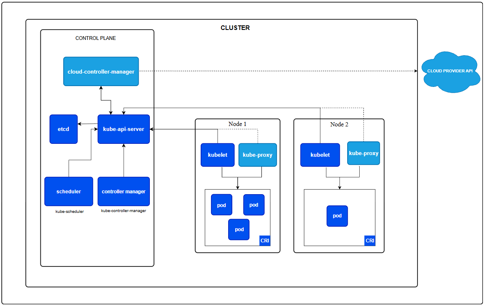

# CLUSTER ARCHITECTURE IN K8S

## I. TỔNG QUAN

Một **Kubernetes cluster** bao gồm **Control Plane** và một tập hợp các **máy làm việc** (**Worker Machines**), được gọi là **Node**, nơi chạy các ứng dụng được đóng gói dưới dạng **Container**. Mỗi cluster cần có ít nhất một **Worker Node** để có thể chạy các **Pod**.

Các **Worker Node** lưu trữ các **Pod**, là những thành phần tạo nên **khối lượng công việc** (**workload**) của ứng dụng. Trong khi đó, **Control Plane** chịu trách nhiệm **quản lý các Worker Node và các Pod trong cluster**. **Trong môi trường production, Control Plane thường được triển khai trên nhiều máy tính khác nhau**, và một cluster cũng thường bao **gồm nhiều Node nhằm đảm bảo khả năng chịu lỗi** (Fault Tolerance) và tính sẵn sàng cao (High Availability).

Tài liệu này sẽ trình bày tổng quan về các thành phần cần thiết để xây dựng một Kubernetes Cluster hoàn chỉnh và hoạt động đầy đủ.

Mô hình tổng quan của 1 cụm K8s:



>Sơ đồ trong **Hình trên** trình bày một ví dụ về **kiến trúc tham chiếu (Reference Architecture)** của một Kubernetes Cluster. Việc phân bố thực tế của các thành phần có thể khác nhau tùy thuộc vào cách triển khai và các yêu cầu cụ thể của từng Cluster.
>
>Trong sơ đồ, mỗi Node đều chạy thành phần **kube-proxy**. Mỗi Node cần có một thành phần **Network Proxy** để đảm bảo rằng **Service API** và các chức năng liên quan của nó hoạt động trên mạng của Cluster.
>
>Tuy nhiên, một số **Network Plugin** cung cấp cơ chế proxy riêng do bên thứ ba triển khai. Khi sử dụng các Network Plugin này, Node sẽ **không cần chạy kube-proxy**.  

## II. CONTROL PLANE NODE COMPONENTS

**Control Plane** là "bộ não" của Kubernetes, chịu trách nhiệm quản lý toàn bộ Cluster.

Nó thực hiện các nhiệm vụ như:

- Đưa ra các quyết định ở cấp độ Cluster (ví dụ: lập lịch Pod).
- Phát hiện và phản hồi các sự kiện xảy ra trong Cluster.
- Đảm bảo trạng thái thực tế (**Current State**) luôn khớp với trạng thái mong muốn (**Desired State**).

Ví dụ:

- Khi Deployment yêu cầu chạy 5 Pod nhưng hiện tại chỉ có 4 Pod, Control Plane sẽ tự động tạo thêm 1 Pod.
- Khi một Node bị lỗi, Control Plane sẽ phát hiện và chuyển Pod sang Node khác nếu cần.

### 1. Vị trí triển khai Control Plane

Các thành phần của Control Plane có thể chạy trên bất kỳ máy nào trong Cluster.

Trong thực tế:

- **Môi trường Lab hoặc Development:** Tất cả các thành phần Control Plane thường chạy trên cùng một máy để đơn giản hóa việc cài đặt.
- **Môi trường Production:** Các thành phần Control Plane thường được triển khai trên nhiều máy khác nhau nhằm đảm bảo **High Availability (HA)** và **Fault Tolerance**.

Thông thường, các Node chạy Control Plane sẽ **không chạy workload của người dùng** để đảm bảo hiệu năng và tính ổn định.

### 2. kube-apiserver

**kube-apiserver** là cổng giao tiếp (Front-end) của Kubernetes Control Plane.

Mọi yêu cầu đến Kubernetes đều phải đi qua API Server.

Ví dụ:

```bash
kubectl get pods
kubectl apply -f deployment.yaml
kubectl delete pod nginx
```

Các lệnh trên đều gửi HTTP Request đến `kube-apiserver`.

#### a. Chức năng

- Cung cấp Kubernetes REST API.
- Xác thực người dùng (Authentication).
- Phân quyền truy cập (Authorization).
- Kiểm tra dữ liệu đầu vào (Admission Control).
- Đọc và ghi dữ liệu vào **etcd**.
- Là cầu nối giữa người dùng và các thành phần khác của Kubernetes.

#### b. Khả năng mở rộng

`kube-apiserver` hỗ trợ **Horizontal Scaling**.

Có thể chạy nhiều API Server cùng lúc và đặt phía sau một Load Balancer để:

- Tăng hiệu năng.
- Tăng khả năng chịu lỗi.
- Đảm bảo tính sẵn sàng cao.

### 3. etcd

**etcd** là cơ sở dữ liệu phân tán dạng **Key-Value Store**, được Kubernetes sử dụng để lưu toàn bộ dữ liệu của Cluster.

Nó là **nguồn dữ liệu duy nhất (Source of Truth)** của Kubernetes.

#### a. etcd lưu những gì?

- Node
- Pod
- Deployment
- Service
- ConfigMap
- Secret
- Namespace
- StatefulSet
- ReplicaSet
- Desired State
- Thông tin cấu hình của Cluster

Nếu etcd bị mất dữ liệu, Kubernetes sẽ không thể biết trạng thái của Cluster.

> **Lưu ý:** Luôn cần có kế hoạch sao lưu (Backup) dữ liệu etcd để tránh mất dữ liệu quan trọng.

#### b. Đặc điểm

- Key-Value Store
- Strong Consistency
- High Availability
- Distributed Database

### 4. kube-scheduler

`kube-scheduler` chịu trách nhiệm quyết định:

> **Pod mới sẽ chạy trên Node nào?**

Scheduler chỉ xử lý các Pod **chưa được gán Node**.

Khi một Pod mới được tạo:

1. Scheduler kiểm tra tất cả các Node.
2. Đánh giá từng Node theo nhiều tiêu chí.
3. Chọn Node phù hợp nhất.
4. Gán Pod vào Node đó.

#### a. Các yếu tố Scheduler xem xét

- CPU còn trống.
- RAM còn trống.
- GPU.
- Node Selector.
- Node Affinity.
- Pod Affinity.
- Pod Anti-Affinity.
- Taints và Tolerations.
- Data Locality.
- Chính sách của Cluster.
- Mức độ ảnh hưởng giữa các workload.
- Deadline của Job.

Scheduler **không tạo Pod**, mà chỉ quyết định Pod sẽ chạy ở đâu.

### 5. kube-controller-manager

`kube-controller-manager` là tiến trình chạy nhiều **Controller** khác nhau.

Mỗi Controller là một vòng lặp (Control Loop) liên tục:

1. Theo dõi trạng thái hiện tại.
2. So sánh với Desired State.
3. Nếu khác nhau thì thực hiện hành động để đồng bộ.

Về mặt logic, mỗi Controller là một tiến trình riêng, nhưng để đơn giản hóa, Kubernetes biên dịch tất cả vào cùng một binary và chạy trong một process.

#### a. Một số Controller phổ biến

##### Node Controller

Theo dõi trạng thái của Node.

Nếu Node mất kết nối hoặc ngừng hoạt động, Controller sẽ phát hiện và xử lý.

##### Job Controller

Theo dõi các đối tượng **Job**.

Nếu Job chưa hoàn thành, Controller sẽ tạo Pod để thực thi công việc cho đến khi hoàn tất.

##### EndpointSlice Controller

Tự động tạo và cập nhật các **EndpointSlice**, giúp liên kết giữa **Service** và các **Pod** phía sau.

##### ServiceAccount Controller

Khi tạo một Namespace mới, Controller sẽ tự động tạo **Default ServiceAccount** trong Namespace đó.

> Ngoài các Controller trên, Kubernetes còn nhiều Controller khác như Deployment Controller, ReplicaSet Controller, Namespace Controller, StatefulSet Controller,...

### 6. cloud-controller-manager

`cloud-controller-manager` là thành phần giúp Kubernetes tích hợp với các nhà cung cấp Cloud.

Ví dụ:

- AWS
- Azure
- Google Cloud
- OpenStack
- VMware (qua Cloud Provider)

Nếu chạy Kubernetes trên:

- Máy cá nhân.
- Bare Metal.
- Lab nội bộ.

thì thường **không cần cloud-controller-manager**.

Giống như `kube-controller-manager`, thành phần này cũng kết hợp nhiều Controller vào một tiến trình duy nhất và có thể mở rộng theo chiều ngang (Horizontal Scaling).

**Các Controller của Cloud Controller Manager**:

#### a. Node Controller

Kiểm tra xem Node có bị xóa khỏi hạ tầng Cloud hay không.

#### b. Route Controller

Thiết lập các tuyến mạng (Route) trong hạ tầng Cloud.

#### c. Service Controller

Tự động:

- Tạo Load Balancer.
- Cập nhật Load Balancer.
- Xóa Load Balancer.

Ví dụ:

```yaml
apiVersion: v1
kind: Service
spec:
  type: LoadBalancer
```

**Kubernetes** sẽ yêu cầu Cloud Provider tạo một Load Balancer tương ứng.

## III. WORKER NODE COMPONENTS

Các thành phần này chạy trên **mọi Worker Node**.

Chúng chịu trách nhiệm:

- Chạy Pod.
- Quản lý Container.
- Giao tiếp với Control Plane.

### 1. kubelet

`kubelet` là agent chạy trên mỗi Node.

Nó nhận yêu cầu từ API Server và đảm bảo Pod được tạo đúng theo PodSpec.

Ví dụ:

API Server yêu cầu:

> Chạy Pod nginx.

kubelet sẽ:

1. Nhận PodSpec.
2. Gọi Container Runtime.
3. Pull Image nếu cần.
4. Tạo Container.
5. Theo dõi Container.
6. Báo cáo trạng thái về API Server.

**kubelet không làm gì?**

kubelet **không quản lý** các Container được tạo thủ công ngoài Kubernetes.

Ví dụ:

```bash
docker run nginx
```

Container này không thuộc Kubernetes nên kubelet sẽ không quản lý.

### 2. kube-proxy (Tùy chọn)

`kube-proxy` là thành phần chịu trách nhiệm triển khai một phần khái niệm **Service** trong Kubernetes.

Nó tạo các quy tắc mạng trên Node để:

- Pod có thể giao tiếp với nhau.
- Service có thể truy cập Pod.
- Thực hiện cân bằng tải giữa các Pod.

#### Cách hoạt động

Nếu hệ điều hành hỗ trợ:

- iptables
- IPVS

kube-proxy sẽ sử dụng chúng để chuyển tiếp lưu lượng mạng.

Nếu không, kube-proxy sẽ tự thực hiện việc chuyển tiếp.

> Nếu sử dụng các CNI hiện đại như **Cilium** (dùng eBPF), kube-proxy có thể không cần thiết.

### 3. Container Runtime

Container Runtime là thành phần chịu trách nhiệm chạy Container.

Kubernetes không trực tiếp chạy Container mà giao việc này cho Container Runtime thông qua **CRI (Container Runtime Interface)**.

#### Một số Container Runtime phổ biến

- containerd
- CRI-O
- Các Runtime tương thích CRI khác

> Kể từ Kubernetes v1.24, Docker không còn được hỗ trợ trực tiếp thông qua Dockershim.

#### Chức năng

- Pull Image.
- Tạo Container.
- Khởi động Container.
- Dừng Container.
- Xóa Container.
- Quản lý vòng đời của Container.

## IV. Addons

Addons là các thành phần mở rộng giúp Cluster có đầy đủ chức năng.

Chúng thường được triển khai dưới dạng:

- Deployment
- DaemonSet
- StatefulSet

và hầu hết nằm trong Namespace **kube-system**.

### 1. DNS

Mọi Kubernetes Cluster gần như đều cần **Cluster DNS**.

Cluster DNS cung cấp phân giải tên cho:

- Service
- Pod (trong một số trường hợp)

Các Pod được Kubernetes tạo ra sẽ tự động sử dụng DNS này.

Ví dụ:

```text
mysql.default.svc.cluster.local
```

### 2. Dashboard (Web UI)

Dashboard là giao diện Web để quản lý Kubernetes.

Cho phép:

- Xem Pod.
- Xem Deployment.
- Theo dõi tài nguyên.
- Khắc phục sự cố.

### 3. Container Resource Monitoring

Thành phần này thu thập các chỉ số (Metrics) như:

- CPU
- Memory
- Network
- Disk

và lưu vào cơ sở dữ liệu để phục vụ giám sát và trực quan hóa.

### 4. Cluster-level Logging

Thu thập log của các Container và lưu vào hệ thống tập trung.

Thường kết hợp với:

- Fluent Bit
- Fluentd
- Elasticsearch
- Loki

giúp tìm kiếm và phân tích log dễ dàng.

### 5. Network Plugins (CNI)

Network Plugin triển khai chuẩn **CNI (Container Network Interface)**.

Chức năng:

- Cấp phát địa chỉ IP cho Pod.
- Kết nối mạng giữa các Pod.
- Kết nối Pod với Node và bên ngoài Cluster.

Một số CNI phổ biến:

- Calico
- Flannel
- Cilium
- Weave Net

## V. CÁC BIẾN THỂ KIẾN TRÚC K8S

Mặc dù các thành phần cốt lõi không thay đổi, cách triển khai Kubernetes có thể khác nhau tùy theo môi trường.

### 1. Các cách triển khai Control Plane

#### a. Traditional Deployment

Các thành phần Control Plane chạy trực tiếp trên máy chủ hoặc VM, thường được quản lý bằng `systemd`.

#### b. Static Pods

Control Plane được triển khai dưới dạng **Static Pod**, do kubelet quản lý. Đây là cách triển khai mặc định của **kubeadm**.

#### c. Self-hosted

Control Plane chạy như các Pod trong chính Cluster và được quản lý bởi Deployment hoặc StatefulSet.

#### d. Managed Kubernetes

Các dịch vụ như:

- Amazon EKS
- Google GKE
- Azure AKS

sẽ quản lý toàn bộ Control Plane, người dùng chỉ cần quản lý Worker Node và ứng dụng.

### 2. Các cách Bố trí Workload

Tùy theo quy mô Cluster:

- Cluster nhỏ hoặc môi trường Development: Control Plane và ứng dụng có thể chạy trên cùng Node.
- Cluster Production: Control Plane thường chạy trên các Node chuyên dụng, tách biệt với ứng dụng.
- Một số tổ chức còn triển khai các công cụ giám sát hoặc Addons quan trọng trên các Node Control Plane.

### 3. Công cụ quản lý Cluster

Một số công cụ phổ biến để triển khai Kubernetes:

- **kubeadm**: Công cụ chính thức của Kubernetes.
- **kops**: Triển khai Kubernetes trên Cloud.
- **Kubespray**: Sử dụng Ansible để cài đặt Kubernetes.

### 4. Khả năng tùy biến và mở rộng

Kiến trúc Kubernetes rất linh hoạt và cho phép mở rộng theo nhiều cách:

- Thay thế hoặc bổ sung **Scheduler** tùy chỉnh.
- Mở rộng API bằng **CustomResourceDefinition (CRD)** và **API Aggregation**.
- Tích hợp sâu với các nhà cung cấp Cloud thông qua **cloud-controller-manager**.

Nhờ kiến trúc mở này, Kubernetes có thể được điều chỉnh để phù hợp với nhiều nhu cầu khác nhau, từ môi trường học tập, phát triển đến các hệ thống Production quy mô lớn.
