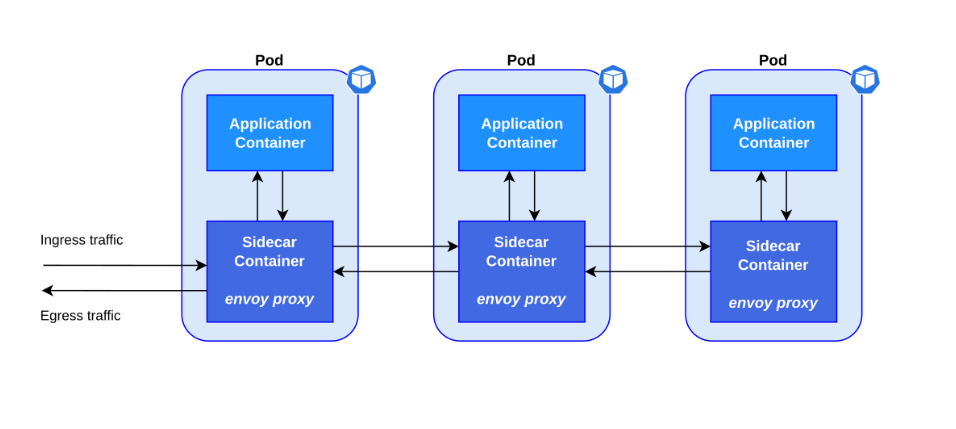

# KUBERNETS OBJECTS

## I. KHÁI NIỆM

- Object là các thực thể tồn tại lâu dài (persistent entities) trong hệ thống Kubernetes dùng để đại diện cho trạng thái của cluster.

Cụ thể chúng mô tả:

- Những ứng dụng container nào đang chạy (và đang chạy trên Node nào).
- Các tài nguyên (RAM, CPU...) được phân bổ cho các ứng dụng đó.
- Các chính sách quản lý hành vi ứng dụng (chính sách khởi động lại, nâng cấp, chịu lỗi...).



### 1. Cấu hình khai báo

- Khi bạn tạo một object, Kubernetes sẽ liên tục làm việc để đảm bảo object đó luôn tồn tại đúng như bạn mô tả.

- Bạn không "ra lệnh" từng bước cho Kubernetes làm gì, mà bạn khai báo "tôi muốn trạng thái cuối cùng như thế này", rồi Kubernetes tự tìm cách đạt được và duy trì trạng thái đó mãi mãi (declarative, không phải imperative).

- Để tạo/sửa/xoá object, bạn phải thông qua Kubernetes API — dù bạn gõ `kubectl` hay dùng client library, thực chất phía sau đều là gọi API.

**Ví dụ**:

Bạn tạo 1 Deployment với `spec.replicas: 3` → nghĩa là bạn muốn có 3 bản sao ứng dụng chạy song song.

- Kubernetes đọc spec → khởi động 3 instance → cập nhật status phản ánh đúng 3 cái đang chạy.
- Nếu 1 instance bị chết (status đổi thành 2) → Kubernetes phát hiện status ≠ spec → tự động tạo lại 1 instance mới để bù vào, cho đến khi status khớp lại spec (3 cái).
- Đây chính là cơ chế **reconciliation loop** (vòng lặp đối chiếu) — "trái tim" của toàn bộ Kubernetes: liên tục so sánh spec (muốn gì) với status (đang có gì) và tự sửa cho khớp.

### 2. Object Describing - File miêu tả object

- Khi tạo object, bạn viết 1 file gọi là manifest, thường ở định dạng YAML/JSON (YAML là quy ước phổ biến):

```yaml
apiVersion: apps/v1
kind: Deployment
metadata:
  name: nginx-deployment
spec:
  selector:
    matchLabels:
      app: nginx
  replicas: 2 # tells deployment to run 2 pods matching the template
  template:
    metadata:
      labels:
        app: nginx
    spec:
      containers:
      - name: nginx
        image: nginx:1.14.2
        ports:
        - containerPort: 80
```

Tạo bằng lệnh:

```bash
kubectl apply -f deployment.yaml
```

- `kubectl` sẽ tự chuyển file YAML thành JSON và gửi request đến kube-apiserver.

**4 trường(field) bắt buộc** phải có trong mọi manifest:

| Trường | Mô tả |
| --- | --- |
| apiVersion | Dùng phiên bản API nào để tạo object(VD: apps/v1) |
| kind | Loại object là gì (VD: Deployment,Pod,Service...) |
| metadata | Thông tin định danh: name, UID, namespace... |
| spec | Trạng thái mong muốn - định dạng riêng từng loại object |

**Ai đọc spec và hành động theo nó?**

- **Controller Manager**: các Controller (Deployment Controller, ReplicaSet Controller...) liên tục "watch" API Server, đọc spec, so sánh với status, rồi tạo/xóa Pod cho khớp.
- **Scheduler**: đọc spec của Pod (chưa có node) để quyết định gán vào node nào.
- **kubelet** (chạy trên từng Node): đọc spec của Pod được gán cho node đó, rồi thực sự khởi chạy container qua container runtime (containerd/CRI-O).

### 3. Server Side Field Validation (từ Kubernetes v1.25+)

Đây là tính năng giúp phát hiện lỗi trong manifest ngay tại API server, ví dụ: field không tồn tại, field bị khai trùng lặp.

Điều khiển qua flag `--validate` khi dùng `kubectl`:

| Giá trị        | Hành vi                                  |
| -------------- | ---------------------------------------- |
| strict(hoặc true) | Lỗi -> từ chối request luôn (mặc định) |
| warn           | Lỗi -> chỉ cảnh báo, vẫn cho request đi qua |
| ignore(hoặc false) | Không kiểm tra gì cả                      |

- Nếu `kubectl` không kết nối được API server hỗ trợ tính năng này → tự động fallback về client-side validation (kiểm tra ngay trên máy bạn, trước khi gửi đi).

- **Từ Kubernetes 1.27 trở đi, tính năng này luôn có sẵn; bản cũ hơn thì cần kiểm tra tài liệu riêng**

### 4. Object Management (3 cách quản lý)

| Cách | Thao tác trên | Môi trường |
|---|---|---|
| **Imperative commands** | Object đang sống (live) | Dev / thử nghiệm |
| **Imperative object configuration** | Từng file cấu hình | Production | 
| **Declarative object configuration** | Thư mục chứa nhiều file | Production |

> **Quy tắc quan trọng**: chỉ dùng **1 kỹ thuật duy nhất** cho 1 object — trộn lẫn sẽ gây hành vi khó lường.

- **Imperative commands**:

  - Đây là cách ra lệnh trực tiếp: `kubectl create deployment nginx --image nginx`
  - Nhanh, gọn, nhưng **không có lịch sử cấu hình**, Yaml, Git, không audit trail, không template.

- **Imperative object configuration**: `kubectl create -f nginx.yaml`, `kubectl replace -f nginx.yaml`

  - Bạn viết ra 1 file mô tả bạn muốn gì, rồi bảo kubectl: "làm y như cái file này đi" (`kubectl create -f file.yaml`). 
  - Có thể lưu Git, review trước khi push. **Lưu ý**: `replace` sẽ **ghi đè toàn bộ**, mất các thay đổi không có trong file (VD: field `externalIPs` của LoadBalancer Service do cluster tự set).
  - Vấn đề là nếu dùng lệnh replace, nó sẽ xoá sạch những gì không có trong file rồi ghi đè — nên dễ mất dữ liệu nếu không cẩn thận. Hiểu đơn giản là replace sẽ xóa toàn bộ object cũ ghi đè object mới và không quan tâm object cũ có gì.

- **Declarative object configuration**: `kubectl diff -f configs/`, `kubectl apply -f configs/`
  - Đây là cách Kubernetes khuyến khích dùng.
  - kubectl **tự phát hiện** cần create/patch/delete cho từng object.
  - Dùng **patch** (chỉ ghi phần khác biệt) thay vì **replace** (ghi đè toàn bộ) → giữ được thay đổi từ bên ngoài không merge lại vào file.
  - **Nhược điểm**: khó debug khi kết quả không như mong đợi.

### 5. Object Name và UID

**Object Name (Tên)**:

- Do người dùng tự đặt (VD: `my-pod`).
- Chỉ cần không trùng trong cùng 1 loại resource (`Pod`, `Deployment`,...) + cùng namespace, tại cùng 1 thời điểm.

- → Pod tên `app-1` và Deployment tên `app-1` được phép tồn tại song song (khác loại nhau).

- → Xoá Pod `app-1` đi, rồi tạo lại Pod mới cũng tên `app-1` → hoàn toàn ok, không lỗi gì.

- `generateName`: lười đặt tên → để K8s tự thêm đuôi random (VD: app-x7f2k). Vẫn có xác suất đụng tên, lúc đó nó tự thử lại tối đa 8 lần (từ bản v1.31).

**Object UID**:

- Do hệ thống tự sinh (dạng UUID dài ngoằng, kiểu 550e8400-e29b-...).
- Duy nhất tuyệt đối trên toàn cluster, không bao giờ trùng, không bao giờ tái sử dụng.
- Dùng để phân biệt: "Pod tên app-1 lần tạo thứ 1" khác với "Pod tên app-1 lần tạo thứ 2" (dù tên giống hệt nhau).

**Ví dụ dễ hình dung:**
Giống như tên người vs CMND/CCCD:

- Name = tên "Nguyễn Văn A" → nhiều người có thể trùng tên, hoặc 1 người đổi tên vẫn có thể lấy lại tên cũ sau khi "khai tử" cái cũ.
- UID = số CCCD → mỗi người (mỗi lần tạo object) có 1 số duy nhất, không ai trùng, không bao giờ cấp lại.

→ K8s dùng Name để bạn gọi/tham chiếu cho tiện (qua `kubectl`, API URL), nhưng dùng **UID** ở hậu trường để đảm bảo không bao giờ nhầm lẫn giữa các object, kể cả khi chúng trùng tên ở các thời điểm khác nhau.

### 6. Object label và field selector

**ObjectLabel** = nhãn dán lên object (dạng key: value) để sau này dễ tìm/lọc.

**Ví dụ**: dán `environment: production` lên 100 Pod → sau này chỉ cần 1 lệnh lọc là ra đúng 100 Pod đó.

Quy tắc đặt tên:

- Cú pháp: `[prefix/]name` — VD: `company.com/app: nginx`
- name: bắt buộc, tối đa 63 ký tự.
- prefix: tuỳ chọn — không ghi thì coi như label riêng của bạn; hệ thống (kube-scheduler...) bắt buộc phải có prefix.
- Đừng tự đặt prefix `kubernetes.io/` hay `k8s.io/`

**Selector** = điều kiện lọc, dùng label để tìm object mình cần. Có 2 kiểu:

1. **Equality-based** (đơn giản, dùng với kubectl get): **chỉ so sánh "bằng" hoặc "khác" với MỘT giá trị duy nhất**

- `environment=production,tier!=frontend`

→ nghĩa là "môi trường = production VÀ tier ≠ frontend" (luôn là AND, không có OR).

2. **Set-based** (mạnh hơn, dùng trong YAML của Deployment/Job...): **so sánh với MỘT TẬP HỢP nhiều giá trị cùng lúc**

- `environment in (production, qa)`
- `tier notin (frontend, backend)`
- `partition` (có tồn tại label "partition")
- `!partition` (không có label "partition")

Trong YAML thì viết như sau:

```yaml
selector:
  matchLabels:
    component: redis
  matchExpressions:
    - { key: tier, operator: In, values: [cache] }
```

→ **matchLabels** và **matchExpressions** luôn **AND** với nhau, tất cả điều kiện phải đúng hết.

**Lưu ý riêng**: Service/ReplicationController chỉ hiểu kiểu equality-based đơn giản, không hỗ trợ matchExpressions.

### 7. Namespaces

**Namespace là gì**: Cơ chế "chia ngăn" trong 1 cluster để nhóm resource lại, giúp nhiều team/user dùng chung cluster mà không đụng nhau.

**Điểm cốt lõi**:

- Tên resource chỉ cần duy nhất trong 1 namespace (không cần duy nhất toàn cluster).
- Chỉ áp dụng cho namespaced object (Pod, Deployment, Service...).
- Không áp dụng cho cluster-wide object (Node, PersistentVolume, StorageClass — những thứ này ở cấp toàn cluster, không thuộc namespace nào).
- Không lồng nhau được (không có namespace-con bên trong namespace).

**Khi nào dùng, khi nào không**:

- Cluster nhỏ, ít người dùng (vài chục user) → thường không cần namespace.
- Muốn phân biệt version phần mềm (v1, v2...) → nên dùng label, không cần tạo namespace riêng cho từng version.

**4 namespace có sẵn khi tạo cluster**:

| Namespace   | Vai trò|
|-------------|--------|
| default     | Namespace mặc định khi bạn không khai báo gì|
| kube-node-lease | Chứa Lease object — heartbeat của từng Node|
| kube-public | Ai cũng đọc được, kể cả chưa đăng nhập|
| kube-system | Chứa object do chính K8s tạo ra (kube-dns, kube-proxy...)|

→ Đừng tự đặt tên namespace bắt đầu bằng `kube-` (vì nó dành riêng cho hệ thống).

**Lệnh hay dùng nhất**:

```bash
kubectl get ns                          # xem danh sách namespace
kubectl create ns dev                   # tạo namespace mới
kubectl get pods -n dev                 # xem pod trong namespace "dev"
kubectl get pods -A                     # xem pod ở TẤT CẢ namespace
kubectl config set-context --current --namespace=dev   # đổi namespace mặc định, khỏi phải gõ -n dev mỗi lần
```

**DNS giữa các namespace**:

- Service có tên DNS đầy đủ: `<service-name>.<namespace>.svc.cluster.local`
- Cùng namespace → gọi ngắn gọn `<service-name>` là đủ (VD: gọi `my-db`).
- Khác namespace → phải gọi đầy đủ, VD: `my-db.production.svc.cluster.local`, nếu không sẽ không tìm thấy service.

**Ví dụ dễ nhớ:** Namespace giống như các "phòng ban" trong 1 công ty — mỗi phòng có thể có nhân viên tên "An" riêng mà không trùng nhau, nhưng muốn gọi người ở phòng khác thì phải nói rõ "An phòng Marketing" chứ gọi trống "An" thì phòng mình chỉ hiểu là người cùng phòng.

### 8. Annotations

- Cặp key/value gắn metadata phi định danh (non-identifying) — KHÔNG dùng để select/filter object (đó là việc của label).
- Value không giới hạn ký tự (khác Label) — có thể chứa JSON, YAML, khoảng trắng, ký tự đặc biệt.
- Tổng kích thước toàn bộ annotation trên 1 object ≤ 256 KiB.
- Cú pháp key giống Label: `[prefix/]name.`
- Dùng để lưu: thông tin build/release, con trỏ tới log/monitoring, thông tin công cụ quản lý (VD: Helm), số điện thoại người phụ trách, v.v.

### 9. Finalizers

- Là "chốt chặn" ngăn object bị xoá ngay lập tức — buộc phải dọn dẹp xong mới cho xoá thật.
- Xoá object có **finalizer** → object không biến mất ngay, chuyển sang trạng thái **Terminating**.
- Controller tương ứng phải dọn dẹp xong (VD: gỡ kết nối, giải phóng tài nguyên ngoài) rồi mới gỡ **finalizer** ra.
- Hết **finalizer** → object mới thực sự bị xoá.
- **Một khi đã xin xoá thì hết đường lùi**: không thêm **finalizer** mới được, không sửa được, không "hồi sinh" được — chỉ có xoá hẳn rồi tạo lại.
- Ví dụ dễ hiểu: **pv-protection** — ngăn bạn lỡ tay xoá ổ đĩa (PV) khi đang có Pod dùng nó.

**Ví dụ minh hoạ**: Giống như xin nghỉ việc — bạn nộp đơn (**deletionTimestamp**), nhưng phải bàn giao xong hết công việc (**finalizers**) thì mới được nghỉ chính thức.

### 10. Owner References

Xác định quan hệ "cha - con" để biết cái gì cần dọn theo khi xoá cái gốc.

- **VD**: ReplicaSet là owner, các Pod nó tạo ra là dependent. Xoá ReplicaSet → Pod con cũng bị xoá theo.
- Khác Label/Selector (dùng để tìm nhóm) — Owner Reference dùng để biết cái gì phải dọn dẹp cùng.
- Không owner xuyên namespace được (cha con phải cùng 1 namespace).
- 2 kiểu xoá:

    - **Foreground**: xoá con hết rồi mới xoá cha.
    - **Orphan**: xoá cha, nhưng để con sống mồ côi (không xoá theo).

### 11. Recommended Labels

Bộ nhãn "chuẩn chung" để tool nào cũng hiểu được app của bạn (Helm, Lens, ArgoCD...).

| Label | Ý nghĩa | Ví dụ |
|---|---|---|
| `app.kubernetes.io/name` | Tên ứng dụng | `mysql` |
| `app.kubernetes.io/instance` | Tên định danh **duy nhất** cho 1 lần cài đặt | `mysql-abcxyz` |
| `app.kubernetes.io/version` | Version ứng dụng | `5.7.21` |
| `app.kubernetes.io/component` | Thành phần trong kiến trúc | `database` |
| `app.kubernetes.io/part-of` | Tên ứng dụng lớn hơn mà nó thuộc về | `wordpress` |
| `app.kubernetes.io/managed-by` | Công cụ dùng để quản lý | `Helm` |

- **`name`** = tên ứng dụng (chung), **`instance`** = tên riêng của **1 lần cài đặt cụ thể** — 1 app có thể cài nhiều lần (nhiều instance) trong cùng cluster/namespace.
- Ứng dụng nhiều tầng (VD: WordPress + MySQL) → mỗi tầng có `name`/`instance` riêng, nhưng **cùng chung `part-of: wordpress`**.

### 12. Storage Versions

- (nâng cao, dành cho admin — không cần nhớ kỹ nếu mới học)
- Object lưu trong etcd theo 1 version cố định gọi là storage version.
- Bạn đọc bằng version nào cũng được (v1, v2...) — API tự convert qua lại, không cần quan tâm bên trong lưu version gì.
- Ghi/sửa → luôn lưu lại theo storage version mới nhất đang active.

### 13. Gộp nhiều resource vào 1 file YAML

Dùng dấu **---** để tách nhiều object trong cùng 1 file — tiện khi deploy 1 lượt Service + Deployment.

```yaml
apiVersion: v1
kind: Service
...
---
apiVersion: apps/v1
kind: Deployment
...
```

→ Chạy kubectl `apply -f file.yaml` là tạo luôn cả 2 object cùng lúc