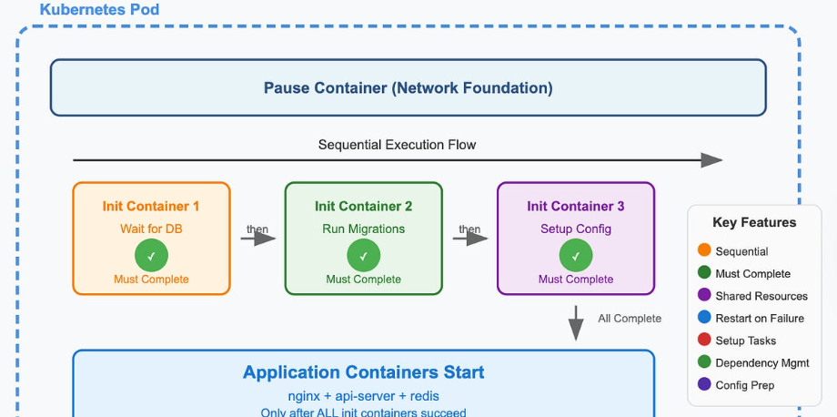
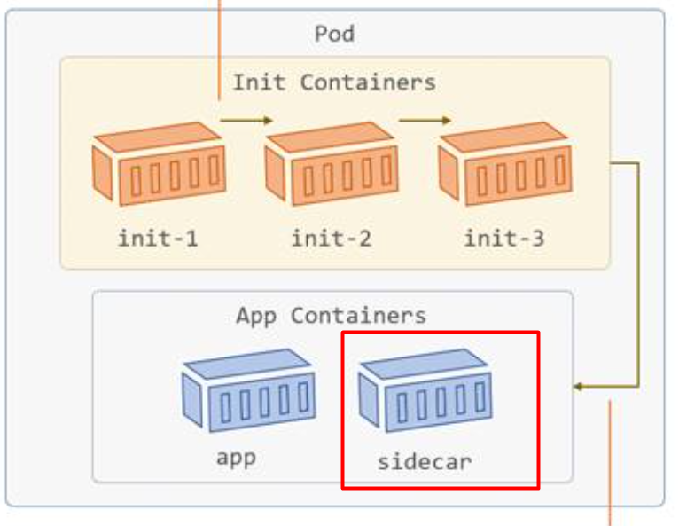

# TÌM HIỂU POD TRONG K8S

**Pod** là đơn vị triển khai (deployable unit) nhỏ nhất mà bạn có thể tạo và quản lý trong Kubernetes.

Một **Pod** (giống như một đàn cá voi hoặc một quả đậu chứa nhiều hạt) là một nhóm gồm **một hoặc nhiều container**, cùng chia sẻ tài nguyên lưu trữ (storage), tài nguyên mạng (network) và một đặc tả (specification) mô tả cách chạy các container đó.

Các thành phần bên trong một Pod luôn được:

- Triển khai trên cùng một Node (co-located).
- Được lập lịch cùng nhau (co-scheduled).
- Chạy trong cùng một ngữ cảnh (shared context).

Pod đại diện cho một **"máy chủ logic" (logical host)** dành riêng cho một ứng dụng. Nó chứa một hoặc nhiều container của ứng dụng có mối liên kết chặt chẽ với nhau.

Trong môi trường không phải Cloud, điều này tương tự như việc nhiều ứng dụng chạy trên cùng một máy vật lý hoặc máy ảo.

Ngoài các **Application Container**, Pod còn có thể chứa:

- **Init Container**, chạy trong quá trình khởi động Pod.
- **Ephemeral Container**, được thêm vào để gỡ lỗi (debug) Pod đang chạy.

## I. Pod LÀ GÌ?

> **Lưu ý:** Mỗi Node trong Cluster cần cài đặt một **Container Runtime** để có thể chạy Pod.

Ngữ cảnh dùng chung (shared context) của Pod bao gồm:

- Linux Namespaces
- cgroups
- Và các cơ chế cô lập khác

Đây cũng chính là các cơ chế dùng để cô lập Container.

Trong cùng một Pod, từng ứng dụng vẫn có thể có các cơ chế cô lập riêng ở mức thấp hơn.

Một Pod tương tự như một nhóm Container dùng chung:

- Namespace
- Volume

**2 Cách sử dụng Pod trong K8S**:

### 1. Pod chạy một Container

Đây là mô hình phổ biến nhất trong Kubernetes.

Trong trường hợp này, Pod có thể được xem như một lớp bao bọc (wrapper) cho một Container.

Kubernetes quản lý Pod thay vì quản lý trực tiếp Container.

### 2. Pod chạy nhiều Container

Một Pod có thể chứa nhiều Container cần phối hợp chặt chẽ với nhau.

Các Container này:

- Được triển khai cùng nhau.
- Chia sẻ tài nguyên.
- Hoạt động như một đơn vị thống nhất.

Đây là trường hợp sử dụng nâng cao và chỉ nên áp dụng khi các Container có sự phụ thuộc chặt chẽ.

Bạn **không cần** chạy nhiều Container trong cùng một Pod để tăng khả năng chịu lỗi hoặc mở rộng ứng dụng.

Nếu cần nhiều bản sao (Replica), hãy sử dụng nhiều Pod.

## II. Pod LIFE CYCLE

Mỗi **Pod** trong Kubernetes đều trải qua một vòng đời (Lifecycle), bắt đầu từ khi được tạo cho đến khi bị xóa.

Vòng đời của Pod bao gồm các giai đoạn chính (`Phase`) sau:

```text
Pending
    │
    ▼
Running
    │
    ├──────────────┐
    ▼              ▼
Succeeded      Failed
    │              │
    └──────┬───────┘
           ▼
      Terminating
           │
           ▼
         Deleted
```

### 1. Pending

Đây là trạng thái đầu tiên của Pod sau khi được tạo.

Pod đã được Kubernetes chấp nhận nhưng chưa chạy.

Trong giai đoạn này Kubernetes đang thực hiện các công việc như:

- Scheduler chọn Node phù hợp.
- Pull Container Image.
- Tạo Volume.
- Chuẩn bị môi trường chạy.

Nếu việc tải Image mất nhiều thời gian thì Pod có thể ở trạng thái **Pending** khá lâu.

### 2. Running

Pod đã được gán vào một Node và tất cả các Container cần thiết đã được tạo.

Ít nhất một Container đang chạy hoặc đang khởi động.

Trong trạng thái này:

- Ứng dụng đang hoạt động.
- kubelet liên tục theo dõi tình trạng của Pod.
- Các Probe (Liveness, Readiness, Startup) được thực hiện nếu được cấu hình.

### 3. Succeeded

Pod kết thúc thành công.

- Tất cả Container đã hoàn thành.
- Mọi Container đều thoát với Exit Code = 0.
- Kubernetes sẽ không khởi động lại Pod.

Trạng thái này thường gặp ở:

- Job
- Batch Processing

Ví dụ:

```text
Backup Database
↓
Hoàn thành
↓
Succeeded
```

### 4. Failed

Pod kết thúc với lỗi.

Điều kiện:

- Ít nhất một Container kết thúc với Exit Code khác `0`.
- Hoặc Container bị hệ thống buộc dừng.

Ví dụ:

- Chương trình bị Crash.
- Thiếu file cấu hình.
- Lỗi kết nối Database.
- Out Of Memory (OOMKilled).

Tùy thuộc vào `restartPolicy`, Kubernetes có thể khởi động lại Container.

### 5. Unknown

Trạng thái này xuất hiện khi Kubernetes không thể xác định trạng thái của Pod.

Nguyên nhân thường gặp:

- Node mất kết nối.
- kubelet không phản hồi.
- Lỗi mạng giữa Node và Control Plane.

Thông thường trạng thái này chỉ tồn tại tạm thời.

### 6. Terminating

**Pod** đang trong quá trình bị xóa.

Khi Pod bị xóa:

```bash
kubectl delete pod nginx
```

Kubernetes sẽ thực hiện theo thứ tự:

1. Đánh dấu Pod ở trạng thái **Terminating**.
2. Gửi tín hiệu **SIGTERM** đến các Container.
3. Chờ trong thời gian `terminationGracePeriodSeconds` (mặc định 30 giây).
4. Nếu Container vẫn chưa dừng, gửi **SIGKILL** để buộc dừng.
5. Xóa Pod khỏi Cluster.

### 7. Restart Policy

Mỗi Pod có một chính sách khởi động lại Container:

```yaml
restartPolicy:
```

Có ba giá trị:

- **Always** (mặc định)
  - Container luôn được khởi động lại khi dừng.

- **OnFailure**
  - Chỉ khởi động lại khi Container kết thúc với lỗi.

- **Never**
  - Không khởi động lại Container.

### 8. Pod Conditions

Ngoài `Phase`, Kubernetes còn theo dõi trạng thái của Pod thông qua **Conditions**.

Các Condition phổ biến:

- **PodScheduled**
  - Pod đã được Scheduler gán vào Node.

- **Initialized**
  - Các Init Container đã chạy xong.

- **ContainersReady**
  - Tất cả Container đã sẵn sàng.

- **Ready**
  - Pod đã sẵn sàng nhận lưu lượng từ Service.

## III. INIT CONTAINER

**Init Container** là các container đặc biệt chạy **trước Application Container** trong một Pod.

Chúng thường được dùng để chuẩn bị môi trường trước khi ứng dụng chính khởi động, chẳng hạn như:

- Kiểm tra các dịch vụ phụ thuộc đã sẵn sàng.
- Tải hoặc tạo dữ liệu cấu hình.
- Khởi tạo thư mục, Volume.
- Chạy script cài đặt.
- Clone mã nguồn hoặc dữ liệu từ Git.

Sau khi tất cả Init Container hoàn thành thành công, Kubernetes mới khởi động các Application Container.

### 1. Cách hoạt động

Một Pod có thể có:

- 0 Init Container
- 1 hoặc nhiều Init Container

Nếu có nhiều Init Container:

- Chúng **không chạy song song**.
- Chúng chạy **tuần tự** theo đúng thứ tự khai báo trong trường `initContainers`.

Ví dụ:

```text
Init Container 1
        │
        ▼
Init Container 2
        │
        ▼
Init Container 3
        │
        ▼
Application Container
```

Nếu một Init Container chưa hoàn thành thì Init Container tiếp theo sẽ không được chạy.

### 2. Đặc điểm của Init Container

Init Container có hầu hết các tính năng giống Container thông thường:

- Có Image riêng.
- Có Volume.
- Có Resource Requests/Limits.
- Có Security Context.
- Có thể dùng Secret và ConfigMap.

Tuy nhiên, chúng có một số điểm khác biệt:

- Luôn chạy đến khi hoàn thành (Run to Completion).
- Chỉ chạy một lần khi Pod khởi động.
- Không chạy song song với Application Container.
- Không tồn tại sau khi hoàn thành.

### 3. Điều kiện để Pod khởi động

Pod chỉ được chuyển sang chạy Application Container khi:

- Tất cả Init Container đều hoàn thành thành công.

Nếu còn một Init Container chưa hoàn thành:

- Pod vẫn ở trạng thái **Pending**.
- Điều kiện `Initialized=False`.

### 4. Nếu Init Container gặp lỗi

Nếu một Init Container thất bại:

- kubelet sẽ tự động khởi động lại Init Container đó cho đến khi thành công (tùy theo `restartPolicy` của Pod).
- Các Init Container phía sau sẽ **không được chạy**.
- Application Container cũng **không được khởi động**.

Nếu Pod có:

```yaml
restartPolicy: Never
```

thì khi Init Container thất bại, Kubernetes sẽ đánh dấu toàn bộ Pod là **Failed**.

### 5. So sánh Init Container và Application Container

|           Init Container                     | Application Container                        |
|----------------------------------------------|----------------------------------------------|
| Chạy trước ứng dụng                          | Chạy ứng dụng chính                          |
| Chạy một lần                                 | Chạy trong suốt vòng đời Pod                 |
| Phải hoàn thành mới chạy container tiếp theo | Có thể chạy song song với các container khác |
| Không phục vụ request                        | Phục vụ request của ứng dụng                 |

### 6. Khác biệt giữa Init Container và Sidecar Container

| Init Container                                                              | Sidecar Container                        |
|-----------------------------------------------------------------------------|------------------------------------------|
| Chạy trước ứng dụng                                                         | Chạy cùng ứng dụng                       |
| Kết thúc sau khi hoàn thành                                                 | Tiếp tục chạy trong suốt vòng đời Pod    |
| Chạy tuần tự                                                                | Chạy song song với Application Container |
| Không hỗ trợ `lifecycle`, `livenessProbe`, `readinessProbe`, `startupProbe` | Hỗ trợ đầy đủ các Probe và Lifecycle     |

### 7. Khi nào nên dùng Init Container?

Một số trường hợp sử dụng phổ biến:

- Chờ Service hoặc Database sẵn sàng trước khi khởi động ứng dụng.
- Khởi tạo cơ sở dữ liệu.
- Tạo hoặc cập nhật file cấu hình.
- Clone Git Repository vào Volume.
- Tải dữ liệu hoặc chứng chỉ (Certificate).
- Thiết lập quyền cho thư mục và tập tin.
- Chạy script cài đặt hoặc migrate database.

### 8. Ví dụ

Một Pod có:

- Init Container 1: Chờ Service `myservice`.
- Init Container 2: Chờ Database `mydb`.
- Application Container: Chạy ứng dụng.

Quá trình khởi động:



```text
Tạo Pod
    │
    ▼
Init Container 1
(chờ myservice)
    │
    ▼
Init Container 2
(chờ mydb)
    │
    ▼
Application Container
    │
    ▼
Pod Running
```

Ứng dụng chỉ được khởi động khi cả `myservice` và `mydb` đều sẵn sàng.

### 9. Trạng thái của Pod khi chạy Init Container

Trong quá trình Init Container đang chạy:

```text
STATUS: Init:0/2
```

Ý nghĩa:

- Có 2 Init Container.
- Chưa có Init Container nào hoàn thành.

Ví dụ:

```text
Init:1/2
```

Nghĩa là:

- Init Container thứ nhất đã hoàn thành.
- Init Container thứ hai đang chạy.

Khi tất cả hoàn thành:

```text
STATUS: Running
READY: 1/1
```

### 10. Thứ tự khởi động của Pod

```text
Pod được tạo
        │
        ▼
Chuẩn bị Network và Volume
        │
        ▼
Init Container 1
        │
        ▼
Init Container 2
        │
        ▼
...
        │
        ▼
Tất cả Init Container hoàn thành
        │
        ▼
Khởi động Application Container
        │
        ▼
Pod Ready
```

### 11. Một số lưu ý

- Nếu Pod bị khởi động lại, **tất cả Init Container sẽ được thực thi lại**.
- Tên của mỗi Init Container phải **duy nhất** trong Pod.
- Nên thiết kế Init Container theo nguyên tắc **idempotent**, tức là có thể chạy nhiều lần mà không gây lỗi hoặc làm sai dữ liệu.
- Init Container có thể dùng **Volume chung** để truyền dữ liệu cho Application Container.
- Có thể dùng `activeDeadlineSeconds` để giới hạn thời gian thực thi của Pod, bao gồm cả thời gian chạy Init Container.

### 12. Tóm tắt

- **Init Container** là container chạy **trước** Application Container.
- Chúng được dùng để **chuẩn bị môi trường** trước khi ứng dụng khởi động.
- Nếu có nhiều Init Container, chúng sẽ **chạy tuần tự**.
- Pod chỉ khởi động Application Container khi **tất cả Init Container đều hoàn thành thành công**.
- Nếu Init Container thất bại, Pod sẽ **không thể chuyển sang trạng thái Running** cho đến khi lỗi được khắc phục hoặc Pod bị đánh dấu **Failed** (tùy `restartPolicy`).

## IV. SIDECAR CONTAINER




**Sidecar Container** là container phụ chạy **cùng với Application Container** trong cùng một Pod.

Nó không thực hiện logic chính của ứng dụng mà cung cấp các chức năng hỗ trợ như:

- Logging (thu thập log)
- Monitoring (giám sát)
- Security
- Proxy
- Đồng bộ dữ liệu (Data Synchronization)
- Service Mesh (Envoy, Istio)

Mục tiêu là **mở rộng chức năng của ứng dụng mà không cần sửa đổi mã nguồn của Application Container**.

### 1. Cách hoạt động Sidecar

Trong Kubernetes (từ v1.33 Stable), Sidecar được triển khai như một **Init Container đặc biệt**.

Điểm khác biệt là Sidecar được khai báo trong:

```yaml
initContainers:
```

và có:

```yaml
restartPolicy: Always
```

Ví dụ:

```yaml
initContainers:
- name: logshipper
  image: alpine
  restartPolicy: Always
```

Kubernetes sẽ coi đây là một **Sidecar Container** thay vì Init Container thông thường.

---

### 2. Vòng đời của Sidecar Container

Sidecar có vòng đời riêng nhưng gắn liền với Pod.

Quá trình hoạt động:

```text
Pod được tạo
      │
      ▼
Init Container
(chạy tuần tự)
      │
      ▼
Sidecar Container khởi động
      │
      ▼
Application Container khởi động
      │
      ▼
Sidecar và Application chạy song song
      │
      ▼
Application kết thúc
      │
      ▼
Sidecar dừng
      │
      ▼
Pod kết thúc
```

Khác với Init Container:

- Sidecar **không kết thúc sau khi khởi động**.
- Nó tiếp tục chạy trong **suốt vòng đời của Pod**.

### 3. Đặc điểm của Sidecar Container

- Chạy cùng Application Container.
- Có thể được khởi động, dừng hoặc khởi động lại độc lập.
- Có thể cập nhật Image mà không cần khởi động lại toàn bộ Pod (chỉ Sidecar được khởi động lại).
- Chia sẻ cùng:

  - Network Namespace
  - Volume
  - IPC

- Có thể giao tiếp trực tiếp với Application Container qua `localhost` hoặc Volume dùng chung.

### 4. Sidecar hỗ trợ Probe

Khác với Init Container, Sidecar hỗ trợ đầy đủ:

- `startupProbe`
- `livenessProbe`
- `readinessProbe`
- `lifecycle`

Nếu cấu hình `readinessProbe`, kết quả của Probe sẽ được sử dụng để xác định trạng thái **Ready** của Pod.

### 5. Khi nào nên dùng Sidecar?

Sidecar phù hợp với các chức năng cần hoạt động liên tục cùng ứng dụng, ví dụ:

- Thu thập và gửi log.
- Export Metrics cho Prometheus.
- Reverse Proxy (Nginx, Envoy).
- Service Mesh (Istio, Linkerd).
- Đồng bộ dữ liệu.
- Reload cấu hình.
- Theo dõi file thay đổi.

### 6. Ví dụ

Một Pod có:

- Application Container ghi log vào file.
- Sidecar đọc file log và gửi log đến hệ thống tập trung.

```text
Application
     │
ghi log vào
     ▼
Shared Volume
     ▲
đọc log
     │
Sidecar
     │
gửi log
     ▼
ELK / Loki / Splunk
```

Trong ví dụ này:

- Hai Container dùng chung `emptyDir Volume`.
- Application chỉ ghi log.
- Sidecar chịu trách nhiệm thu thập và gửi log.

### 7. Sidecar và Pod Termination

Khi Pod bị xóa:

1. Application Container được dừng trước.
2. Sau khi Application dừng hoàn toàn, Kubernetes mới dừng các Sidecar.
3. Nếu có nhiều Sidecar, chúng sẽ được dừng theo **thứ tự ngược lại** so với lúc khai báo.

Cách này đảm bảo Sidecar vẫn có thể hoàn thành các công việc hỗ trợ (ví dụ: gửi hết log còn lại) trước khi Pod kết thúc.

> **Lưu ý:** Khi Pod bị xóa, Sidecar có thể bị nhận tín hiệu `SIGTERM` rồi `SIGKILL` trước khi kịp thoát hoàn toàn, vì vậy mã thoát (exit code) khác `0` ở Sidecar thường được xem là bình thường.

### 8. Sidecar trong Job

Nếu Pod thuộc một **Job**:

- Khi Application Container hoàn thành công việc, Job vẫn được đánh dấu **Completed**.
- Sidecar **không ngăn Job kết thúc**, mặc dù Sidecar vẫn đang chạy.

### 9. So sánh Sidecar và Init Container

| Sidecar Container | Init Container |
|-------------------|----------------|
| Chạy cùng Application | Chạy trước Application |
| Tiếp tục chạy trong suốt vòng đời Pod | Kết thúc sau khi hoàn thành |
| Hỗ trợ Probe (`liveness`, `readiness`, `startup`) | Không hỗ trợ Probe |
| Có thể giao tiếp trực tiếp với Application | Không thể giao tiếp với Application khi chạy vì đã kết thúc |
| Có thể khởi động lại độc lập | Chỉ chạy khi Pod khởi động |

### 10. So sánh Sidecar và Application Container

| Sidecar Container | Application Container |
|-------------------|-----------------------|
| Thực hiện chức năng hỗ trợ | Thực hiện logic chính của ứng dụng |
| Có thể khởi động lại độc lập | Chạy ứng dụng chính |
| Chia sẻ Network và Volume với ứng dụng | Chia sẻ tài nguyên với Sidecar |

### 11. Chia sẻ tài nguyên

Sidecar sử dụng chung tài nguyên với Pod:

- CPU
- Memory
- Network
- Storage (Volume)

Scheduler sẽ tính tổng tài nguyên của:

- Application Container
- Sidecar Container

để quyết định Node phù hợp cho Pod.

### 12. Tóm tắt Sidecar

- **Sidecar Container** là container phụ chạy **song song** với Application Container trong cùng một Pod.
- Sidecar cung cấp các chức năng hỗ trợ như **logging, monitoring, proxy, security, data synchronization**.
- Sidecar được triển khai như một **Init Container có `restartPolicy: Always`**.
- Sidecar tiếp tục chạy trong **suốt vòng đời của Pod** và chỉ dừng sau khi Application Container kết thúc.
- Sidecar hỗ trợ đầy đủ các **Probe** (`startup`, `liveness`, `readiness`) và có thể khởi động lại độc lập với Application Container.

## V. PROBE

**Probe** là cơ chế kiểm tra sức khỏe (Health Check) của Container do **kubelet** thực hiện định kỳ.

Dựa trên kết quả của Probe, Kubernetes có thể:

- Khởi động lại Container bị lỗi.
- Ngừng gửi lưu lượng (Traffic) đến Pod chưa sẵn sàng.
- Chờ ứng dụng khởi động hoàn tất trước khi kiểm tra các Probe khác.

**Có 3 loại Probe**:

- **Startup Probe**
- **Liveness Probe**
- **Readiness Probe**

Mỗi loại phục vụ một mục đích khác nhau.

### 1. Startup Probe

#### Mục đích

Kiểm tra **ứng dụng đã khởi động hoàn tất hay chưa**.

Được sử dụng cho các ứng dụng:

- Khởi động chậm.
- Load dữ liệu lớn.
- Chạy migration.
- Khởi tạo cache.

Trong thời gian Startup Probe chưa thành công:

- Kubernetes **không chạy** Liveness Probe.
- Kubernetes **không chạy** Readiness Probe.

Điều này giúp tránh việc ứng dụng bị khởi động lại khi vẫn đang trong quá trình khởi động.

#### Nếu Startup Probe thất bại

- `kubelet` sẽ dừng Container.
- Container được khởi động lại theo `restartPolicy`.

#### Khi nào nên dùng?

Sử dụng khi ứng dụng cần **nhiều thời gian để khởi động**.

Ví dụ:

- Spring Boot
- Elasticsearch
- Kafka
- Database

### 2. Liveness Probe

#### Mục đích Liveness Probe

Kiểm tra **Container còn hoạt động bình thường hay không**.

Liveness Probe giúp phát hiện các trường hợp như:

- Deadlock.
- Treo ứng dụng.
- Không còn phản hồi.

#### Nếu Liveness Probe thất bại

Sau khi vượt quá số lần lỗi (`failureThreshold`):

- kubelet sẽ **khởi động lại Container**.

Pod **không bị xóa**, chỉ Container được restart.

#### Khi nào nên dùng ?

Sử dụng khi muốn Kubernetes tự động khởi động lại ứng dụng nếu ứng dụng bị treo hoặc không thể tự phục hồi.

### 3. Readiness Probe

#### Mục đích Readiness Probe.

Kiểm tra **Container đã sẵn sàng nhận request hay chưa**.

Ứng dụng có thể:

- Đang khởi động.
- Đang tải dữ liệu.
- Đang kết nối Database.
- Đang bảo trì.

Trong các trường hợp này ứng dụng vẫn chạy nhưng chưa nên nhận lưu lượng.

#### Nếu Readiness Probe thất bại

- Container **vẫn tiếp tục chạy**.
- Kubernetes đánh dấu Pod là **Not Ready**.
- Endpoint của Pod bị loại khỏi Service.
- Load Balancer sẽ **không gửi Traffic** đến Pod.

Khi Probe thành công trở lại:

- Pod được thêm lại vào Service.
- Tiếp tục nhận Traffic.

#### Khi nào nên dùng Readiness Probe ?

Sử dụng khi ứng dụng cần thời gian chuẩn bị trước khi phục vụ request hoặc tạm thời không muốn nhận lưu lượng.

### 4. So sánh ba loại Probe

| Probe | Mục đích | Nếu thất bại |
|--------|----------|--------------|
| **Startup Probe** | Kiểm tra ứng dụng đã khởi động xong chưa | Restart Container |
| **Liveness Probe** | Kiểm tra ứng dụng còn hoạt động bình thường không | Restart Container |
| **Readiness Probe** | Kiểm tra ứng dụng đã sẵn sàng nhận Traffic chưa | Không restart, chỉ loại Pod khỏi Service |

#### Thứ tự hoạt động

```text
Container khởi động
        │
        ▼
Startup Probe
        │
        ├── Fail → Restart Container
        │
        ▼
Startup thành công
        │
        ▼
Liveness Probe
        │
        ▼
Readiness Probe
        │
        ▼
Pod Ready
```

### 5. Cơ chế kiểm tra (Probe Mechanisms)

Mỗi Probe phải sử dụng **một** trong bốn cơ chế sau:

| Cơ chế | Mô tả |
|--------|------|
| **HTTP GET** | Gửi HTTP GET đến một endpoint (ví dụ: `/healthz`, `/ready`) |
| **TCP Socket** | Kiểm tra cổng TCP có mở hay không |
| **Exec** | Thực thi một lệnh trong Container, thành công nếu exit code = 0 |
| **gRPC** | Gọi gRPC Health Check (ứng dụng phải hỗ trợ giao thức gRPC Health Checking) |

### 6. Các tham số cấu hình quan trọng

| Tham số | Ý nghĩa |
|---------|----------|
| `initialDelaySeconds` | Thời gian chờ trước khi bắt đầu Probe lần đầu |
| `periodSeconds` | Khoảng thời gian giữa hai lần Probe |
| `timeoutSeconds` | Thời gian tối đa chờ Probe phản hồi |
| `successThreshold` | Số lần thành công liên tiếp để Probe được coi là thành công (chỉ áp dụng cho Readiness Probe) |
| `failureThreshold` | Số lần thất bại liên tiếp trước khi Kubernetes coi Probe thất bại |
| `terminationGracePeriodSeconds` | Thời gian chờ trước khi buộc dừng Container sau khi Probe thất bại (Startup/Liveness) |

### 7. Kết quả của Probe

Mỗi lần kiểm tra, Probe trả về một trong ba trạng thái:

- **Success**: Kiểm tra thành công.
- **Failure**: Kiểm tra thất bại.
- **Unknown**: Không xác định được kết quả, kubelet sẽ tiếp tục kiểm tra ở các lần sau.

### 8. Ví dụ cấu hình

```yaml
startupProbe:
  httpGet:
    path: /healthz
    port: 8080
  failureThreshold: 30
  periodSeconds: 10

livenessProbe:
  httpGet:
    path: /healthz
    port: 8080
  initialDelaySeconds: 10
  periodSeconds: 5

readinessProbe:
  httpGet:
    path: /ready
    port: 8080
  periodSeconds: 5
```

### 9. Tóm tắt

- **Startup Probe**: Kiểm tra ứng dụng **đã khởi động xong chưa**, tránh restart khi ứng dụng khởi động chậm.
- **Liveness Probe**: Kiểm tra ứng dụng **còn hoạt động bình thường hay không**, nếu thất bại Kubernetes sẽ **restart Container**.
- **Readiness Probe**: Kiểm tra ứng dụng **đã sẵn sàng nhận Traffic chưa**, nếu thất bại Pod sẽ **không nhận Traffic** nhưng Container vẫn tiếp tục chạy.
- Probe có thể sử dụng **HTTP, TCP, Exec hoặc gRPC** để kiểm tra sức khỏe của Container.
