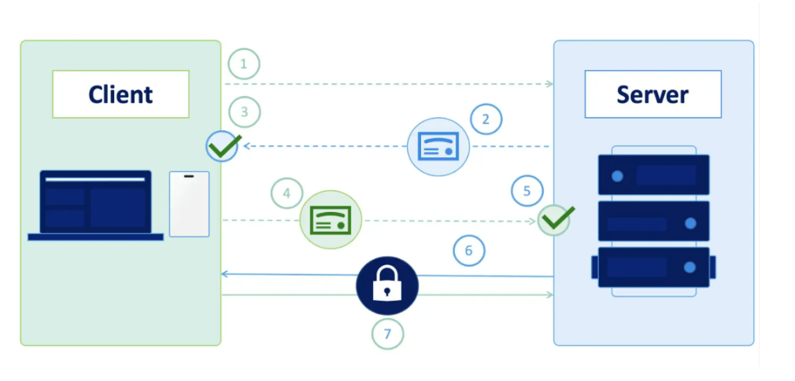

# mTLS

## I KHÁI NIỆM

mTLS (Mutual TLS) là cơ chế xác thực hai chiều giữa client và server bằng chứng chỉ (certificate), thay vì chỉ xác thực 1 chiều như TLS thông thường.

**mTLS trong Kubernetes — dùng ở đâu?**

- Giữa các component control plane

  - VD: kubelet ↔ kube-apiserver giao tiếp với nhau đều dùng mTLS để đảm bảo cả 2 phía đều xác thực được nhau, tránh giả mạo.

- Service Mesh (Istio, Linkerd...)

  - Đây là nơi mTLS được nhắc đến nhiều nhất trong K8s. Service Mesh tự động:

    - Cấp cert cho từng Pod/Service.
    - Mã hoá + xác thực 2 chiều mọi traffic giữa các Service trong cluster (Pod A gọi Pod B thì cả 2 đều phải chứng minh danh tính).
    - Bạn không cần tự code TLS trong app — sidecar proxy (VD: Envoy trong Istio) lo hết.

- Ingress/API Server yêu cầu client certificate

  - VD: cấu hình kube-apiserver yêu cầu client (kubectl, kubelet...) phải trình cert hợp lệ mới cho gọi API.

**Tại sao cần mTLS trong microservices/K8s?**

Trong 1 cluster có hàng trăm Service gọi qua lại nhau, nếu không xác thực 2 chiều thì:

- 1 Pod bị hack có thể giả danh gọi sang Service khác mà không bị phát hiện.
- mTLS đảm bảo: dù traffic có đi trong mạng nội bộ cluster, mỗi bên vẫn phải chứng minh mình đúng là ai trước khi trao đổi dữ liệu — mô hình gọi là **Zero Trust Network**.

## II. CÁC BƯỚC THỰC HIỆN



### Bước 1: Xin cert

**Server**:

```bash
server.csr 

server.key
```

**Client**:

```bash
client.csr

client.key
```

**CA Trust**:

```bash
ca.crt

ca.key
```

- Cả Server và Client gửi CSR lên để CA trust. Như đã nói từ trước trong file csr đều đã có chứa public key và chữ ký số bằng private key của private Server và Client lần lượt nên có bị lộ cũng không sao cả.

- Sau khi xin cấp xong các thành phần : Server sẽ sở hữu `server.crt` và Client có `client.crt`

### Bước 2: Sinh 1 cặp khóa tạm thời

- Cả 2 bên sinh 1 cặp khóa tạm thời gọi là Ephemeral Key:

**Server**:

```bash
Ephemeral public Key A
Ephemeral private Key A
```

**Client**:

```bash
Ephemeral public key B
Ephemeral private key B
```

### Bước 3: TLS Handshake

- 2 bên trao đổi public key cho nhau tin nhắn sẽ được mã hóa bởi crt của từng bên. 

  - Ví dụ khi server gửi ephemeral public key của nó cho client nó sẽ được mã hóa, ký bởi cert của server, client thấy cert đã được trust bởi CA -> Client tin tưởng và chấp nhập Public key này.

- Đây là 1 trong những phát minh vĩ đãi của Diffie-Hellman năm 1976:
  - Hai bên không cần biết Private Key của nhau.
  - Chỉ cần:
    - Private của mình.
    - Public của đối phương.
  - Là sẽ tính ra cùng một Shared Secret.

=> 2 bên sinh ra 1 Session Key chung và dùng session Key này cho phiên làm việc hiện tại. SSH cũng sử dụng thuật toán tương tự.
