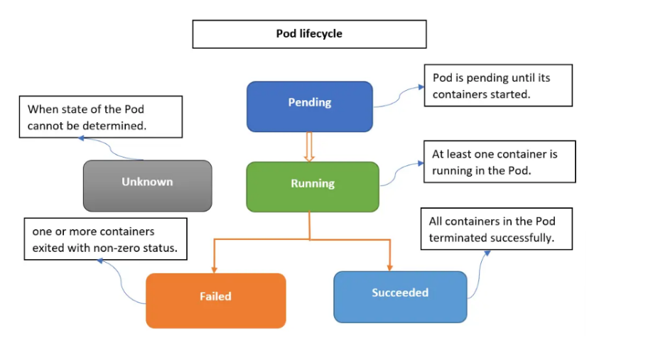
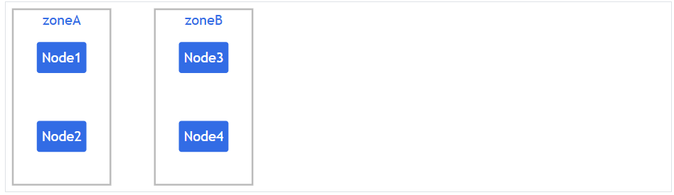

# POD IN K8S

## I. KHÁI NIỆM

### 1. Lý thuyết

Pod là đơn vị triển khai nhỏ nhất trong Kubernetes, đại diện cho một hoặc nhiều containers chạy cùng nhau trên một node. Các containers trong Pod chia sẻ network namespace( cùng IP và port), storage (qua volumes), và life cycle. Pods là ephemeral nghĩa là chúng có thể bị destroy và recreate bất kỳ lúc nào, thường được quản lý bởi controllers như Deployments để đảm bảo availability.

Một Pod cơ bản bao gồm:

- **Metadata**: Tên, namespace, labels(để chọn lọc), annotations.
- **Spec**: Mô tả containers (image, ports, resources), volumes, restart policy.
- **Status**: Trạng thái hiện tại (Pending, Running, Succeeded, Failed, Unknown).


So sánh tổng quát:

| | Pod | Node | Cluster |
|-----|----|-----|-------|
| Khái niệm | Đơn vị thực thi nhỏ nhất trong Kubernetes | Máy chủ ảo hoặc máy chủ vật lý | Tập hợp các node trong Kubernetes |
| Vai trò |  Tách Container khỏi máy chủ nhằm tăng tính di động. Định hướng hoạt động và cung cấp tài nguyên cho Container | Cung cấp CPU, ổ cứng, … để chạy các ứng dụng | Điều khiển, sắp xếp các container thông qua Pod và Node|
| Thành phần | Container, Supporting Volumes và địa chỉ IP cho các Container | Pod, Container, Kubelet | Nodes, Control Plane, Kube-proxy, etc|


### 2. Pod Lifecycle

- **Pending**: Pod đã được tạo nhưng chưa được schedule lên node (ví dụ: chờ pull image hoặc thiếu resources).
- **Running**: Ít nhất một container đang chạy bình thường.
- **Succeeded**: Tất cả containers hoàn thành thành công( exit code 0), thường cho Jobs.
- **Failed**: Ít nhất một container thất bại (exit code !=0).
- **Unknown**: Không thể xác định trạng thái (lỗi network).



## 3. Liệt kê Pods

```bash
# Liệt kê pod trong Namespace hiện tại của Context
kubectl get pods 
# Xem Pod trong tất cả Namespace 
kubectl get po -A
# Chỉ xem Pod trong Namespace kube-system
kubectl get po -n kube-system
```

- Thêm `-o wide` để xem IP/node



- Mô tả chi tiết:

```bash
kubectl describe pod <pod-name>
```

- Tham khảo thêm

```bash
kubectl get pods
kubectl get pods -A                     # tất cả namespace (thay cho --all-namespaces)
kubectl get pods -o wide
kubectl get pods --show-labels
kubectl get pods -l app=nginx           # lọc theo label
kubectl get pods --field-selector=status.phase=Running
kubectl get pods -w                     # watch realtime
kubectl get all                         # deployment, service, pod, rs trong ns hiện tại
kubectl describe pod <ten-pod>
kubectl get pod <ten-pod> -o yaml
kubectl get pod <ten-pod> -o json
kubectl get pod <ten-pod> -o jsonpath='{.status.podIP}'
```

## 3. Tạo Pod (Create Pod)

**Imperative**: Tạo nhanh bằng lệnh (không cần file YAML) — dùng cho học/test

```bash
kubectl run <pod-name> --image=<image> [options].
```

- Ví dụ: `kubectl run nginx-pod --image=nginx --port 80`.
- Options: `--restart=Never`(cho Pod standalone, không restart), `--dry-run=client -o yaml`(generate Yaml mà không tạo thật).

**Declarative(YAML)**:

- Viết file YAML rồi apply:
  - Cấu trúc YAML cơ bản:

```yaml
apiVersion: v1
kind: Pod
metadata:
  name: my-pod
  labels:
    app: myapp
spec:
  containers:
  - name: my-container
    image: nginx:latest
    ports:
    - containerPort: 80
  restartPolicy: Always
```

- `kubectl apply -f my-pod.yaml` (tạo hoặc cập nhật)
- `kubectl create -f my-pod.yaml` (chỉ tạo, lỗi nếu tồn tại)

- Xem docs: `kubectl explain pod.spec.containers`

- `apiVersion`: Phiên bản Kubernetes API dùng để tạo object.

  - v1 là API version của các object cơ bản như: Pod, Service, ConfigMap, Secret, Namespace.

- `kind`: loại object muốn tạo
- `metadata`: Đây là nơi chứa thông tin mô tả (metadata) của object. Thông tin mô tả.

  - `name`: tên của Pod
  - `label`: để phân loại Object

- `Spec`: Specification, chứa toàn bộ cấu hình của Pod( chạy như thế nào). Thông tin vận hành.

  - Mỗi Pod có thể chứa 1 hoặc nhiều container, chỉ cần 1 `- name`
  - `ports`: Danh sách các port mà container cần sử dụng. Container này dùng port 80 nhưng bên ngoài vẫn chưa truy cập được vào. Muốn truy cập cần Ingress, Service, port forward.
  - `restartPolicy`: `alway`: tự động auto restart liên tục đến khi container khởi động đầy đủ. `OnFailure`: nếu exit code =0 thì không restart thường dùng cho Job. `Never` Không bao giờ restart.

## 4. Mô tả Pod (Describe Pod)

```bash
kubectl describe pod <pod-name>
```

- Hiển thị: Metadata, spec, status, conditions(Ready, Scheduled), events(lỗi pull image, crash)
- Ví dụ: `kubectl describe pod nginx-pod` - Check nếu Pod Pending do thiếu resources

## 5. Xóa Pod

```bash
kubectl delete pod <pod-name> ||
kubectl delete -f my-pod.yaml
```

- Options: `--force --grace-period=0` (xóa ngay lập tức, không chờ terminate)
- Xóa nhiều: `kubectl delete pods -l app=myapp`
- Pods bị xóa sẽ không recover trừ khi managed bởi Deployment (tự tạo mới).

## 6. Xem logs

```bash
kubectl logs <ten-pod>
kubectl logs -f <ten-pod>                    # follow realtime, giống tail -f
kubectl logs <ten-pod> -c <ten-container>    # pod có nhiều container thì cần chỉ rõ container
kubectl logs --previous <ten-pod>            # log của lần chạy trước (khi pod bị crash/restart)
kubectl logs --tail=50 <ten-pod>             # chỉ xem 50 dòng cuối
kubectl logs --since=10m <ten-pod>           # log 10 phút gần nhất
```

## 7. Vào bên trong Pod

```bash
kubectl exec -it <ten-pod> -- /bin/bash
kubectl exec -it <ten-pod> -- sh             # dùng khi image không có bash (alpine...)
kubectl exec -it <ten-pod> -c <container> -- sh   # pod nhiều container
kubectl exec <ten-pod> -- ls /app            # chạy 1 lệnh không cần vào shell

# Nếu image không có shell (distroless) - dùng debug thay vì exec
kubectl debug -it <ten-pod> --image=busybox:1.36 --target=<container>
```

## 8. Copy file với Pod

```bash
kubectl cp <ten-pod>:/path/trong/pod ./local-folder
kubectl cp ./local-file <ten-pod>:/path/trong/pod
kubectl cp <ten-pod>:/path -c <container> ./local-folder    # pod nhiều container
```

## 9. Port-forward(truy cập pod từ máy local)

```bash
kubectl port-forward pod/<ten-pod> 8080:80
```

## 10. Quy trình debug Pod

```bash
kubectl get pods                          # 1. xem trạng thái: Running/Pending/CrashLoopBackOff/Error
kubectl describe pod <ten-pod>            # 2. xem Event ở cuối để biết lý do (thiếu resource, image sai, mount lỗi...)
kubectl logs <ten-pod>                    # 3. xem log ứng dụng bên trong
kubectl logs --previous <ten-pod>         # 4. nếu pod restart, xem log lần chạy trước khi crash
kubectl exec -it <ten-pod> -- sh          # 5. vào trong kiểm tra trực tiếp nếu cần
```