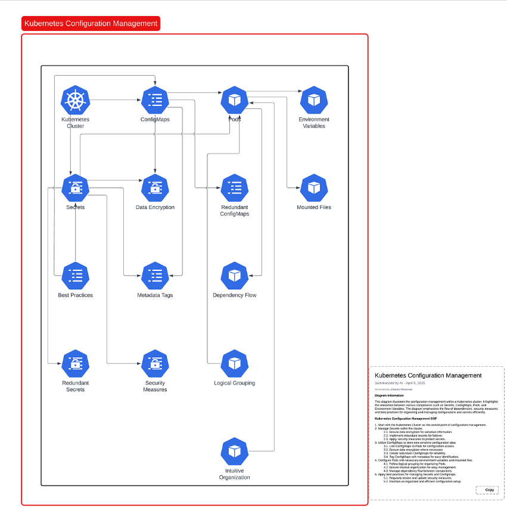
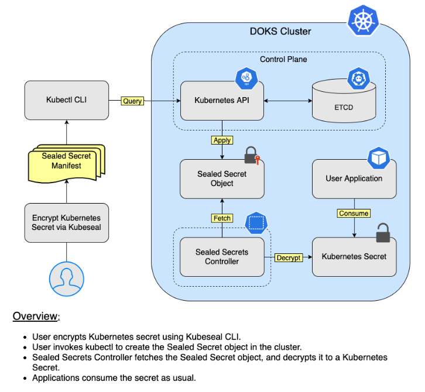

# CONFIGMAP & SECRET

## CONFIG MAP

### I. KHÁI NIỆM



**ConfigMap** là một object Kubernetes dùng để lưu trữ dữ liệu cấu hình không nhạy cảm dưới dạng key-value pairs hoặc toàn bộ file. Nó giúp tách biệt config khỏi container image, cho phép bạn thay đổi hành vi ứng dụng mà không rebuild( ví dụ: thay đổi URL database hoặc log level).

ConfigMap được lưu trong etcd như plain text, nên chỉ dùng cho dữ liệu không bí mật.

Lợi ích chính:

- **Decouple config**: Ứng dụng có thể đọc config từ env, vars hoặc mounted files, dễ scale và update.
- **Reuseability**: Một ConfigMap có thể được sử dụng bởi nhiều Pods.
- **Versioning**: Dễ quản lý qua Git, hỗ trợ CI/CD
- **Types**: Binary (cho file nhị phân) hoặc immutable (không thể chỉnh sửa sau tạo, để tránh lỗi).

Có thể hiểu Config Map như 1 tờ giấy gián ghi chú công khai còn Secret tương tự nhưng bí mật.

## SECRET

### I. Khái niệm

- **Secret** tương tự như ConfigMap nhưng dành cho dữ liệu nhạy cảm như passwords, API keys, certificates.
- Dữ liệu trong Secret được mã hóa base64 (không phải encryption thực sự, chỉ obfuscation), và Kubernetes lưu chúng an toàn hơn (không expose qua `kubectl get` mặc định).
- Secret có thể là generic (từ literals/files), docker-registry (cho pull images), hoặc tls (cho certificates).

Khác biệt chính với ConfigMap:

- **Security**: Secret base64-encoded, không hiển thị plain text khi describe ConfigMap là plain text.
- **Size limit**: Secret giới hạn 1MB (do etcd), ConfigMap cũng tương tự.
- **Usage**: Secret cho sensitive data ConfigMap cho non-sensitive
- **Immutable**: Cả hai đều hỗ trợ, nhưng Secret thường dùng để tránh leak.



### II. Cách tạo ConfigMap và Secret trong YAML

- Có 2 cách: Imperative (nhanh cho test) và Declarative (YAML)

#### 1. Tạo ConfigMap

##### Imperative

- Từ literals: `kubectl create configmap my-cm --from-literal=key1=value1 --from-literal=key2-value2`
- Từ file: `kubectl create configmap my-cm --from-file=config.properties`
- Từ env file: `kubectl create configmap my-cm --from-env-file=env.txt`

##### Declarative(YAML)

```YAML
apiVersion: v1
kind: ConfigMap
metadata:
  name: my-configmap
data:
  key1: value1
  config.properties: |  # Multi-line file
    property1=val1
    property2=val2
binaryData:  # Cho binary, base64-encoded
  binary-key: <base64-data>
immutable: true  # Optional
```

Áp dụng: `kubectl apply -f cm.yaml`

- `data`: đây là nơi chứa dữ liệu cấu hình, tất cả dữ liệu trong data đều được lưu dưới dạng: key -> value.
- Dấu `|` trong YAMl có nghĩa là giữ nguyên toàn bộ dòng bên dưới dùng multi-line file.
- `binaryData:` dùng để lưu dữ liệu nhị phân (binary). Do YAML chỉ hỗ trợ text nên binary phải được Base64 encode.
- `immutable:true` ConfigMap không được phép sửa.

#### 2. Tạo Secret

##### Imperative

- **Generic**: `kubectl create secret generic my-secret --from-literal=password=supersecret --from-file=ssh-key=/path/to/key.`
- TLS: `kubectl create secret tls my-tls --cert=path/to/cert --key=path/to/key`.
- Docker registry: `kubectl create secret docker-registry my-reg --docker-server=... --docker-username=...`.

##### Declarative (YAML)

```YAML
apiVersion: v1
kind: Secret
metadata:
  name: my-secret
type: Opaque  # Generic
data:
  password: c3VwZXJzZWNyZXQ=  # echo -n 'supersecret' | base64
  api-key: YXBpa2V5Cg==  
stringData:  # Plain text, Kubernetes sẽ encode
  username: admin
immutable: true
```

- Áp dụng: `kubectl apply -f secret.yaml`

- `data`: tương tự configMap nhưng phải Base64
- **Lưu ý**: Base64 chỉ là encode không phải encrypt, nó chỉ là cách chuẩn để K8s lưu dữ liệu nhị phân và tránh hiển thị plain text trong YAML. Muốn bảo mật hơn cần: Encryption at Rest, KMS, HashiCorp Vault, External Secrets.
- `stringData`: tiện hơn, không cần encode

- Có thể chỉ dùng `data` hoặc chỉ dùng `stringData` tùy vào nhu cầu người dùng. Username nên đặt vào `stringData` vì khi muốn đổi nó sẽ cần phải decode base64.

### III. Mount ConfigMap/Secret vào Pod trong YAML

#### 1. Mount làm Env

```yaml
apiVersion: v1
kind: Pod
metadata:
  name: my-pod
spec:
  containers:
  - name: app
    image: busybox
    env:
    - name: KEY1
      valueFrom:
        configMapKeyRef:
          name: my-configmap
          key: key1
    - name: PASSWORD
      valueFrom:
        secretKeyRef:
          name: my-secret
          key: password
```

Hoặc

```yaml
apiVersion: v1
kind: Pod
metadata:
  name: cm-env-pod
spec:
  containers:
  - name: busybox
    image: busybox
    command: ["env"]
    envFrom:
    - configMapRef:
        name: env-config
```

- `env` là danh sách các biến môi trường sẽ được tạo trong container.
- `name: KEY1` Tên biến môi trường sau khi chạy container sẽ có `KEY1=....`
- `valueFrom`: không gán trực tiếp, thay vào đó lấy từ ConfigMap(`configMapKeyRef`).
  - `name`: tên configmap
  - `key: key1`: Lấy key là `key1`.
  - Hiểu đơn giản như này nếu trong my-configmap(cái bạn apply hay create từ trước ấy) mà có dòng: `key1: hello world` thì key1 này sẽ truyền thẳng cho `KEY1: hello world`.
  - Password tương tự.

**Lưu ý**

- Sử dụng:

```bash
kubectl explain pod.spec.containers.envFrom
```

```bash
kubectl explain pod.spec.containers.env --recursive
```

#### 2. Mount làm Volumes

```yaml
apiVersion: v1
kind: Pod
metadata:
  name: my-pod
spec:
  containers:
  - name: app
    image: nginx
    volumeMounts:
    - name: config-vol
      mountPath: /etc/config  # Đường dẫn trong container
      readOnly: true
    - name: secret-vol
      mountPath: /etc/secret
  volumes:
  - name: config-vol
    configMap:
      name: my-configmap
      items:  # Optional, chỉ mount key cụ thể
      - key: config.properties
        path: app.conf  # Tên file trong volume
  - name: secret-vol
    secret:
      secretName: my-secret
      items:
      - key: password
        path: db-pass.txt
        mode: 0400  # Permissions
```

- `volumeMounts`: Khai báo Container sẽ mount những volume nào, dưới là tên volume mà containers sẽ mount đến.
- `mount-path`: mount vào thư mục đó trong container (không phải host) và chỉ đọc không được chỉnh sửa file.
- `volumes:` Đây là nơi định nghĩa volume thật, dưới là tên volume
- `configMap` or `secret`: Volume này lấy dữ liệu tự configMap, tương tự bên dưới lấy dữ liệu từ secret.
- `items`: mặc định Kubernetes mount toàn bộ key, items cho phép chọn từng key.
  - `key: config.properties`: chỉ lấy config.properties
  - `path: app.conf` tạo 1 file và đặt tên như vậy 
  - ví dụ dễ hiểu nếu trong configMap có sẵn `config.properties: port 8080` thì khi tạo pod sẽ có container có `/etc/config/app.conf` với nội dung `porrt 8080`
  - Dưới tương tự thêm mode 0400 để ko ai có quyển chỉnh sửa chỉ owners đc quyền read.

#### 3. So sánh env và volume

| Dùng `env`                                  | Dùng `volume`                                                             |
| ------------------------------------------- | ------------------------------------------------------------------------- |
| Giá trị nhỏ, đơn lẻ                         | File cấu hình hoàn chỉnh                                                  |
| `DB_HOST`, `PORT`, `LOG_LEVEL`              | `nginx.conf`, `app.conf`, `.env`, chứng chỉ SSL                           |
| Password, API key (nếu ứng dụng đọc từ env) | Certificate (`tls.crt`, `tls.key`), private key, file cấu hình nhiều dòng |

**Các lệnh Kubectl Để quản lý ConfigMap và Secret**:

- **GET**: `kubectl get configmap` hoặc `kubectl get secret`
- **Describe**: `kubectl describe cm my-cm`(hiển thị data plain), `kubectl describe secret my-secret`(không hiển thị data).
- **Edit**: `kubectl edit cmn my-cm`
- **Delete**: `kubectl delete cm my-cm`
- **Xem data**: `kubectl get cm my-cm -o yaml | grep data -A 10`, Secret: `kubectl get secret my-secret -o jsonpath='{.data.password}' | base64 -d`.

### IV. Lab tham khảo

#### 1. Tạo ConfigMap

```bash
echo -e "db_url=localhost\ndb_port=5432" > config.txt
kubectl create configmap app-config --from-file=config.txt
kubectl get cm app-config -o yaml
```

#### 2. Tạo Secret

```bash
kubectl create secret generic db-secret --from-literal=password=pass123
kubectl get secret db-secret -o jsonpath='{.data.password}' | base64 -d  # Xem plain
```

#### 3. Mount vào Pod

```bash
kubectl apply -f pod-with-config.yaml
kubectl exec -it my-pod -- env | grep KEY1  # Check env
kubectl exec -it my-pod -- cat /etc/config/app.conf  # Check file
```

#### 4. Clean up

```bash
kubectl delete pod my-pod
kubectl delete cm app-config
kubectl delete secret db-secret
```
