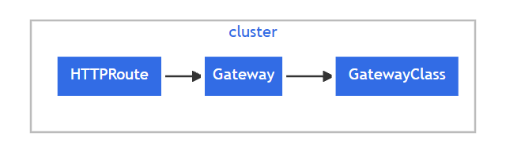
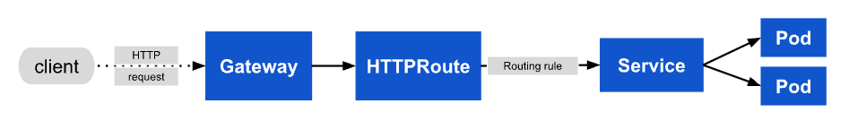

# NETWORKING DEEP DIVE IN K8S

Mô hình mạng của Kubernetes được xây dựng từ nhiều thành phần:

- Mỗi Pod trong cluster được cấp một **địa chỉ IP duy nhất trên toàn cluster**.

- Mỗi Pod có **network namespace riêng**, được chia sẻ giữa tất cả các container bên trong Pod. Các tiến trình chạy trong các container khác nhau của cùng một Pod có thể giao tiếp với nhau thông qua **localhost**.

- **Pod network** (còn gọi là **cluster network**) chịu trách nhiệm xử lý giao tiếp giữa các Pod. Nó đảm bảo rằng (trừ khi có cấu hình phân đoạn mạng có chủ đích):

  - Tất cả các Pod có thể giao tiếp với tất cả các Pod khác, dù chúng nằm trên cùng một Node hay khác Node. Các Pod có thể giao tiếp trực tiếp với nhau mà không cần sử dụng proxy hoặc chuyển đổi địa chỉ mạng (NAT).

  - Trên Windows, quy tắc này **không áp dụng** đối với các Pod sử dụng **host network**.

  - Các agent trên Node (ví dụ: system daemon hoặc kubelet) có thể giao tiếp với tất cả các Pod trên Node đó.

- **Service API** cho phép cung cấp một địa chỉ IP hoặc hostname ổn định (tồn tại lâu dài) cho một Service được triển khai bởi một hoặc nhiều Pod backend, ngay cả khi các Pod này có thể thay đổi theo thời gian.

- Kubernetes tự động quản lý các đối tượng **EndpointSlice** để cung cấp thông tin về các Pod hiện đang là backend của một Service.

- Một thành phần **service proxy** sẽ theo dõi tập hợp các đối tượng **Service** và **EndpointSlice**, sau đó cấu hình **data plane** để định tuyến lưu lượng đến các Pod backend bằng cách sử dụng API của hệ điều hành hoặc nhà cung cấp cloud để chặn hoặc ghi lại (rewrite) các gói tin.

- **Gateway API** (hoặc tiền thân của nó là **Ingress**) cho phép các Service có thể được truy cập bởi các client nằm bên ngoài cluster.

- Một cơ chế đơn giản hơn nhưng ít khả năng cấu hình hơn để cung cấp truy cập từ bên ngoài cluster là sử dụng **Service** với `type: LoadBalancer`, khi chạy trên nhà cung cấp Cloud được hỗ trợ.

- **NetworkPolicy** là một API tích hợp sẵn của Kubernetes, cho phép kiểm soát lưu lượng mạng giữa các Pod hoặc giữa Pod với bên ngoài cluster.

Trong các hệ thống container cũ, không có kết nối mạng tự động giữa các container trên các host khác nhau. Do đó, thường phải tạo liên kết (link) giữa các container hoặc ánh xạ cổng của container sang cổng của host để các container trên host khác có thể truy cập được. Trong Kubernetes, điều này không còn cần thiết; Kubernetes coi các Pod tương tự như máy ảo (VM) hoặc máy vật lý về các khía cạnh như phân bổ cổng, đặt tên, khám phá dịch vụ (service discovery), cân bằng tải (load balancing), cấu hình ứng dụng và di chuyển (migration).

Chỉ một số ít thành phần của mô hình này được Kubernetes triển khai trực tiếp. Đối với các thành phần còn lại, Kubernetes chỉ định nghĩa API, còn chức năng thực tế được cung cấp bởi các thành phần bên ngoài, một số trong đó là tùy chọn:

- Việc thiết lập **network namespace** cho Pod được xử lý bởi phần mềm hệ thống triển khai **Container Runtime Interface (CRI)**.

- **Pod network** được quản lý bởi một triển khai mạng cho Pod. Trên Linux, hầu hết các container runtime sử dụng **Container Networking Interface (CNI)** để tương tác với triển khai mạng này, vì vậy các triển khai này thường được gọi là **CNI plugin**.

- Kubernetes cung cấp một triển khai mặc định cho **service proxy** là **kube-proxy**, tuy nhiên một số triển khai Pod network sử dụng service proxy riêng được tích hợp chặt chẽ hơn với phần còn lại của hệ thống mạng.

- **NetworkPolicy** thường cũng được triển khai bởi Pod network. (Một số triển khai Pod network đơn giản không hỗ trợ NetworkPolicy, hoặc quản trị viên có thể cấu hình Pod network mà không bật hỗ trợ NetworkPolicy. Trong các trường hợp này, API vẫn tồn tại nhưng sẽ không có tác dụng.)

- Có nhiều triển khai khác nhau của **Gateway API**, một số dành riêng cho từng môi trường Cloud, một số tập trung vào môi trường **bare metal**, và một số khác có mục đích sử dụng tổng quát hơn.

## I. CNI LÀ GÌ ?

CNI định nghĩa cách một container runtime (như containerd, CRI-O) giao tiếp với plugin mạng để:

- Cấp phát địa chỉ IP cho container/Pod
- Kết nối container vào network namespace
- Thiết lập routing, DNS
- Gỡ bỏ cấu hình mạng khi container bị xoá

Nói đơn giản: CNI là "cầu nối" giữa Kubernetes và các giải pháp mạng cụ thể, giúp K8s không cần biết chi tiết công nghệ mạng bên dưới — chỉ cần gọi CNI plugin theo chuẩn là xong.

### Tại sao K8s cần CNI?

Kubernetes yêu cầu mô hình mạng phẳng (flat network) với các nguyên tắc:

- Mọi Pod có thể giao tiếp trực tiếp với Pod khác mà không cần NAT
- Mọi Node có thể giao tiếp với mọi Pod mà không cần NAT
- IP mà Pod thấy chính là IP mà các thành phần khác thấy

Bản thân Kubernetes không tự triển khai mạng — nó chỉ định nghĩa các yêu cầu trên, và giao việc thực thi cho CNI plugin.

## II. INGRESS TRONG K8S

### 1. Ingress là gì?

**Ingress** là tài nguyên trong Kubernetes dùng để quản lý **HTTP/HTTPS traffic từ bên ngoài cluster vào các Service**.

Ingress không chuyển tiếp trực tiếp đến Pod mà sẽ **định tuyến (route) request đến Service**, sau đó Service phân phối lưu lượng đến các Pod phía sau.

### 2. Vai trò của Ingress

- Cho phép truy cập ứng dụng từ bên ngoài cluster.
- Định tuyến request dựa trên:
  - URL Path
  - Hostname
- Một Ingress có thể phục vụ nhiều Service khác nhau.
- Hoạt động phía trước các Service trong cluster.

### 3. Luồng hoạt động


### 4. Định tuyến theo URL Path

**Ingress** có thể chuyển request đến các Service khác nhau dựa trên đường dẫn URL.

Ví dụ:

| URL    |    Service    |
|--------|---------------|
| `/foo` | service1:4200 |
| `/bar` | service2:8080 |

Luồng xử lý:

```text
Client
   │
   ▼
Ingress
   ├── /foo ──► Service service1:4200 ──► Pods
   └── /bar ──► Service service2:8080 ──► Pods
```

### 5. Định tuyến theo Hostname

Ingress cũng có thể định tuyến dựa trên giá trị của HTTP Host Header.

Ví dụ:

| Host | Service |
|------|---------|
| foo.bar.com | service1:80 |
| bar.foo.com | service2:80 |

Luồng xử lý:

```text
Client
   │
   ▼
Ingress
   ├── Host: foo.bar.com ──► Service service1:80 ──► Pods
   └── Host: bar.foo.com ──► Service service2:80 ──► Pods
```

## 6. Tổng kết

- Ingress quản lý truy cập HTTP/HTTPS từ bên ngoài cluster.
- Ingress chuyển request đến **Service**, không truy cập trực tiếp Pod.
- Có thể định tuyến theo:
  - URL Path
  - Hostname
- Một Ingress có thể phục vụ nhiều Service thông qua các routing rule khác nhau.

## III. Ingress Controller trong Kubernetes

### 1. Ingress Controller là gì?

**Ingress Controller** là thành phần thực thi các tài nguyên **Ingress** trong Kubernetes.

Để Ingress hoạt động trong cluster, **bắt buộc phải có ít nhất một Ingress Controller đang chạy**.

**Lưu ý**:

Kubernetes khuyến nghị sử dụng **Gateway API** thay cho Ingress.

**Ingress API** hiện đã **đóng băng (frozen)**:

- Ingress API vẫn là API ổn định (Generally Available - GA).
- Kubernetes không có kế hoạch loại bỏ Ingress.
- Ingress API sẽ không được phát triển hoặc bổ sung tính năng mới.

### 2. Ingress Controller được Kubernetes hỗ trợ

Kubernetes trực tiếp hỗ trợ và duy trì:

- AWS Ingress Controller
- GCE Ingress Controller

### 3. Ingress Controller của bên thứ ba

Một số Ingress Controller phổ biến:

- NGINX Ingress Controller
- HAProxy Ingress Controller
- Traefik Ingress Controller
- Apache APISIX Ingress Controller
- Cilium Ingress Controller

> Tuỳ hãng mà những Ingress Controller này có thế mạnh riêng

### 4. Sử dụng nhiều Ingress Controller

Một cluster có thể triển khai **nhiều Ingress Controller** thông qua **IngressClass**.

Khi tạo Ingress, sử dụng trường:

```yaml
spec:
  ingressClassName: <ingress-class-name>
```

Trong đó:

- `ingressClassName` là tên của tài nguyên **IngressClass** (`metadata.name`).
- `ingressClassName` thay thế cho phương pháp cấu hình bằng annotation cũ.

### 5. IngressClass mặc định

Nếu:

- Ingress **không chỉ định** `ingressClassName`.
- Cluster chỉ có **một IngressClass** được đánh dấu là mặc định.

Thì Kubernetes sẽ tự động sử dụng **IngressClass mặc định**.

Đánh dấu IngressClass mặc định bằng annotation:

```yaml
metadata:
  annotations:
    ingressclass.kubernetes.io/is-default-class: "true"
```

**Lưu ý**:

- Các Ingress Controller đều hướng tới việc tuân theo cùng một đặc tả của Kubernetes.
- Tuy nhiên, mỗi Ingress Controller có thể có cách triển khai và hành vi khác nhau.
- Cần tham khảo tài liệu của Ingress Controller trước khi sử dụng.

## IV. GATEWAY API TRONG K8s

### 1. Gateway API là gì?

Gateway API là một nhóm các API trong Kubernetes cung cấp khả năng:

- Dynamic infrastructure provisioning.
- Advanced traffic routing.
- Cung cấp cơ chế cấu hình mở rộng, theo vai trò và nhận biết giao thức (protocol-aware) để đưa dịch vụ mạng ra bên ngoài.

> Gateway API là add-on của Kubernetes và được xem là phiên bản kế nhiệm của Ingress.

### 2. Nguyên tắc thiết kế

Gateway API được thiết kế dựa trên các nguyên tắc sau:

- **Role-oriented**
  - Chia tài nguyên theo từng vai trò trong tổ chức:
    - Infrastructure Provider
    - Cluster Operator
    - Application Developer

- **Portable**
  - Được định nghĩa bằng Custom Resources và được nhiều implementation hỗ trợ.

- **Expressive**
  - Hỗ trợ các chức năng routing nâng cao như:
    - Header-based matching
    - Traffic weighting
    - Các khả năng mà trước đây Ingress chỉ thực hiện được bằng annotation.

- **Extensible**
  - Cho phép mở rộng thông qua Custom Resources ở nhiều lớp khác nhau của API.

### 3. Resource Model

Gateway API gồm 4 API ổn định:

| API Kind | Chức năng |
|----------|-----------|
| GatewayClass | Định nghĩa một nhóm Gateway có cấu hình chung và được quản lý bởi một Gateway Controller |
| Gateway | Đại diện cho hạ tầng xử lý lưu lượng (ví dụ Cloud Load Balancer) |
| HTTPRoute | Định nghĩa quy tắc định tuyến HTTP tới backend (Service) |
| GRPCRoute | Định nghĩa quy tắc định tuyến gRPC tới backend (Service) |

Quan hệ giữa các tài nguyên:



- Một Gateway chỉ thuộc một GatewayClass.
- Một hoặc nhiều Route (HTTPRoute, GRPCRoute) có thể gắn vào Gateway.
- Gateway có thể giới hạn Route nào được phép gắn thông qua `allowedRoutes`.

### 4. Gateway Class

**GatewayClass** xác định:

- Loại Gateway.
- Controller chịu trách nhiệm quản lý Gateway thuộc lớp đó.

Ví dụ:

```yaml
apiVersion: gateway.networking.k8s.io/v1
kind: GatewayClass
metadata:
  name: example-class
spec:
  controllerName: example.com/gateway-controller
```

### 5. Gateway

Gateway đại diện cho một endpoint xử lý traffic.

Gateway có thể:

- Nhận lưu lượng mạng.
- Load balancing.
- Filtering.
- Traffic splitting.
- Chuyển tiếp tới backend Service.

Một Gateway:

- Tham chiếu đến một `GatewayClass`.
- Định nghĩa:
  - Listener
  - Protocol
  - Port
  - Hostname
  - allowedRoutes

Ví dụ:

```yaml
listeners:
- protocol: HTTP
  port: 80
  hostname: www.example.com
```

**Lưu ý**:

- Mặc định Gateway chỉ chấp nhận Route trong cùng namespace.
- Muốn Route từ namespace khác phải cấu hình `allowedRoutes`.

### 6. HTTPRoute

HTTPRoute định nghĩa cách định tuyến HTTP request từ Gateway đến backend.

Có thể định tuyến dựa trên:

- Hostname
- Path
- Match rules

Ví dụ:

```text
Host: www.example.com
Path: /login
        │
        ▼
Service example-svc:8080
```

HTTPRoute đại diện cho cấu hình routing được áp dụng lên Gateway.

### 7. GRPCRoute

**GRPCRoute** định nghĩa cách định tuyến lưu lượng gRPC từ Gateway đến backend.

Đặc điểm:

- Route theo hostname.
- Route theo gRPC service.
- Route theo gRPC method.

Ví dụ:

```text
Host: svc.example.com
Method:
com.example.Login
          │
          ▼
Service example-svc:50051
```

Gateway hỗ trợ GRPCRoute phải hỗ trợ HTTP/2.

### 8. Luồng xử lý Request

Quy trình xử lý HTTP request:



### 9. Conformance

**Gateway API** có **bộ tiêu chuẩn (Conformance)** nhằm:

- Đảm bảo các implementation hoạt động nhất quán.
- Kiểm tra mức độ hỗ trợ các tính năng của Gateway API.

### 10. Chuyển đổi từ Ingress

- Gateway API là phiên bản kế nhiệm của Ingress.
- Gateway API **không bao gồm** tài nguyên `Ingress`.
- Khi chuyển sang Gateway API cần chuyển đổi các tài nguyên Ingress hiện có sang các tài nguyên Gateway API.

## V. EXTENDED (MỞ RỘNG)

### 1. EndpointSlice

#### a Khái niệm

- EndpointSlice là cơ chế Kubernetes dùng để lưu danh sách backend của Service.
- Kubernetes tự động tạo EndpointSlice cho Service có selector.
- kube-proxy sử dụng EndpointSlice để định tuyến traffic.

#### b. Đặc điểm

- Mỗi EndpointSlice mặc định chứa tối đa **100 endpoint**.
- Có thể cấu hình tối đa **1000 endpoint**.

#### c. Address Type

- IPv4
- IPv6

#### d. Conditions

- `serving`
- `terminating`
- `ready`

#### e. Topology Information

Mỗi endpoint có thể chứa:

- `nodeName`
- `zone`

#### f. Ownership

- **EndpointSlice** thường thuộc về một Service.
- Được nhận biết qua:
  - Owner Reference
  - Label `kubernetes.io/service-name`

#### g. Distribution

- Control Plane cố gắng phân bố endpoint vào EndpointSlice.
- Ưu tiên giảm số lần cập nhật EndpointSlice hơn là phân bố hoàn hảo.

#### h. EndpointSlice Mirroring

- EndpointSlice là API thay thế Endpoints API.
- Mirroring từ Endpoints sang EndpointSlice đã **deprecated**.

### 2. Topology Aware Routing

#### a. Khái niệm

- Giúp ưu tiên route traffic trong cùng Zone.
- Giảm latency, chi phí và tăng reliability.

#### b. Enable

```yaml
service.kubernetes.io/topology-mode: Auto
```

#### c. Điều kiện hoạt động tốt

- Traffic phân bố tương đối đều giữa các Zone.
- Mỗi Zone có ít nhất **3 endpoint**.

#### d. Cách hoạt động

- EndpointSlice Controller gán topology hints.
- kube-proxy ưu tiên endpoint cùng Zone.

#### e. Safeguards

Fallback về routing mặc định nếu:

- Không đủ endpoint.
- Không thể phân bố cân bằng.
- Node thiếu topology information.
- Endpoint không có topology hint.
- Zone không có endpoint.

#### f. Constraint

Không dùng cùng:

```yaml
internalTrafficPolicy: Local
```

trên cùng một Service.

### 5. Service ClusterIP Allocation

#### a. Khái niệm SCA

ClusterIP có thể được cấp theo hai cách:

- **Dynamic**

  - Kubernetes tự động cấp IP.

- **Static**

  - Người dùng chỉ định ClusterIP.

#### b. Quy tắc

- ClusterIP phải duy nhất trong toàn Cluster.
- Trùng IP sẽ tạo Service thất bại.

#### c. Mục đích Static Allocation

- Dùng cho các Service cần IP cố định.
- Ví dụ: CoreDNS.

#### d. Tránh xung đột

- Kubernetes chia Service CIDR thành:

  - Static Band
  - Dynamic Band

- Dynamic Allocation ưu tiên sử dụng Dynamic Band trước.

### 6. Service Internal Traffic Policy

#### a. Khái niệm SITP

Giữ traffic nội bộ trong cùng Node.

#### b. Enable SITP

```yaml
spec:
  internalTrafficPolicy: Local
```

#### c. Hoạt động

`Local`

- kube-proxy chỉ route tới endpoint trên cùng Node.

`Cluster` (mặc định)

- Route tới mọi endpoint trong Cluster.

**Lưu ý**:

Nếu Node không có endpoint thì Service được xem như không có backend trên Node đó.

### 7. DNS for Services and Pods

#### a. Tổng quan

- Kubernetes tạo DNS record cho Service và Pod.
- Pod truy cập Service bằng DNS thay vì IP.
- kubelet cấu hình DNS cho Pod.

#### b. Namespace

- Không chỉ định namespace → tìm trong namespace hiện tại.
- Muốn truy cập namespace khác phải chỉ rõ namespace.

#### c. DNS Records

##### A/AAAA Record

- Service thường → trả về ClusterIP.
- Headless Service → trả về danh sách IP Pod.

##### SRV Record

- Dùng cho named port.
- Headless Service trả về nhiều bản ghi tương ứng từng Pod.

#### d. Pod

- Có thể có A/AAAA record.
- CoreDNS có thể tạo DNS theo Service của Pod.

#### e. hostname và subdomain

- Pod có thể khai báo:

  - hostname
  - subdomain

- Nếu tồn tại Headless Service cùng tên subdomain thì Pod có FQDN.

#### f. setHostnameAsFQDN

```yaml
setHostnameAsFQDN: true
```

Hostname của Pod sẽ là FQDN.

#### g. DNS Policy

- Default
- ClusterFirst (mặc định)
- ClusterFirstWithHostNet
- None

#### h. DNS Config

Có thể cấu hình:

- nameservers
- searches
- options

### 8. Cài đặt và cấu hình Calico & Cilium

#### a. Calico

**Calico** là một CNI plugin mã nguồn mở, tập trung vào networking và network security cho Kubernetes.

Đặc điểm chính:

- Dùng giao thức BGP (Border Gateway Protocol) để định tuyến traffic giữa các Node — không cần overlay network (encapsulation) trong nhiều trường hợp, giúp hiệu năng cao
- Hỗ trợ Network Policy rất mạnh: có thể viết policy chi tiết (theo namespace, label, port, protocol...) để kiểm soát traffic ra/vào Pod
- Có thể chạy ở chế độ overlay (VXLAN/IPIP) khi hạ tầng không hỗ trợ BGP trực tiếp (ví dụ cloud có NAT)
- Phù hợp cho các cluster cần bảo mật mạng chặt chẽ (zero-trust, compliance)

**Dùng khi**: bạn cần Network Policy mạnh, hạ tầng on-premise có hỗ trợ BGP, hoặc cần kiểm soát traffic chi tiết.

#### b. Cilium

**Cilium** là CNI plugin thế hệ mới, dùng công nghệ eBPF (extended Berkeley Packet Filter) — chạy trực tiếp trong kernel Linux thay vì dùng iptables truyền thống.

Đặc điểm chính:

Hiệu năng cao hơn nhiều so với các CNI dùng iptables (do eBPF xử lý packet ở tầng kernel, ít overhead)
Hỗ trợ Network Policy ở cả tầng L3/L4 và L7 (HTTP, gRPC, Kafka...) — có thể chặn theo path API, method HTTP...
Có Hubble — công cụ observability tích hợp, giúp quan sát traffic, debug network real-time, vẽ service map
Hỗ trợ service mesh không cần sidecar (thay thế Istio sidecar bằng eBPF ở tầng kernel) — giảm tải tài nguyên
Được nhiều cloud lớn dùng làm CNI mặc định (GKE Dataplane V2, EKS Anywhere...)

Dùng khi: bạn cần hiệu năng cao, observability sâu, network policy ở tầng L7, hoặc muốn service mesh nhẹ.

...
