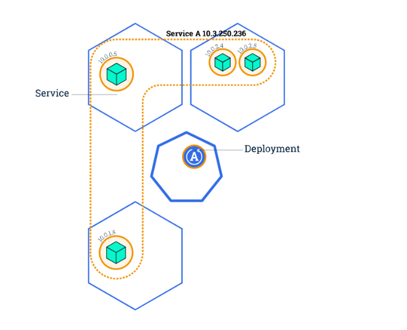
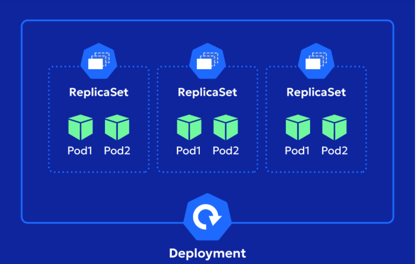
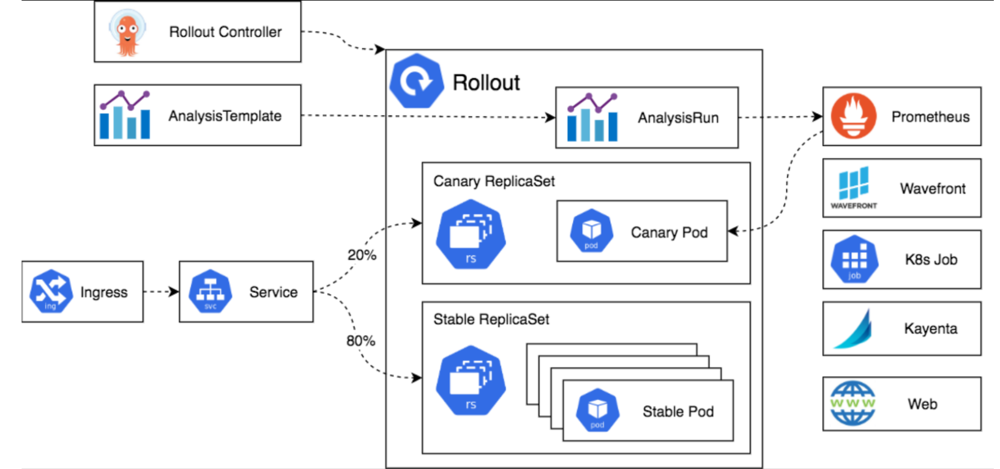
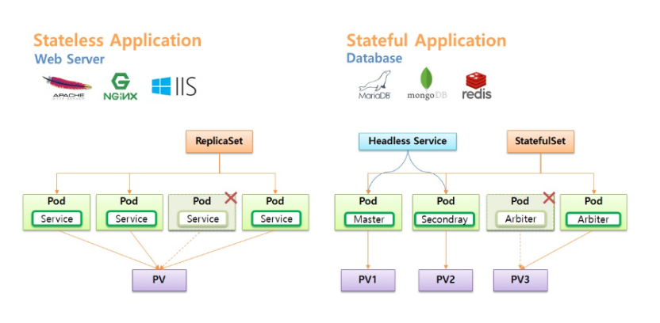
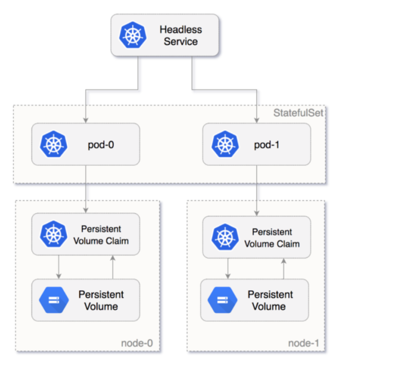

# Deployment & Replica Set

## I. Deployment

Deployment là một controller Kubernetes quản lý việc triển khai và cập nhật Pods một cách declarative. Nó sử dụng ReplicaSet để duy trì số lượng Pods mong muốn, hỗ trợ rollout (cập nhật dần dần), rollback (quay lại phiên bản cũ), và scaling (tăng/giảm replicas). Deployment lý tưởng cho stateless apps như web servers, nơi Pods có thể thay thế mà không mất data.

**Advantages**:

- **Zero-downtime updates**: Cập nhật image hoặc config mà không gián đoạn service (rolling update strategy).
- **Version history**: Tự động tạo ReplicaSet mới cho mỗi update, dễ rollback.
- **Scaling**: Dễ dàng thay đổi số lượng Pods để handle traffic.
- **Self-healing**: Tự động recreate Pods nếu crash hoặc node fail.
- **Pod template**: Định nghĩa spec Pods (containers, volumes, env) trong Deployment.

Deployment không quản lý trực tiếp Pods mà qua ReplicaSet – một layer abstraction để tránh chỉnh sửa thủ công. Trong sản xuất, Deployment là standard cho apps, kết hợp với Services cho exposure.



## II. ReplicaSet

ReplicaSet là controller duy trì số lượng Pods chính xác theo spec, sử dụng selector (labels) để match và manage Pods. Nếu Pods ít hơn replica, RS tạo thêm nếu nhiều hơn, RS xóa bớt. RS là building block cho Deployment, nhưng hiếm khi dùng trực tiếp vì Deployment cung cấp thêm tính năng update/rollback.

Khác biệt chính:

- **ReplicaSet**: ReplicaSet chỉ có một nhiệm vụ duy nhất: Đảm bảo luôn có đúng số lượng Pod mà bạn yêu cầu, không hỗ trợ update (nếu thay đổi template, phải tạo RS mới).

- **Deployment**: Deployment không trực tiếp tạo Pod. Quản lý nhiều RS (mỗi update tạo RS mới), hỗ trợ strategy như RollingUpdate hoặc Recreate.



> Lưu ý: ReplicaSet không phải hoàn toàn không biết Update
Ví dụ Khi bạn:

```bash
kubectl set image deployment/my-app nginx=nginx:2.0
```

Deployment sẽ tạo ReplicaSet v2 sau đó từ từ thay thế các Pod của ReplicaSet cũ

ReplicaSet đảm bảo số lượng Pod theo desired replicas, còn Deployment cung cấp cơ chế quản lý lifecycle/version của ReplicaSet, bao gồm rolling update và rollback.

## III. Cấu hình Deployment và ReplicaSet trong YAML

### 1. YAML cho ReplicaSet

```yaml
apiVersion: apps/v1
kind: ReplicaSet
metadata:
  name: my-rs
  labels:
    app: myapp
spec:
  replicas: 3  # Số lượng Pods
  selector:
    matchLabels:  # Equality-based
      app: myapp
    matchExpressions:  # Set-based (optional)
    - key: tier
      operator: In
      values: [frontend]
  template:  # Pod template
    metadata:
      labels:
        app: myapp
        tier: frontend
    spec:
      containers:
      - name: nginx
        image: nginx:1.14
        ports:
        - containerPort: 80
```

- Áp dụng: `kubectl apply -f rs.yaml`

Trong đó:

- Dòng đầu thông báo với Kubernetes muốn tạo một object loại ReplicaSet thuộc API group `apps`
  - name và label của chính ReplicaSet
  - `replicas: 3`: Tôi muốn duy trì 3 Pod phù hợp với selector.
  - `matchlabels`: Đây là equality-based selector. Có thể nhiều label thì Pod phải thỏa mãn: theo cơ chế AND

```bash
matchLabels:
  app: myapp
  tier: frontend
```

  - `matchExpressions`: là set-based selector nói label `tier` phải có giá trị nằm trong tập frontend. Có thể nhiều giá trị:

```bash
matchExpressions:
- key: tier
  operator: In
  values:
  - frontend
  - backend
```

  - Nói tóm lại Pod này phải thỏa cả hai app=myapp và tier=frontend.
  
  - `template`: là mẫu Pod mà ReplicaSet dùng để tạo Pod mới.
  
  - Nếu cần nó sẽ dựa vào template này để tạo pod mới. ví dụ như app=myapp tier=frontend. Nếu cái này khác bên trên thì nó sẽ tạo gần như vô hạn vì nó tạo xong nó vx sẽ khác label nó không xác định được.

### 2. YAML cho Deployment

```yaml
apiVersion: apps/v1
kind: Deployment
metadata:
  name: my-deployment
spec:
  replicas: 3
  selector:
    matchLabels:
      app: myapp
  template:  # Giống RS
    metadata:
      labels:
        app: myapp
    spec:
      containers:
      - name: nginx
        image: nginx:1.14
  strategy:  # Update strategy
    type: RollingUpdate  # Hoặc Recreate (kill all then create)
    rollingUpdate:
      maxSurge: 25%  # Số Pods thêm tối đa (int hoặc %)
      maxUnavailable: 25%  # Số Pods unavailable tối đa
  minReadySeconds: 10  # Thời gian chờ Pod ready trước khi coi success
  revisionHistoryLimit: 10  # Giữ bao nhiêu RS cũ cho rollback
  paused: false  # Pause rollout (optional)
```

Trong đó:

- `stategy`: quyết định khi pod template thay đổi thì Deployment thay đổi Pod như thế nào.
  - `RollingUpdate`: Không kill toàn bộ Pod cũ cùng lúc mà từ từ thay Pod cũ bằng Pod mới.
  - `Recreate`: Không rolling thay toàn bộ cùng lúc có downtime.
- `maxSurge`: Trong quá trình update, Deployment được phép tạo thêm tối đa bao nhiêu Pod so với desired replicas.
  `maxSurge:25%` là 0.75 làm tròn lên là 1 là trong lúc thay thế nó tạo thêm 1 pod thành 4 rồi bỏ đi 1 pod cũ rồi dần thay thế.
- `maxUnavailable`: Nó quy định: trong quá trình rollout, tối đa bao nhiêu Pod được phép unavailable so với desired replicas.
  - `maxUnavailable: 25%` làm tròn xuống là 0. Nghĩa là cố giữ đủ 3 Pod
- `minReadySeconds`: Sau khi Pod trở thành Ready, Deployment phải thấy Pod Ready liên tục ít nhất 10 giây trước khi coi Pod đó là available.
- `revisionHistoryLimit`: giữ tối đa khoảng 10 ReplicaSet revision cũ để phục vụ rollback.
- `paused`: -True nếu ngừng rollback, `kubectl rollout resume deployment/my-deployment` nếu muốn tiếp tục

Quy trình rollout của Deployment:



## IV. Các lệnh quản lý Deployment và ReplicaSet

- **Tạo Imperative**:(ít dùng)
  - Deployment: `kubectl create deployment my-dep --image=nginx --replicas=3`
  - ReplicaSet: `kubectl create rs my-rs --image=nginx --replicas=3`

- **Get/List**:

  - `kubectl get deployments` , `kubectl get rs`
  - `kubectl get deployments -o wide`

- **Describe**:

  - `kubectl describe deployment my-dep`(Xem events, conditions, RS liên quan).

- **Scale**:

  - `kubectl scale deployment my-dep --replicas=5`.
  - `kubectl scale rs my-rs --replicas=5`.

- **Update**:

  - `kubectl set image deployment/my-dep nginx=nginx:1.16` (nginx la ten container, muon update container nao thi dien ten container do voi image moi)
  - EDIT YAML: `kubectl edit deployment my-dep`

- **Rollout Management**(Chỉ Deployment)

  - Status: `kubectl rollout status deployment/my-dep`
  - History: `kubectl rollout history deployment/my-dep`
  - Rollback: `kubectl rollout undo deployment/my-dep --to-revision=2`
  - Pause/Resume: `kubectl rollout pause deployment/my-dep`, `kubectl rollout resume deployment/my-dep`

- **Delete**: `kubectl delete deployment my-dep`

## V. Lab Deployment và Replica

### 1. Tạo ReplicaSet

- Tạo file `rs.yaml` như trên rồi:

```bash
kubectl apply -f rs.yaml
kubectl get rs
kubectl get pods -l app=myapp
```

### 2. Tạo Deployment

- Tạo file `dep.yaml` như trên:

```bash
kubectl apply -f dep.yaml
kubectl get deployments
kubectl get rs
```

### 3. Scale và Update

```bash
kubectl scale deployment my-deployment --replicas=5
kubectl set image deployment/my-deployment nginx=nginx:1.16
kubectl rollout status deployment/my-deployment # theo dõi
kubectl rollout history deployment/my-deployment
kubectl rollout undo deployment/my-deployment # roll back
```

### 4. Clean up

```bash
kubectl delete deployment my-deployment
kubectl delete rs my-rs
```

## VI. StatefulSet

### 1. Khái niệm

Là Kubernetes controller dùng để quản lý các ứng dụng stateful tức là các Pod cần giữ identity và dữ liệu ổn định.

Ví dụ:

Deployment:

```yaml
Pod abc-7x82
Pod abc-k91x
Pod abc-p3d2
```

- Pod nào cũng tương đối giống nhau
- Pod chết có thể tạo Pod khác

StatefulSet:

```yaml
mysql-0
mysql-1
mysql-2
```

- Pod có identity ổn định nếu mysql-1 bị shutdown, nó vẫn quay lại với identity `mysql-1`

#### a. Stateless và Stateful

- Các ứng dụng stateless thường là các service dụng nginx, apache hoặc chạy dạng HTTP Request. Gọi là stateless app vì mỗi request tới nginx hoặc apache chúng sẽ độc lập với nhau.
- Các ứng dụng stateful thường là các service dạng database, điển hình nhất là mariadb, mysql.
- Các database như mariadb hoặc mysql sẽ gặp phải vấn đề chỉ có thể ghi trên 1 node và ghi trên nhiều node. Và các database dạng mysql, mariadb không thể scale hàng loạt bởi lý do cơ chế master slave, cơ chế ghi 1 đọc nhiều node ..
- Qua đó, Deployment phù hợp hơn cho các ứng dụng dạng stateless, khi mà pod có thể sinh ra và mất đi linh hoạt
- Statefulset sinh ra khi phải quản lý pod chặt chẽ, ví dụ triển khai cụm mariadb master slave 3 node trên k8s.



Deployment quản lý các Pod có thể thay thế lẫn nhau. StatefulSet quản lý các Pod mà "danh tính của từng Pod có ý nghĩa".

#### b. Headless Service



Thông thường khi tạo deployment, expose service ra bên ngoài chúng ta sẽ khởi tạo một Service để load-balance traffic xuống các Pod.

Vậy, đặt câu hỏi “Có cách để chúng ta có thể truy cập trực tiếp các Pod IP thông qua DNS endpoint nội bộ?”

Để giải quyết bài toán này, k8s sinh ra khái niệm “Headless Service”. Với Headless Service, chúng ta có thể kết nối trực tiếp với Pods.

Ví dụ, điển hình nhất cần sử dụng Headless Service là bài toán triển khai database trong k8s.

**VD**: Triển khai cụm database 3 node Master Slave Mariadb dạng Statefulset, thì việc đọc ghi chỉ thực hiện trên 1 node Master. Với trường này ta sẽ sử dụng Headless service.

Bình thường 1 Service có một head:

```yaml
             Service
          ClusterIP
              │
       ┌──────┼──────┐
       ↓      ↓      ↓
      Pod    Pod    Pod
```

- Còn headless:

```yaml
          Service
       clusterIP=None
              │
       DNS records
       /    |    \
      ↓     ↓     ↓
    Pod    Pod    Pod
```

- Không có VIP

### 2. Cấu trúc file YAML

```yaml
apiVersion: apps/v1
kind: StatefulSet
metadata:
  name: my-app
spec:
  serviceName: my-app
  replicas: 3
  podManagementPolicy: OrderedReady
  updateStrategy:
    type: RollingUpdate
  selector:
    matchLabels:
      app: my-app
  template:
    metadata:
      labels:
        app: my-app
    spec:
      terminationGracePeriodSeconds: 30
      containers:
      - name: app
        image: nginx:1.25
        ports:
        - containerPort: 80
        volumeMounts:
        - name: data
          mountPath: /data
  volumeClaimTemplates:
  - metadata:
      name: data
    spec:
      accessModes:
      - ReadWriteOnce
      storageClassName: ceph-rbd
      resources:
        requests:
          storage: 10Gi
```
